# Trace

## Execution trace — Apple

Started: `2026-05-11T02:29:45.584574+00:00`. Total wall time: `175.2s` across `48` recorded actions.

### Per-step time totals

| Step | Calls | Total time | Avg time |
|---|---:|---:|---:|
| `resolve_entity` | 1 | 1.18s | 1183ms |
| `research` | 1 | 10.80s | 10804ms |
| `gap_fill` | 4 | 3.00s | 750ms |
| `retrieve` | 2 | 0.58s | 288ms |
| `generate` | 2 | 22.78s | 11389ms |
| `generate.web_search` | 2 | 5.90s | 2949ms |
| `score` | 2 | 23.08s | 11539ms |
| `verify` | 6 | 19.68s | 3281ms |
| `enrich` | 1 | 67.09s | 67087ms |
| `polish` | 3 | 6.35s | 2116ms |
| `meta_eval` | 1 | 9.03s | 9030ms |
| `web_verify` | 1 | 5.29s | 5294ms |
| `source_judge` | 18 | 12.27s | 682ms |
| `final_qualify` | 2 | 3.44s | 1720ms |
| `quality_signals` | 2 | 2.92s | 1458ms |

### Chronological event log

- `02:29:45.628` **[resolve_entity]** `mistral-small-2603.chat.complete` — 1183ms
   - inputs: user_input='Apple'
   - outputs: resolved=True → 'Apple Inc.'
- `02:29:57.871` **[research]** `mistral-medium-2604.chat.complete` — 10804ms
   - inputs: synthesize CompanyContext for Apple Inc. | depth=medium
   - outputs: industry='American multinational technology, consumer electronics, software and services' verified=True conf=0.75
- `02:30:08.676` **[gap_fill]** `mistral-small-2603.chat.complete` — 882ms
   - inputs: generate gap queries | fields=['business_model', 'products', 'data_assets', 'priorities']
   - outputs: queries=4
- `02:30:15.903` **[gap_fill]** `mistral-small-2603.chat.complete` — 706ms
   - inputs: layer-2 extract field=priorities
   - outputs: items=6
- `02:30:15.908` **[gap_fill]** `mistral-small-2603.chat.complete` — 715ms
   - inputs: layer-2 extract field=data_assets
   - outputs: items=6
- `02:30:15.912` **[gap_fill]** `mistral-small-2603.chat.complete` — 697ms
   - inputs: layer-2 extract field=products
   - outputs: items=16
- `02:30:16.624` **[retrieve]** `mistral-embed.embeddings.create` — 320ms
   - inputs: company_query | industries='American multinational technology, consumer electronics, software and services'
   - outputs: embedded 1024-dim query vector
- `02:30:16.944` **[retrieve]** `precedent_corpus.cosine_topk` — 255ms
   - inputs: k=8 min_depth=0.4 target='Apple Inc.'
   - outputs: retrieved 8 | mmr=True | top_sim=0.802
- `02:30:18.626` **[generate]** `mistral-medium-2604.chat.complete` — 1876ms
   - inputs: iteration=0 tool_calls_used=0/2 tools=on
   - outputs: tool_calls=4 | content_chars=0
- `02:30:20.524` **[generate.web_search]** `tavily.search` — 2654ms
   - inputs: query='Apple 2026 AI smart glasses camera features developer platform'
   - outputs: 2 raw results
- `02:30:25.199` **[generate.web_search]** `tavily.search` — 3244ms
   - inputs: query='Apple M5 chip AI capabilities on-device inference 2026'
   - outputs: 2 raw results
- `02:30:29.428` **[generate]** `mistral-medium-2604.chat.complete` — 20902ms
   - inputs: iteration=1 tool_calls_used=2/2 tools=off
   - outputs: tool_calls=0 | content_chars=14758
- `02:30:50.662` **[score]** `mistral-small-2603.chat.complete` — 11559ms
   - inputs: self-consistency pass T=0.2
   - outputs: scored 8 candidates
- `02:30:50.713` **[score]** `mistral-small-2603.chat.complete` — 11519ms
   - inputs: self-consistency pass T=0.4
   - outputs: scored 8 candidates
- `02:31:02.259` **[verify]** `tavily.search` — 2146ms
   - inputs: candidate=apple_glass_ai_vision_assistant | query='Apple Inc. On-device AI vision assistant for Apple Glass sma'
   - outputs: 4 results
- `02:31:02.259` **[verify]** `tavily.search` — 2344ms
   - inputs: candidate=apple_health_ai_coaching | query='Apple Inc. Personalized AI health coaching assistant for App'
   - outputs: 4 results
- `02:31:02.260` **[verify]** `tavily.search` — 2558ms
   - inputs: candidate=apple_supply_chain_ai_forecasting | query="Apple Inc. AI-driven supply chain forecasting for Apple's gl"
   - outputs: 4 results
- `02:31:04.612` **[verify]** `mistral-small-2603.chat.complete` — 4598ms
   - inputs: verdict for apple_glass_ai_vision_assistant
   - outputs: verdict='confirmed_existing'
- `02:31:05.318` **[verify]** `mistral-small-2603.chat.complete` — 4500ms
   - inputs: verdict for apple_supply_chain_ai_forecasting
   - outputs: verdict='partial_overlap'
- `02:31:05.429` **[verify]** `mistral-small-2603.chat.complete` — 3537ms
   - inputs: verdict for apple_health_ai_coaching
   - outputs: verdict='confirmed_existing'
- `02:31:09.825` **[enrich]** `mistral-large-2512.chat.complete` — 67087ms
   - inputs: tier=standard parallel=False ids=['apple_supply_chain_ai_forecasting', 'developer_tools_ai_code_assistant', 'apple_education_ai_tutor']
   - outputs: enriched 3 use cases
- `02:32:16.951` **[polish]** `mistral-small-2603.chat.complete` — 2144ms
   - inputs: use_case=apple_supply_chain_ai_forecasting unanchored=True opaque_ev=False
   - outputs: polished 5 fields
- `02:32:16.957` **[polish]** `mistral-small-2603.chat.complete` — 1898ms
   - inputs: use_case=developer_tools_ai_code_assistant unanchored=True opaque_ev=False
   - outputs: polished 5 fields
- `02:32:16.962` **[polish]** `mistral-small-2603.chat.complete` — 2305ms
   - inputs: use_case=apple_education_ai_tutor unanchored=True opaque_ev=False
   - outputs: polished 5 fields
- `02:32:19.271` **[meta_eval]** `mistral-medium-2604.chat.complete` — 9030ms
   - inputs: reviewing 3 use cases
   - outputs: review + claims
- `02:32:28.324` **[web_verify]** `tavily.search.rescue_unsupported_claims` — 5294ms
   - inputs: company='Apple Inc.' unsupported=11 budget=12
   - outputs: rescued: verified=6 corroborated=5 of 11 attempted
- `02:32:33.621` **[source_judge]** `mistral-small-2603.judge_claim_sources` — 1671ms
   - inputs: pairs=17
   - outputs: judged 17 pairs
- `02:32:33.622` **[source_judge]** `mistral-small-2603.chat.complete` — 873ms
   - inputs: claim='Apple operates one of the world’s most complex supply chains'
   - outputs: verdict=supported
- `02:32:33.629` **[source_judge]** `mistral-small-2603.chat.complete` — 830ms
   - inputs: claim='Apple supports over $380B in annual revenue'
   - outputs: verdict=unsupported
- `02:32:33.638` **[source_judge]** `mistral-small-2603.chat.complete` — 756ms
   - inputs: claim='Apple’s supply chain is a critical competitive advantage'
   - outputs: verdict=unsupported
- `02:32:33.642` **[source_judge]** `mistral-small-2603.chat.complete` — 801ms
   - inputs: claim='Delays in a single component (e.g., OLED displays, M-series '
   - outputs: verdict=supported
- `02:32:33.645` **[source_judge]** `mistral-small-2603.chat.complete` — 594ms
   - inputs: claim='Apple already uses ML for demand forecasting and supplier ri'
   - outputs: verdict=supported
- `02:32:33.649` **[source_judge]** `mistral-small-2603.chat.complete` — 672ms
   - inputs: claim='Peer deployments in manufacturing report material improvemen'
   - outputs: verdict=unsupported
- `02:32:33.653` **[source_judge]** `mistral-small-2603.chat.complete` — 800ms
   - inputs: claim='Apple’s developer ecosystem has 28M+ registered developers'
   - outputs: verdict=corrected
- `02:32:33.656` **[source_judge]** `mistral-small-2603.chat.complete` — 549ms
   - inputs: claim='Apple’s developer ecosystem has 1.8M+ apps on the App Store'
   - outputs: verdict=supported
- `02:32:34.205` **[source_judge]** `mistral-small-2603.chat.complete` — 481ms
   - inputs: claim='Apple’s developer tools lag behind peers in AI augmentation'
   - outputs: verdict=unsupported
- `02:32:34.239` **[source_judge]** `mistral-small-2603.chat.complete` — 550ms
   - inputs: claim='GitHub Copilot and Amazon CodeWhisperer offer general-purpos'
   - outputs: verdict=unsupported
- `02:32:34.320` **[source_judge]** `mistral-small-2603.chat.complete` — 562ms
   - inputs: claim='Apple Intelligence focuses on consumer features (e.g., Siri '
   - outputs: verdict=supported
- `02:32:34.394` **[source_judge]** `mistral-small-2603.chat.complete` — 501ms
   - inputs: claim='Apple’s education ecosystem has over 30M iPads deployed in K'
   - outputs: verdict=unsupported
- `02:32:34.443` **[source_judge]** `mistral-small-2603.chat.complete` — 490ms
   - inputs: claim='Apple’s education ecosystem has more than 1.2M teachers usin'
   - outputs: verdict=unsupported
- `02:32:34.453` **[source_judge]** `mistral-small-2603.chat.complete` — 536ms
   - inputs: claim='Apple’s education strategy prioritizes privacy and equity'
   - outputs: verdict=unsupported
- `02:32:34.459` **[source_judge]** `mistral-small-2603.chat.complete` — 514ms
   - inputs: claim='Competitors like Khan Academy and Duolingo offer AI tutors'
   - outputs: verdict=supported
- `02:32:34.495` **[source_judge]** `mistral-small-2603.chat.complete` — 488ms
   - inputs: claim='Khan Academy and Duolingo rely on cloud processing for their'
   - outputs: verdict=unsupported
- `02:32:34.686` **[source_judge]** `mistral-small-2603.chat.complete` — 606ms
   - inputs: claim='Apple’s tools (e.g., Schoolwork) lack AI-powered personaliza'
   - outputs: verdict=unsupported
- `02:32:35.623` **[final_qualify]** `mistral-small-2603.chat.complete` — 1723ms
   - inputs: use_case=apple_supply_chain_ai_forecasting unsupported=1
   - outputs: qualified 4 fields
- `02:32:35.631` **[final_qualify]** `mistral-small-2603.chat.complete` — 1717ms
   - inputs: use_case=apple_education_ai_tutor unsupported=3
   - outputs: qualified 4 fields
- `02:32:37.877` **[quality_signals]** `mistral-small-2603.chat.complete` — 2798ms
   - inputs: specificity grade (3 use cases)
   - outputs: scored 3 use cases
- `02:32:40.675` **[quality_signals]** `mistral-small-2603.chat.complete` ❌ — 118ms
   - inputs: diversity grade
   - error: `SDKError`

## Mermaid sequence

```mermaid
sequenceDiagram
    autonumber
    participant pipeline as pipeline
    participant mistral_small_2603 as mistral-small-2603
    participant mistral_medium_2604 as mistral-medium-2604
    participant mistral_embed as mistral-embed
    participant precedent_corpus as precedent_corpus
    participant tavily as tavily
    participant mistral_large_2512 as mistral-large-2512
    participant tavily_search as tavily.search
    pipeline->>mistral_small_2603: resolve_entity: chat.complete (1183ms)
    mistral_small_2603-->>pipeline: resolved=True → 'Apple Inc.'
    pipeline->>mistral_medium_2604: research: chat.complete (10804ms)
    mistral_medium_2604-->>pipeline: industry='American multinational technology, consumer electr
    pipeline->>mistral_small_2603: gap_fill: chat.complete (882ms)
    mistral_small_2603-->>pipeline: queries=4
    pipeline->>mistral_small_2603: gap_fill: chat.complete (706ms)
    mistral_small_2603-->>pipeline: items=6
    pipeline->>mistral_small_2603: gap_fill: chat.complete (715ms)
    mistral_small_2603-->>pipeline: items=6
    pipeline->>mistral_small_2603: gap_fill: chat.complete (697ms)
    mistral_small_2603-->>pipeline: items=16
    pipeline->>mistral_embed: retrieve: embeddings.create (320ms)
    mistral_embed-->>pipeline: embedded 1024-dim query vector
    pipeline->>precedent_corpus: retrieve: cosine_topk (255ms)
    precedent_corpus-->>pipeline: retrieved 8 | mmr=True | top_sim=0.802
    pipeline->>mistral_medium_2604: generate: chat.complete (1876ms)
    mistral_medium_2604-->>pipeline: tool_calls=4 | content_chars=0
    pipeline->>tavily: generate.web_search: search (2654ms)
    tavily-->>pipeline: 2 raw results
    pipeline->>tavily: generate.web_search: search (3244ms)
    tavily-->>pipeline: 2 raw results
    pipeline->>mistral_medium_2604: generate: chat.complete (20902ms)
    mistral_medium_2604-->>pipeline: tool_calls=0 | content_chars=14758
    pipeline->>mistral_small_2603: score: chat.complete (11559ms)
    mistral_small_2603-->>pipeline: scored 8 candidates
    pipeline->>mistral_small_2603: score: chat.complete (11519ms)
    mistral_small_2603-->>pipeline: scored 8 candidates
    pipeline->>tavily: verify: search (2146ms)
    tavily-->>pipeline: 4 results
    pipeline->>tavily: verify: search (2344ms)
    tavily-->>pipeline: 4 results
    pipeline->>tavily: verify: search (2558ms)
    tavily-->>pipeline: 4 results
    pipeline->>mistral_small_2603: verify: chat.complete (4598ms)
    mistral_small_2603-->>pipeline: verdict='confirmed_existing'
    pipeline->>mistral_small_2603: verify: chat.complete (4500ms)
    mistral_small_2603-->>pipeline: verdict='partial_overlap'
    pipeline->>mistral_small_2603: verify: chat.complete (3537ms)
    mistral_small_2603-->>pipeline: verdict='confirmed_existing'
    pipeline->>mistral_large_2512: enrich: chat.complete (67087ms)
    mistral_large_2512-->>pipeline: enriched 3 use cases
    pipeline->>mistral_small_2603: polish: chat.complete (2144ms)
    mistral_small_2603-->>pipeline: polished 5 fields
    pipeline->>mistral_small_2603: polish: chat.complete (1898ms)
    mistral_small_2603-->>pipeline: polished 5 fields
    pipeline->>mistral_small_2603: polish: chat.complete (2305ms)
    mistral_small_2603-->>pipeline: polished 5 fields
    pipeline->>mistral_medium_2604: meta_eval: chat.complete (9030ms)
    mistral_medium_2604-->>pipeline: review + claims
    pipeline->>tavily_search: web_verify: rescue_unsupported_claims (5294ms)
    tavily_search-->>pipeline: rescued: verified=6 corroborated=5 of 11 attempted
    pipeline->>mistral_small_2603: source_judge: judge_claim_sources (1671ms)
    mistral_small_2603-->>pipeline: judged 17 pairs
    pipeline->>mistral_small_2603: source_judge: chat.complete (873ms)
    mistral_small_2603-->>pipeline: verdict=supported
    pipeline->>mistral_small_2603: source_judge: chat.complete (830ms)
    mistral_small_2603-->>pipeline: verdict=unsupported
    pipeline->>mistral_small_2603: source_judge: chat.complete (756ms)
    mistral_small_2603-->>pipeline: verdict=unsupported
    pipeline->>mistral_small_2603: source_judge: chat.complete (801ms)
    mistral_small_2603-->>pipeline: verdict=supported
    pipeline->>mistral_small_2603: source_judge: chat.complete (594ms)
    mistral_small_2603-->>pipeline: verdict=supported
    pipeline->>mistral_small_2603: source_judge: chat.complete (672ms)
    mistral_small_2603-->>pipeline: verdict=unsupported
    pipeline->>mistral_small_2603: source_judge: chat.complete (800ms)
    mistral_small_2603-->>pipeline: verdict=corrected
    pipeline->>mistral_small_2603: source_judge: chat.complete (549ms)
    mistral_small_2603-->>pipeline: verdict=supported
    pipeline->>mistral_small_2603: source_judge: chat.complete (481ms)
    mistral_small_2603-->>pipeline: verdict=unsupported
    pipeline->>mistral_small_2603: source_judge: chat.complete (550ms)
    mistral_small_2603-->>pipeline: verdict=unsupported
    pipeline->>mistral_small_2603: source_judge: chat.complete (562ms)
    mistral_small_2603-->>pipeline: verdict=supported
    pipeline->>mistral_small_2603: source_judge: chat.complete (501ms)
    mistral_small_2603-->>pipeline: verdict=unsupported
    pipeline->>mistral_small_2603: source_judge: chat.complete (490ms)
    mistral_small_2603-->>pipeline: verdict=unsupported
    pipeline->>mistral_small_2603: source_judge: chat.complete (536ms)
    mistral_small_2603-->>pipeline: verdict=unsupported
    pipeline->>mistral_small_2603: source_judge: chat.complete (514ms)
    mistral_small_2603-->>pipeline: verdict=supported
    pipeline->>mistral_small_2603: source_judge: chat.complete (488ms)
    mistral_small_2603-->>pipeline: verdict=unsupported
    pipeline->>mistral_small_2603: source_judge: chat.complete (606ms)
    mistral_small_2603-->>pipeline: verdict=unsupported
    pipeline->>mistral_small_2603: final_qualify: chat.complete (1723ms)
    mistral_small_2603-->>pipeline: qualified 4 fields
    pipeline->>mistral_small_2603: final_qualify: chat.complete (1717ms)
    mistral_small_2603-->>pipeline: qualified 4 fields
    pipeline->>mistral_small_2603: quality_signals: chat.complete (2798ms)
    mistral_small_2603-->>pipeline: scored 3 use cases
    pipeline->>mistral_small_2603: quality_signals: chat.complete (118ms) ERR
```

