# Trace

## Execution trace — Carrefour

Started: `2026-05-11T02:38:40.512592+00:00`. Total wall time: `182.3s` across `51` recorded actions.

### Per-step time totals

| Step | Calls | Total time | Avg time |
|---|---:|---:|---:|
| `resolve_entity` | 1 | 0.48s | 476ms |
| `research` | 1 | 7.94s | 7936ms |
| `gap_fill` | 4 | 3.64s | 909ms |
| `retrieve` | 2 | 0.18s | 92ms |
| `generate` | 2 | 25.99s | 12997ms |
| `generate.web_search` | 2 | 5.70s | 2849ms |
| `score` | 2 | 23.99s | 11995ms |
| `verify` | 6 | 26.75s | 4459ms |
| `enrich` | 1 | 67.60s | 67600ms |
| `meta_eval` | 1 | 13.01s | 13006ms |
| `web_verify` | 1 | 2.81s | 2814ms |
| `source_judge` | 25 | 21.83s | 873ms |
| `final_qualify` | 1 | 1.94s | 1938ms |
| `quality_signals` | 2 | 4.06s | 2028ms |

### Chronological event log

- `02:38:40.512` **[resolve_entity]** `mistral-small-2603.chat.complete` — 476ms
   - inputs: user_input='Carrefour'
   - outputs: resolved=True → 'Carrefour Group S.A.'
- `02:38:52.162` **[research]** `mistral-medium-2604.chat.complete` — 7936ms
   - inputs: synthesize CompanyContext for Carrefour Group S.A. | depth=medium
   - outputs: industry='French multinational retail and wholesaling corporation' verified=True conf=0.75
- `02:39:00.100` **[gap_fill]** `mistral-small-2603.chat.complete` — 1240ms
   - inputs: generate gap queries | fields=['business_model', 'products', 'data_assets', 'priorities']
   - outputs: queries=4
- `02:39:08.377` **[gap_fill]** `mistral-small-2603.chat.complete` — 772ms
   - inputs: layer-2 extract field=priorities
   - outputs: items=6
- `02:39:08.380` **[gap_fill]** `mistral-small-2603.chat.complete` — 906ms
   - inputs: layer-2 extract field=data_assets
   - outputs: items=6
- `02:39:08.383` **[gap_fill]** `mistral-small-2603.chat.complete` — 719ms
   - inputs: layer-2 extract field=products
   - outputs: items=9
- `02:39:09.287` **[retrieve]** `mistral-embed.embeddings.create` — 180ms
   - inputs: company_query | industries='French multinational retail and wholesaling corporation'
   - outputs: embedded 1024-dim query vector
- `02:39:09.467` **[retrieve]** `precedent_corpus.cosine_topk` — 3ms
   - inputs: k=8 min_depth=0.4 target='Carrefour Group S.A.'
   - outputs: retrieved 8 | mmr=True | top_sim=0.813
- `02:39:11.290` **[generate]** `mistral-medium-2604.chat.complete` — 1939ms
   - inputs: iteration=0 tool_calls_used=0/2 tools=on
   - outputs: tool_calls=4 | content_chars=0
- `02:39:13.244` **[generate.web_search]** `tavily.search` — 3835ms
   - inputs: query='Carrefour private label brands 2026'
   - outputs: 2 raw results
- `02:39:17.304` **[generate.web_search]** `tavily.search` — 1862ms
   - inputs: query='Carrefour CSR Food Transition targets 2026'
   - outputs: 2 raw results
- `02:39:19.571` **[generate]** `mistral-medium-2604.chat.complete` — 24055ms
   - inputs: iteration=1 tool_calls_used=2/2 tools=off
   - outputs: tool_calls=0 | content_chars=17748
- `02:39:44.148` **[score]** `mistral-small-2603.chat.complete` — 11131ms
   - inputs: self-consistency pass T=0.2
   - outputs: scored 8 candidates
- `02:39:44.150` **[score]** `mistral-small-2603.chat.complete` — 12858ms
   - inputs: self-consistency pass T=0.4
   - outputs: scored 8 candidates
- `02:39:57.039` **[verify]** `tavily.search` — 2265ms
   - inputs: candidate=private-label-ai-formulator | query='Carrefour Group S.A. AI-powered formulation and compliance e'
   - outputs: 4 results
- `02:39:57.040` **[verify]** `tavily.search` — 2391ms
   - inputs: candidate=csr-compliance-automation | query='Carrefour Group S.A. AI-powered CSR compliance automation fo'
   - outputs: 4 results
- `02:39:57.040` **[verify]** `tavily.search` — 6252ms
   - inputs: candidate=supplier-esg-intelligence | query='Carrefour Group S.A. AI-driven supplier ESG intelligence and'
   - outputs: 4 results
- `02:39:59.910` **[verify]** `mistral-small-2603.chat.complete` — 4902ms
   - inputs: verdict for csr-compliance-automation
   - outputs: verdict='pass'
- `02:40:02.054` **[verify]** `mistral-small-2603.chat.complete` — 7559ms
   - inputs: verdict for private-label-ai-formulator
   - outputs: verdict='pass'
- `02:40:03.572` **[verify]** `mistral-small-2603.chat.complete` — 3385ms
   - inputs: verdict for supplier-esg-intelligence
   - outputs: verdict='pass'
- `02:40:09.615` **[enrich]** `mistral-large-2512.chat.complete` — 67600ms
   - inputs: tier=standard parallel=False ids=['private-label-ai-formulator', 'csr-compliance-automation', 'retail-media-dynamic-creative-optimization']
   - outputs: enriched 3 use cases
- `02:41:17.233` **[meta_eval]** `mistral-medium-2604.chat.complete` — 13006ms
   - inputs: reviewing 3 use cases
   - outputs: review + claims
- `02:41:30.262` **[web_verify]** `tavily.search.rescue_unsupported_claims` — 2814ms
   - inputs: company='Carrefour Group S.A.' unsupported=4 budget=12
   - outputs: rescued: verified=0 corroborated=4 of 4 attempted
- `02:41:33.078` **[source_judge]** `mistral-small-2603.judge_claim_sources` — 3484ms
   - inputs: pairs=24
   - outputs: judged 24 pairs
- `02:41:33.079` **[source_judge]** `mistral-small-2603.chat.complete` — 526ms
   - inputs: claim='Carrefour’s private label expansion is a cornerstone of its '
   - outputs: verdict=supported
- `02:41:33.081` **[source_judge]** `mistral-small-2603.chat.complete` — 580ms
   - inputs: claim='Carrefour has CSR and Food Transition targets including 50% '
   - outputs: verdict=supported
- `02:41:33.088` **[source_judge]** `mistral-small-2603.chat.complete` — 655ms
   - inputs: claim='Carrefour has a target of 2,600-tonne sugar reduction.'
   - outputs: verdict=supported
- `02:41:33.091` **[source_judge]** `mistral-small-2603.chat.complete` — 757ms
   - inputs: claim='Carrefour cross-references regulatory databases (EU 1169/201'
   - outputs: verdict=unsupported
- `02:41:33.092` **[source_judge]** `mistral-small-2603.chat.complete` — 637ms
   - inputs: claim='Carrefour has 2,000+ enriched product sheets.'
   - outputs: verdict=supported
- `02:41:33.094` **[source_judge]** `mistral-small-2603.chat.complete` — 723ms
   - inputs: claim='Carrefour has a partnership with Centric PLM.'
   - outputs: verdict=supported
- `02:41:33.097` **[source_judge]** `mistral-small-2603.chat.complete` — 734ms
   - inputs: claim='Carrefour’s private label pipeline is uniquely positioned fo'
   - outputs: verdict=supported
- `02:41:33.104` **[source_judge]** `mistral-small-2603.chat.complete` — 848ms
   - inputs: claim='Carrefour has CSR commitments including sugar/salt reduction'
   - outputs: verdict=supported
- `02:41:33.604` **[source_judge]** `mistral-small-2603.chat.complete` — 535ms
   - inputs: claim='Carrefour has a multilingual market presence (France, Spain,'
   - outputs: verdict=supported
- `02:41:33.662` **[source_judge]** `mistral-small-2603.chat.complete` — 669ms
   - inputs: claim='Carrefour’s CSR and Food Transition strategy is governed by '
   - outputs: verdict=supported
- `02:41:33.729` **[source_judge]** `mistral-small-2603.chat.complete` — 500ms
   - inputs: claim='Carrefour has targets including 50% healthier food sales by '
   - outputs: verdict=supported
- `02:41:33.744` **[source_judge]** `mistral-small-2603.chat.complete` — 725ms
   - inputs: claim='Carrefour has a target of 100% reusable packaging by 2025.'
   - outputs: verdict=unsupported
- `02:41:33.817` **[source_judge]** `mistral-small-2603.chat.complete` — 600ms
   - inputs: claim='Carrefour ingests data from POS systems, loyalty programs (H'
   - outputs: verdict=supported
- `02:41:33.831` **[source_judge]** `mistral-small-2603.chat.complete` — 695ms
   - inputs: claim='Carrefour’s CSR methodology evolved under the 2022 and 2026 '
   - outputs: verdict=supported
- `02:41:33.848` **[source_judge]** `mistral-small-2603.chat.complete` — 666ms
   - inputs: claim='Carrefour tracks progress against regional regulations (e.g.'
   - outputs: verdict=supported
- `02:41:33.951` **[source_judge]** `mistral-small-2603.chat.complete` — 470ms
   - inputs: claim='Carrefour has 2,239+ stores.'
   - outputs: verdict=supported
- `02:41:34.139` **[source_judge]** `mistral-small-2603.chat.complete` — 642ms
   - inputs: claim='Carrefour’s Retail Media business (Unlimitail) is a strategi'
   - outputs: verdict=unsupported
- `02:41:34.229` **[source_judge]** `mistral-small-2603.chat.complete` — 454ms
   - inputs: claim='Carrefour has consolidated loyalty data (Hopi, Zubizu).'
   - outputs: verdict=supported
- `02:41:34.331` **[source_judge]** `mistral-small-2603.chat.complete` — 514ms
   - inputs: claim='Carrefour has 2,239+ stores.'
   - outputs: verdict=supported
- `02:41:34.418` **[source_judge]** `mistral-small-2603.chat.complete` — 745ms
   - inputs: claim='Carrefour has a regional focus (France, Spain, Brazil).'
   - outputs: verdict=supported
- `02:41:34.421` **[source_judge]** `mistral-small-2603.chat.complete` — 596ms
   - inputs: claim='Carrefour has private label priorities (e.g., promoting ‘Act'
   - outputs: verdict=supported
- `02:41:34.469` **[source_judge]** `mistral-small-2603.chat.complete` — 1778ms
   - inputs: claim='Carrefour has CSR commitments (e.g., highlighting sustainabl'
   - outputs: verdict=supported
- `02:41:34.514` **[source_judge]** `mistral-small-2603.chat.complete` — 1258ms
   - inputs: claim='Carrefour has a campaign rules engine.'
   - outputs: verdict=unsupported
- `02:41:34.526` **[source_judge]** `mistral-small-2603.chat.complete` — 2037ms
   - inputs: claim='Carrefour’s ‘agentic retail’ vision involves AI assistants p'
   - outputs: verdict=supported
- `02:41:36.563` **[final_qualify]** `mistral-small-2603.chat.complete` — 1938ms
   - inputs: use_case=retail-media-dynamic-creative-optimization unsupported=1
   - outputs: qualified 4 fields
- `02:41:38.777` **[quality_signals]** `mistral-small-2603.chat.complete` — 2969ms
   - inputs: specificity grade (3 use cases)
   - outputs: scored 3 use cases
- `02:41:41.747` **[quality_signals]** `mistral-small-2603.chat.complete` — 1086ms
   - inputs: diversity grade
   - outputs: diversity=0.85

## Mermaid sequence

```mermaid
sequenceDiagram
    autonumber
    participant pipeline as pipeline
    participant mistral_small_2603 as mistral-small-2603
    participant mistral_medium_2604 as mistral-medium-2604
    participant mistral_embed as mistral-embed
    participant precedent_corpus as precedent_corpus
    participant tavily as tavily
    participant mistral_large_2512 as mistral-large-2512
    participant tavily_search as tavily.search
    pipeline->>mistral_small_2603: resolve_entity: chat.complete (476ms)
    mistral_small_2603-->>pipeline: resolved=True → 'Carrefour Group S.A.'
    pipeline->>mistral_medium_2604: research: chat.complete (7936ms)
    mistral_medium_2604-->>pipeline: industry='French multinational retail and wholesaling corpor
    pipeline->>mistral_small_2603: gap_fill: chat.complete (1240ms)
    mistral_small_2603-->>pipeline: queries=4
    pipeline->>mistral_small_2603: gap_fill: chat.complete (772ms)
    mistral_small_2603-->>pipeline: items=6
    pipeline->>mistral_small_2603: gap_fill: chat.complete (906ms)
    mistral_small_2603-->>pipeline: items=6
    pipeline->>mistral_small_2603: gap_fill: chat.complete (719ms)
    mistral_small_2603-->>pipeline: items=9
    pipeline->>mistral_embed: retrieve: embeddings.create (180ms)
    mistral_embed-->>pipeline: embedded 1024-dim query vector
    pipeline->>precedent_corpus: retrieve: cosine_topk (3ms)
    precedent_corpus-->>pipeline: retrieved 8 | mmr=True | top_sim=0.813
    pipeline->>mistral_medium_2604: generate: chat.complete (1939ms)
    mistral_medium_2604-->>pipeline: tool_calls=4 | content_chars=0
    pipeline->>tavily: generate.web_search: search (3835ms)
    tavily-->>pipeline: 2 raw results
    pipeline->>tavily: generate.web_search: search (1862ms)
    tavily-->>pipeline: 2 raw results
    pipeline->>mistral_medium_2604: generate: chat.complete (24055ms)
    mistral_medium_2604-->>pipeline: tool_calls=0 | content_chars=17748
    pipeline->>mistral_small_2603: score: chat.complete (11131ms)
    mistral_small_2603-->>pipeline: scored 8 candidates
    pipeline->>mistral_small_2603: score: chat.complete (12858ms)
    mistral_small_2603-->>pipeline: scored 8 candidates
    pipeline->>tavily: verify: search (2265ms)
    tavily-->>pipeline: 4 results
    pipeline->>tavily: verify: search (2391ms)
    tavily-->>pipeline: 4 results
    pipeline->>tavily: verify: search (6252ms)
    tavily-->>pipeline: 4 results
    pipeline->>mistral_small_2603: verify: chat.complete (4902ms)
    mistral_small_2603-->>pipeline: verdict='pass'
    pipeline->>mistral_small_2603: verify: chat.complete (7559ms)
    mistral_small_2603-->>pipeline: verdict='pass'
    pipeline->>mistral_small_2603: verify: chat.complete (3385ms)
    mistral_small_2603-->>pipeline: verdict='pass'
    pipeline->>mistral_large_2512: enrich: chat.complete (67600ms)
    mistral_large_2512-->>pipeline: enriched 3 use cases
    pipeline->>mistral_medium_2604: meta_eval: chat.complete (13006ms)
    mistral_medium_2604-->>pipeline: review + claims
    pipeline->>tavily_search: web_verify: rescue_unsupported_claims (2814ms)
    tavily_search-->>pipeline: rescued: verified=0 corroborated=4 of 4 attempted
    pipeline->>mistral_small_2603: source_judge: judge_claim_sources (3484ms)
    mistral_small_2603-->>pipeline: judged 24 pairs
    pipeline->>mistral_small_2603: source_judge: chat.complete (526ms)
    mistral_small_2603-->>pipeline: verdict=supported
    pipeline->>mistral_small_2603: source_judge: chat.complete (580ms)
    mistral_small_2603-->>pipeline: verdict=supported
    pipeline->>mistral_small_2603: source_judge: chat.complete (655ms)
    mistral_small_2603-->>pipeline: verdict=supported
    pipeline->>mistral_small_2603: source_judge: chat.complete (757ms)
    mistral_small_2603-->>pipeline: verdict=unsupported
    pipeline->>mistral_small_2603: source_judge: chat.complete (637ms)
    mistral_small_2603-->>pipeline: verdict=supported
    pipeline->>mistral_small_2603: source_judge: chat.complete (723ms)
    mistral_small_2603-->>pipeline: verdict=supported
    pipeline->>mistral_small_2603: source_judge: chat.complete (734ms)
    mistral_small_2603-->>pipeline: verdict=supported
    pipeline->>mistral_small_2603: source_judge: chat.complete (848ms)
    mistral_small_2603-->>pipeline: verdict=supported
    pipeline->>mistral_small_2603: source_judge: chat.complete (535ms)
    mistral_small_2603-->>pipeline: verdict=supported
    pipeline->>mistral_small_2603: source_judge: chat.complete (669ms)
    mistral_small_2603-->>pipeline: verdict=supported
    pipeline->>mistral_small_2603: source_judge: chat.complete (500ms)
    mistral_small_2603-->>pipeline: verdict=supported
    pipeline->>mistral_small_2603: source_judge: chat.complete (725ms)
    mistral_small_2603-->>pipeline: verdict=unsupported
    pipeline->>mistral_small_2603: source_judge: chat.complete (600ms)
    mistral_small_2603-->>pipeline: verdict=supported
    pipeline->>mistral_small_2603: source_judge: chat.complete (695ms)
    mistral_small_2603-->>pipeline: verdict=supported
    pipeline->>mistral_small_2603: source_judge: chat.complete (666ms)
    mistral_small_2603-->>pipeline: verdict=supported
    pipeline->>mistral_small_2603: source_judge: chat.complete (470ms)
    mistral_small_2603-->>pipeline: verdict=supported
    pipeline->>mistral_small_2603: source_judge: chat.complete (642ms)
    mistral_small_2603-->>pipeline: verdict=unsupported
    pipeline->>mistral_small_2603: source_judge: chat.complete (454ms)
    mistral_small_2603-->>pipeline: verdict=supported
    pipeline->>mistral_small_2603: source_judge: chat.complete (514ms)
    mistral_small_2603-->>pipeline: verdict=supported
    pipeline->>mistral_small_2603: source_judge: chat.complete (745ms)
    mistral_small_2603-->>pipeline: verdict=supported
    pipeline->>mistral_small_2603: source_judge: chat.complete (596ms)
    mistral_small_2603-->>pipeline: verdict=supported
    pipeline->>mistral_small_2603: source_judge: chat.complete (1778ms)
    mistral_small_2603-->>pipeline: verdict=supported
    pipeline->>mistral_small_2603: source_judge: chat.complete (1258ms)
    mistral_small_2603-->>pipeline: verdict=unsupported
    pipeline->>mistral_small_2603: source_judge: chat.complete (2037ms)
    mistral_small_2603-->>pipeline: verdict=supported
    pipeline->>mistral_small_2603: final_qualify: chat.complete (1938ms)
    mistral_small_2603-->>pipeline: qualified 4 fields
    pipeline->>mistral_small_2603: quality_signals: chat.complete (2969ms)
    mistral_small_2603-->>pipeline: scored 3 use cases
    pipeline->>mistral_small_2603: quality_signals: chat.complete (1086ms)
    mistral_small_2603-->>pipeline: diversity=0.85
```

