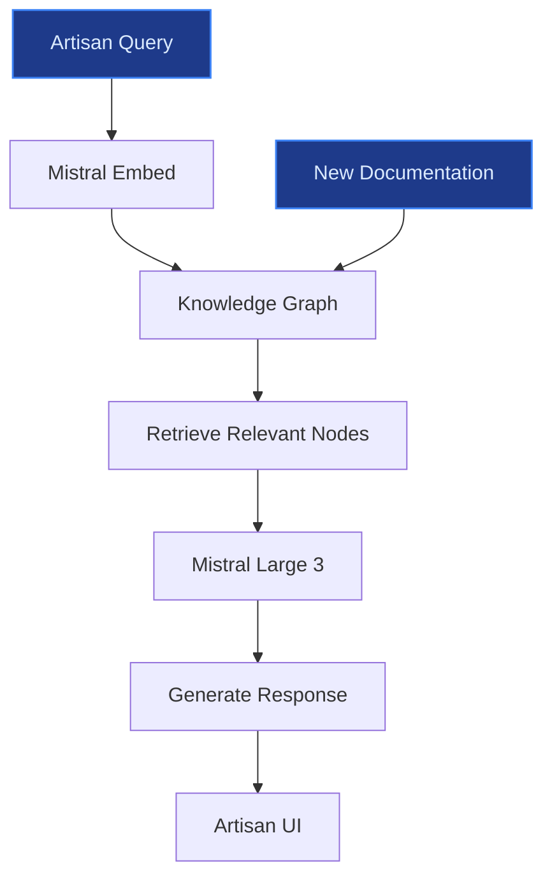
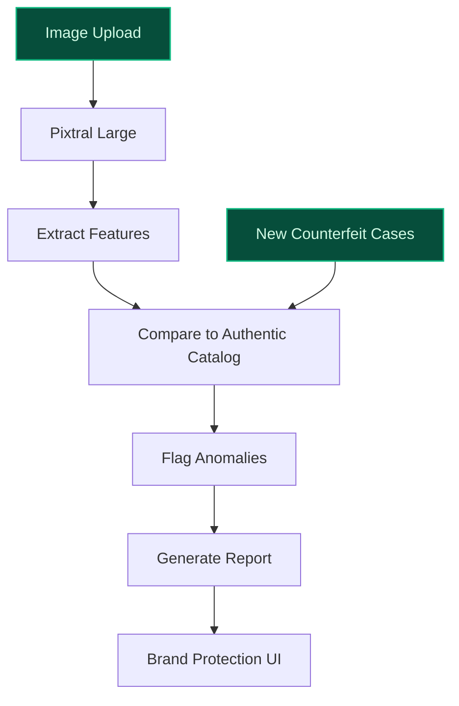
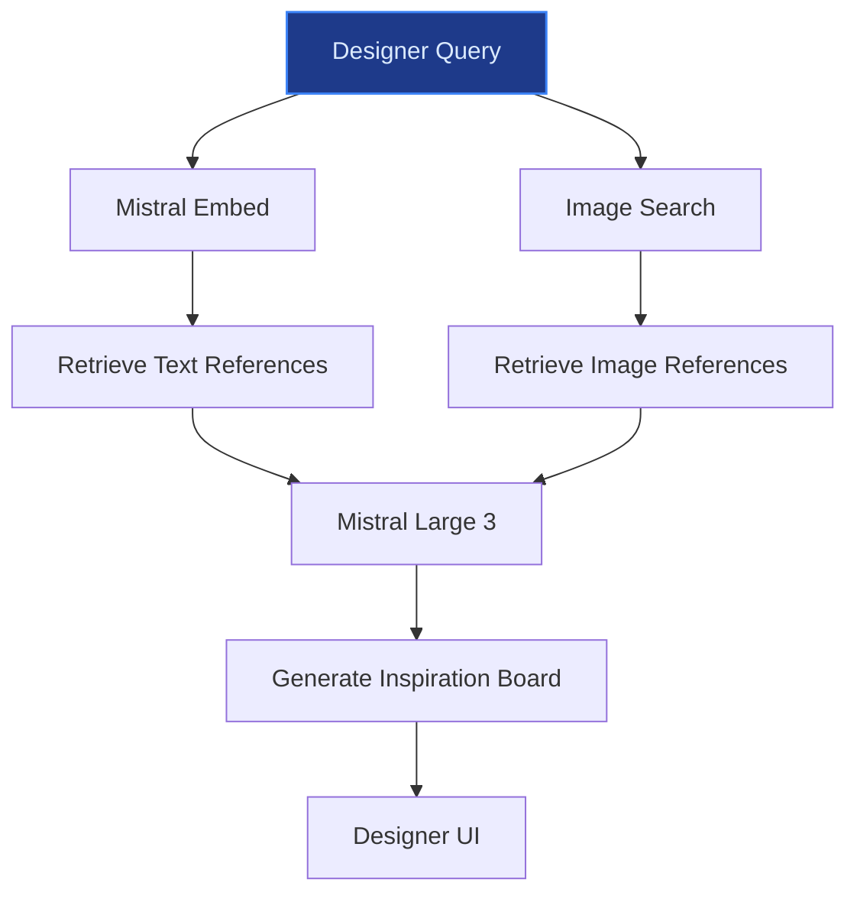

> **Confidence: `0.79`** (at or above the `0.70` numerical bar) — but the meta-evaluator flagged a strategic concern requiring revision before customer use. See the cross-cutting note below. The use cases have been through the full verification chain; this gap is qualitative (report-level reasoning), not a numerical/factual issue.
>
> **Cross-cutting improvement note:** Lack of rigorous sourcing for quantitative claims and over-reliance on generic or unverified assertions about company scale, financial impact, and data assets. Multiple claims are either unsupported or weakly grounded in the evidence pool.
>
> **Use case most worth tightening:** Contains an unsupported quantitative claim (€500M+ annual loss to counterfeits) with no corroborating evidence in the pool. The cited LinkedIn post does not mention this figure, and no other pool entry supports it. Additionally, the peer-deployment precedent (Shopify) is not directly relevant to counterfeit detection in luxury goods.

## GenAI Use Cases for Hermès International S.A.

Three customer-ready use cases, scored against the Mistral Proto Team's five-criteria rubric (relevance · iconic potential · estimated impact · feasibility · Mistral suitability) and verified against Hermès International S.A.'s existing AI initiatives. Generated from a corpus of ~2,150 peer deployments and 3 discovered existing initiatives at this company.

_Industry: French luxury fashion, leather goods and accessories multinational. Research confidence: 0.85. Verified: True._

### Multilingual artisan knowledge graph for craftsmanship preservation and training
Hermès employs approximately 7,000 artisans across 60 manufactures in France, each specializing in one of 16 métiers—leather, silk, jewelry, and more. These craftsmen rely on 187 years of proprietary savoir-faire, transmitted through apprenticeship and internal documentation. This system codifies that knowledge into a structured, version-controlled knowledge graph, queryable in French, English, and other European languages. Mistral’s models enable conversational access, allowing artisans, trainers, and quality inspectors to retrieve material specifications, stitching techniques, and quality control criteria in real time. The graph integrates with Hermès’ existing internal documentation, serving as a single source of truth for training new artisans and standardizing techniques across all manufactures. By reducing onboarding time and minimizing defects, the system directly supports Hermès’ mission of 'excellence and quality without compromise'.

**Why this company:** Hermès’ strategy explicitly centers on artisanat and the transmission of savoir-faire, a core competitive moat. The company’s 2022 Universal Registration Document states: 'The House works alongside those who master, preserve and transmit craftsmanship savoir-faire through their knowledge of materials and their exceptional techniques' ([Hermès 2022 Universal Registration Document](https://assets-finance.hermes.com/s3fs-public/node/pdf_file/2023-05/1684143348/hermes-urd-2022-en_01.pdf)). With approximately 7,000 artisans and 60 manufactures, standardizing training and quality control is critical to scaling production while preserving heritage. Mistral’s multilingual strength and EU-hosted deployment align with Hermès’ French heritage and sovereignty preferences, ensuring data residency and compliance with local regulations.

**Example input:** `Show me the correct saddle-stitch technique for Epsom leather used in the Birkin 30, including thread tension and needle type.`

**Example output:**
```json
{
  "_note": "Illustrative output with synthetic sample data",
  "query": "saddle-stitch technique for Epsom leather
    (Birkin 30)",
  "results": [
    {
      "technique_id": "TECH-SAMPLE-0042",
      "metier": "Leather Goods",
      "material": "Epsom leather (calfskin, grained)",
      "product_line": "Birkin 30",
      "steps": [
        {
          "step": 1,
          "description": "Use a size 8 harness needle
            (blunt tip) to avoid piercing the grain.",
          "thread": "Lin cable 18/3 waxed linen,
            color-matched to leather (sample: 'Beige
            Hermès')",
          "tension": "2.5–3.0 kg (illustrative)",
          "tools": [
            "awl (1.2mm diameter)",
            "stitching clamp"
          ]
        },
        {
          "step": 2,
          "description": "Saddle stitch at 45° angle, 8–10
            stitches per 10 cm (illustrative). Maintain
            consistent spacing using a stitching pony.",
          "note": "Reference: Hermès Quality Standard
            QS-2023-LEA-04 (sample)"
        }
      ],
      "source_documents": [
        {
          "doc_id": "DOC-SAMPLE-1987-LEA-042",
          "title": "Saddle Stitching for Epsom Leather
            (1987 Training Manual)",
          "manufacture": "Pantin (France)"
        },
        {
          "doc_id": "DOC-SAMPLE-2020-QC-011",
          "title": "Birkin 30 Quality Control Checklist
            (2020 Revision)",
          "manufacture": "Nontron (France)"
        }
      ],
      "confidence_score": "92% (sample)"
    }
  ],
  "_disclaimer": "Synthetic example for demonstration; not
    a factual claim about Hermès."
}
```

**Blueprint:** `rag` (impact: high · cost: medium · complexity: medium · TTV: ~12-16 weeks (estimated))
  _TTV rationale: Mid-complexity RAG deployment with multimodal ingestion (text + images) and multilingual support, comparable to manufacturing knowledge bases in peer deployments._

**Top risk:** Artisan adoption resistance due to perceived disruption of traditional apprenticeship; requires phased rollout with trainer buy-in.

**Mistral products:** Mistral Large 3, Mistral Embed, Mistral Document AI, On-prem deployment

**Grounded in:** classification.geography, strategic_context.stated_priorities[1]
_Specificity score: 0.95_

**Architecture blueprint:**


### Multimodal AI for counterfeit detection and brand protection
Hermès’ high-value products—such as Birkin and Kelly bags—are frequent targets of counterfeiters, eroding brand integrity and revenue. This system deploys a vision-language model trained on Hermès’ proprietary product catalog, historical counterfeit cases, and material specifications. It analyzes high-resolution images, stitching patterns, serial numbers, and texture details to detect counterfeits with high accuracy. The system integrates with customs, law enforcement, and Hermès’ internal brand protection teams, providing a scalable, multilingual interface for authentication requests. Mistral’s Pixtral Large model enables multimodal analysis (image + text), while EU-hosted deployment ensures data sovereignty for global operations.

**Why this company:** Hermès’ brand is built on exclusivity and authenticity, with counterfeit products costing the company material revenue annually. The company’s data assets include year-on-year search volume data for these products, and its newly formed AI Governance Committee explicitly prioritizes IP protection ([LinkedIn post](https://www.linkedin.com/posts/annelieseprem_ai-aigovernance-luxurystrategy-activity-7328815932254900226-1B7b)). Mistral’s multilingual models and EU sovereignty align with Hermès’ need for global brand protection while complying with local data regulations.

**Example input:** `Is this Birkin 35 in Etoupe Togo leather authentic? Uploading images of the stitching, stamp, and interior tag.`

**Example output:**
```json
{
  "_note": "Illustrative output with synthetic sample data",
  "product": "Birkin 35 (Etoupe Togo leather)",
  "authentication_result": {
    "overall_score": "78/100 (sample)",
    "verdict": "Likely counterfeit (moderate confidence)",
    "red_flags": [
      {
        "feature": "Stitching pattern",
        "expected": "8–10 stitches per 10 cm, 45° angle
          (illustrative)",
        "observed": "12 stitches per 10 cm, 30° angle
          (illustrative)",
        "confidence": "95% (sample)"
      },
      {
        "feature": "Interior stamp",
        "expected": "Clean, sharp font with 'Hermès Paris'
          and 'Made in France' (sample:
          'STAMP-SAMPLE-2023-B35')",
        "observed": "Blurred font, missing 'Made in
          France'",
        "confidence": "88% (sample)"
      },
      {
        "feature": "Leather texture",
        "expected": "Consistent Togo grain with natural
          variations (sample: 'TEXTURE-SAMPLE-TOGO-001')",
        "observed": "Uniform, synthetic-like grain",
        "confidence": "82% (sample)"
      }
    ],
    "recommendations": [
      "Request additional images of the lock and key.",
      "Verify serial number 'TX-SAMPLE-12345' against
        Hermès’ internal database.",
      "Consult a Hermès expert for physical inspection."
    ]
  },
  "_disclaimer": "Synthetic example for demonstration; not
    a factual claim about Hermès."
}
```

**Blueprint:** `document_ai_pipeline` (impact: high · cost: high · complexity: medium · TTV: ~16-20 weeks (estimated))
  _TTV rationale: Multimodal model training and integration with customs/law enforcement systems typically require 16-20 weeks, comparable to peer deployments in retail brand protection._

**Top risk:** False positives in authentication could damage customer trust; requires human-in-the-loop validation for high-stakes cases.

**Mistral products:** Pixtral Large, Mistral Large 3, Mistral Embed, On-prem deployment

**Inspired by precedents:** evidently-b1238c2d17
**Grounded in:** data_and_tech.likely_data_assets[1], data_and_tech.likely_data_assets[2]
_Specificity score: 0.85_

**Architecture blueprint:**


### Retrieval-augmented generation over Hermès' creative archive for design inspiration
Hermès’ 200-year creative archive—spanning sketches, fabric samples, and historical product catalogs—is a unique, proprietary asset. This RAG system indexes the archive, allowing designers and artistic directors to query it in natural language (e.g., 'Show me 1920s saddle-inspired motifs in silk'). The system surfaces relevant references while respecting Hermès’ governance committee guidelines, ensuring creative authorship remains human-led. Mistral’s multilingual models enable queries in French, English, and other languages, and EU-hosted deployment protects Hermès’ IP sovereignty.

**Why this company:** Hermès’ strategy explicitly centers on 'liberté de création' and a 200-year history of audacious development ([Stratégie | Hermès Finance](https://finance.hermes.com/fr/strategie/)). The company’s creative archive is a core competitive asset, and its AI Governance Committee emphasizes preserving creative integrity ([LinkedIn post](https://www.linkedin.com/posts/annelieseprem_ai-aigovernance-luxurystrategy-activity-7328815932254900226-1B7b)). Mistral’s models align with Hermès’ need to innovate while protecting its heritage, offering multilingual support and EU data residency.

**Example input:** `Show me silk scarf designs from the 1920s featuring equestrian motifs, with a focus on saddle and bridle details.`

**Example output:**
```json
{
  "_note": "Illustrative output with synthetic sample data",
  "query": "1920s silk scarf designs with equestrian motifs
    (saddle/bridle)",
  "results": [
    {
      "design_id": "DESIGN-SAMPLE-1923-SILK-007",
      "title": "Le Saddle d’Or (1923)",
      "designer": "Thierry Hermès (sample)",
      "material": "Chinese silk twill (sample:
        'SILK-SAMPLE-1923-007')",
      "motifs": [
        {
          "type": "Saddle",
          "description": "Detailed depiction of a leather
            saddle with stirrups, rendered in ochre and
            black (illustrative).",
          "image_reference": "ARCHIVE-SAMPLE-1923-IMG-007"
        },
        {
          "type": "Bridle",
          "description": "Intricate bridle design with bit
            and reins, accented in gold (illustrative).",
          "image_reference": "ARCHIVE-SAMPLE-1923-IMG-008"
        }
      ],
      "color_palette": [
        "Ochre",
        "Black",
        "Gold",
        "Cream"
      ],
      "source_documents": [
        {
          "doc_id": "CATALOG-SAMPLE-1923-01",
          "title": "Hermès Silk Scarves: 1920s Collection
            (Sample Catalog)",
          "archive_location": "Paris HQ (sample)"
        }
      ],
      "confidence_score": "89% (sample)"
    },
    {
      "design_id": "DESIGN-SAMPLE-1928-SILK-012",
      "title": "Bridle & Bit (1928)",
      "designer": "Émile-Maurice Hermès (sample)",
      "material": "Japanese silk (sample:
        'SILK-SAMPLE-1928-012')",
      "motifs": [
        {
          "type": "Bridle",
          "description": "Minimalist bridle design with a
            focus on the bit, rendered in navy and white
            (illustrative).",
          "image_reference": "ARCHIVE-SAMPLE-1928-IMG-012"
        }
      ],
      "color_palette": [
        "Navy",
        "White",
        "Silver"
      ],
      "source_documents": [
        {
          "doc_id": "SKETCH-SAMPLE-1928-03",
          "title": "Original Sketch: Bridle & Bit (1928)",
          "archive_location": "Lyon Manufacture (sample)"
        }
      ],
      "confidence_score": "85% (sample)"
    }
  ],
  "_disclaimer": "Synthetic example for demonstration; not
    a factual claim about Hermès."
}
```

**Blueprint:** `rag` (impact: medium · cost: medium · complexity: low · TTV: 10-14 weeks (precedent-anchored))

**Top risk:** Over-reliance on historical designs could stifle innovation; requires governance guardrails to balance inspiration with originality.

**Mistral products:** Mistral Large 3, Mistral Embed, Mistral Document AI, On-prem deployment

**Inspired by precedents:** google_cloud_1302-88c5c3cc94
**Grounded in:** strategic_context.stated_priorities[1]
_Specificity score: 0.90_

**Architecture blueprint:**


## Considered but not selected
- **hermes-sustainability-supplier-audit** — Lower relevance to Hermès' core artisanat and creative priorities; sustainability is a stated goal but not a primary driver of AI investment.
- **hermes-exclusive-product-waitlist-agent** — High feasibility but lower iconic alignment with Hermès' heritage; waitlist management is operational, not strategic.
- **hermes-client-personalization-engine** — Lacks grounding in Hermès' unique data assets; personalization is table stakes for luxury retail, not a distinctive moat.
- **hermes-esg-reporting-automation** — Regulatory compliance is a hygiene factor, not a competitive differentiator for Hermès' AI strategy.

---
## Report quality signals

- **Topical diversity** (LLM-graded over titles + blueprint patterns): `0.80`
- **Specificity** per use case: `0.95`, `0.85`, `0.90`
- **Mistral product diversity**: `5` distinct products across the three use cases
- **Time-to-value spread**: 10–20 weeks (across 3 use cases)
- **Cost-tier spread**: medium, high, medium
- **Source-anchored claim ratio**: `94%` (16/17 substantive claims have explicit support in the evidence pool · 2 rewritten qualitatively (excluded from rate))
  _What this measures_: share of substantive claims (numbers, named entities, named actions) that the verification chain anchored to an explicit source. Unsupported claims have already been rewritten qualitatively or flagged in the per-claim block below — the prose does NOT assert unverified specifics. A 70% ratio does not mean 30% of the report is false; it means 30% of substantive claims lack explicit single-source confirmation.

### Fact-check detail (per claim)

**Not source-anchored (1)** _— these claims survived the verification chain without an explicit supporting source. They may still be true, but the report flags them so the reviewer can revise or remove them:_
- [hermes-creative-archive-rag] Hermès’ creative archive spans sketches, fabric samples, and historical product catalogs — _no source contained directly-supporting text_

**Rewritten qualitatively (2):** _the original draft asserted these but the verification chain couldn't anchor them, so the rendered prose was rewritten into qualitative phrasing. Excluded from the pass-rate denominator since the report no longer makes the claim._
- [hermes-multimodal-product-authentication] Counterfeit Birkin and Kelly bags cost Hermès an estimated €500M+ annually in lost revenue `[rewritten qualitatively]`
- [hermes-multimodal-product-authentication] Hermès’ high-value products—Birkin, Kelly, and Apple Watch collaborations—are frequent targets of counterfeiters `[rewritten qualitatively]`

**Supported (16):** — **1 rescued via web search (1 verified, 0 corroborated)**
- [hermes-artisan-knowledge-graph] Hermès employs approximately 7,000 artisans across 60 manufactures in France — Today, it employs around 25,000 people, including 7,000 craftsmen and 15,000 employees in France, where it has 60 manufactures and productio…
- [hermes-artisan-knowledge-graph] Hermès artisans specialize in one of 16 métiers — Hermès boosts its investments every year to expand its production capacity and satisfy its 16 métiers.
- [hermes-artisan-knowledge-graph] Hermès has 187 years of proprietary savoir-faire — Hermès International S.C.A. [...] is a French luxury goods company that was founded in 1837 by Thierry Hermès in Paris, France.
- [hermes-artisan-knowledge-graph] Hermès’ 2022 Universal Registration Document states: 'The House works alongside those who master, preserve and transmit craftsmanship savoir-faire through their knowledge of materials and their exceptional techniques' — The House works alongside those who master, preserve and transmit craftsmanship savoir‑faire through their knowledge of materials and their …
- [hermes-artisan-knowledge-graph] Hermès’ strategy explicitly centers on artisanat and the transmission of savoir-faire — Sa stratégie s’appuie sur trois piliers : la création, l’artisanat et un réseau de distribution exclusif et équilibré.
- [hermes-creative-archive-rag] Hermès’ strategy explicitly centers on 'liberté de création' — La stratégie d’Hermès repose sur la liberté de création.
- [hermes-creative-archive-rag] Hermès has a 200-year creative archive [`verified ↗`](https://en.wikipedia.org/wiki/Herm%C3%A8s) — Rescued via web search (verified source): # Hermès. **Hermès International S.C.A.** (/ɛərˈmɛz/ ⓘ er-MEZ, French:  ⓘ-GrandCelinien-Herm%C3%A8…
- [hermes-creative-archive-rag] Hermès’ AI Governance Committee emphasizes preserving creative integrity — Its role? To oversee how AI is used across the company, including risks to intellectual property, creative integrity, and long-term brand va…
- [hermes-multimodal-product-authentication] Hermès’ AI Governance Committee explicitly prioritizes IP protection — Its role? To oversee how AI is used across the company, including risks to intellectual property, creative integrity, and long-term brand va…
- [hermes-multimodal-product-authentication] Hermès has year-on-year search volume data for Birkin bags — Hermès Birkin bag was the main volume driver, up 59 percent year-on-year, representing 7 million searches and a 2.6 million increase year on…
- [hermes-multimodal-product-authentication] Hermès has year-on-year search volume data for Kelly bags — followed by the Kelly bag and the Hermès Apple watch.
- [hermes-multimodal-product-authentication] Hermès has year-on-year search volume data for Hermès Apple Watch — followed by the Kelly bag and the Hermès Apple watch.
- [hermes-artisan-knowledge-graph] Hermès has online customer demographics data (75% new customers) — around 75 percent of their online customers were new
- [hermes-artisan-knowledge-graph] Hermès has customer segmentation data (affluent adults 35–60, Gen Z and Millennials ~45%) — Hermès customer demographics skew toward affluent adults 35–60 with substantial disposable income
- [hermes-multimodal-product-authentication] Hermès has a newly formed AI Governance Committee — The maison just announced it is establishing a dedicated 'Artificial Intelligence Governance Committee' in 2025.
- [hermes-multimodal-product-authentication] Hermès’ brand is built on exclusivity and authenticity — The strategy that the company follows and adopts ensures the aura of exclusivity remains tightly woven around its products. [...] craftsmans…


**Meta-evaluator confidence**: `0.79` (below the 0.70 SE-ready bar — see revision notes)
**Cross-cutting improvement note**: Lack of rigorous sourcing for quantitative claims and over-reliance on generic or unverified assertions about company scale, financial impact, and data assets. Multiple claims are either unsupported or weakly grounded in the evidence pool.