# Trace

## Execution trace — Hermes

Started: `2026-05-11T02:35:50.738359+00:00`. Total wall time: `169.8s` across `46` recorded actions.

### Per-step time totals

| Step | Calls | Total time | Avg time |
|---|---:|---:|---:|
| `resolve_entity` | 1 | 0.49s | 490ms |
| `research` | 1 | 6.15s | 6145ms |
| `gap_fill` | 4 | 3.69s | 922ms |
| `retrieve` | 2 | 0.19s | 96ms |
| `generate` | 2 | 23.36s | 11679ms |
| `generate.web_search` | 2 | 6.59s | 3297ms |
| `score` | 2 | 25.53s | 12764ms |
| `verify` | 6 | 15.33s | 2555ms |
| `enrich` | 1 | 64.17s | 64165ms |
| `polish` | 1 | 2.72s | 2723ms |
| `meta_eval` | 1 | 12.00s | 12002ms |
| `web_verify` | 1 | 3.00s | 3002ms |
| `source_judge` | 19 | 14.22s | 748ms |
| `final_qualify` | 1 | 1.78s | 1776ms |
| `quality_signals` | 2 | 4.00s | 2002ms |

### Chronological event log

- `02:35:50.738` **[resolve_entity]** `mistral-small-2603.chat.complete` — 490ms
   - inputs: user_input='Hermes'
   - outputs: resolved=True → 'Hermès International S.A.'
- `02:36:01.599` **[research]** `mistral-medium-2604.chat.complete` — 6145ms
   - inputs: synthesize CompanyContext for Hermès International S.A. | depth=medium
   - outputs: industry='French luxury fashion, leather goods and accessories multinational' verified=True conf=0.75
- `02:36:07.746` **[gap_fill]** `mistral-small-2603.chat.complete` — 867ms
   - inputs: generate gap queries | fields=['business_model', 'products', 'data_assets', 'priorities']
   - outputs: queries=4
- `02:36:14.528` **[gap_fill]** `mistral-small-2603.chat.complete` — 893ms
   - inputs: layer-2 extract field=priorities
   - outputs: items=6
- `02:36:14.533` **[gap_fill]** `mistral-small-2603.chat.complete` — 1320ms
   - inputs: layer-2 extract field=data_assets
   - outputs: items=6
- `02:36:14.537` **[gap_fill]** `mistral-small-2603.chat.complete` — 606ms
   - inputs: layer-2 extract field=products
   - outputs: items=0
- `02:36:15.854` **[retrieve]** `mistral-embed.embeddings.create` — 183ms
   - inputs: company_query | industries='French luxury fashion, leather goods and accessories multinational'
   - outputs: embedded 1024-dim query vector
- `02:36:16.037` **[retrieve]** `precedent_corpus.cosine_topk` — 8ms
   - inputs: k=8 min_depth=0.4 target='Hermès International S.A.'
   - outputs: retrieved 8 | mmr=True | top_sim=0.798
- `02:36:17.856` **[generate]** `mistral-medium-2604.chat.complete` — 1983ms
   - inputs: iteration=0 tool_calls_used=0/2 tools=on
   - outputs: tool_calls=4 | content_chars=0
- `02:36:19.854` **[generate.web_search]** `tavily.search` — 2655ms
   - inputs: query='Hermès official sustainability and ESG commitments 2024 2025'
   - outputs: 2 raw results
- `02:36:23.260` **[generate.web_search]** `tavily.search` — 3940ms
   - inputs: query='Hermès recent digital retail and e-commerce initiatives 2024 2025'
   - outputs: 2 raw results
- `02:36:28.688` **[generate]** `mistral-medium-2604.chat.complete` — 21375ms
   - inputs: iteration=1 tool_calls_used=2/2 tools=off
   - outputs: tool_calls=0 | content_chars=15164
- `02:36:50.356` **[score]** `mistral-small-2603.chat.complete` — 12542ms
   - inputs: self-consistency pass T=0.2
   - outputs: scored 8 candidates
- `02:36:50.364` **[score]** `mistral-small-2603.chat.complete` — 12986ms
   - inputs: self-consistency pass T=0.4
   - outputs: scored 8 candidates
- `02:37:03.378` **[verify]** `tavily.search` — 2854ms
   - inputs: candidate=hermes-artisan-knowledge-graph | query='Hermès International S.A. Multilingual artisan knowledge gra'
   - outputs: 4 results
- `02:37:03.379` **[verify]** `tavily.search` — 2164ms
   - inputs: candidate=hermes-multimodal-product-authentication | query='Hermès International S.A. Multimodal AI for counterfeit dete'
   - outputs: 4 results
- `02:37:03.379` **[verify]** `tavily.search` — 3064ms
   - inputs: candidate=hermes-creative-archive-rag | query='Hermès International S.A. Retrieval-augmented generation ove'
   - outputs: 4 results
- `02:37:06.294` **[verify]** `mistral-small-2603.chat.complete` — 1618ms
   - inputs: verdict for hermes-multimodal-product-authentication
   - outputs: verdict='pass'
- `02:37:06.547` **[verify]** `mistral-small-2603.chat.complete` — 3715ms
   - inputs: verdict for hermes-artisan-knowledge-graph
   - outputs: verdict='pass'
- `02:37:06.642` **[verify]** `mistral-small-2603.chat.complete` — 1912ms
   - inputs: verdict for hermes-creative-archive-rag
   - outputs: verdict='pass'
- `02:37:10.267` **[enrich]** `mistral-large-2512.chat.complete` — 64165ms
   - inputs: tier=standard parallel=False ids=['hermes-artisan-knowledge-graph', 'hermes-multimodal-product-authentication', 'hermes-creative-archive-rag']
   - outputs: enriched 3 use cases
- `02:38:14.458` **[polish]** `mistral-small-2603.chat.complete` — 2723ms
   - inputs: use_case=hermes-artisan-knowledge-graph unanchored=True opaque_ev=False
   - outputs: polished 5 fields
- `02:38:17.186` **[meta_eval]** `mistral-medium-2604.chat.complete` — 12002ms
   - inputs: reviewing 3 use cases
   - outputs: review + claims
- `02:38:29.207` **[web_verify]** `tavily.search.rescue_unsupported_claims` — 3002ms
   - inputs: company='Hermès International S.A.' unsupported=3 budget=12
   - outputs: rescued: verified=1 corroborated=1 of 3 attempted
- `02:38:32.211` **[source_judge]** `mistral-small-2603.judge_claim_sources` — 2101ms
   - inputs: pairs=18
   - outputs: judged 18 pairs
- `02:38:32.211` **[source_judge]** `mistral-small-2603.chat.complete` — 710ms
   - inputs: claim='Hermès employs approximately 7,000 artisans across 60 manufa'
   - outputs: verdict=supported
- `02:38:32.216` **[source_judge]** `mistral-small-2603.chat.complete` — 1139ms
   - inputs: claim='Hermès artisans specialize in one of 16 métiers'
   - outputs: verdict=supported
- `02:38:32.220` **[source_judge]** `mistral-small-2603.chat.complete` — 769ms
   - inputs: claim='Hermès has 187 years of proprietary savoir-faire'
   - outputs: verdict=supported
- `02:38:32.223` **[source_judge]** `mistral-small-2603.chat.complete` — 659ms
   - inputs: claim="Hermès’ 2022 Universal Registration Document states: 'The Ho"
   - outputs: verdict=supported
- `02:38:32.227` **[source_judge]** `mistral-small-2603.chat.complete` — 787ms
   - inputs: claim='Hermès’ strategy explicitly centers on artisanat and the tra'
   - outputs: verdict=supported
- `02:38:32.232` **[source_judge]** `mistral-small-2603.chat.complete` — 571ms
   - inputs: claim="Hermès’ strategy explicitly centers on 'liberté de création'"
   - outputs: verdict=supported
- `02:38:32.235` **[source_judge]** `mistral-small-2603.chat.complete` — 642ms
   - inputs: claim='Hermès has a 200-year creative archive'
   - outputs: verdict=supported
- `02:38:32.238` **[source_judge]** `mistral-small-2603.chat.complete` — 650ms
   - inputs: claim='Hermès’ AI Governance Committee emphasizes preserving creati'
   - outputs: verdict=supported
- `02:38:32.804` **[source_judge]** `mistral-small-2603.chat.complete` — 514ms
   - inputs: claim='Hermès’ AI Governance Committee explicitly prioritizes IP pr'
   - outputs: verdict=supported
- `02:38:32.878` **[source_judge]** `mistral-small-2603.chat.complete` — 695ms
   - inputs: claim='Counterfeit Birkin and Kelly bags cost Hermès an estimated €'
   - outputs: verdict=unsupported
- `02:38:32.883` **[source_judge]** `mistral-small-2603.chat.complete` — 658ms
   - inputs: claim='Hermès has year-on-year search volume data for Birkin bags'
   - outputs: verdict=supported
- `02:38:32.888` **[source_judge]** `mistral-small-2603.chat.complete` — 584ms
   - inputs: claim='Hermès has year-on-year search volume data for Kelly bags'
   - outputs: verdict=supported
- `02:38:32.921` **[source_judge]** `mistral-small-2603.chat.complete` — 537ms
   - inputs: claim='Hermès has year-on-year search volume data for Hermès Apple '
   - outputs: verdict=supported
- `02:38:32.989` **[source_judge]** `mistral-small-2603.chat.complete` — 552ms
   - inputs: claim='Hermès has online customer demographics data (75% new custom'
   - outputs: verdict=supported
- `02:38:33.013` **[source_judge]** `mistral-small-2603.chat.complete` — 561ms
   - inputs: claim='Hermès has customer segmentation data (affluent adults 35–60'
   - outputs: verdict=supported
- `02:38:33.317` **[source_judge]** `mistral-small-2603.chat.complete` — 553ms
   - inputs: claim='Hermès has a newly formed AI Governance Committee'
   - outputs: verdict=supported
- `02:38:33.355` **[source_judge]** `mistral-small-2603.chat.complete` — 956ms
   - inputs: claim='Hermès’ brand is built on exclusivity and authenticity'
   - outputs: verdict=supported
- `02:38:33.458` **[source_judge]** `mistral-small-2603.chat.complete` — 583ms
   - inputs: claim='Hermès’ high-value products—Birkin, Kelly, and Apple Watch c'
   - outputs: verdict=unsupported
- `02:38:34.313` **[final_qualify]** `mistral-small-2603.chat.complete` — 1776ms
   - inputs: use_case=hermes-multimodal-product-authentication unsupported=2
   - outputs: qualified 4 fields
- `02:38:36.505` **[quality_signals]** `mistral-small-2603.chat.complete` — 2574ms
   - inputs: specificity grade (3 use cases)
   - outputs: scored 3 use cases
- `02:38:39.079` **[quality_signals]** `mistral-small-2603.chat.complete` — 1431ms
   - inputs: diversity grade
   - outputs: diversity=0.8

## Mermaid sequence

```mermaid
sequenceDiagram
    autonumber
    participant pipeline as pipeline
    participant mistral_small_2603 as mistral-small-2603
    participant mistral_medium_2604 as mistral-medium-2604
    participant mistral_embed as mistral-embed
    participant precedent_corpus as precedent_corpus
    participant tavily as tavily
    participant mistral_large_2512 as mistral-large-2512
    participant tavily_search as tavily.search
    pipeline->>mistral_small_2603: resolve_entity: chat.complete (490ms)
    mistral_small_2603-->>pipeline: resolved=True → 'Hermès International S.A.'
    pipeline->>mistral_medium_2604: research: chat.complete (6145ms)
    mistral_medium_2604-->>pipeline: industry='French luxury fashion, leather goods and accessori
    pipeline->>mistral_small_2603: gap_fill: chat.complete (867ms)
    mistral_small_2603-->>pipeline: queries=4
    pipeline->>mistral_small_2603: gap_fill: chat.complete (893ms)
    mistral_small_2603-->>pipeline: items=6
    pipeline->>mistral_small_2603: gap_fill: chat.complete (1320ms)
    mistral_small_2603-->>pipeline: items=6
    pipeline->>mistral_small_2603: gap_fill: chat.complete (606ms)
    mistral_small_2603-->>pipeline: items=0
    pipeline->>mistral_embed: retrieve: embeddings.create (183ms)
    mistral_embed-->>pipeline: embedded 1024-dim query vector
    pipeline->>precedent_corpus: retrieve: cosine_topk (8ms)
    precedent_corpus-->>pipeline: retrieved 8 | mmr=True | top_sim=0.798
    pipeline->>mistral_medium_2604: generate: chat.complete (1983ms)
    mistral_medium_2604-->>pipeline: tool_calls=4 | content_chars=0
    pipeline->>tavily: generate.web_search: search (2655ms)
    tavily-->>pipeline: 2 raw results
    pipeline->>tavily: generate.web_search: search (3940ms)
    tavily-->>pipeline: 2 raw results
    pipeline->>mistral_medium_2604: generate: chat.complete (21375ms)
    mistral_medium_2604-->>pipeline: tool_calls=0 | content_chars=15164
    pipeline->>mistral_small_2603: score: chat.complete (12542ms)
    mistral_small_2603-->>pipeline: scored 8 candidates
    pipeline->>mistral_small_2603: score: chat.complete (12986ms)
    mistral_small_2603-->>pipeline: scored 8 candidates
    pipeline->>tavily: verify: search (2854ms)
    tavily-->>pipeline: 4 results
    pipeline->>tavily: verify: search (2164ms)
    tavily-->>pipeline: 4 results
    pipeline->>tavily: verify: search (3064ms)
    tavily-->>pipeline: 4 results
    pipeline->>mistral_small_2603: verify: chat.complete (1618ms)
    mistral_small_2603-->>pipeline: verdict='pass'
    pipeline->>mistral_small_2603: verify: chat.complete (3715ms)
    mistral_small_2603-->>pipeline: verdict='pass'
    pipeline->>mistral_small_2603: verify: chat.complete (1912ms)
    mistral_small_2603-->>pipeline: verdict='pass'
    pipeline->>mistral_large_2512: enrich: chat.complete (64165ms)
    mistral_large_2512-->>pipeline: enriched 3 use cases
    pipeline->>mistral_small_2603: polish: chat.complete (2723ms)
    mistral_small_2603-->>pipeline: polished 5 fields
    pipeline->>mistral_medium_2604: meta_eval: chat.complete (12002ms)
    mistral_medium_2604-->>pipeline: review + claims
    pipeline->>tavily_search: web_verify: rescue_unsupported_claims (3002ms)
    tavily_search-->>pipeline: rescued: verified=1 corroborated=1 of 3 attempted
    pipeline->>mistral_small_2603: source_judge: judge_claim_sources (2101ms)
    mistral_small_2603-->>pipeline: judged 18 pairs
    pipeline->>mistral_small_2603: source_judge: chat.complete (710ms)
    mistral_small_2603-->>pipeline: verdict=supported
    pipeline->>mistral_small_2603: source_judge: chat.complete (1139ms)
    mistral_small_2603-->>pipeline: verdict=supported
    pipeline->>mistral_small_2603: source_judge: chat.complete (769ms)
    mistral_small_2603-->>pipeline: verdict=supported
    pipeline->>mistral_small_2603: source_judge: chat.complete (659ms)
    mistral_small_2603-->>pipeline: verdict=supported
    pipeline->>mistral_small_2603: source_judge: chat.complete (787ms)
    mistral_small_2603-->>pipeline: verdict=supported
    pipeline->>mistral_small_2603: source_judge: chat.complete (571ms)
    mistral_small_2603-->>pipeline: verdict=supported
    pipeline->>mistral_small_2603: source_judge: chat.complete (642ms)
    mistral_small_2603-->>pipeline: verdict=supported
    pipeline->>mistral_small_2603: source_judge: chat.complete (650ms)
    mistral_small_2603-->>pipeline: verdict=supported
    pipeline->>mistral_small_2603: source_judge: chat.complete (514ms)
    mistral_small_2603-->>pipeline: verdict=supported
    pipeline->>mistral_small_2603: source_judge: chat.complete (695ms)
    mistral_small_2603-->>pipeline: verdict=unsupported
    pipeline->>mistral_small_2603: source_judge: chat.complete (658ms)
    mistral_small_2603-->>pipeline: verdict=supported
    pipeline->>mistral_small_2603: source_judge: chat.complete (584ms)
    mistral_small_2603-->>pipeline: verdict=supported
    pipeline->>mistral_small_2603: source_judge: chat.complete (537ms)
    mistral_small_2603-->>pipeline: verdict=supported
    pipeline->>mistral_small_2603: source_judge: chat.complete (552ms)
    mistral_small_2603-->>pipeline: verdict=supported
    pipeline->>mistral_small_2603: source_judge: chat.complete (561ms)
    mistral_small_2603-->>pipeline: verdict=supported
    pipeline->>mistral_small_2603: source_judge: chat.complete (553ms)
    mistral_small_2603-->>pipeline: verdict=supported
    pipeline->>mistral_small_2603: source_judge: chat.complete (956ms)
    mistral_small_2603-->>pipeline: verdict=supported
    pipeline->>mistral_small_2603: source_judge: chat.complete (583ms)
    mistral_small_2603-->>pipeline: verdict=unsupported
    pipeline->>mistral_small_2603: final_qualify: chat.complete (1776ms)
    mistral_small_2603-->>pipeline: qualified 4 fields
    pipeline->>mistral_small_2603: quality_signals: chat.complete (2574ms)
    mistral_small_2603-->>pipeline: scored 3 use cases
    pipeline->>mistral_small_2603: quality_signals: chat.complete (1431ms)
    mistral_small_2603-->>pipeline: diversity=0.8
```

