# Trace

## Execution trace — Joe's Pizza Shop

Started: `2026-05-11T02:41:42.836314+00:00`. Total wall time: `190.9s` across `42` recorded actions.

### Per-step time totals

| Step | Calls | Total time | Avg time |
|---|---:|---:|---:|
| `resolve_entity` | 1 | 0.96s | 958ms |
| `research` | 1 | 5.04s | 5045ms |
| `gap_fill` | 4 | 2.92s | 730ms |
| `retrieve` | 2 | 0.27s | 136ms |
| `generate` | 2 | 24.51s | 12256ms |
| `generate.web_search` | 2 | 4.93s | 2467ms |
| `score` | 2 | 24.72s | 12358ms |
| `verify` | 6 | 15.61s | 2602ms |
| `enrich` | 1 | 56.33s | 56334ms |
| `meta_eval` | 1 | 9.69s | 9690ms |
| `web_verify` | 1 | 7.86s | 7860ms |
| `source_judge` | 15 | 51.77s | 3451ms |
| `final_qualify` | 2 | 3.54s | 1768ms |
| `quality_signals` | 2 | 4.11s | 2053ms |

### Chronological event log

- `02:41:42.836` **[resolve_entity]** `mistral-small-2603.chat.complete` — 958ms
   - inputs: user_input="Joe's Pizza Shop"
   - outputs: resolved=True → "Joe's Pizza"
- `02:41:58.236` **[research]** `mistral-medium-2604.chat.complete` — 5045ms
   - inputs: synthesize CompanyContext for Joe's Pizza | depth=medium
   - outputs: industry='New York City pizzeria' verified=True conf=0.75
- `02:42:03.282` **[gap_fill]** `mistral-small-2603.chat.complete` — 762ms
   - inputs: generate gap queries | fields=['business_model', 'products', 'data_assets', 'priorities']
   - outputs: queries=4
- `02:42:12.542` **[gap_fill]** `mistral-small-2603.chat.complete` — 402ms
   - inputs: layer-2 extract field=priorities
   - outputs: items=0
- `02:42:12.546` **[gap_fill]** `mistral-small-2603.chat.complete` — 729ms
   - inputs: layer-2 extract field=data_assets
   - outputs: items=6
- `02:42:12.549` **[gap_fill]** `mistral-small-2603.chat.complete` — 1028ms
   - inputs: layer-2 extract field=products
   - outputs: items=24
- `02:42:13.579` **[retrieve]** `mistral-embed.embeddings.create` — 264ms
   - inputs: company_query | industries='New York City pizzeria'
   - outputs: embedded 1024-dim query vector
- `02:42:13.842` **[retrieve]** `precedent_corpus.cosine_topk` — 7ms
   - inputs: k=8 min_depth=0.4 target="Joe's Pizza"
   - outputs: retrieved 8 | mmr=True | top_sim=0.788
- `02:42:15.580` **[generate]** `mistral-medium-2604.chat.complete` — 1782ms
   - inputs: iteration=0 tool_calls_used=0/2 tools=on
   - outputs: tool_calls=4 | content_chars=0
- `02:42:17.373` **[generate.web_search]** `tavily.search` — 2655ms
   - inputs: query="Joe's Pizza Greenwich Village Carmine Street menu specials history"
   - outputs: 2 raw results
- `02:42:20.631` **[generate.web_search]** `tavily.search` — 2278ms
   - inputs: query="Joe's Pizza New York City customer loyalty program news"
   - outputs: 2 raw results
- `02:42:23.883` **[generate]** `mistral-medium-2604.chat.complete` — 22731ms
   - inputs: iteration=1 tool_calls_used=2/2 tools=off
   - outputs: tool_calls=0 | content_chars=14941
- `02:42:46.951` **[score]** `mistral-small-2603.chat.complete` — 12576ms
   - inputs: self-consistency pass T=0.2
   - outputs: scored 8 candidates
- `02:42:46.957` **[score]** `mistral-small-2603.chat.complete` — 12139ms
   - inputs: self-consistency pass T=0.4
   - outputs: scored 8 candidates
- `02:42:59.564` **[verify]** `tavily.search` — 2290ms
   - inputs: candidate=joes_pizza_brand_story_content_generator | query="Joe's Pizza AI-Generated Brand Story Content for Social Medi"
   - outputs: 4 results
- `02:42:59.565` **[verify]** `tavily.search` — 5482ms
   - inputs: candidate=joes_pizza_smart_inventory_forecasting | query="Joe's Pizza Smart Inventory Forecasting for Perishable Ingre"
   - outputs: 4 results
- `02:42:59.565` **[verify]** `tavily.search` — 2627ms
   - inputs: candidate=joes_pizza_dynamic_menu_recommendations | query="Joe's Pizza Dynamic Menu Recommendations with Cultural and S"
   - outputs: 4 results
- `02:43:02.108` **[verify]** `mistral-small-2603.chat.complete` — 1778ms
   - inputs: verdict for joes_pizza_brand_story_content_generator
   - outputs: verdict='pass'
- `02:43:03.052` **[verify]** `mistral-small-2603.chat.complete` — 1764ms
   - inputs: verdict for joes_pizza_dynamic_menu_recommendations
   - outputs: verdict='pass'
- `02:43:11.653` **[verify]** `mistral-small-2603.chat.complete` — 1670ms
   - inputs: verdict for joes_pizza_smart_inventory_forecasting
   - outputs: verdict='pass'
- `02:43:13.329` **[enrich]** `mistral-large-2512.chat.complete` — 56334ms
   - inputs: tier=standard parallel=False ids=['joes_pizza_brand_story_content_generator', 'joes_pizza_smart_inventory_forecasting', 'joes_pizza_dynamic_menu_recommendations']
   - outputs: enriched 3 use cases
- `02:44:09.696` **[meta_eval]** `mistral-medium-2604.chat.complete` — 9690ms
   - inputs: reviewing 3 use cases
   - outputs: review + claims
- `02:44:19.407` **[web_verify]** `tavily.search.rescue_unsupported_claims` — 7860ms
   - inputs: company="Joe's Pizza" unsupported=8 budget=12
   - outputs: rescued: verified=2 corroborated=4 of 8 attempted
- `02:44:27.269` **[source_judge]** `mistral-small-2603.judge_claim_sources` — 20084ms
   - inputs: pairs=14
   - outputs: judged 14 pairs
- `02:44:27.269` **[source_judge]** `mistral-small-2603.chat.complete` — 737ms
   - inputs: claim="Joe's Pizza is a Greenwich Village institution since 1975"
   - outputs: verdict=supported
- `02:44:27.278` **[source_judge]** `mistral-small-2603.chat.complete` — 671ms
   - inputs: claim="Joe's Pizza was founded by Joe Pozzuoli"
   - outputs: verdict=supported
- `02:44:27.281` **[source_judge]** `mistral-small-2603.chat.complete` — 793ms
   - inputs: claim="Joe's Pizza has iconic signatures like 'Joe's Porky Pie' and"
   - outputs: verdict=unsupported
- `02:44:27.284` **[source_judge]** `mistral-small-2603.chat.complete` — 715ms
   - inputs: claim="Joe's Pizza has a 50-year history"
   - outputs: verdict=supported
- `02:44:27.287` **[source_judge]** `mistral-small-2603.chat.complete` — 684ms
   - inputs: claim="Joe's Pizza is a must-visit destination for both locals and "
   - outputs: verdict=supported
- `02:44:27.290` **[source_judge]** `mistral-small-2603.chat.complete` — 582ms
   - inputs: claim="Joe's Pizza's menu includes 'Joe's Porky Pie' and 'Native Mu"
   - outputs: verdict=unsupported
- `02:44:27.294` **[source_judge]** `mistral-small-2603.chat.complete` — 513ms
   - inputs: claim="Joe's Pizza relies on perishable ingredients for its iconic "
   - outputs: verdict=unsupported
- `02:44:27.297` **[source_judge]** `mistral-small-2603.chat.complete` ❌ — 20055ms
   - inputs: claim="Joe's Pizza has high footfall and is located in Greenwich Vi"
   - error: `ReadTimeout`
- `02:44:27.807` **[source_judge]** `mistral-small-2603.chat.complete` — 665ms
   - inputs: claim="Joe's Pizza has existing transaction data (basket size, in-s"
   - outputs: verdict=supported
- `02:44:27.873` **[source_judge]** `mistral-small-2603.chat.complete` — 526ms
   - inputs: claim="OK Corporation's near real-time purchase analysis enables ma"
   - outputs: verdict=supported
- `02:44:27.949` **[source_judge]** `mistral-small-2603.chat.complete` — 1421ms
   - inputs: claim="Joe's Pizza's menu includes time-tested signatures like 'Joe"
   - outputs: verdict=supported
- `02:44:27.971` **[source_judge]** `mistral-small-2603.chat.complete` — 781ms
   - inputs: claim="Joe's Pizza attracts a diverse customer base (locals, touris"
   - outputs: verdict=supported
- `02:44:27.999` **[source_judge]** `mistral-small-2603.chat.complete` — 628ms
   - inputs: claim="Joe's Pizza is located in Greenwich Village and exposed to s"
   - outputs: verdict=supported
- `02:44:28.006` **[source_judge]** `mistral-small-2603.chat.complete` — 2914ms
   - inputs: claim="Joe's Pizza has existing transaction data (basket size, in-s"
   - outputs: verdict=supported
- `02:44:47.356` **[final_qualify]** `mistral-small-2603.chat.complete` — 2095ms
   - inputs: use_case=joes_pizza_brand_story_content_generator unsupported=1
   - outputs: qualified 4 fields
- `02:44:47.362` **[final_qualify]** `mistral-small-2603.chat.complete` — 1441ms
   - inputs: use_case=joes_pizza_smart_inventory_forecasting unsupported=1
   - outputs: qualified 4 fields
- `02:44:49.634` **[quality_signals]** `mistral-small-2603.chat.complete` — 2663ms
   - inputs: specificity grade (3 use cases)
   - outputs: scored 3 use cases
- `02:44:52.297` **[quality_signals]** `mistral-small-2603.chat.complete` — 1443ms
   - inputs: diversity grade
   - outputs: diversity=0.8

## Mermaid sequence

```mermaid
sequenceDiagram
    autonumber
    participant pipeline as pipeline
    participant mistral_small_2603 as mistral-small-2603
    participant mistral_medium_2604 as mistral-medium-2604
    participant mistral_embed as mistral-embed
    participant precedent_corpus as precedent_corpus
    participant tavily as tavily
    participant mistral_large_2512 as mistral-large-2512
    participant tavily_search as tavily.search
    pipeline->>mistral_small_2603: resolve_entity: chat.complete (958ms)
    mistral_small_2603-->>pipeline: resolved=True → 'Joe's Pizza'
    pipeline->>mistral_medium_2604: research: chat.complete (5045ms)
    mistral_medium_2604-->>pipeline: industry='New York City pizzeria' verified=True conf=0.75
    pipeline->>mistral_small_2603: gap_fill: chat.complete (762ms)
    mistral_small_2603-->>pipeline: queries=4
    pipeline->>mistral_small_2603: gap_fill: chat.complete (402ms)
    mistral_small_2603-->>pipeline: items=0
    pipeline->>mistral_small_2603: gap_fill: chat.complete (729ms)
    mistral_small_2603-->>pipeline: items=6
    pipeline->>mistral_small_2603: gap_fill: chat.complete (1028ms)
    mistral_small_2603-->>pipeline: items=24
    pipeline->>mistral_embed: retrieve: embeddings.create (264ms)
    mistral_embed-->>pipeline: embedded 1024-dim query vector
    pipeline->>precedent_corpus: retrieve: cosine_topk (7ms)
    precedent_corpus-->>pipeline: retrieved 8 | mmr=True | top_sim=0.788
    pipeline->>mistral_medium_2604: generate: chat.complete (1782ms)
    mistral_medium_2604-->>pipeline: tool_calls=4 | content_chars=0
    pipeline->>tavily: generate.web_search: search (2655ms)
    tavily-->>pipeline: 2 raw results
    pipeline->>tavily: generate.web_search: search (2278ms)
    tavily-->>pipeline: 2 raw results
    pipeline->>mistral_medium_2604: generate: chat.complete (22731ms)
    mistral_medium_2604-->>pipeline: tool_calls=0 | content_chars=14941
    pipeline->>mistral_small_2603: score: chat.complete (12576ms)
    mistral_small_2603-->>pipeline: scored 8 candidates
    pipeline->>mistral_small_2603: score: chat.complete (12139ms)
    mistral_small_2603-->>pipeline: scored 8 candidates
    pipeline->>tavily: verify: search (2290ms)
    tavily-->>pipeline: 4 results
    pipeline->>tavily: verify: search (5482ms)
    tavily-->>pipeline: 4 results
    pipeline->>tavily: verify: search (2627ms)
    tavily-->>pipeline: 4 results
    pipeline->>mistral_small_2603: verify: chat.complete (1778ms)
    mistral_small_2603-->>pipeline: verdict='pass'
    pipeline->>mistral_small_2603: verify: chat.complete (1764ms)
    mistral_small_2603-->>pipeline: verdict='pass'
    pipeline->>mistral_small_2603: verify: chat.complete (1670ms)
    mistral_small_2603-->>pipeline: verdict='pass'
    pipeline->>mistral_large_2512: enrich: chat.complete (56334ms)
    mistral_large_2512-->>pipeline: enriched 3 use cases
    pipeline->>mistral_medium_2604: meta_eval: chat.complete (9690ms)
    mistral_medium_2604-->>pipeline: review + claims
    pipeline->>tavily_search: web_verify: rescue_unsupported_claims (7860ms)
    tavily_search-->>pipeline: rescued: verified=2 corroborated=4 of 8 attempted
    pipeline->>mistral_small_2603: source_judge: judge_claim_sources (20084ms)
    mistral_small_2603-->>pipeline: judged 14 pairs
    pipeline->>mistral_small_2603: source_judge: chat.complete (737ms)
    mistral_small_2603-->>pipeline: verdict=supported
    pipeline->>mistral_small_2603: source_judge: chat.complete (671ms)
    mistral_small_2603-->>pipeline: verdict=supported
    pipeline->>mistral_small_2603: source_judge: chat.complete (793ms)
    mistral_small_2603-->>pipeline: verdict=unsupported
    pipeline->>mistral_small_2603: source_judge: chat.complete (715ms)
    mistral_small_2603-->>pipeline: verdict=supported
    pipeline->>mistral_small_2603: source_judge: chat.complete (684ms)
    mistral_small_2603-->>pipeline: verdict=supported
    pipeline->>mistral_small_2603: source_judge: chat.complete (582ms)
    mistral_small_2603-->>pipeline: verdict=unsupported
    pipeline->>mistral_small_2603: source_judge: chat.complete (513ms)
    mistral_small_2603-->>pipeline: verdict=unsupported
    pipeline->>mistral_small_2603: source_judge: chat.complete (20055ms) ERR
    pipeline->>mistral_small_2603: source_judge: chat.complete (665ms)
    mistral_small_2603-->>pipeline: verdict=supported
    pipeline->>mistral_small_2603: source_judge: chat.complete (526ms)
    mistral_small_2603-->>pipeline: verdict=supported
    pipeline->>mistral_small_2603: source_judge: chat.complete (1421ms)
    mistral_small_2603-->>pipeline: verdict=supported
    pipeline->>mistral_small_2603: source_judge: chat.complete (781ms)
    mistral_small_2603-->>pipeline: verdict=supported
    pipeline->>mistral_small_2603: source_judge: chat.complete (628ms)
    mistral_small_2603-->>pipeline: verdict=supported
    pipeline->>mistral_small_2603: source_judge: chat.complete (2914ms)
    mistral_small_2603-->>pipeline: verdict=supported
    pipeline->>mistral_small_2603: final_qualify: chat.complete (2095ms)
    mistral_small_2603-->>pipeline: qualified 4 fields
    pipeline->>mistral_small_2603: final_qualify: chat.complete (1441ms)
    mistral_small_2603-->>pipeline: qualified 4 fields
    pipeline->>mistral_small_2603: quality_signals: chat.complete (2663ms)
    mistral_small_2603-->>pipeline: scored 3 use cases
    pipeline->>mistral_small_2603: quality_signals: chat.complete (1443ms)
    mistral_small_2603-->>pipeline: diversity=0.8
```

