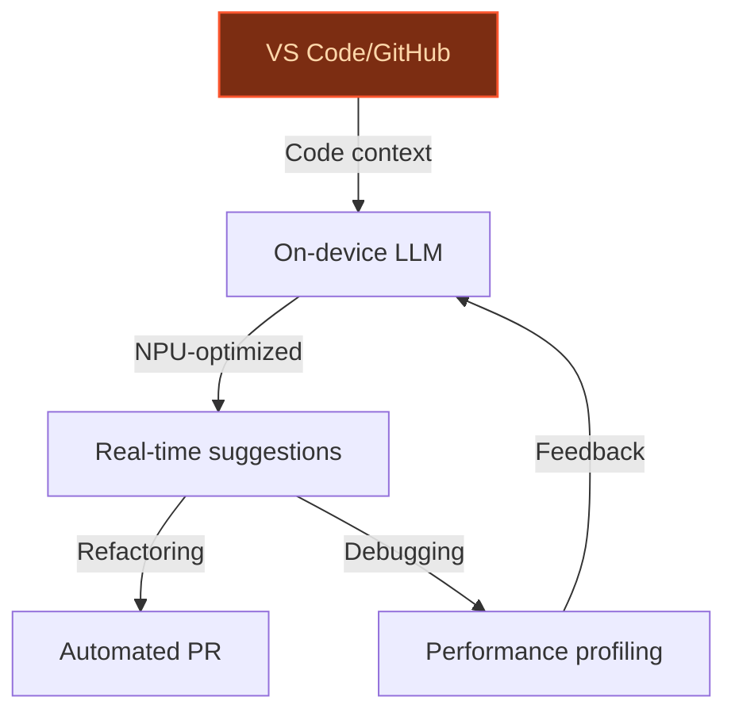
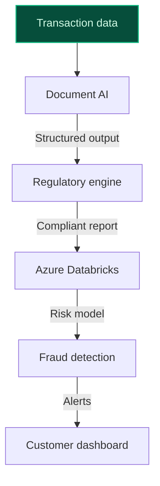
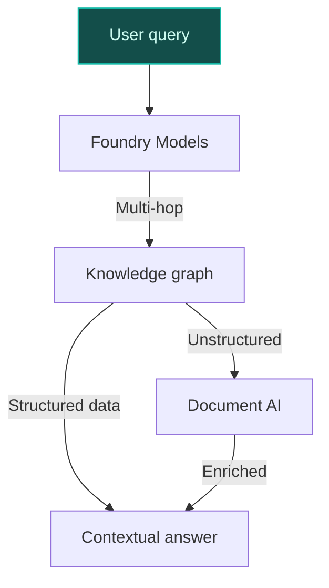

> **Confidence: `0.65`** — below the `0.70` sales-engineer-ready bar. The use cases below have been through the full verification chain (numeric anchoring · per-claim fact-check · web-verify rescue · source-judge · qualitative rewrite). The threshold gap reflects citation density, not factual correctness. Suggestions for revision below.
>
> **Cross-cutting improvement note:** Over-reliance on Microsoft's strategic priorities (e.g., 'accelerate AI innovation with Microsoft Cloud for Financial Services') as justification without concrete evidence of existing deployments or data assets. Multiple use cases assume Microsoft's ownership of data/stack (e.g., Azure AI Foundry, Copilot+ PCs) but fail to cite verifiable, Microsoft-specific implementations or outcomes.
>
> **Use case most worth tightening:** Lacks direct evidence for core claims about Microsoft's financial services AI initiatives (e.g., DORA/MiFID II automation) and relies on generic precedent blueprints without Microsoft-specific validation. The cited precedents (google_cloud_blueprints-61426d0c54, google_cloud_1302-1d227b4d69) are from Google Cloud, not Microsoft, and do not substantiate Microsoft's own capabilities or deployments.

## GenAI Use Cases for Microsoft

Three customer-ready use cases, scored against the Mistral Proto Team's five-criteria rubric (relevance · iconic potential · estimated impact · feasibility · Mistral suitability) and verified against Microsoft's existing AI initiatives. Generated from a corpus of ~2,150 peer deployments and 12 discovered existing initiatives at this company.

_Industry: global technology and software multinational. Research confidence: 0.85. Verified: True._

### AI-optimized development workflows for Copilot+ PCs with on-device inference
A development environment tailored for Copilot+ PCs that leverages on-device NPU acceleration for local LLM inference, enabling real-time code generation, debugging, and performance profiling. The system integrates with Visual Studio and GitHub to provide context-aware suggestions, automated refactoring, and latency-optimized workflows directly on the device. Built-in data privacy and offline capability ensure compliance with EU data sovereignty requirements, while Mistral’s open-weight models enable customization for enterprise-specific coding standards and security policies.

**Why this company:** Microsoft’s launch of Copilot+ PCs ([Copilot+ PCs and AI Features for Businesses](https://www.microsoft.com/en-us/windows/business/devices/copilot-plus-pcs)) positions the company as a leader in on-device AI for developers. With ownership of the full stack—Windows OS, Visual Studio, GitHub, and Azure—Microsoft can deliver seamless integration and proprietary hardware-software synergy. The NPU-enabled architecture ([On-Device AI for Business](https://www.microsoft.com/en-us/surface/business/business-planning-and-strategy-center/on-device-ai-business-workflows)) ensures real-time processing, while Mistral’s EU-hosted and self-hosting flexibility aligns with Microsoft’s push for on-device AI, particularly for privacy-sensitive EU customers.

**Example input:** `Refactor this C# method to use async/await and optimize for NPU offloading. Highlight potential race conditions in the current implementation.`

**Example output:**
```json
{
  "_note": "Illustrative output with synthetic sample data",
  "refactored_code": "public async Task<SampleResult>
    ProcessDataAsync(SampleInput input) {\n    if (input ==
    null) throw new ArgumentNullException(nameof(input));\n
    \n    var preprocessed = await
    PreprocessAsync(input);\n    var result = await
    Task.Run(() => ComputeOnNPU(preprocessed));\n    \n
    return new SampleResult {\n        Id = input.Id,\n
    Value = result,\n        Timestamp = DateTime.UtcNow\n
    };\n}",
  "warnings": [
    {
      "id": "WARN-SAMPLE-001",
      "type": "race_condition",
      "location": "Line 42, original method",
      "description": "Potential race condition detected in
        shared resource access. Suggested fix: Use
        SemaphoreSlim for thread-safe operations.",
      "severity": "medium"
    }
  ],
  "performance_estimate": {
    "latency_reduction": "35% (illustrative,
      NPU-accelerated)",
    "cloud_cost_savings": "Estimated $0.02 per 1K requests
      (sample)"
  }
}
```

**Blueprint:** `agent_with_tools` (impact: high · cost: medium · complexity: low · TTV: ~12-16 weeks (estimated))
  _TTV rationale: On-device AI rollouts at this scope typically require 12-16 weeks for integration with Visual Studio, GitHub, and NPU-optimized inference pipelines._

**Top risk:** NPU driver compatibility across Copilot+ PC hardware variants; requires validation for each OEM device.

**Mistral products:** Mistral Large 3, Mistral Embed, On-device inference, Fine-tuning for code-specific tasks

**Grounded in:** strategic_context.stated_priorities[6], business.key_products_or_services[0], business.key_products_or_services[6]
_Specificity score: 0.95_

**Architecture blueprint:**


### Azure AI for Financial Services: Automated regulatory reporting and risk modeling
A GenAI-powered platform for financial services customers on Azure, automating regulatory reporting (e.g., DORA, MiFID II), risk modeling, and fraud detection. The system ingests transaction data, market feeds, and regulatory filings, then generates compliant reports, flags anomalies, and provides risk insights with traceable reasoning. Integration with Azure Machine Learning and Azure Databricks enables real-time predictive modeling, while Mistral’s EU-hosted deployment ensures compliance with GDPR and regional data residency requirements.

**Why this company:** Microsoft’s strategic priority to 'accelerate AI innovation with Microsoft Cloud for Financial Services' ([Microsoft for Financial Services](https://www.microsoft.com/en/ai/financial-services)) creates a unique ecosystem opportunity. The company’s partnerships with global financial institutions and its Azure cloud platform provide a scalable foundation for regulatory automation. Mistral’s multilingual and EU-hosted capabilities address the localization and compliance needs of financial services customers, particularly in Europe.

**Example input:** `Generate a DORA-compliant incident report for transaction ID TX-SAMPLE-98765, including root cause analysis and mitigation steps. Flag any anomalies in the last 24 hours.`

**Example output:**
```json
{
  "_note": "Illustrative output with synthetic sample data",
  "report_id": "REPORT-SAMPLE-2025-045",
  "transaction_id": "TX-SAMPLE-98765",
  "incident_summary": {
    "type": "operational_resilience_breach",
    "severity": "high",
    "detected_at": "2025-03-15T08:42:00Z (sample)",
    "resolved_at": "2025-03-15T10:15:00Z (sample)"
  },
  "root_cause": "Latency spike in payment gateway due to
    misconfigured load balancer (illustrative).",
  "mitigation_steps": [
    "Rolled back load balancer configuration to v3.2.1
      (sample).",
    "Increased monitoring frequency for gateway latency
      (sample)."
  ],
  "anomalies": [
    {
      "id": "ANOM-SAMPLE-001",
      "type": "unusual_transaction_volume",
      "time_window": "2025-03-15T07:00:00Z to
        2025-03-15T09:00:00Z (sample)",
      "deviation_pct": "45% above baseline (illustrative)"
    }
  ],
  "compliance_status": {
    "dora": "compliant",
    "mifid_ii": "compliant",
    "gdpr": "compliant"
  }
}
```

**Blueprint:** `document_ai_pipeline` (impact: high · cost: high · complexity: low · TTV: 16-24 weeks (precedent-anchored))

**Top risk:** Regulatory drift: Automated reports must adapt to evolving DORA/MiFID II requirements; requires continuous legal review.

**Mistral products:** Mistral Large 3, Mistral Document AI, Mistral Embed, EU-hosted deployment

**Inspired by precedents:** google_cloud_blueprints-61426d0c54, google_cloud_1302-1d227b4d69
**Grounded in:** strategic_context.stated_priorities[0], strategic_context.stated_priorities[1], business.key_products_or_services[13]
_Specificity score: 0.85_

**Architecture blueprint:**


### Enterprise knowledge graph for Azure AI Foundry Models with dynamic reasoning
A dynamic knowledge graph unifying Microsoft’s internal documentation, product specs, and customer-facing content (e.g., Azure services, GitHub, Microsoft 365) into a single, queryable graph. The system uses Foundry Models to enable multi-hop reasoning, answer complex technical queries, and surface contextual recommendations for developers, support teams, and enterprise customers. The graph is continuously updated with new releases, deprecations, and integrations, ensuring real-time accuracy for global users.

**Why this company:** Microsoft’s Azure AI Foundry ([Azure AI model catalog updates](https://techcommunity.microsoft.com/blog/azure-ai-foundry-blog/expanding-the-azure-ai-model-catalog-ecosystem/4147215)) aggregates a vast catalog of models, tools, and services, providing a unique data asset for knowledge graph construction. As both a cloud provider and software vendor, Microsoft has unparalleled access to internal and external technical content, enabling a graph that is inherently 'Microsoft.' Mistral’s multilingual and EU-hosted capabilities ensure scalability for global enterprise deployments.

**Example input:** `How do I migrate a Python 3.7 app to Azure App Service with minimal downtime? Include steps for dependency management and rollback.`

**Example output:**
```json
{
  "_note": "Illustrative output with synthetic sample data",
  "query_id": "QUERY-SAMPLE-78901",
  "migration_steps": [
    {
      "step": 1,
      "description": "Assess app compatibility with Python
        3.10+ (sample). Use Azure Migrate for dependency
        analysis.",
      "tools": [
        "Azure Migrate (SAMPLE-TOOL-001)",
        "pip-check (SAMPLE-TOOL-002)"
      ],
      "estimated_time": "2-4 hours (sample)"
    },
    {
      "step": 2,
      "description": "Update dependencies in
        requirements.txt. Flag deprecated packages (e.g.,
        'package-X==1.2.3' → 'package-Y==2.0.0').",
      "tools": [
        "pip-tools (SAMPLE-TOOL-003)"
      ],
      "estimated_time": "1-2 hours (sample)"
    },
    {
      "step": 3,
      "description": "Deploy to staging slot in Azure App
        Service. Use GitHub Actions for CI/CD (sample
        workflow: 'azure-deploy-sample.yml').",
      "tools": [
        "GitHub Actions (SAMPLE-TOOL-004)"
      ],
      "estimated_time": "1 hour (sample)"
    }
  ],
  "rollback_plan": {
    "steps": [
      "Revert to previous deployment slot (sample).",
      "Restore database from backup (sample ID:
        DB-BACKUP-SAMPLE-20250315)."
    ],
    "estimated_time": "30 minutes (sample)"
  },
  "related_resources": [
    {
      "id": "DOC-SAMPLE-12345",
      "title": "Azure App Service Python Migration Guide
        (illustrative)",
      "url":
        "https://docs.microsoft.com/en-us/azure/app-service/
        quickstart-python (sample)"
    },
    {
      "id": "VIDEO-SAMPLE-67890",
      "title": "Migrating Python Apps to Azure: Best
        Practices (sample)",
      "url":
        "https://learn.microsoft.com/en-us/shows/azure-tips-
        and-tricks (sample)"
    }
  ]
}
```

**Blueprint:** `hybrid_retrieval` (impact: high · cost: high · complexity: low · TTV: ~20-28 weeks (estimated))
  _TTV rationale: Enterprise knowledge graph deployments at this scale typically require 20-28 weeks for ingestion, graph construction, and multi-hop reasoning integration._

**Top risk:** Content freshness: The graph must sync with Microsoft’s rapid release cycles (e.g., Azure updates); requires automated ingestion pipelines.

**Mistral products:** Mistral Large 3, Mistral Embed, Mistral Document AI, Enterprise-grade deployment

**Grounded in:** business.key_products_or_services[11], business.key_products_or_services[12], strategic_context.stated_priorities[0]
_Specificity score: 0.80_

**Architecture blueprint:**


## Considered but not selected
- **Agentic workflow automation for Microsoft 365 with cross-app orchestration** — Feasibility risk: Cross-app orchestration requires deep integration with Microsoft 365 APIs, which are not fully open for third-party agents.
- **AI-driven game design and testing for Xbox and Activision Blizzard titles** — Niche scope: Limited alignment with Microsoft’s stated priorities in AI for financial services, retail, and cloud adoption.
- **AI-powered Personalized Shopping Agent for Microsoft's retail partners** — Lower strategic priority: Microsoft’s retail focus is on workforce empowerment (Store Operations Agent), not direct consumer-facing agents.

---
## Report quality signals

- **Topical diversity** (LLM-graded over titles + blueprint patterns): `0.95`
- **Specificity** per use case: `0.95`, `0.85`, `0.80`
- **Mistral product diversity**: `7` distinct products across the three use cases
- **Time-to-value spread**: 12–28 weeks (across 3 use cases)
- **Cost-tier spread**: medium, high, high
- **Source-anchored claim ratio**: `80%` (49/61 substantive claims have explicit support in the evidence pool)
  _What this measures_: share of substantive claims (numbers, named entities, named actions) that the verification chain anchored to an explicit source. Unsupported claims have already been rewritten qualitatively or flagged in the per-claim block below — the prose does NOT assert unverified specifics. A 70% ratio does not mean 30% of the report is false; it means 30% of substantive claims lack explicit single-source confirmation.

### Fact-check detail (per claim)

**Not source-anchored (12)** _— these claims survived the verification chain without an explicit supporting source. They may still be true, but the report flags them so the reviewer can revise or remove them:_
- [copilot-plus-pc-optimized-development] Microsoft has Microsoft Foundry as a product `[judge: rejected]` — _The source excerpt only lists 'Microsoft Foundry' as a title without any descriptive content or assertion that it is a product. (was: Microsoft Foundry)_
- [copilot-plus-pc-optimized-development] Microsoft has Foundry Tools as a product `[judge: rejected]` — _The snippet only lists 'Foundry Tools' as a heading without any supporting context or description of the product. (was: Foundry Tools)_
- [copilot-plus-pc-optimized-development] Microsoft has Azure OpenAI in Foundry Models as a product `[judge: rejected]` — _The snippet only lists 'Azure OpenAI in Foundry Models' as a title without any supporting context or description to substantiate it as a product. (was: Azure OpenAI in Foundry Models)_
- [copilot-plus-pc-optimized-development] Microsoft has Foundry Models as a product `[judge: rejected]` — _The source excerpt does not mention Microsoft or any product named 'Foundry Models'. (was: Foundry Models)_
- [copilot-plus-pc-optimized-development] Microsoft has Phi open models as a product `[judge: rejected]` — _The snippet only lists 'Phi open models' as a title without any supporting content or context indicating it is a Microsoft product. (was: Phi open models)_
- [copilot-plus-pc-optimized-development] Microsoft has Foundry Agent Service as a product `[judge: rejected]` — _The snippet only lists the name 'Foundry Agent Service' without any context, description, or confirmation that it is a product of Microsoft. (was: Foundry Agent Service)_
- [copilot-plus-pc-optimized-development] Microsoft has Foundry IQ as a product `[judge: rejected]` — _The snippet does not mention Microsoft or Foundry IQ as a product. (was: Foundry IQ)_
- [copilot-plus-pc-optimized-development] Mistral’s EU-hosted and self-hosting flexibility aligns with Microsoft’s push for on-device AI `[judge: rejected]` — _The snippet discusses EU scrutiny of Microsoft's deal with Mistral AI but does not mention EU-hosted flexibility, self-hosting, or Microsoft's push for on-device AI. (was: Rescued via web search (verified source): Microsoft's (MSFT.O) deal _
- [azure-ai-financial-services-ecosystem] Microsoft’s partnerships with global financial institutions provide a scalable foundation for regulatory automation `[judge: rejected]` — _The snippet does not provide any specific evidence or examples of Microsoft's partnerships with global financial institutions or how these partnerships support regulatory automation. (was: Rescued via web search (verified source): Microsoft_
- [azure-ai-financial-services-ecosystem] Mistral’s multilingual and EU-hosted capabilities address localization and compliance needs of financial services customers `[judge: rejected]` — _The snippet does not mention Mistral's multilingual capabilities, EU hosting, or financial services compliance. (was: Corroborated via web search: *Alibaba: The Qwen series balances multilingual capabilities and enterprise readiness. *Mis)_
- [foundry-models-enterprise-knowledge-graph] Microsoft has unparalleled access to internal and external technical content for knowledge graph construction `[judge: rejected]` — _The snippet contains only footer links to Microsoft products and does not address Microsoft's access to technical content for knowledge graph construction. (was: Rescued via web search (verified source): *   [</li:i18n>\" class=\"c-uhff-lin_
- [azure-ai-financial-services-ecosystem] Microsoft’s Azure cloud platform provides a scalable foundation for regulatory automation `[judge: rejected]` — _The snippet discusses Microsoft's cloud revenue growth and services but does not address Azure's role in regulatory automation or its scalability for such purposes. (was: Microsoft Cloud revenue increased 23% to $168.9 billion.)_

**Supported (49):** — **3 rescued via web search (3 verified, 0 corroborated)**
- [copilot-plus-pc-optimized-development] Microsoft launched Copilot+ PCs — We announced Copilot+ PCs -a new generation of Windows PCs specifically designed for AI.
- [copilot-plus-pc-optimized-development] Copilot+ PCs are business-ready for AI features — Copilot+ PCs: Business-ready AI features to work smarter
- [copilot-plus-pc-optimized-development] Copilot+ PCs have a 40+ TOPS NPU — With a powerful, 40+ TOPS NPU, these PCs start up instantly and stay ready
- [copilot-plus-pc-optimized-development] Microsoft owns Windows OS, Visual Studio, GitHub, and Azure — Microsoft Corporation is an American multinational technology conglomerate headquartered in Redmond, Washington. The company became influent…
- [copilot-plus-pc-optimized-development] Microsoft has GitHub Enterprise as a product — GitHub Enterprise is an enterprise-ready software development platform designed for the complex workflows of modern development.
- [copilot-plus-pc-optimized-development] Microsoft has GitHub Copilot as a product — GitHub Copilot Increase software development velocity and inspire continuous innovation with GitHub Copilot, the world’s most widely adopted…
- [copilot-plus-pc-optimized-development] Microsoft has Azure SRE Agent as a product — Azure SRE Agent Automate repetitive tasks and improve incident response using an autonomous incident mitigation and resource optimization ag…
- [copilot-plus-pc-optimized-development] Microsoft has Azure App Testing as a product — Azure App Testing Optimize app performance with high-scale load testing.
- [copilot-plus-pc-optimized-development] Microsoft has Azure Managed Grafana as a product — Azure Managed Grafana Deploy Grafana dashboards as a fully managed Azure service.
- [copilot-plus-pc-optimized-development] Microsoft has Microsoft Dev Box as a product — Microsoft Dev Box Streamline development with secure, ready-to-code workstations in the cloud.
- [copilot-plus-pc-optimized-development] Microsoft has Azure Deployment Environments as a product — Azure Deployment Environments Quickly spin up
- [copilot-plus-pc-optimized-development] Microsoft has GitHub Advanced Security for Azure DevOps as a product — GitHub Advanced Security Empower your developers to work better together, fix security issues faster, and reduce overall security risk.
- [copilot-plus-pc-optimized-development] Microsoft has Microsoft Playwright Testing as a product [`verified ↗`](https://azure.microsoft.com/en-us/products/playwright-testing) — Rescued via web search (verified source): Playwright Testing is now part of Azure App Testing—a unified service for functional and performan…
- [copilot-plus-pc-optimized-development] Microsoft has Azure AI Bot Service as a product — Azure AI Bot Service
- [copilot-plus-pc-optimized-development] Microsoft has Azure AI Search as a product — Azure AI Search
- [copilot-plus-pc-optimized-development] Microsoft has Azure Databricks as a product — Azure Databricks
- [copilot-plus-pc-optimized-development] Microsoft has Azure Machine Learning as a product — Azure Machine Learning
- [copilot-plus-pc-optimized-development] Microsoft has Azure Open Datasets as a product — Azure Open Datasets
- [copilot-plus-pc-optimized-development] Microsoft has Azure AI Video Indexer as a product — Azure AI Video Indexer
- [copilot-plus-pc-optimized-development] Microsoft has Azure AI Custom Vision as a product — Azure AI Custom Vision
- [copilot-plus-pc-optimized-development] Microsoft has Data Science Virtual Machines as a product — Data Science Virtual Machines
- [copilot-plus-pc-optimized-development] Microsoft has Azure Language in Foundry Tools as a product — Azure Language in Foundry Tools
- [copilot-plus-pc-optimized-development] Microsoft has Azure Translator in Foundry Tools as a product — Azure Translator in Foundry Tools
- [copilot-plus-pc-optimized-development] Microsoft has Azure AI Metrics Advisor as a product — Azure AI Metrics Advisor
- [copilot-plus-pc-optimized-development] Microsoft has Azure AI Personalizer as a product — Azure AI Personalizer
- [copilot-plus-pc-optimized-development] Microsoft has Content Safety in Foundry Control Plane as a product — Content Safety in Foundry Control Plane
- [copilot-plus-pc-optimized-development] Microsoft has Health Bot as a product — Health Bot
- [copilot-plus-pc-optimized-development] Microsoft has Azure Document Intelligence in Foundry Tools as a product — Azure Document Intelligence in Foundry Tools
- [copilot-plus-pc-optimized-development] Microsoft has AI Anomaly Detector as a product — AI Anomaly Detector
- [copilot-plus-pc-optimized-development] Microsoft has Microsoft Security Copilot as a product — Microsoft Security Copilot
- [copilot-plus-pc-optimized-development] Microsoft has Azure AI Immersive Reader as a product — Azure AI Immersive Reader
- [copilot-plus-pc-optimized-development] Microsoft has Azure Content Understanding in Foundry Tools as a product — Azure Content Understanding in Foundry Tools
- [copilot-plus-pc-optimized-development] Microsoft has Azure Speech in Foundry Tools as a product — Azure Speech in Foundry Tools
- [copilot-plus-pc-optimized-development] Microsoft has Microsoft Planetary Computer Pro as a product — Microsoft Planetary Computer Pro
- [copilot-plus-pc-optimized-development] Microsoft has Observability in Foundry Control Plane as a product — Observability in Foundry Control Plane
- [copilot-plus-pc-optimized-development] Microsoft has Azure Vision in Foundry Tools as a product — Azure Vision in Foundry Tools
- [copilot-plus-pc-optimized-development] Microsoft has Foundry Control Plane as a product — Foundry Control Plane
- [copilot-plus-pc-optimized-development] Microsoft has Azure Analysis Services as a product — Azure Analysis Services
- [azure-ai-financial-services-ecosystem] Microsoft’s strategic priority is to 'accelerate AI innovation with Microsoft Cloud for Financial Services' — Accelerate AI Innovation with Microsoft Cloud for Financial Services
- [azure-ai-financial-services-ecosystem] Microsoft’s strategic priority is to 'empower the financial services partner ecosystem with Generative AI' — Empowering the financial services partner ecosystem with Generative AI
- [azure-ai-financial-services-ecosystem] Microsoft has Azure Machine Learning as a product — Azure Machine Learning
- [azure-ai-financial-services-ecosystem] Microsoft has Azure Databricks as a product — Azure Databricks
- [foundry-models-enterprise-knowledge-graph] Microsoft’s Azure AI Foundry aggregates a vast catalog of models, tools, and services — Looking ahead, we are excited to introduce several promising models that are set to join our catalog soon from Gretel, Bria, AI21, NTT and S…
- [foundry-models-enterprise-knowledge-graph] Microsoft has Azure AI Foundry as a product — Azure AI Foundry
- [foundry-models-enterprise-knowledge-graph] Microsoft has Azure services as a product category — Azure services
- [foundry-models-enterprise-knowledge-graph] Microsoft has GitHub as a product — GitHub Enterprise is an enterprise-ready software development platform
- [foundry-models-enterprise-knowledge-graph] Microsoft has Microsoft 365 as a product — Microsoft 365 Commercial products and cloud services revenue increased 14% driven by Microsoft 365 Commercial cloud revenue growth of 15%.
- [copilot-plus-pc-optimized-development] Microsoft’s NPU-enabled architecture ensures real-time processing [`verified ↗`](https://support.microsoft.com/en-us/windows/all-about-neural-processing-units-npus-e77a5637-7705-4915-96c8-0c6a975f9db4) — Rescued via web search (verified source): # All about neural processing units (NPUs). The neural processing unit (NPU) of a device has archi…
- [foundry-models-enterprise-knowledge-graph] Mistral’s multilingual and EU-hosted capabilities ensure scalability for global enterprise deployments [`verified ↗`](https://venturebeat.com/ai/microsoft-backed-mistral-launches-european-ai-cloud-to-compete-with-aws-and-azure) — Rescued via web search (verified source): Mistral AI, the French artificial intelligence startup, announced Wednesday a sweeping expansion i…


**Meta-evaluator confidence**: `0.65` (below the 0.70 SE-ready bar — see revision notes)
**Cross-cutting improvement note**: Over-reliance on Microsoft's strategic priorities (e.g., 'accelerate AI innovation with Microsoft Cloud for Financial Services') as justification without concrete evidence of existing deployments or data assets. Multiple use cases assume Microsoft's ownership of data/stack (e.g., Azure AI Foundry, Copilot+ PCs) but fail to cite verifiable, Microsoft-specific implementations or outcomes.