# Trace

## Execution trace — Microsoft

Started: `2026-05-11T02:32:40.797648+00:00`. Total wall time: `189.9s` across `88` recorded actions.

### Per-step time totals

| Step | Calls | Total time | Avg time |
|---|---:|---:|---:|
| `resolve_entity` | 1 | 0.10s | 95ms |
| `research` | 1 | 10.45s | 10453ms |
| `gap_fill` | 4 | 6.40s | 1601ms |
| `retrieve` | 2 | 0.19s | 95ms |
| `generate` | 2 | 23.94s | 11970ms |
| `generate.web_search` | 2 | 6.43s | 3217ms |
| `score` | 2 | 26.88s | 13439ms |
| `verify` | 6 | 18.89s | 3148ms |
| `enrich` | 1 | 55.59s | 55587ms |
| `meta_eval` | 1 | 24.00s | 23997ms |
| `web_verify` | 1 | 5.42s | 5422ms |
| `source_judge` | 62 | 38.25s | 617ms |
| `final_qualify` | 1 | 1.69s | 1689ms |
| `quality_signals` | 2 | 4.08s | 2038ms |

### Chronological event log

- `02:32:40.798` **[resolve_entity]** `mistral-small-2603.chat.complete` ❌ — 95ms
   - inputs: user_input='Microsoft'
   - error: `SDKError`
- `02:32:51.397` **[research]** `mistral-medium-2604.chat.complete` — 10453ms
   - inputs: synthesize CompanyContext for Microsoft | depth=medium
   - outputs: industry='global technology and software multinational' verified=True conf=0.75
- `02:33:01.853` **[gap_fill]** `mistral-small-2603.chat.complete` — 973ms
   - inputs: generate gap queries | fields=['business_model', 'products', 'data_assets', 'priorities']
   - outputs: queries=4
- `02:33:10.436` **[gap_fill]** `mistral-small-2603.chat.complete` — 1439ms
   - inputs: layer-2 extract field=priorities
   - outputs: items=7
- `02:33:10.440` **[gap_fill]** `mistral-small-2603.chat.complete` — 1430ms
   - inputs: layer-2 extract field=data_assets
   - outputs: items=0
- `02:33:10.443` **[gap_fill]** `mistral-small-2603.chat.complete` — 2563ms
   - inputs: layer-2 extract field=products
   - outputs: items=42
- `02:33:13.008` **[retrieve]** `mistral-embed.embeddings.create` — 180ms
   - inputs: company_query | industries='global technology and software multinational'
   - outputs: embedded 1024-dim query vector
- `02:33:13.188` **[retrieve]** `precedent_corpus.cosine_topk` — 9ms
   - inputs: k=8 min_depth=0.4 target='Microsoft'
   - outputs: retrieved 8 | mmr=True | top_sim=0.822
- `02:33:15.010` **[generate]** `mistral-medium-2604.chat.complete` — 1822ms
   - inputs: iteration=0 tool_calls_used=0/2 tools=on
   - outputs: tool_calls=4 | content_chars=0
- `02:33:16.854` **[generate.web_search]** `tavily.search` — 2619ms
   - inputs: query='Microsoft Copilot+ PCs 2024 features and partnerships'
   - outputs: 2 raw results
- `02:33:20.878` **[generate.web_search]** `tavily.search` — 3815ms
   - inputs: query='Microsoft Azure AI Foundry Models 2024 announcements'
   - outputs: 2 raw results
- `02:33:27.594` **[generate]** `mistral-medium-2604.chat.complete` — 22118ms
   - inputs: iteration=1 tool_calls_used=2/2 tools=off
   - outputs: tool_calls=0 | content_chars=16060
- `02:33:50.091` **[score]** `mistral-small-2603.chat.complete` — 11355ms
   - inputs: self-consistency pass T=0.2
   - outputs: scored 8 candidates
- `02:33:50.095` **[score]** `mistral-small-2603.chat.complete` — 15522ms
   - inputs: self-consistency pass T=0.4
   - outputs: scored 8 candidates
- `02:34:05.654` **[verify]** `tavily.search` — 2526ms
   - inputs: candidate=azure-security-copilot-for-compliance | query='Microsoft Azure Security Copilot for automated compliance au'
   - outputs: 4 results
- `02:34:05.654` **[verify]** `tavily.search` — 2223ms
   - inputs: candidate=copilot-plus-pc-optimized-development | query='Microsoft AI-optimized development workflows for Copilot+ PC'
   - outputs: 4 results
- `02:34:05.654` **[verify]** `tavily.search` — 2225ms
   - inputs: candidate=azure-ai-financial-services-ecosystem | query='Microsoft Azure AI for Financial Services: Automated regulat'
   - outputs: 4 results
- `02:34:08.321` **[verify]** `mistral-small-2603.chat.complete` — 3856ms
   - inputs: verdict for azure-ai-financial-services-ecosystem
   - outputs: verdict='pass'
- `02:34:08.356` **[verify]** `mistral-small-2603.chat.complete` — 3996ms
   - inputs: verdict for copilot-plus-pc-optimized-development
   - outputs: verdict='pass'
- `02:34:10.576` **[verify]** `mistral-small-2603.chat.complete` — 4061ms
   - inputs: verdict for azure-security-copilot-for-compliance
   - outputs: verdict='confirmed_existing'
- `02:34:14.642` **[enrich]** `mistral-large-2512.chat.complete` — 55587ms
   - inputs: tier=standard parallel=False ids=['copilot-plus-pc-optimized-development', 'azure-ai-financial-services-ecosystem', 'foundry-models-enterprise-knowledge-graph']
   - outputs: enriched 3 use cases
- `02:35:10.259` **[meta_eval]** `mistral-medium-2604.chat.complete` — 23997ms
   - inputs: reviewing 3 use cases
   - outputs: review + claims
- `02:35:34.276` **[web_verify]** `tavily.search.rescue_unsupported_claims` — 5422ms
   - inputs: company='Microsoft' unsupported=7 budget=12
   - outputs: rescued: verified=6 corroborated=1 of 7 attempted
- `02:35:39.701` **[source_judge]** `mistral-small-2603.judge_claim_sources` — 4646ms
   - inputs: pairs=61
   - outputs: judged 61 pairs
- `02:35:39.702` **[source_judge]** `mistral-small-2603.chat.complete` — 655ms
   - inputs: claim='Microsoft launched Copilot+ PCs'
   - outputs: verdict=supported
- `02:35:39.706` **[source_judge]** `mistral-small-2603.chat.complete` — 800ms
   - inputs: claim='Copilot+ PCs are business-ready for AI features'
   - outputs: verdict=supported
- `02:35:39.710` **[source_judge]** `mistral-small-2603.chat.complete` — 586ms
   - inputs: claim='Copilot+ PCs have a 40+ TOPS NPU'
   - outputs: verdict=supported
- `02:35:39.713` **[source_judge]** `mistral-small-2603.chat.complete` — 734ms
   - inputs: claim='Microsoft owns Windows OS, Visual Studio, GitHub, and Azure'
   - outputs: verdict=supported
- `02:35:39.717` **[source_judge]** `mistral-small-2603.chat.complete` — 593ms
   - inputs: claim='Microsoft has GitHub Enterprise as a product'
   - outputs: verdict=supported
- `02:35:39.722` **[source_judge]** `mistral-small-2603.chat.complete` — 654ms
   - inputs: claim='Microsoft has GitHub Copilot as a product'
   - outputs: verdict=supported
- `02:35:39.726` **[source_judge]** `mistral-small-2603.chat.complete` — 665ms
   - inputs: claim='Microsoft has Azure SRE Agent as a product'
   - outputs: verdict=supported
- `02:35:39.728` **[source_judge]** `mistral-small-2603.chat.complete` — 656ms
   - inputs: claim='Microsoft has Azure App Testing as a product'
   - outputs: verdict=supported
- `02:35:40.296` **[source_judge]** `mistral-small-2603.chat.complete` — 523ms
   - inputs: claim='Microsoft has Azure Managed Grafana as a product'
   - outputs: verdict=supported
- `02:35:40.310` **[source_judge]** `mistral-small-2603.chat.complete` — 496ms
   - inputs: claim='Microsoft has Microsoft Dev Box as a product'
   - outputs: verdict=supported
- `02:35:40.357` **[source_judge]** `mistral-small-2603.chat.complete` — 541ms
   - inputs: claim='Microsoft has Azure Deployment Environments as a product'
   - outputs: verdict=supported
- `02:35:40.377` **[source_judge]** `mistral-small-2603.chat.complete` — 469ms
   - inputs: claim='Microsoft has GitHub Advanced Security for Azure DevOps as a'
   - outputs: verdict=supported
- `02:35:40.385` **[source_judge]** `mistral-small-2603.chat.complete` — 679ms
   - inputs: claim='Microsoft has Microsoft Playwright Testing as a product'
   - outputs: verdict=supported
- `02:35:40.391` **[source_judge]** `mistral-small-2603.chat.complete` — 588ms
   - inputs: claim='Microsoft has Microsoft Foundry as a product'
   - outputs: verdict=unsupported
- `02:35:40.446` **[source_judge]** `mistral-small-2603.chat.complete` — 391ms
   - inputs: claim='Microsoft has Azure AI Bot Service as a product'
   - outputs: verdict=supported
- `02:35:40.506` **[source_judge]** `mistral-small-2603.chat.complete` — 398ms
   - inputs: claim='Microsoft has Azure AI Search as a product'
   - outputs: verdict=supported
- `02:35:40.807` **[source_judge]** `mistral-small-2603.chat.complete` — 453ms
   - inputs: claim='Microsoft has Azure Databricks as a product'
   - outputs: verdict=supported
- `02:35:40.818` **[source_judge]** `mistral-small-2603.chat.complete` — 427ms
   - inputs: claim='Microsoft has Azure Machine Learning as a product'
   - outputs: verdict=supported
- `02:35:40.837` **[source_judge]** `mistral-small-2603.chat.complete` — 402ms
   - inputs: claim='Microsoft has Azure Open Datasets as a product'
   - outputs: verdict=supported
- `02:35:40.845` **[source_judge]** `mistral-small-2603.chat.complete` — 642ms
   - inputs: claim='Microsoft has Foundry Tools as a product'
   - outputs: verdict=unsupported
- `02:35:40.898` **[source_judge]** `mistral-small-2603.chat.complete` — 448ms
   - inputs: claim='Microsoft has Azure AI Video Indexer as a product'
   - outputs: verdict=supported
- `02:35:40.904` **[source_judge]** `mistral-small-2603.chat.complete` — 450ms
   - inputs: claim='Microsoft has Azure AI Custom Vision as a product'
   - outputs: verdict=supported
- `02:35:40.979` **[source_judge]** `mistral-small-2603.chat.complete` — 517ms
   - inputs: claim='Microsoft has Data Science Virtual Machines as a product'
   - outputs: verdict=supported
- `02:35:41.064` **[source_judge]** `mistral-small-2603.chat.complete` — 463ms
   - inputs: claim='Microsoft has Azure Language in Foundry Tools as a product'
   - outputs: verdict=supported
- `02:35:41.239` **[source_judge]** `mistral-small-2603.chat.complete` — 442ms
   - inputs: claim='Microsoft has Azure Translator in Foundry Tools as a product'
   - outputs: verdict=supported
- `02:35:41.245` **[source_judge]** `mistral-small-2603.chat.complete` — 417ms
   - inputs: claim='Microsoft has Azure AI Metrics Advisor as a product'
   - outputs: verdict=supported
- `02:35:41.260` **[source_judge]** `mistral-small-2603.chat.complete` — 578ms
   - inputs: claim='Microsoft has Azure OpenAI in Foundry Models as a product'
   - outputs: verdict=unsupported
- `02:35:41.346` **[source_judge]** `mistral-small-2603.chat.complete` — 448ms
   - inputs: claim='Microsoft has Azure AI Personalizer as a product'
   - outputs: verdict=supported
- `02:35:41.354` **[source_judge]** `mistral-small-2603.chat.complete` — 862ms
   - inputs: claim='Microsoft has Content Safety in Foundry Control Plane as a p'
   - outputs: verdict=supported
- `02:35:41.487` **[source_judge]** `mistral-small-2603.chat.complete` — 758ms
   - inputs: claim='Microsoft has Health Bot as a product'
   - outputs: verdict=supported
- `02:35:41.496` **[source_judge]** `mistral-small-2603.chat.complete` — 463ms
   - inputs: claim='Microsoft has Azure Document Intelligence in Foundry Tools a'
   - outputs: verdict=supported
- `02:35:41.527` **[source_judge]** `mistral-small-2603.chat.complete` — 416ms
   - inputs: claim='Microsoft has AI Anomaly Detector as a product'
   - outputs: verdict=supported
- `02:35:41.662` **[source_judge]** `mistral-small-2603.chat.complete` — 488ms
   - inputs: claim='Microsoft has Foundry Models as a product'
   - outputs: verdict=unsupported
- `02:35:41.681` **[source_judge]** `mistral-small-2603.chat.complete` — 433ms
   - inputs: claim='Microsoft has Microsoft Security Copilot as a product'
   - outputs: verdict=supported
- `02:35:41.793` **[source_judge]** `mistral-small-2603.chat.complete` — 458ms
   - inputs: claim='Microsoft has Azure AI Immersive Reader as a product'
   - outputs: verdict=supported
- `02:35:41.838` **[source_judge]** `mistral-small-2603.chat.complete` — 565ms
   - inputs: claim='Microsoft has Phi open models as a product'
   - outputs: verdict=unsupported
- `02:35:41.944` **[source_judge]** `mistral-small-2603.chat.complete` — 440ms
   - inputs: claim='Microsoft has Azure Content Understanding in Foundry Tools a'
   - outputs: verdict=supported
- `02:35:41.960` **[source_judge]** `mistral-small-2603.chat.complete` — 459ms
   - inputs: claim='Microsoft has Azure Speech in Foundry Tools as a product'
   - outputs: verdict=supported
- `02:35:42.113` **[source_judge]** `mistral-small-2603.chat.complete` — 433ms
   - inputs: claim='Microsoft has Microsoft Planetary Computer Pro as a product'
   - outputs: verdict=supported
- `02:35:42.150` **[source_judge]** `mistral-small-2603.chat.complete` — 566ms
   - inputs: claim='Microsoft has Foundry Agent Service as a product'
   - outputs: verdict=unsupported
- `02:35:42.216` **[source_judge]** `mistral-small-2603.chat.complete` — 507ms
   - inputs: claim='Microsoft has Observability in Foundry Control Plane as a pr'
   - outputs: verdict=supported
- `02:35:42.245` **[source_judge]** `mistral-small-2603.chat.complete` — 464ms
   - inputs: claim='Microsoft has Azure Vision in Foundry Tools as a product'
   - outputs: verdict=supported
- `02:35:42.252` **[source_judge]** `mistral-small-2603.chat.complete` — 451ms
   - inputs: claim='Microsoft has Foundry IQ as a product'
   - outputs: verdict=unsupported
- `02:35:42.384` **[source_judge]** `mistral-small-2603.chat.complete` — 460ms
   - inputs: claim='Microsoft has Foundry Control Plane as a product'
   - outputs: verdict=supported
- `02:35:42.402` **[source_judge]** `mistral-small-2603.chat.complete` — 446ms
   - inputs: claim='Microsoft has Azure Analysis Services as a product'
   - outputs: verdict=supported
- `02:35:42.419` **[source_judge]** `mistral-small-2603.chat.complete` — 612ms
   - inputs: claim="Microsoft’s strategic priority is to 'accelerate AI innovati"
   - outputs: verdict=supported
- `02:35:42.546` **[source_judge]** `mistral-small-2603.chat.complete` — 630ms
   - inputs: claim="Microsoft’s strategic priority is to 'empower the financial "
   - outputs: verdict=supported
- `02:35:42.702` **[source_judge]** `mistral-small-2603.chat.complete` — 469ms
   - inputs: claim='Microsoft has Azure Machine Learning as a product'
   - outputs: verdict=supported
- `02:35:42.710` **[source_judge]** `mistral-small-2603.chat.complete` — 444ms
   - inputs: claim='Microsoft has Azure Databricks as a product'
   - outputs: verdict=supported
- `02:35:42.717` **[source_judge]** `mistral-small-2603.chat.complete` — 676ms
   - inputs: claim='Microsoft’s Azure AI Foundry aggregates a vast catalog of mo'
   - outputs: verdict=supported
- `02:35:42.724` **[source_judge]** `mistral-small-2603.chat.complete` — 453ms
   - inputs: claim='Microsoft has Azure AI Foundry as a product'
   - outputs: verdict=supported
- `02:35:42.844` **[source_judge]** `mistral-small-2603.chat.complete` — 409ms
   - inputs: claim='Microsoft has Azure services as a product category'
   - outputs: verdict=supported
- `02:35:42.848` **[source_judge]** `mistral-small-2603.chat.complete` — 558ms
   - inputs: claim='Microsoft has GitHub as a product'
   - outputs: verdict=supported
- `02:35:43.031` **[source_judge]** `mistral-small-2603.chat.complete` — 599ms
   - inputs: claim='Microsoft has Microsoft 365 as a product'
   - outputs: verdict=supported
- `02:35:43.153` **[source_judge]** `mistral-small-2603.chat.complete` — 595ms
   - inputs: claim='Microsoft’s NPU-enabled architecture ensures real-time proce'
   - outputs: verdict=supported
- `02:35:43.172` **[source_judge]** `mistral-small-2603.chat.complete` — 594ms
   - inputs: claim='Mistral’s EU-hosted and self-hosting flexibility aligns with'
   - outputs: verdict=unsupported
- `02:35:43.177` **[source_judge]** `mistral-small-2603.chat.complete` — 543ms
   - inputs: claim='Microsoft’s partnerships with global financial institutions '
   - outputs: verdict=unsupported
- `02:35:43.180` **[source_judge]** `mistral-small-2603.chat.complete` — 556ms
   - inputs: claim='Mistral’s multilingual and EU-hosted capabilities address lo'
   - outputs: verdict=unsupported
- `02:35:43.252` **[source_judge]** `mistral-small-2603.chat.complete` — 1095ms
   - inputs: claim='Microsoft has unparalleled access to internal and external t'
   - outputs: verdict=unsupported
- `02:35:43.393` **[source_judge]** `mistral-small-2603.chat.complete` — 801ms
   - inputs: claim='Mistral’s multilingual and EU-hosted capabilities ensure sca'
   - outputs: verdict=supported
- `02:35:43.406` **[source_judge]** `mistral-small-2603.chat.complete` — 787ms
   - inputs: claim='Microsoft’s Azure cloud platform provides a scalable foundat'
   - outputs: verdict=unsupported
- `02:35:44.349` **[final_qualify]** `mistral-small-2603.chat.complete` — 1689ms
   - inputs: use_case=copilot-plus-pc-optimized-development unsupported=5
   - outputs: qualified 4 fields
- `02:35:46.659` **[quality_signals]** `mistral-small-2603.chat.complete` — 2657ms
   - inputs: specificity grade (3 use cases)
   - outputs: scored 3 use cases
- `02:35:49.316` **[quality_signals]** `mistral-small-2603.chat.complete` — 1419ms
   - inputs: diversity grade
   - outputs: diversity=0.95

## Mermaid sequence

```mermaid
sequenceDiagram
    autonumber
    participant pipeline as pipeline
    participant mistral_small_2603 as mistral-small-2603
    participant mistral_medium_2604 as mistral-medium-2604
    participant mistral_embed as mistral-embed
    participant precedent_corpus as precedent_corpus
    participant tavily as tavily
    participant mistral_large_2512 as mistral-large-2512
    participant tavily_search as tavily.search
    pipeline->>mistral_small_2603: resolve_entity: chat.complete (95ms) ERR
    pipeline->>mistral_medium_2604: research: chat.complete (10453ms)
    mistral_medium_2604-->>pipeline: industry='global technology and software multinational' veri
    pipeline->>mistral_small_2603: gap_fill: chat.complete (973ms)
    mistral_small_2603-->>pipeline: queries=4
    pipeline->>mistral_small_2603: gap_fill: chat.complete (1439ms)
    mistral_small_2603-->>pipeline: items=7
    pipeline->>mistral_small_2603: gap_fill: chat.complete (1430ms)
    mistral_small_2603-->>pipeline: items=0
    pipeline->>mistral_small_2603: gap_fill: chat.complete (2563ms)
    mistral_small_2603-->>pipeline: items=42
    pipeline->>mistral_embed: retrieve: embeddings.create (180ms)
    mistral_embed-->>pipeline: embedded 1024-dim query vector
    pipeline->>precedent_corpus: retrieve: cosine_topk (9ms)
    precedent_corpus-->>pipeline: retrieved 8 | mmr=True | top_sim=0.822
    pipeline->>mistral_medium_2604: generate: chat.complete (1822ms)
    mistral_medium_2604-->>pipeline: tool_calls=4 | content_chars=0
    pipeline->>tavily: generate.web_search: search (2619ms)
    tavily-->>pipeline: 2 raw results
    pipeline->>tavily: generate.web_search: search (3815ms)
    tavily-->>pipeline: 2 raw results
    pipeline->>mistral_medium_2604: generate: chat.complete (22118ms)
    mistral_medium_2604-->>pipeline: tool_calls=0 | content_chars=16060
    pipeline->>mistral_small_2603: score: chat.complete (11355ms)
    mistral_small_2603-->>pipeline: scored 8 candidates
    pipeline->>mistral_small_2603: score: chat.complete (15522ms)
    mistral_small_2603-->>pipeline: scored 8 candidates
    pipeline->>tavily: verify: search (2526ms)
    tavily-->>pipeline: 4 results
    pipeline->>tavily: verify: search (2223ms)
    tavily-->>pipeline: 4 results
    pipeline->>tavily: verify: search (2225ms)
    tavily-->>pipeline: 4 results
    pipeline->>mistral_small_2603: verify: chat.complete (3856ms)
    mistral_small_2603-->>pipeline: verdict='pass'
    pipeline->>mistral_small_2603: verify: chat.complete (3996ms)
    mistral_small_2603-->>pipeline: verdict='pass'
    pipeline->>mistral_small_2603: verify: chat.complete (4061ms)
    mistral_small_2603-->>pipeline: verdict='confirmed_existing'
    pipeline->>mistral_large_2512: enrich: chat.complete (55587ms)
    mistral_large_2512-->>pipeline: enriched 3 use cases
    pipeline->>mistral_medium_2604: meta_eval: chat.complete (23997ms)
    mistral_medium_2604-->>pipeline: review + claims
    pipeline->>tavily_search: web_verify: rescue_unsupported_claims (5422ms)
    tavily_search-->>pipeline: rescued: verified=6 corroborated=1 of 7 attempted
    pipeline->>mistral_small_2603: source_judge: judge_claim_sources (4646ms)
    mistral_small_2603-->>pipeline: judged 61 pairs
    pipeline->>mistral_small_2603: source_judge: chat.complete (655ms)
    mistral_small_2603-->>pipeline: verdict=supported
    pipeline->>mistral_small_2603: source_judge: chat.complete (800ms)
    mistral_small_2603-->>pipeline: verdict=supported
    pipeline->>mistral_small_2603: source_judge: chat.complete (586ms)
    mistral_small_2603-->>pipeline: verdict=supported
    pipeline->>mistral_small_2603: source_judge: chat.complete (734ms)
    mistral_small_2603-->>pipeline: verdict=supported
    pipeline->>mistral_small_2603: source_judge: chat.complete (593ms)
    mistral_small_2603-->>pipeline: verdict=supported
    pipeline->>mistral_small_2603: source_judge: chat.complete (654ms)
    mistral_small_2603-->>pipeline: verdict=supported
    pipeline->>mistral_small_2603: source_judge: chat.complete (665ms)
    mistral_small_2603-->>pipeline: verdict=supported
    pipeline->>mistral_small_2603: source_judge: chat.complete (656ms)
    mistral_small_2603-->>pipeline: verdict=supported
    pipeline->>mistral_small_2603: source_judge: chat.complete (523ms)
    mistral_small_2603-->>pipeline: verdict=supported
    pipeline->>mistral_small_2603: source_judge: chat.complete (496ms)
    mistral_small_2603-->>pipeline: verdict=supported
    pipeline->>mistral_small_2603: source_judge: chat.complete (541ms)
    mistral_small_2603-->>pipeline: verdict=supported
    pipeline->>mistral_small_2603: source_judge: chat.complete (469ms)
    mistral_small_2603-->>pipeline: verdict=supported
    pipeline->>mistral_small_2603: source_judge: chat.complete (679ms)
    mistral_small_2603-->>pipeline: verdict=supported
    pipeline->>mistral_small_2603: source_judge: chat.complete (588ms)
    mistral_small_2603-->>pipeline: verdict=unsupported
    pipeline->>mistral_small_2603: source_judge: chat.complete (391ms)
    mistral_small_2603-->>pipeline: verdict=supported
    pipeline->>mistral_small_2603: source_judge: chat.complete (398ms)
    mistral_small_2603-->>pipeline: verdict=supported
    pipeline->>mistral_small_2603: source_judge: chat.complete (453ms)
    mistral_small_2603-->>pipeline: verdict=supported
    pipeline->>mistral_small_2603: source_judge: chat.complete (427ms)
    mistral_small_2603-->>pipeline: verdict=supported
    pipeline->>mistral_small_2603: source_judge: chat.complete (402ms)
    mistral_small_2603-->>pipeline: verdict=supported
    pipeline->>mistral_small_2603: source_judge: chat.complete (642ms)
    mistral_small_2603-->>pipeline: verdict=unsupported
    pipeline->>mistral_small_2603: source_judge: chat.complete (448ms)
    mistral_small_2603-->>pipeline: verdict=supported
    pipeline->>mistral_small_2603: source_judge: chat.complete (450ms)
    mistral_small_2603-->>pipeline: verdict=supported
    pipeline->>mistral_small_2603: source_judge: chat.complete (517ms)
    mistral_small_2603-->>pipeline: verdict=supported
    pipeline->>mistral_small_2603: source_judge: chat.complete (463ms)
    mistral_small_2603-->>pipeline: verdict=supported
    pipeline->>mistral_small_2603: source_judge: chat.complete (442ms)
    mistral_small_2603-->>pipeline: verdict=supported
    pipeline->>mistral_small_2603: source_judge: chat.complete (417ms)
    mistral_small_2603-->>pipeline: verdict=supported
    pipeline->>mistral_small_2603: source_judge: chat.complete (578ms)
    mistral_small_2603-->>pipeline: verdict=unsupported
    pipeline->>mistral_small_2603: source_judge: chat.complete (448ms)
    mistral_small_2603-->>pipeline: verdict=supported
    pipeline->>mistral_small_2603: source_judge: chat.complete (862ms)
    mistral_small_2603-->>pipeline: verdict=supported
    pipeline->>mistral_small_2603: source_judge: chat.complete (758ms)
    mistral_small_2603-->>pipeline: verdict=supported
    pipeline->>mistral_small_2603: source_judge: chat.complete (463ms)
    mistral_small_2603-->>pipeline: verdict=supported
    pipeline->>mistral_small_2603: source_judge: chat.complete (416ms)
    mistral_small_2603-->>pipeline: verdict=supported
    pipeline->>mistral_small_2603: source_judge: chat.complete (488ms)
    mistral_small_2603-->>pipeline: verdict=unsupported
    pipeline->>mistral_small_2603: source_judge: chat.complete (433ms)
    mistral_small_2603-->>pipeline: verdict=supported
    pipeline->>mistral_small_2603: source_judge: chat.complete (458ms)
    mistral_small_2603-->>pipeline: verdict=supported
    pipeline->>mistral_small_2603: source_judge: chat.complete (565ms)
    mistral_small_2603-->>pipeline: verdict=unsupported
    pipeline->>mistral_small_2603: source_judge: chat.complete (440ms)
    mistral_small_2603-->>pipeline: verdict=supported
    pipeline->>mistral_small_2603: source_judge: chat.complete (459ms)
    mistral_small_2603-->>pipeline: verdict=supported
    pipeline->>mistral_small_2603: source_judge: chat.complete (433ms)
    mistral_small_2603-->>pipeline: verdict=supported
    pipeline->>mistral_small_2603: source_judge: chat.complete (566ms)
    mistral_small_2603-->>pipeline: verdict=unsupported
    pipeline->>mistral_small_2603: source_judge: chat.complete (507ms)
    mistral_small_2603-->>pipeline: verdict=supported
    pipeline->>mistral_small_2603: source_judge: chat.complete (464ms)
    mistral_small_2603-->>pipeline: verdict=supported
    pipeline->>mistral_small_2603: source_judge: chat.complete (451ms)
    mistral_small_2603-->>pipeline: verdict=unsupported
    pipeline->>mistral_small_2603: source_judge: chat.complete (460ms)
    mistral_small_2603-->>pipeline: verdict=supported
    pipeline->>mistral_small_2603: source_judge: chat.complete (446ms)
    mistral_small_2603-->>pipeline: verdict=supported
    pipeline->>mistral_small_2603: source_judge: chat.complete (612ms)
    mistral_small_2603-->>pipeline: verdict=supported
    pipeline->>mistral_small_2603: source_judge: chat.complete (630ms)
    mistral_small_2603-->>pipeline: verdict=supported
    pipeline->>mistral_small_2603: source_judge: chat.complete (469ms)
    mistral_small_2603-->>pipeline: verdict=supported
    pipeline->>mistral_small_2603: source_judge: chat.complete (444ms)
    mistral_small_2603-->>pipeline: verdict=supported
    pipeline->>mistral_small_2603: source_judge: chat.complete (676ms)
    mistral_small_2603-->>pipeline: verdict=supported
    pipeline->>mistral_small_2603: source_judge: chat.complete (453ms)
    mistral_small_2603-->>pipeline: verdict=supported
    pipeline->>mistral_small_2603: source_judge: chat.complete (409ms)
    mistral_small_2603-->>pipeline: verdict=supported
    pipeline->>mistral_small_2603: source_judge: chat.complete (558ms)
    mistral_small_2603-->>pipeline: verdict=supported
    pipeline->>mistral_small_2603: source_judge: chat.complete (599ms)
    mistral_small_2603-->>pipeline: verdict=supported
    pipeline->>mistral_small_2603: source_judge: chat.complete (595ms)
    mistral_small_2603-->>pipeline: verdict=supported
    pipeline->>mistral_small_2603: source_judge: chat.complete (594ms)
    mistral_small_2603-->>pipeline: verdict=unsupported
    pipeline->>mistral_small_2603: source_judge: chat.complete (543ms)
    mistral_small_2603-->>pipeline: verdict=unsupported
    pipeline->>mistral_small_2603: source_judge: chat.complete (556ms)
    mistral_small_2603-->>pipeline: verdict=unsupported
    pipeline->>mistral_small_2603: source_judge: chat.complete (1095ms)
    mistral_small_2603-->>pipeline: verdict=unsupported
    pipeline->>mistral_small_2603: source_judge: chat.complete (801ms)
    mistral_small_2603-->>pipeline: verdict=supported
    pipeline->>mistral_small_2603: source_judge: chat.complete (787ms)
    mistral_small_2603-->>pipeline: verdict=unsupported
    pipeline->>mistral_small_2603: final_qualify: chat.complete (1689ms)
    mistral_small_2603-->>pipeline: qualified 4 fields
    pipeline->>mistral_small_2603: quality_signals: chat.complete (2657ms)
    mistral_small_2603-->>pipeline: scored 3 use cases
    pipeline->>mistral_small_2603: quality_signals: chat.complete (1419ms)
    mistral_small_2603-->>pipeline: diversity=0.95
```

