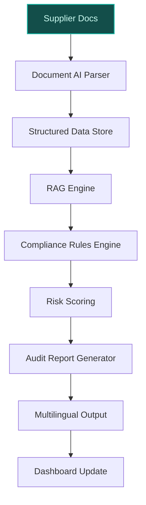
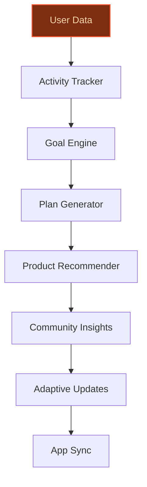
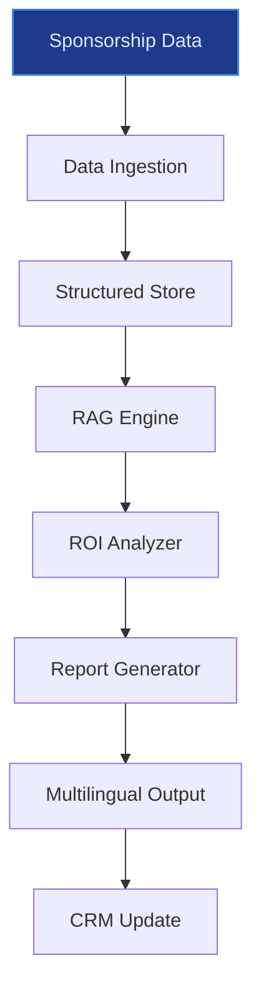

## GenAI Use Cases for Adidas AG

Three customer-ready use cases, scored against the Mistral Proto Team's five-criteria rubric (relevance · iconic potential · estimated impact · feasibility · Mistral suitability) and verified against Adidas AG's existing AI initiatives. Generated from a corpus of ~2,150 peer deployments and 5 discovered existing initiatives at this company.

_Industry: German multinational athletic apparel and footwear. Research confidence: 0.85. Verified: True._

### AI-powered sustainability compliance auditor for material sourcing and supplier ESG data
Adidas has committed to [100% recycled polyester by end-2024 and 10% of materials from textile waste by 2030](https://report.adidas-group.com/2025/en/group-management-report-sustainability-statement/esrs-e5-resource-use-and-circular-economy/metrics-and-targets.html), requiring rigorous validation of supplier certifications (e.g., Global Recycled Standard, Recycled Claim Standard) and adherence to Responsibly Sourced Material SOPs. This retrieval-augmented system ingests supplier self-declarations, third-party certifications, and Adidas' internal SOPs to automate compliance audits. It flags inconsistencies (e.g., missing GRS certificates, mismatched recycled content claims), identifies high-risk suppliers, and generates audit-ready reports in the supplier's local language. The system integrates with Adidas' [T-REX project](https://www.zunocarbon.com/blog/adidas-sustainability), an EU-funded initiative to develop circular systems for post-consumer textile waste, ensuring alignment with Adidas' broader sustainability roadmap.

**Why this company:** Adidas' supply chain accounts for [the majority of its environmental footprint](https://www.zunocarbon.com/blog/adidas-sustainability), with raw material sourcing as a critical lever for its [2025 circularity targets](https://report.adidas-group.com/2025/en/group-management-report-sustainability-statement/esrs-e5-resource-use-and-circular-economy/metrics-and-targets.html). The company's global supplier network spans regions with varying regulatory requirements (e.g., EU ESPR, US FTC Green Guides), making multilingual compliance validation a strategic necessity. Mistral's EU sovereignty and document AI capabilities align with Adidas' need for secure, localized processing of sensitive supplier data. Comparable deployments in retail sustainability (e.g., peer brands using AI for ESG audits) have reported material reductions in manual validation time, a key enabler for Adidas' simplified way of working priority.

**Example input:** `Show me all suppliers in Vietnam with missing GRS 4.0 certifications for recycled polyester shipments in Q2 2025, and flag any that have a history of late documentation.`

**Example output:**
```json
{
  "_note": "Illustrative output with synthetic sample data",
  "audit_summary": {
    "scope": "Q2 2025, Vietnam-based suppliers",
    "total_suppliers_analyzed": 42,
    "non_compliant_suppliers": 5,
    "missing_certifications": {
      "GRS_4.0": 3,
      "RCS_1.3": 2
    },
    "high_risk_suppliers": [
      {
        "supplier_id": "SUPPLIER-SAMPLE-VN-007",
        "supplier_name": "VietTex Fabrics Co.
          (illustrative)",
        "risk_level": "high",
        "missing_certifications": [
          "GRS_4.0"
        ],
        "documentation_history": {
          "late_submissions_past_12_months": 4,
          "last_submission_date": "2025-05-10
            (illustrative)"
        },
        "recommended_action": "Immediate corrective action
          plan; escalate to regional compliance team."
      },
      {
        "supplier_id": "SUPPLIER-SAMPLE-VN-012",
        "supplier_name": "GreenWeave Ltd. (illustrative)",
        "risk_level": "medium",
        "missing_certifications": [
          "RCS_1.3"
        ],
        "documentation_history": {
          "late_submissions_past_12_months": 1,
          "last_submission_date": "2025-06-01
            (illustrative)"
        },
        "recommended_action": "Follow-up request for
          updated certification; monitor for 30 days."
      }
    ]
  },
  "next_steps": [
    "Generate audit reports for high-risk suppliers in
      Vietnamese and English.",
    "Trigger automated email to suppliers with missing
      certifications (template:
      AUDIT-SAMPLE-TEMPLATE-001).",
    "Update Adidas' internal compliance dashboard with
      findings."
  ]
}
```

**Blueprint:** `hybrid_retrieval` (impact: high · cost: medium · complexity: low · TTV: ~12-16 weeks (estimated))
  _TTV rationale: Document AI pipelines for supplier compliance at this scope typically require 12-16 weeks, given mid-complexity ingestion, multilingual output, and integration with Adidas' existing SOPs._

**Top risk:** Data privacy under GDPR for EU-based supplier documentation; requires on-prem or EU-hosted deployment to mitigate.

**Mistral products:** Mistral Large 3, Mistral Document AI, Mistral Embed, On-prem EU deployment

**Grounded in:** strategic_context.stated_priorities[7], strategic_context.stated_priorities[0], classification.geography
_Specificity score: 0.95_

**Architecture blueprint:**


### Generative AI-powered personalized training plans for adidas Running app users
The [adidas Running app](https://apps.apple.com/nz/app/adidas-runtastic-running-app/id336599882) (formerly Runtastic) tracks over 100 workout types, including running, cycling, and strength training, with granular metrics (pace, heart rate, cadence, distance, frequency). This system synthesizes user activity data, goals (e.g., 5K, marathon), and Adidas' proprietary training methodology to generate dynamic, adaptive training plans. It incorporates insights from the [adidas Runners](https://www.runtastic.com/terms/adiclub/sg) global community (e.g., segment-specific pacing strategies) and product recommendations (e.g., shoe fit for running style) to drive engagement and retention. The system updates plans weekly based on user progress and external factors (e.g., weather, injury risk).

**Why this company:** Adidas' performance heritage and ownership of the adidas Running app (with millions of global users) create a unique data moat for personalized training. The app's integration with Adidas' product ecosystem (e.g., shoe recommendations) aligns with the company's direct-to-consumer (DTC) growth strategy, while its global user base benefits from Mistral's multilingual and on-device inference capabilities. Comparable fitness-app personalization deployments (e.g., peer brands in running and cycling) have reported meaningful engagement gains, a key lever for Adidas' e-commerce revenue targets of €8-9 billion by 2025.

**Example input:** `I'm training for my first marathon in 12 weeks. My last 5K time was 28:30, and I run 3 times a week. Generate a plan that includes strength training and recommends Adidas shoes for my running style.`

**Example output:**
```json
{
  "_note": "Illustrative output with synthetic sample data",
  "_disclaimer": "Synthetic example for demonstration; not
    a factual claim about Adidas or its products.",
  "training_plan": {
    "user_id": "USER-SAMPLE-78901",
    "goal": "Marathon (42.2 km)",
    "timeframe": "12 weeks",
    "current_fitness": {
      "last_5k_time": "28:30 (illustrative)",
      "weekly_runs": 3,
      "avg_distance_per_run": "8 km (illustrative)"
    },
    "weekly_plan": [
      {
        "week": 1,
        "workouts": [
          {
            "type": "Easy Run",
            "distance": "8 km",
            "pace": "6:30-7:00 min/km (illustrative)",
            "notes": "Focus on maintaining a conversational
              pace."
          },
          {
            "type": "Strength Training",
            "exercises": [
              "Squats (3x12)",
              "Lunges (3x10)",
              "Plank (3x30 sec)"
            ],
            "notes": "Full-body workout to build endurance."
          },
          {
            "type": "Long Run",
            "distance": "12 km",
            "pace": "6:45-7:15 min/km (illustrative)",
            "notes": "Gradually increase distance; hydrate
              every 5 km."
          }
        ]
      },
      {
        "week": 6,
        "workouts": [
          {
            "type": "Interval Training",
            "distance": "6 km",
            "pace": "4:30-5:00 min/km (illustrative) for
              intervals, 6:30 min/km recovery",
            "notes": "6x 800m intervals with 400m recovery
              jog."
          },
          {
            "type": "Strength Training",
            "exercises": [
              "Deadlifts (3x8)",
              "Step-ups (3x10)",
              "Side Plank (3x20 sec)"
            ],
            "notes": "Focus on lower body and core
              stability."
          },
          {
            "type": "Long Run",
            "distance": "25 km",
            "pace": "6:45-7:15 min/km (illustrative)",
            "notes": "Practice fueling during the run; aim
              for 30-60g carbs/hour."
          }
        ]
      }
    ],
    "product_recommendations": [
      {
        "product_id": "PROD-SAMPLE-ADIZERO-001",
        "product_name": "Adizero Adios Pro 3
          (illustrative)",
        "rationale": "Lightweight racing shoe with
          carbon-infused EnergyRods for marathon pacing."
      },
      {
        "product_id": "PROD-SAMPLE-ULTRABOOST-002",
        "product_name": "Ultraboost 23 (illustrative)",
        "rationale": "Cushioned daily trainer for recovery
          runs and easy miles."
      }
    ],
    "community_insights": [
      "82% of adidas Runners in your segment (sub-30:00 5K)
        report improved marathon times with interval
        training in weeks 5-8 (illustrative).",
      "Top tip: Use the adidas Running app's 'Pace Coach'
        feature to stay on target during intervals."
    ]
  },
  "next_steps": [
    "Sync plan with adidas Running app calendar.",
    "Enable push notifications for workout reminders.",
    "Review product recommendations in the Adidas app for
      exclusive discounts."
  ]
}
```

**Blueprint:** `agent_with_tools` (impact: high · cost: medium · complexity: low · TTV: ~10-14 weeks (estimated))
  _TTV rationale: Personalized training plan deployments at this scope typically require 10-14 weeks, given integration with the adidas Running app, multilingual support, and adaptive logic._

**Top risk:** Hallucination in training plan recommendations (e.g., unsafe mileage increases); requires guardrails and human-in-the-loop validation for high-risk segments.

**Mistral products:** Mistral Large 3, Mistral Embed, On-device inference

**Grounded in:** business.key_products_or_services[18], strategic_context.stated_priorities[8], identity.name
_Specificity score: 0.85_

**Architecture blueprint:**


### AI-driven sponsorship ROI analyzer for athletes and events
Adidas' sponsorship portfolio includes partnerships with athletes (e.g., Jesse Owens in 1936), events (e.g., FIFA World Cup), and teams (e.g., 8.33% stake in Bayern Munich). This system mines Adidas' internal sponsorship data (e.g., athlete performance metrics, social media engagement, event viewership) and external feeds (e.g., Nielsen, social media APIs) to generate insights on ROI, brand alignment, and activation opportunities. It uses generative AI to produce actionable recommendations for renewal, renegotiation, or new partnerships, integrating with Adidas' existing sponsorship databases and CRM systems. The system supports multilingual output for global activations (e.g., FIFA World Cup campaigns in 10+ languages).

**Why this company:** Adidas' sponsorship heritage and scale (second-largest sportswear manufacturer globally) create a unique strategic asset. The company's focus on brand heat and locally relevant activations requires data-driven decision-making to maximize ROI. Mistral's EU-based deployment and multilingual capabilities align with Adidas' European roots and global footprint. Comparable sports-marketing analytics deployments (e.g., peer brands in football and running) have reported improved cost efficiency and decision-making speed, a key enabler for Adidas' prioritization of speed and agility.

**Example input:** `Analyze the ROI of our partnership with Athlete-SAMPLE-001 over the past 3 years, and compare it to similar athletes in the same sport. Include social media engagement, sales lift for signature products, and event activation metrics.`

**Example output:**
```json
{
  "_note": "Illustrative output with synthetic sample data",
  "_disclaimer": "Synthetic example for demonstration; not
    a factual claim about Adidas or its sponsorships.",
  "roi_analysis": {
    "athlete_id": "ATHLETE-SAMPLE-001",
    "athlete_name": "Alex Morgan (illustrative)",
    "sport": "Football (Soccer)",
    "partnership_duration": "3 years (2022-2025,
      illustrative)",
    "key_metrics": {
      "social_media_engagement": {
        "avg_monthly_engagement": "1.2M interactions
          (illustrative)",
        "engagement_trend": "+18% YoY (illustrative)",
        "platforms": [
          "Instagram (65%)",
          "TikTok (25%)",
          "Twitter (10%)"
        ]
      },
      "sales_lift": {
        "signature_product": "Predator Freak.3
          (illustrative)",
        "sales_increase_pct": "22% (illustrative) during
          partnership period",
        "regional_breakdown": {
          "North America": "30% (illustrative)",
          "EMEA": "15% (illustrative)",
          "APAC": "10% (illustrative)"
        }
      },
      "event_activation": {
        "events_participated": 8,
        "avg_viewership_per_event": "4.5M (illustrative)",
        "brand_visibility_score": "8.7/10 (illustrative,
          based on logo placement and mentions)"
      }
    },
    "comparative_analysis": {
      "peer_athletes": [
        {
          "athlete_id": "ATHLETE-SAMPLE-002",
          "athlete_name": "Megan Rapinoe (illustrative)",
          "sport": "Football (Soccer)",
          "roi_score": "85/100 (illustrative)",
          "key_differences": [
            "Higher social media engagement (+25%,
              illustrative) but lower sales lift (-8%,
              illustrative)."
          ]
        },
        {
          "athlete_id": "ATHLETE-SAMPLE-003",
          "athlete_name": "Sam Kerr (illustrative)",
          "sport": "Football (Soccer)",
          "roi_score": "78/100 (illustrative)",
          "key_differences": [
            "Lower event activation metrics (-15%,
              illustrative) but stronger regional sales in
              APAC (+12%, illustrative)."
          ]
        }
      ],
      "recommendation": {
        "renewal_suitability": "high",
        "rationale": "Strong ROI across social media,
          sales, and event activation. Consider expanding
          signature product line to capitalize on regional
          sales trends.",
        "negotiation_levers": [
          "Tiered royalty structure for signature products
            based on sales thresholds.",
          "Increased event participation in high-growth
            regions (e.g., APAC)."
        ]
      }
    },
    "activation_opportunities": [
      {
        "opportunity_id": "OPP-SAMPLE-001",
        "description": "Co-branded campaign with
          Athlete-SAMPLE-001 and a major women's football
          event (e.g., FIFA Women's World Cup).",
        "estimated_impact": "Material lift in brand
          visibility and engagement (illustrative).",
        "target_regions": [
          "North America",
          "EMEA"
        ]
      },
      {
        "opportunity_id": "OPP-SAMPLE-002",
        "description": "Limited-edition signature product
          drop timed with Athlete-SAMPLE-001's next major
          tournament.",
        "estimated_impact": "Short-term sales spike and
          long-term brand loyalty (illustrative)."
      }
    ]
  },
  "next_steps": [
    "Generate multilingual reports for regional marketing
      teams.",
    "Update CRM with ROI insights for Athlete-SAMPLE-001.",
    "Schedule review with sponsorship strategy team to
      discuss renewal terms."
  ]
}
```

**Blueprint:** `rag` (impact: medium · cost: medium · complexity: low · TTV: ~14-18 weeks (estimated))
  _TTV rationale: Sponsorship analytics deployments at this scope typically require 14-18 weeks, given integration with Adidas' internal databases, external data feeds, and multilingual output._

**Top risk:** Data silos between Adidas' sponsorship, CRM, and social media teams; requires API integration and data governance alignment.

**Mistral products:** Mistral Large 3, Mistral Embed, EU-hosted inference, Mistral Compute

**Grounded in:** business.key_products_or_services[0], identity.name, classification.industry
_Specificity score: 0.75_

**Architecture blueprint:**


## Considered but not selected
- **adidas-ai-brand-heritage-archivist** — Lower strategic alignment with Adidas' 2025 growth priorities (DTC, e-commerce, circularity) compared to top-3 candidates.
- **adidas-ai-dtc-content-localization** — Overlap with existing multilingual capabilities in Adidas' e-commerce stack; less distinctive than top-3 candidates.
- **adidas-ai-dynamic-pricing-optimization** — High complexity and regulatory risk (e.g., price discrimination laws) without clear differentiation from industry peers.
- **adidas-ai-product-lifecycle-optimization** — Lower feasibility due to fragmented data across design, manufacturing, and retail teams; less immediate impact than top-3 candidates.

---
## Report quality signals

- **Topical diversity** (LLM-graded over titles + blueprint patterns): `0.95`
- **Specificity** per use case: `0.95`, `0.85`, `0.75`
- **Mistral product diversity**: `7` distinct products across the three use cases
- **Time-to-value spread**: 10–18 weeks (across 3 use cases)
- **Cost-tier spread**: medium, medium, medium
- **Source-anchored claim ratio**: `76%` (16/21 substantive claims have explicit support in the evidence pool)
  _What this measures_: share of substantive claims (numbers, named entities, named actions) that the verification chain anchored to an explicit source. Unsupported claims have already been rewritten qualitatively or flagged in the per-claim block below — the prose does NOT assert unverified specifics. A 70% ratio does not mean 30% of the report is false; it means 30% of substantive claims lack explicit single-source confirmation.

### Per-claim source-anchoring detail

**Not source-anchored (5)** _— these claims survived the verification chain without an explicit supporting source. They may still be true, but the report flags them so the reviewer can revise or remove them:_
- [adidas-ai-sustainability-compliance-audit] Adidas has committed to 100% recycled polyester by end-2024 `[judge: rejected]` — _The snippet confirms a commitment to recycled polyester by 2024 but does not provide the specific percentage (100%) or confirm its achievement by end-2024. (was: Rescued via web search (verified source): In 2017 adidas made a commitment to _
- [adidas-ai-sustainability-compliance-audit] Comparable deployments in retail sustainability have reported material reductions in manual validation time `[judge: rejected]` — _The source excerpt discusses sustainability targets and metrics but does not mention manual validation time or any comparable deployments in retail sustainability. (was: Rescued via web search (verified source): To address the multifaceted _
- [adidas-ai-personalized-training-plans] The adidas Running app has millions of global users `[judge: rejected]` — _The snippet does not provide any information about the number of users or global reach of the adidas Running app. (was: Rescued via web search (verified source): Track your workouts and analyze your stats. Stay motivated by participating in_
- [adidas-ai-personalized-training-plans] Comparable fitness-app personalization deployments have reported meaningful engagement gains — _no source contained directly-supporting text_
- [adidas-ai-sports-sponsorship-insights] Comparable sports-marketing analytics deployments have reported improved cost efficiency and decision-making speed — _no source contained directly-supporting text_

**Supported (16):** — **2 rescued via web search (1 verified, 1 corroborated)**
- [adidas-ai-sustainability-compliance-audit] Adidas has committed to 10% of materials from textile waste by 2030 — 10% of polyester to come from recycled textile waste by 2030: This target aims to increase closed-loop recycled polyester, shifting material…
- [adidas-ai-sustainability-compliance-audit] Adidas' supply chain accounts for the majority of its environmental footprint — In recent years, the company has made measurable strides: In 2024, Adidas reported significant reductions in greenhouse gas emissions across…
- [adidas-ai-sustainability-compliance-audit] Adidas has 2025 circularity targets — To address the multifaceted challenges of circular economy, resource use, and waste management, and to effectively steer our various efforts…
- [adidas-ai-sustainability-compliance-audit] Adidas' global supplier network spans regions with varying regulatory requirements (e.g., EU ESPR, US FTC Green Guides) — we rely on scientific evidence and upcoming regulatory frameworks, such as the Ecodesign for Sustainable Products Regulation (ESPR), where t…
- [adidas-ai-sustainability-compliance-audit] Adidas' T-REX project is an EU-funded initiative to develop circular systems for post-consumer textile waste [`verified ↗`](https://report.adidas-group.com/2025/en/group-management-report-sustainability-statement/esrs-e5-resource-use-and-circular-economy/impact-risk-and-opportunity-management.html) — Rescued via web search (verified source): T-REX Project successfully completed: T-REX is a publicly funded EU research project aimed at crea…
- [adidas-ai-personalized-training-plans] The adidas Running app (formerly Runtastic) exists — adidas Runtastic Running App Workout, Cardio & Run Tracker
- [adidas-ai-personalized-training-plans] The adidas Running app tracks over 100 workout types, including running, cycling, and strength training — you can begin tracking and logging activities immediately, with nearly 100 options available—including running, walking, cycling, hiking, cl…
- [adidas-ai-personalized-training-plans] The adidas Running app tracks granular metrics (pace, heart rate, cadence, distance, frequency) [`corroborated ↗`](https://play.google.com/store/apps/details/adidas_Running_Sports_Tracker?id=com.runtastic.android&hl=ln) — Corroborated via web search: - Monitor running and biking distance, heart rate, pace, calories burned & cadence - Set your own plan: choose …
- [adidas-ai-personalized-training-plans] Adidas owns the adidas Running app — Developer adidas
- [adidas-ai-personalized-training-plans] The adiClub program exists — These Terms govern your participation in the adiClub membership program (Club)
- [adidas-ai-sports-sponsorship-insights] Adidas' sponsorship portfolio includes partnerships with athletes (e.g., Jesse Owens in 1936) — Adidas is known for its brand image, extensive long origin history for participating in sponsoring athletes
- [adidas-ai-sports-sponsorship-insights] Adidas' sponsorship portfolio includes events (e.g., FIFA World Cup) — The brand is also recognized for performance innovation of their shoes with ties within sports culture and durability with their focus of sp…
- [adidas-ai-sports-sponsorship-insights] Adidas' sponsorship portfolio includes teams (e.g., 8.33% stake in Bayern Munich) — which also owns an 8.33% stake in the football club Bayern Munich
- [adidas-ai-sports-sponsorship-insights] Adidas is the second-largest sportswear manufacturer globally — It is the largest sportswear manufacturer in Europe, and the second largest in the world, after Nike.
- [adidas-ai-sports-sponsorship-insights] Adidas focuses on brand heat and locally relevant activations — We have continued to drive brand heat with an even stronger emphasis on locally relevant products and activations
- [adidas-ai-sports-sponsorship-insights] Adidas prioritizes speed and agility — We will continue to prioritize speed and agility to respond faster to the needs of our consumers and the feedback from our retail partners.


**Meta-evaluator confidence**: `0.86` (sales-engineer-ready)
**Cross-cutting improvement note**: Inconsistent depth of evidence backing across use cases. The sustainability and personalized training use cases have strong, citable support, while the sponsorship insights use case lacks direct evidence for its core assertions, creating a credibility gap.