# Trace

## Execution trace — Adidas

Started: `2026-05-11T03:20:07.885090+00:00`. Total wall time: `200.0s` across `45` recorded actions.

### Per-step time totals

| Step | Calls | Total time | Avg time |
|---|---:|---:|---:|
| `resolve_entity` | 1 | 0.77s | 770ms |
| `research` | 1 | 7.51s | 7510ms |
| `gap_fill` | 4 | 3.76s | 940ms |
| `retrieve` | 2 | 0.58s | 290ms |
| `generate` | 2 | 21.45s | 10725ms |
| `generate.web_search` | 2 | 5.19s | 2597ms |
| `score` | 2 | 23.53s | 11765ms |
| `verify` | 6 | 15.30s | 2551ms |
| `enrich` | 1 | 78.60s | 78603ms |
| `meta_eval` | 1 | 12.35s | 12346ms |
| `web_verify` | 1 | 8.89s | 8893ms |
| `source_judge` | 20 | 15.07s | 754ms |
| `quality_signals` | 2 | 5.29s | 2645ms |

### Chronological event log

- `03:20:07.931` **[resolve_entity]** `mistral-small-2603.chat.complete` — 770ms
   - inputs: user_input='Adidas'
   - outputs: resolved=True → 'Adidas AG'
- `03:20:19.699` **[research]** `mistral-medium-2604.chat.complete` — 7510ms
   - inputs: synthesize CompanyContext for Adidas AG | depth=medium
   - outputs: industry='German multinational athletic apparel and footwear' verified=True conf=0.75
- `03:20:27.211` **[gap_fill]** `mistral-small-2603.chat.complete` — 890ms
   - inputs: generate gap queries | fields=['business_model', 'products', 'data_assets', 'priorities']
   - outputs: queries=4
- `03:20:45.704` **[gap_fill]** `mistral-small-2603.chat.complete` — 1425ms
   - inputs: layer-2 extract field=priorities
   - outputs: items=11
- `03:20:45.717` **[gap_fill]** `mistral-small-2603.chat.complete` — 635ms
   - inputs: layer-2 extract field=data_assets
   - outputs: items=0
- `03:20:45.720` **[gap_fill]** `mistral-small-2603.chat.complete` — 810ms
   - inputs: layer-2 extract field=products
   - outputs: items=20
- `03:20:47.133` **[retrieve]** `mistral-embed.embeddings.create` — 205ms
   - inputs: company_query | industries='German multinational athletic apparel and footwear'
   - outputs: embedded 1024-dim query vector
- `03:20:47.339` **[retrieve]** `precedent_corpus.cosine_topk` — 375ms
   - inputs: k=8 min_depth=0.4 target='Adidas AG'
   - outputs: retrieved 8 | mmr=True | top_sim=0.767
- `03:20:49.136` **[generate]** `mistral-medium-2604.chat.complete` — 1851ms
   - inputs: iteration=0 tool_calls_used=0/2 tools=on
   - outputs: tool_calls=4 | content_chars=0
- `03:20:51.010` **[generate.web_search]** `tavily.search` — 2630ms
   - inputs: query='Adidas Runtastic app features and data 2025'
   - outputs: 2 raw results
- `03:20:54.411` **[generate.web_search]** `tavily.search` — 2564ms
   - inputs: query='Adidas supply chain sustainability 2025 polyesters recycled materials'
   - outputs: 2 raw results
- `03:20:59.093` **[generate]** `mistral-medium-2604.chat.complete` — 19598ms
   - inputs: iteration=1 tool_calls_used=2/2 tools=off
   - outputs: tool_calls=0 | content_chars=13789
- `03:21:18.950` **[score]** `mistral-small-2603.chat.complete` — 11174ms
   - inputs: self-consistency pass T=0.2
   - outputs: scored 8 candidates
- `03:21:19.003` **[score]** `mistral-small-2603.chat.complete` — 12356ms
   - inputs: self-consistency pass T=0.4
   - outputs: scored 8 candidates
- `03:21:31.389` **[verify]** `tavily.search` — 2639ms
   - inputs: candidate=adidas-ai-sustainability-compliance-audit | query='Adidas AG AI-powered sustainability compliance auditor for m'
   - outputs: 4 results
- `03:21:31.389` **[verify]** `tavily.search` — 2766ms
   - inputs: candidate=adidas-ai-personalized-training-plans | query='Adidas AG Generative AI-powered personalized training plans '
   - outputs: 4 results
- `03:21:31.389` **[verify]** `tavily.search` — 2652ms
   - inputs: candidate=adidas-ai-sports-sponsorship-insights | query='Adidas AG AI-driven sponsorship ROI analyzer for athletes an'
   - outputs: 4 results
- `03:21:34.524` **[verify]** `mistral-small-2603.chat.complete` — 1494ms
   - inputs: verdict for adidas-ai-personalized-training-plans
   - outputs: verdict='pass'
- `03:21:34.530` **[verify]** `mistral-small-2603.chat.complete` — 3801ms
   - inputs: verdict for adidas-ai-sustainability-compliance-audit
   - outputs: verdict='pass'
- `03:21:34.534` **[verify]** `mistral-small-2603.chat.complete` — 1952ms
   - inputs: verdict for adidas-ai-sports-sponsorship-insights
   - outputs: verdict='pass'
- `03:21:38.335` **[enrich]** `mistral-large-2512.chat.complete` — 78603ms
   - inputs: tier=standard parallel=False ids=['adidas-ai-sustainability-compliance-audit', 'adidas-ai-personalized-training-plans', 'adidas-ai-sports-sponsorship-insights']
   - outputs: enriched 3 use cases
- `03:22:56.959` **[meta_eval]** `mistral-medium-2604.chat.complete` — 12346ms
   - inputs: reviewing 3 use cases
   - outputs: review + claims
- `03:23:09.326` **[web_verify]** `tavily.search.rescue_unsupported_claims` — 8893ms
   - inputs: company='Adidas AG' unsupported=7 budget=12
   - outputs: rescued: verified=4 corroborated=1 of 7 attempted
- `03:23:18.219` **[source_judge]** `mistral-small-2603.judge_claim_sources` — 2004ms
   - inputs: pairs=19
   - outputs: judged 19 pairs
- `03:23:18.219` **[source_judge]** `mistral-small-2603.chat.complete` — 959ms
   - inputs: claim='Adidas has committed to 100% recycled polyester by end-2024'
   - outputs: verdict=unsupported
- `03:23:18.222` **[source_judge]** `mistral-small-2603.chat.complete` — 689ms
   - inputs: claim='Adidas has committed to 10% of materials from textile waste '
   - outputs: verdict=supported
- `03:23:18.224` **[source_judge]** `mistral-small-2603.chat.complete` — 959ms
   - inputs: claim="Adidas' supply chain accounts for the majority of its enviro"
   - outputs: verdict=supported
- `03:23:18.226` **[source_judge]** `mistral-small-2603.chat.complete` — 782ms
   - inputs: claim='Adidas has 2025 circularity targets'
   - outputs: verdict=supported
- `03:23:18.230` **[source_judge]** `mistral-small-2603.chat.complete` — 802ms
   - inputs: claim="Adidas' global supplier network spans regions with varying r"
   - outputs: verdict=supported
- `03:23:18.232` **[source_judge]** `mistral-small-2603.chat.complete` — 837ms
   - inputs: claim="Adidas' T-REX project is an EU-funded initiative to develop "
   - outputs: verdict=supported
- `03:23:18.234` **[source_judge]** `mistral-small-2603.chat.complete` — 739ms
   - inputs: claim='Comparable deployments in retail sustainability have reporte'
   - outputs: verdict=unsupported
- `03:23:18.236` **[source_judge]** `mistral-small-2603.chat.complete` — 946ms
   - inputs: claim='The adidas Running app (formerly Runtastic) exists'
   - outputs: verdict=supported
- `03:23:18.911` **[source_judge]** `mistral-small-2603.chat.complete` — 657ms
   - inputs: claim='The adidas Running app tracks over 100 workout types, includ'
   - outputs: verdict=supported
- `03:23:18.974` **[source_judge]** `mistral-small-2603.chat.complete` — 484ms
   - inputs: claim='The adidas Running app tracks granular metrics (pace, heart '
   - outputs: verdict=supported
- `03:23:19.008` **[source_judge]** `mistral-small-2603.chat.complete` — 491ms
   - inputs: claim='The adidas Running app has millions of global users'
   - outputs: verdict=unsupported
- `03:23:19.032` **[source_judge]** `mistral-small-2603.chat.complete` — 563ms
   - inputs: claim='Adidas owns the adidas Running app'
   - outputs: verdict=supported
- `03:23:19.070` **[source_judge]** `mistral-small-2603.chat.complete` — 591ms
   - inputs: claim='The adiClub program exists'
   - outputs: verdict=supported
- `03:23:19.178` **[source_judge]** `mistral-small-2603.chat.complete` — 709ms
   - inputs: claim="Adidas' sponsorship portfolio includes partnerships with ath"
   - outputs: verdict=supported
- `03:23:19.183` **[source_judge]** `mistral-small-2603.chat.complete` — 571ms
   - inputs: claim="Adidas' sponsorship portfolio includes events (e.g., FIFA Wo"
   - outputs: verdict=supported
- `03:23:19.186` **[source_judge]** `mistral-small-2603.chat.complete` — 566ms
   - inputs: claim="Adidas' sponsorship portfolio includes teams (e.g., 8.33% st"
   - outputs: verdict=supported
- `03:23:19.457` **[source_judge]** `mistral-small-2603.chat.complete` — 520ms
   - inputs: claim='Adidas is the second-largest sportswear manufacturer globall'
   - outputs: verdict=supported
- `03:23:19.499` **[source_judge]** `mistral-small-2603.chat.complete` — 549ms
   - inputs: claim='Adidas focuses on brand heat and locally relevant activation'
   - outputs: verdict=supported
- `03:23:19.568` **[source_judge]** `mistral-small-2603.chat.complete` — 655ms
   - inputs: claim='Adidas prioritizes speed and agility'
   - outputs: verdict=supported
- `03:23:22.590` **[quality_signals]** `mistral-small-2603.chat.complete` — 3549ms
   - inputs: specificity grade (3 use cases)
   - outputs: scored 3 use cases
- `03:23:26.139` **[quality_signals]** `mistral-small-2603.chat.complete` — 1742ms
   - inputs: diversity grade
   - outputs: diversity=0.95

## Mermaid sequence

```mermaid
sequenceDiagram
    autonumber
    participant pipeline as pipeline
    participant mistral_small_2603 as mistral-small-2603
    participant mistral_medium_2604 as mistral-medium-2604
    participant mistral_embed as mistral-embed
    participant precedent_corpus as precedent_corpus
    participant tavily as tavily
    participant mistral_large_2512 as mistral-large-2512
    participant tavily_search as tavily.search
    pipeline->>mistral_small_2603: resolve_entity: chat.complete (770ms)
    mistral_small_2603-->>pipeline: resolved=True → 'Adidas AG'
    pipeline->>mistral_medium_2604: research: chat.complete (7510ms)
    mistral_medium_2604-->>pipeline: industry='German multinational athletic apparel and footwear
    pipeline->>mistral_small_2603: gap_fill: chat.complete (890ms)
    mistral_small_2603-->>pipeline: queries=4
    pipeline->>mistral_small_2603: gap_fill: chat.complete (1425ms)
    mistral_small_2603-->>pipeline: items=11
    pipeline->>mistral_small_2603: gap_fill: chat.complete (635ms)
    mistral_small_2603-->>pipeline: items=0
    pipeline->>mistral_small_2603: gap_fill: chat.complete (810ms)
    mistral_small_2603-->>pipeline: items=20
    pipeline->>mistral_embed: retrieve: embeddings.create (205ms)
    mistral_embed-->>pipeline: embedded 1024-dim query vector
    pipeline->>precedent_corpus: retrieve: cosine_topk (375ms)
    precedent_corpus-->>pipeline: retrieved 8 | mmr=True | top_sim=0.767
    pipeline->>mistral_medium_2604: generate: chat.complete (1851ms)
    mistral_medium_2604-->>pipeline: tool_calls=4 | content_chars=0
    pipeline->>tavily: generate.web_search: search (2630ms)
    tavily-->>pipeline: 2 raw results
    pipeline->>tavily: generate.web_search: search (2564ms)
    tavily-->>pipeline: 2 raw results
    pipeline->>mistral_medium_2604: generate: chat.complete (19598ms)
    mistral_medium_2604-->>pipeline: tool_calls=0 | content_chars=13789
    pipeline->>mistral_small_2603: score: chat.complete (11174ms)
    mistral_small_2603-->>pipeline: scored 8 candidates
    pipeline->>mistral_small_2603: score: chat.complete (12356ms)
    mistral_small_2603-->>pipeline: scored 8 candidates
    pipeline->>tavily: verify: search (2639ms)
    tavily-->>pipeline: 4 results
    pipeline->>tavily: verify: search (2766ms)
    tavily-->>pipeline: 4 results
    pipeline->>tavily: verify: search (2652ms)
    tavily-->>pipeline: 4 results
    pipeline->>mistral_small_2603: verify: chat.complete (1494ms)
    mistral_small_2603-->>pipeline: verdict='pass'
    pipeline->>mistral_small_2603: verify: chat.complete (3801ms)
    mistral_small_2603-->>pipeline: verdict='pass'
    pipeline->>mistral_small_2603: verify: chat.complete (1952ms)
    mistral_small_2603-->>pipeline: verdict='pass'
    pipeline->>mistral_large_2512: enrich: chat.complete (78603ms)
    mistral_large_2512-->>pipeline: enriched 3 use cases
    pipeline->>mistral_medium_2604: meta_eval: chat.complete (12346ms)
    mistral_medium_2604-->>pipeline: review + claims
    pipeline->>tavily_search: web_verify: rescue_unsupported_claims (8893ms)
    tavily_search-->>pipeline: rescued: verified=4 corroborated=1 of 7 attempted
    pipeline->>mistral_small_2603: source_judge: judge_claim_sources (2004ms)
    mistral_small_2603-->>pipeline: judged 19 pairs
    pipeline->>mistral_small_2603: source_judge: chat.complete (959ms)
    mistral_small_2603-->>pipeline: verdict=unsupported
    pipeline->>mistral_small_2603: source_judge: chat.complete (689ms)
    mistral_small_2603-->>pipeline: verdict=supported
    pipeline->>mistral_small_2603: source_judge: chat.complete (959ms)
    mistral_small_2603-->>pipeline: verdict=supported
    pipeline->>mistral_small_2603: source_judge: chat.complete (782ms)
    mistral_small_2603-->>pipeline: verdict=supported
    pipeline->>mistral_small_2603: source_judge: chat.complete (802ms)
    mistral_small_2603-->>pipeline: verdict=supported
    pipeline->>mistral_small_2603: source_judge: chat.complete (837ms)
    mistral_small_2603-->>pipeline: verdict=supported
    pipeline->>mistral_small_2603: source_judge: chat.complete (739ms)
    mistral_small_2603-->>pipeline: verdict=unsupported
    pipeline->>mistral_small_2603: source_judge: chat.complete (946ms)
    mistral_small_2603-->>pipeline: verdict=supported
    pipeline->>mistral_small_2603: source_judge: chat.complete (657ms)
    mistral_small_2603-->>pipeline: verdict=supported
    pipeline->>mistral_small_2603: source_judge: chat.complete (484ms)
    mistral_small_2603-->>pipeline: verdict=supported
    pipeline->>mistral_small_2603: source_judge: chat.complete (491ms)
    mistral_small_2603-->>pipeline: verdict=unsupported
    pipeline->>mistral_small_2603: source_judge: chat.complete (563ms)
    mistral_small_2603-->>pipeline: verdict=supported
    pipeline->>mistral_small_2603: source_judge: chat.complete (591ms)
    mistral_small_2603-->>pipeline: verdict=supported
    pipeline->>mistral_small_2603: source_judge: chat.complete (709ms)
    mistral_small_2603-->>pipeline: verdict=supported
    pipeline->>mistral_small_2603: source_judge: chat.complete (571ms)
    mistral_small_2603-->>pipeline: verdict=supported
    pipeline->>mistral_small_2603: source_judge: chat.complete (566ms)
    mistral_small_2603-->>pipeline: verdict=supported
    pipeline->>mistral_small_2603: source_judge: chat.complete (520ms)
    mistral_small_2603-->>pipeline: verdict=supported
    pipeline->>mistral_small_2603: source_judge: chat.complete (549ms)
    mistral_small_2603-->>pipeline: verdict=supported
    pipeline->>mistral_small_2603: source_judge: chat.complete (655ms)
    mistral_small_2603-->>pipeline: verdict=supported
    pipeline->>mistral_small_2603: quality_signals: chat.complete (3549ms)
    mistral_small_2603-->>pipeline: scored 3 use cases
    pipeline->>mistral_small_2603: quality_signals: chat.complete (1742ms)
    mistral_small_2603-->>pipeline: diversity=0.95
```

