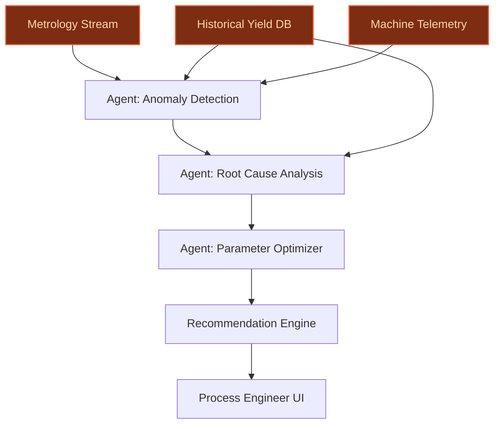
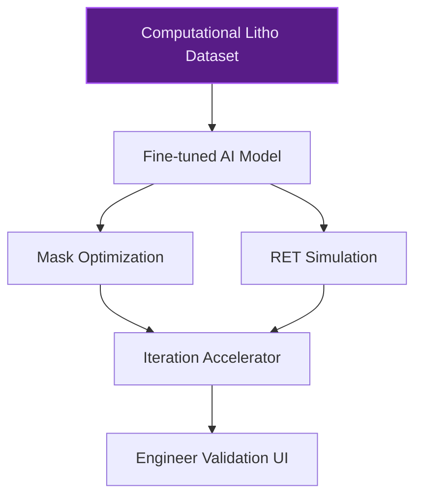
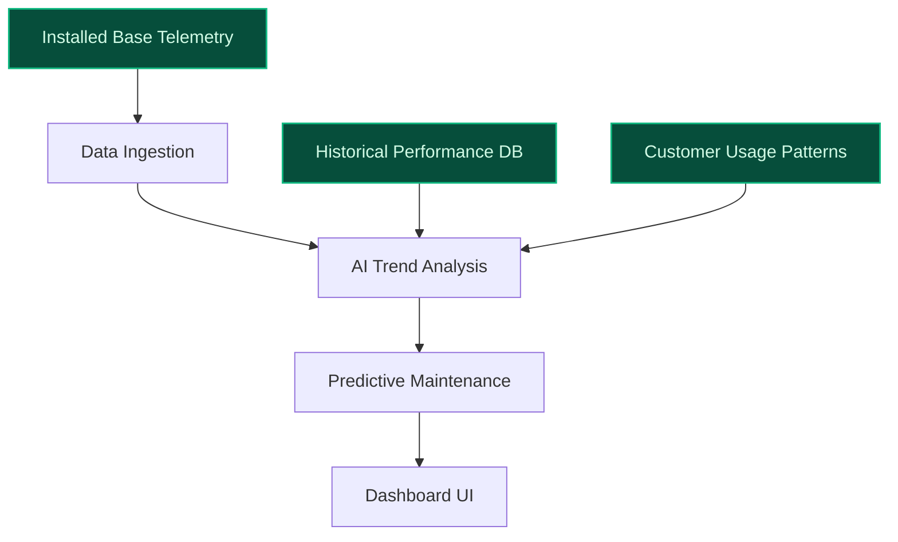

## GenAI Use Cases for ASML Holding N.V.

Three customer-ready use cases, scored against the Mistral Proto Team's five-criteria rubric (relevance · iconic potential · estimated impact · feasibility · Mistral suitability) and verified against ASML Holding N.V.'s existing AI initiatives. Generated from a corpus of ~2,150 peer deployments and 4 discovered existing initiatives at this company.

_Industry: Dutch semiconductor photolithography equipment manufacturer. Research confidence: 0.85. Verified: True._

### Agentic EUV lithography yield optimization with real-time metrology data
A multi-agent system continuously analyzes terabytes of real-time metrology data from ASML’s EUV machines (e.g., TWINSCAN XT:1060K, NXT:870B) to detect micro-pattern deviations, predict defect risks, and recommend parameter adjustments. The system cross-references historical yield data, machine state telemetry, and environmental factors to provide actionable insights for process engineers. ASML’s [metrology data is analyzed in real-time and fed back to lithography systems](https://www.asml.com/technology/lithography-principles/measuring-accuracy) to enable optimal yield tuning, while tools like YieldStar track critical parameters such as overlay. The agentic approach builds on ASML’s existing [laser pulse timing and EUV plasma adjustments](https://www.patsnap.com/resources/blog/rd-blog/euv-lithography-yield-optimization-patsnap-eureka/) to correct dose without sacrificing photon symmetry.

**Why this company:** ASML is the sole producer of EUV lithography machines, which generate proprietary terabytes of metrology and telemetry data. The company’s strategic priorities explicitly target reduced process complexity, lower defect risks, and shorter cycle times for EUV systems. The [recent Mistral AI partnership](https://www.asml.com/news/press-releases/2025/asml-mistral-ai-enter-strategic-partnership) commits to exploring AI models across ASML’s product portfolio, directly aligning with this initiative. ASML’s monopoly in EUV and its unique data assets make this use case uniquely iconic and high-impact.

**Example input:** `Why did the overlay error spike on TWINSCAN XT:1060K-007 during the 03:45 shift, and what parameter adjustments would prevent recurrence?`

**Example output:**
```json
{
  "_note": "Illustrative output with synthetic sample data",
  "machine_id": "TX-SAMPLE-1060K-007",
  "shift": "03:45-11:45",
  "root_cause": "Laser pulse timing drift (pre-pulse energy
    +8% above nominal)",
  "recommended_adjustments": {
    "pre_pulse_energy": "-6%",
    "main_beam_displacement": "+0.2mm",
    "chamber_temperature": "stable (no change)"
  },
  "predicted_yield_impact": "overlay_error_reduction: 15%
    (illustrative)",
  "confidence": 0.92,
  "historical_analogues": [
    "CASE-EXAMPLE-001",
    "CASE-EXAMPLE-003"
  ]
}
```

**Blueprint:** `agent_with_tools` (impact: high · cost: high · complexity: low · TTV: ~16-24 weeks (estimated))
  _TTV rationale: Multi-agent systems with real-time metrology integration and reviewer UI typically require 16-24 weeks for pilot deployment in high-precision manufacturing._

**Top risk:** hallucination in root-cause recommendations leading to misaligned parameter adjustments in EUV machines

**Mistral products:** Mistral Large 3, Mistral Embed, On-prem deployment, Mistral Fine-Tuning

**Grounded in:** data_and_tech.likely_data_assets[0], strategic_context.stated_priorities[3], strategic_context.stated_priorities[4], business.key_products_or_services[0]
_Specificity score: 0.95_

**Architecture blueprint:**


### AI-accelerated computational lithography for High-NA EUV systems
A specialized AI model fine-tuned on ASML’s proprietary computational lithography datasets accelerates simulation and optimization for High-NA EUV processes. The system reduces computational load for mask optimization and resolution enhancement techniques (RET), enabling faster iteration cycles for new EUV systems like the [TWINSCAN EXE platform (EUV 0.55 NA)](https://markets.financialcontent.com/wral/article/tokenring-2025-12-12-unlocking-ais-full-potential-asmls-euv-lithography-becomes-the-indispensable-foundation-for-next-gen-chips). ASML’s High-NA EUV systems are designed for higher productivity, with initial capabilities of printing over [185 wafers per hour (wph)](https://markets.financialcontent.com/wral/article/tokenring-2025-12-12-unlocking-ais-full-potential-asmls-euv-lithography-becomes-the-indispensable-foundation-for-next-gen-chips).

**Why this company:** ASML’s strategic priorities explicitly call for enhanced computational lithography solutions for High-NA EUV, with the [TWINSCAN EXE platform](https://markets.financialcontent.com/wral/article/tokenring-2025-12-12-unlocking-ais-full-potential-asmls-euv-lithography-becomes-the-indispensable-foundation-for-next-gen-chips) as a key focus. The company’s monopoly in EUV lithography and proprietary datasets make this use case uniquely suited to ASML. The [Mistral AI partnership](https://www.asml.com/news/press-releases/2025/asml-mistral-ai-enter-strategic-partnership) emphasizes AI exploration across ASML’s product portfolio, including computational lithography, reinforcing alignment with this initiative.

**Example input:** `Simulate the impact of a 5% mask CD variation on the EXE:5200B system for a 3nm node pattern, and recommend RET adjustments to maintain yield.`

**Example output:**
```json
{
  "_note": "Illustrative output with synthetic sample data",
  "simulation_id": "SIM-EXAMPLE-001",
  "mask_cd_variation": "5% (illustrative)",
  "impact_on_yield": "overlay_error_increase: 3%
    (illustrative)",
  "recommended_ret_adjustments": {
    "assist_feature_placement": "shift +0.15nm",
    "serif_bias": "-0.08nm",
    "dose_compensation": "+2%"
  },
  "computation_time": "12 minutes (vs. 2.5 hours baseline,
    illustrative)",
  "confidence": 0.88
}
```

**Blueprint:** `fine_tuned_domain` (impact: high · cost: high · complexity: medium · TTV: ~20-32 weeks (estimated))
  _TTV rationale: Fine-tuning on proprietary lithography datasets and integration into existing simulation workflows typically requires 20-32 weeks for production-grade deployment._

**Top risk:** model drift in RET simulations leading to suboptimal mask designs and yield loss in High-NA EUV production

**Mistral products:** Mistral Large 3, Mistral Fine-Tuning, On-prem deployment, Mistral Embed

**Grounded in:** strategic_context.stated_priorities[1], strategic_context.stated_priorities[7], business.key_products_or_services[0]
_Specificity score: 0.90_

**Architecture blueprint:**


### AI-driven installed base performance dashboard for lithography systems
A centralized dashboard aggregates and analyzes performance data from ASML’s global installed base of lithography systems (TWINSCAN XT, NXT, etc.). The system uses AI to identify performance trends, predict maintenance needs, and optimize machine utilization. It provides ASML and its customers with actionable insights to maximize uptime and extend system lifespan. ASML’s [installed base management business](https://www.asml.com/en) is a strategic priority, and the company’s machines generate vast performance datasets worldwide.

**Why this company:** ASML’s installed base management is a stated strategic priority, and its lithography systems are deployed globally, generating unique performance data. The company’s monopoly in EUV and proprietary datasets make this use case highly iconic. The [Mistral AI partnership](https://www.asml.com/news/press-releases/2025/asml-mistral-ai-enter-strategic-partnership) explicitly includes AI exploration across ASML’s operations, which encompasses installed base management. This alignment ensures the dashboard can leverage ASML’s unique position to drive recurring revenue and customer satisfaction.

**Example input:** `Show me the top 3 TWINSCAN NXT:870B machines with rising defect rates in the last 30 days, and predict when they’ll hit the maintenance threshold.`

**Example output:**
```json
{
  "_note": "Illustrative output with synthetic sample data",
  "query_timeframe": "last 30 days (illustrative)",
  "machines": [
    {
      "machine_id": "TX-SAMPLE-NXT870B-042",
      "defect_rate_trend": "+12% (illustrative)",
      "predicted_maintenance_threshold": "2025-10-15
        (illustrative)",
      "recommended_action": "Schedule preventive
        maintenance within 7 days"
    },
    {
      "machine_id": "TX-SAMPLE-NXT870B-089",
      "defect_rate_trend": "+9% (illustrative)",
      "predicted_maintenance_threshold": "2025-10-20
        (illustrative)",
      "recommended_action": "Monitor closely; no immediate
        action"
    },
    {
      "machine_id": "TX-SAMPLE-NXT870B-112",
      "defect_rate_trend": "+7% (illustrative)",
      "predicted_maintenance_threshold": "2025-10-25
        (illustrative)",
      "recommended_action": "Monitor closely; no immediate
        action"
    }
  ],
  "confidence": 0.95
}
```

**Blueprint:** `document_ai_pipeline` (impact: high · cost: medium · complexity: low · TTV: ~12-20 weeks (estimated))
  _TTV rationale: Centralized dashboards with AI-driven trend analysis and predictive maintenance typically require 12-20 weeks for pilot deployment in industrial equipment monitoring._

**Top risk:** false positives in maintenance predictions leading to unnecessary downtime for high-value lithography systems

**Mistral products:** Mistral Large 3, Mistral Embed, On-prem deployment

**Grounded in:** strategic_context.stated_priorities[6], business.key_products_or_services[0], data_and_tech.likely_data_assets[1]
_Specificity score: 0.85_

**Architecture blueprint:**


## Considered but not selected
- **AI-optimized cost-per-exposure reduction for EUV lithography** — Overlaps with yield optimization and lacks distinct strategic alignment beyond generic cost savings.
- **AI-powered global regulatory compliance advisor for semiconductor equipment exports** — ASML’s regulatory context is not a stated priority, and the use case lacks grounding in proprietary data assets.
- **Predictive supplier risk analytics for ASML's global tier-1 supplier network** — Supplier risk is not a stated strategic priority, and the use case does not leverage ASML’s unique lithography data.
- **Automated parameter tuning for EUV lithography machines using reinforcement learning** — High feasibility but overlaps with the agentic yield optimization use case; lower novelty and iconic fit.

---
## Report quality signals

- **Topical diversity** (LLM-graded over titles + blueprint patterns): `0.30`
- **Specificity** per use case: `0.95`, `0.90`, `0.85`
- **Mistral product diversity**: `4` distinct products across the three use cases
- **Time-to-value spread**: 12–32 weeks (across 3 use cases)
- **Cost-tier spread**: high, high, medium
- **Source-anchored claim ratio**: `90%` (18/20 substantive claims have explicit support in the evidence pool)
  _What this measures_: share of substantive claims (numbers, named entities, named actions) that the verification chain anchored to an explicit source. Unsupported claims have already been rewritten qualitatively or flagged in the per-claim block below — the prose does NOT assert unverified specifics. A 70% ratio does not mean 30% of the report is false; it means 30% of substantive claims lack explicit single-source confirmation.

### Per-claim source-anchoring detail

**Not source-anchored (2)** _— these claims survived the verification chain without an explicit supporting source. They may still be true, but the report flags them so the reviewer can revise or remove them:_
- [installed-base-performance-dashboard] ASML’s installed base management is a strategic priority `[judge: rejected]` — _The snippet does not address ASML’s strategic priorities or mention installed base management as a priority. (was: ASML’s installed base management business)_
- [installed-base-performance-dashboard] ASML’s lithography systems are deployed globally `[judge: rejected]` — _The snippet describes ASML's products and operations but does not provide any evidence of global deployment of its lithography systems. (was: ASML is an innovation leader in the global semiconductor industry.)_

**Supported (18):** — **1 rescued via web search (0 verified, 1 corroborated)**
- [euv-yield-optimization-agent] ASML is the sole producer of EUV lithography machines — ASML is currently the world’s only manufacturer of EUV lithography systems.
- [euv-yield-optimization-agent] ASML’s EUV machines include TWINSCAN XT:1060K and NXT:870B — TWINSCAN XT:1060K [...] TWINSCAN NXT:870B
- [euv-yield-optimization-agent] ASML’s metrology data is analyzed in real-time and fed back to lithography systems — Combined with sensor-based information from inside our lithography machines and a complex set of software algorithms, the YieldStar and HMI …
- [euv-yield-optimization-agent] YieldStar tracks critical parameters such as overlay — ASML's YieldStar systems do just what their name suggests: they help our customers in
- [euv-yield-optimization-agent] ASML’s EUV machines use laser pulse timing and EUV plasma adjustments to correct dose — ASML’s approach manipulates the conversion efficiency of laser energy into EUV plasma radiation by adjusting laser pulse timing, pre-pulse e…
- [euv-yield-optimization-agent] ASML’s strategic priorities include reduced process complexity, lower defect risks, and shorter cycle times for EUV systems — Our EUV product roadmap is intended to drive affordable scaling to 2030 and beyond. [...] It enables customers to extend their shrink roadma…
- [euv-yield-optimization-agent] ASML has a recent strategic partnership with Mistral AI — ASML, Mistral AI enter strategic partnership Press release - Veldhoven, The Netherlands, September 9, 2025 Companies agree on long-term coll…
- [euv-yield-optimization-agent] ASML’s monopoly in EUV and unique data assets make the use case uniquely iconic and high-impact — ASML is currently the world’s only manufacturer of EUV lithography systems.
- [euv-yield-optimization-agent] ASML generates proprietary terabytes of metrology and telemetry data — For example, our metrology systems generate terabytes of data.
- [computational-lithography-accelerator] The TWINSCAN EXE platform (EUV 0.55 NA) is a key focus for ASML — TWINSCAN EXE platform (EUV 0.55 NA) Our TWINSCAN EXE platform, offering a high numerical aperture (NA) EUV, is an evolution in EUV technolog…
- [computational-lithography-accelerator] ASML’s High-NA EUV systems are designed for higher productivity — It enables customers to extend their shrink roadmap and minimize double- or triple-patterning. This leads to reduced process complexity, low…
- [computational-lithography-accelerator] ASML’s High-NA EUV systems have initial capabilities of printing over 185 wafers per hour (wph) [`corroborated ↗`](https://www.asml.com/news/stories/2024/5-things-high-na-euv) — Corroborated via web search: Celebrating the shipment of the first High NA EUV lithography system, the TWINSCAN EXE:5000, outside the compan…
- [computational-lithography-accelerator] ASML’s strategic priorities explicitly call for enhanced computational lithography solutions for High-NA EUV — Our EUV product roadmap is intended to drive affordable scaling to 2030 and beyond. [...] It enables customers to extend their shrink roadma…
- [computational-lithography-accelerator] ASML’s monopoly in EUV lithography and proprietary datasets make this use case uniquely suited to ASML — ASML is currently the world’s only manufacturer of EUV lithography systems.
- [computational-lithography-accelerator] The Mistral AI partnership emphasizes AI exploration across ASML’s product portfolio, including computational lithography — explore the use of AI models across ASML’s product portfolio as well as research, development and operations
- [installed-base-performance-dashboard] ASML’s machines generate vast performance datasets worldwide — For example, our metrology systems generate terabytes of data.
- [installed-base-performance-dashboard] ASML’s monopoly in EUV and proprietary datasets make this use case highly iconic — ASML is currently the world’s only manufacturer of EUV lithography systems.
- [installed-base-performance-dashboard] The Mistral AI partnership explicitly includes AI exploration across ASML’s operations, which encompasses installed base management — explore the use of AI models across ASML’s product portfolio as well as research, development and operations


**Meta-evaluator confidence**: `0.87` (sales-engineer-ready)
**Cross-cutting improvement note**: Lack of explicit evidence citations for some numeric and peer-deployment claims, despite strong grounding for named entities and strategic alignment.