# Trace

## Execution trace — ASML

Started: `2026-05-11T03:26:38.983215+00:00`. Total wall time: `122.3s` across `43` recorded actions.

### Per-step time totals

| Step | Calls | Total time | Avg time |
|---|---:|---:|---:|
| `resolve_entity` | 1 | 0.47s | 467ms |
| `research` | 1 | 10.12s | 10125ms |
| `gap_fill` | 4 | 3.39s | 847ms |
| `retrieve` | 2 | 0.19s | 97ms |
| `generate` | 1 | 20.04s | 20045ms |
| `score` | 2 | 23.69s | 11844ms |
| `verify` | 6 | 17.56s | 2926ms |
| `enrich` | 1 | 15.49s | 15487ms |
| `meta_eval` | 1 | 11.70s | 11695ms |
| `web_verify` | 1 | 2.61s | 2607ms |
| `source_judge` | 21 | 15.19s | 723ms |
| `quality_signals` | 2 | 5.05s | 2525ms |

### Chronological event log

- `03:26:38.983` **[resolve_entity]** `mistral-small-2603.chat.complete` — 467ms
   - inputs: user_input='ASML'
   - outputs: resolved=True → 'ASML Holding N.V.'
- `03:26:55.597` **[research]** `mistral-medium-2604.chat.complete` — 10125ms
   - inputs: synthesize CompanyContext for ASML Holding N.V. | depth=medium
   - outputs: industry='Dutch semiconductor photolithography equipment manufacturer' verified=True conf=0.75
- `03:27:05.724` **[gap_fill]** `mistral-small-2603.chat.complete` — 988ms
   - inputs: generate gap queries | fields=['business_model', 'products', 'data_assets', 'priorities']
   - outputs: queries=4
- `03:27:12.816` **[gap_fill]** `mistral-small-2603.chat.complete` — 1052ms
   - inputs: layer-2 extract field=priorities
   - outputs: items=10
- `03:27:12.822` **[gap_fill]** `mistral-small-2603.chat.complete` — 555ms
   - inputs: layer-2 extract field=data_assets
   - outputs: items=3
- `03:27:12.826` **[gap_fill]** `mistral-small-2603.chat.complete` — 795ms
   - inputs: layer-2 extract field=products
   - outputs: items=6
- `03:27:13.869` **[retrieve]** `mistral-embed.embeddings.create` — 189ms
   - inputs: company_query | industries='Dutch semiconductor photolithography equipment manufacturer'
   - outputs: embedded 1024-dim query vector
- `03:27:14.058` **[retrieve]** `precedent_corpus.cosine_topk` — 5ms
   - inputs: k=8 min_depth=0.4 target='ASML Holding N.V.'
   - outputs: retrieved 8 | mmr=True | top_sim=0.803
- `03:27:15.871` **[generate]** `mistral-medium-2604.chat.complete` — 20045ms
   - inputs: iteration=0 tool_calls_used=0/0 tools=off
   - outputs: tool_calls=0 | content_chars=15528
- `03:27:36.214` **[score]** `mistral-small-2603.chat.complete` — 11401ms
   - inputs: self-consistency pass T=0.2
   - outputs: scored 8 candidates
- `03:27:36.217` **[score]** `mistral-small-2603.chat.complete` — 12287ms
   - inputs: self-consistency pass T=0.4
   - outputs: scored 8 candidates
- `03:27:48.537` **[verify]** `tavily.search` — 2334ms
   - inputs: candidate=euv-yield-optimization-agent | query='ASML Holding N.V. Agentic EUV lithography yield optimization'
   - outputs: 4 results
- `03:27:48.538` **[verify]** `tavily.search` — 2042ms
   - inputs: candidate=computational-lithography-accelerator | query='ASML Holding N.V. AI-accelerated computational lithography f'
   - outputs: 4 results
- `03:27:48.538` **[verify]** `tavily.search` — 2573ms
   - inputs: candidate=euv-parameter-auto-tuning | query='ASML Holding N.V. Automated parameter tuning for EUV lithogr'
   - outputs: 4 results
- `03:27:51.340` **[verify]** `mistral-small-2603.chat.complete` — 4033ms
   - inputs: verdict for euv-yield-optimization-agent
   - outputs: verdict='pass'
- `03:27:51.348` **[verify]** `mistral-small-2603.chat.complete` — 2054ms
   - inputs: verdict for euv-parameter-auto-tuning
   - outputs: verdict='pass'
- `03:27:56.782` **[verify]** `mistral-small-2603.chat.complete` — 4520ms
   - inputs: verdict for computational-lithography-accelerator
   - outputs: verdict='pass'
- `03:28:01.305` **[enrich]** `mistral-medium-2604.chat.complete` — 15487ms
   - inputs: tier=fast parallel=False ids=['euv-yield-optimization-agent', 'computational-lithography-accelerator', 'installed-base-performance-dashboard']
   - outputs: enriched 3 use cases
- `03:28:16.817` **[meta_eval]** `mistral-medium-2604.chat.complete` — 11695ms
   - inputs: reviewing 3 use cases
   - outputs: review + claims
- `03:28:28.527` **[web_verify]** `tavily.search.rescue_unsupported_claims` — 2607ms
   - inputs: company='ASML Holding N.V.' unsupported=1 budget=12
   - outputs: rescued: verified=0 corroborated=1 of 1 attempted
- `03:28:31.135` **[source_judge]** `mistral-small-2603.judge_claim_sources` — 2149ms
   - inputs: pairs=20
   - outputs: judged 20 pairs
- `03:28:31.135` **[source_judge]** `mistral-small-2603.chat.complete` — 558ms
   - inputs: claim='ASML is the sole producer of EUV lithography machines'
   - outputs: verdict=supported
- `03:28:31.137` **[source_judge]** `mistral-small-2603.chat.complete` — 688ms
   - inputs: claim='ASML’s EUV machines include TWINSCAN XT:1060K and NXT:870B'
   - outputs: verdict=supported
- `03:28:31.139` **[source_judge]** `mistral-small-2603.chat.complete` — 682ms
   - inputs: claim='ASML’s metrology data is analyzed in real-time and fed back '
   - outputs: verdict=supported
- `03:28:31.141` **[source_judge]** `mistral-small-2603.chat.complete` — 743ms
   - inputs: claim='YieldStar tracks critical parameters such as overlay'
   - outputs: verdict=supported
- `03:28:31.143` **[source_judge]** `mistral-small-2603.chat.complete` — 576ms
   - inputs: claim='ASML’s EUV machines use laser pulse timing and EUV plasma ad'
   - outputs: verdict=supported
- `03:28:31.147` **[source_judge]** `mistral-small-2603.chat.complete` — 753ms
   - inputs: claim='ASML’s strategic priorities include reduced process complexi'
   - outputs: verdict=supported
- `03:28:31.149` **[source_judge]** `mistral-small-2603.chat.complete` — 574ms
   - inputs: claim='ASML has a recent strategic partnership with Mistral AI'
   - outputs: verdict=supported
- `03:28:31.151` **[source_judge]** `mistral-small-2603.chat.complete` — 653ms
   - inputs: claim='ASML’s monopoly in EUV and unique data assets make the use c'
   - outputs: verdict=supported
- `03:28:31.693` **[source_judge]** `mistral-small-2603.chat.complete` — 508ms
   - inputs: claim='ASML generates proprietary terabytes of metrology and teleme'
   - outputs: verdict=supported
- `03:28:31.719` **[source_judge]** `mistral-small-2603.chat.complete` — 620ms
   - inputs: claim='The TWINSCAN EXE platform (EUV 0.55 NA) is a key focus for A'
   - outputs: verdict=supported
- `03:28:31.723` **[source_judge]** `mistral-small-2603.chat.complete` — 711ms
   - inputs: claim='ASML’s High-NA EUV systems are designed for higher productiv'
   - outputs: verdict=supported
- `03:28:31.804` **[source_judge]** `mistral-small-2603.chat.complete` — 496ms
   - inputs: claim='ASML’s High-NA EUV systems have initial capabilities of prin'
   - outputs: verdict=supported
- `03:28:31.821` **[source_judge]** `mistral-small-2603.chat.complete` — 726ms
   - inputs: claim='ASML’s strategic priorities explicitly call for enhanced com'
   - outputs: verdict=supported
- `03:28:31.826` **[source_judge]** `mistral-small-2603.chat.complete` — 630ms
   - inputs: claim='ASML’s monopoly in EUV lithography and proprietary datasets '
   - outputs: verdict=supported
- `03:28:31.884` **[source_judge]** `mistral-small-2603.chat.complete` — 717ms
   - inputs: claim='The Mistral AI partnership emphasizes AI exploration across '
   - outputs: verdict=supported
- `03:28:31.900` **[source_judge]** `mistral-small-2603.chat.complete` — 647ms
   - inputs: claim='ASML’s installed base management is a strategic priority'
   - outputs: verdict=unsupported
- `03:28:32.201` **[source_judge]** `mistral-small-2603.chat.complete` — 546ms
   - inputs: claim='ASML’s lithography systems are deployed globally'
   - outputs: verdict=unsupported
- `03:28:32.300` **[source_judge]** `mistral-small-2603.chat.complete` — 700ms
   - inputs: claim='ASML’s machines generate vast performance datasets worldwide'
   - outputs: verdict=supported
- `03:28:32.339` **[source_judge]** `mistral-small-2603.chat.complete` — 661ms
   - inputs: claim='ASML’s monopoly in EUV and proprietary datasets make this us'
   - outputs: verdict=supported
- `03:28:32.433` **[source_judge]** `mistral-small-2603.chat.complete` — 850ms
   - inputs: claim='The Mistral AI partnership explicitly includes AI exploratio'
   - outputs: verdict=supported
- `03:28:36.184` **[quality_signals]** `mistral-small-2603.chat.complete` — 3854ms
   - inputs: specificity grade (3 use cases)
   - outputs: scored 3 use cases
- `03:28:40.037` **[quality_signals]** `mistral-small-2603.chat.complete` — 1196ms
   - inputs: diversity grade
   - outputs: diversity=0.3

## Mermaid sequence

```mermaid
sequenceDiagram
    autonumber
    participant pipeline as pipeline
    participant mistral_small_2603 as mistral-small-2603
    participant mistral_medium_2604 as mistral-medium-2604
    participant mistral_embed as mistral-embed
    participant precedent_corpus as precedent_corpus
    participant tavily as tavily
    participant tavily_search as tavily.search
    pipeline->>mistral_small_2603: resolve_entity: chat.complete (467ms)
    mistral_small_2603-->>pipeline: resolved=True → 'ASML Holding N.V.'
    pipeline->>mistral_medium_2604: research: chat.complete (10125ms)
    mistral_medium_2604-->>pipeline: industry='Dutch semiconductor photolithography equipment man
    pipeline->>mistral_small_2603: gap_fill: chat.complete (988ms)
    mistral_small_2603-->>pipeline: queries=4
    pipeline->>mistral_small_2603: gap_fill: chat.complete (1052ms)
    mistral_small_2603-->>pipeline: items=10
    pipeline->>mistral_small_2603: gap_fill: chat.complete (555ms)
    mistral_small_2603-->>pipeline: items=3
    pipeline->>mistral_small_2603: gap_fill: chat.complete (795ms)
    mistral_small_2603-->>pipeline: items=6
    pipeline->>mistral_embed: retrieve: embeddings.create (189ms)
    mistral_embed-->>pipeline: embedded 1024-dim query vector
    pipeline->>precedent_corpus: retrieve: cosine_topk (5ms)
    precedent_corpus-->>pipeline: retrieved 8 | mmr=True | top_sim=0.803
    pipeline->>mistral_medium_2604: generate: chat.complete (20045ms)
    mistral_medium_2604-->>pipeline: tool_calls=0 | content_chars=15528
    pipeline->>mistral_small_2603: score: chat.complete (11401ms)
    mistral_small_2603-->>pipeline: scored 8 candidates
    pipeline->>mistral_small_2603: score: chat.complete (12287ms)
    mistral_small_2603-->>pipeline: scored 8 candidates
    pipeline->>tavily: verify: search (2334ms)
    tavily-->>pipeline: 4 results
    pipeline->>tavily: verify: search (2042ms)
    tavily-->>pipeline: 4 results
    pipeline->>tavily: verify: search (2573ms)
    tavily-->>pipeline: 4 results
    pipeline->>mistral_small_2603: verify: chat.complete (4033ms)
    mistral_small_2603-->>pipeline: verdict='pass'
    pipeline->>mistral_small_2603: verify: chat.complete (2054ms)
    mistral_small_2603-->>pipeline: verdict='pass'
    pipeline->>mistral_small_2603: verify: chat.complete (4520ms)
    mistral_small_2603-->>pipeline: verdict='pass'
    pipeline->>mistral_medium_2604: enrich: chat.complete (15487ms)
    mistral_medium_2604-->>pipeline: enriched 3 use cases
    pipeline->>mistral_medium_2604: meta_eval: chat.complete (11695ms)
    mistral_medium_2604-->>pipeline: review + claims
    pipeline->>tavily_search: web_verify: rescue_unsupported_claims (2607ms)
    tavily_search-->>pipeline: rescued: verified=0 corroborated=1 of 1 attempted
    pipeline->>mistral_small_2603: source_judge: judge_claim_sources (2149ms)
    mistral_small_2603-->>pipeline: judged 20 pairs
    pipeline->>mistral_small_2603: source_judge: chat.complete (558ms)
    mistral_small_2603-->>pipeline: verdict=supported
    pipeline->>mistral_small_2603: source_judge: chat.complete (688ms)
    mistral_small_2603-->>pipeline: verdict=supported
    pipeline->>mistral_small_2603: source_judge: chat.complete (682ms)
    mistral_small_2603-->>pipeline: verdict=supported
    pipeline->>mistral_small_2603: source_judge: chat.complete (743ms)
    mistral_small_2603-->>pipeline: verdict=supported
    pipeline->>mistral_small_2603: source_judge: chat.complete (576ms)
    mistral_small_2603-->>pipeline: verdict=supported
    pipeline->>mistral_small_2603: source_judge: chat.complete (753ms)
    mistral_small_2603-->>pipeline: verdict=supported
    pipeline->>mistral_small_2603: source_judge: chat.complete (574ms)
    mistral_small_2603-->>pipeline: verdict=supported
    pipeline->>mistral_small_2603: source_judge: chat.complete (653ms)
    mistral_small_2603-->>pipeline: verdict=supported
    pipeline->>mistral_small_2603: source_judge: chat.complete (508ms)
    mistral_small_2603-->>pipeline: verdict=supported
    pipeline->>mistral_small_2603: source_judge: chat.complete (620ms)
    mistral_small_2603-->>pipeline: verdict=supported
    pipeline->>mistral_small_2603: source_judge: chat.complete (711ms)
    mistral_small_2603-->>pipeline: verdict=supported
    pipeline->>mistral_small_2603: source_judge: chat.complete (496ms)
    mistral_small_2603-->>pipeline: verdict=supported
    pipeline->>mistral_small_2603: source_judge: chat.complete (726ms)
    mistral_small_2603-->>pipeline: verdict=supported
    pipeline->>mistral_small_2603: source_judge: chat.complete (630ms)
    mistral_small_2603-->>pipeline: verdict=supported
    pipeline->>mistral_small_2603: source_judge: chat.complete (717ms)
    mistral_small_2603-->>pipeline: verdict=supported
    pipeline->>mistral_small_2603: source_judge: chat.complete (647ms)
    mistral_small_2603-->>pipeline: verdict=unsupported
    pipeline->>mistral_small_2603: source_judge: chat.complete (546ms)
    mistral_small_2603-->>pipeline: verdict=unsupported
    pipeline->>mistral_small_2603: source_judge: chat.complete (700ms)
    mistral_small_2603-->>pipeline: verdict=supported
    pipeline->>mistral_small_2603: source_judge: chat.complete (661ms)
    mistral_small_2603-->>pipeline: verdict=supported
    pipeline->>mistral_small_2603: source_judge: chat.complete (850ms)
    mistral_small_2603-->>pipeline: verdict=supported
    pipeline->>mistral_small_2603: quality_signals: chat.complete (3854ms)
    mistral_small_2603-->>pipeline: scored 3 use cases
    pipeline->>mistral_small_2603: quality_signals: chat.complete (1196ms)
    mistral_small_2603-->>pipeline: diversity=0.3
```

