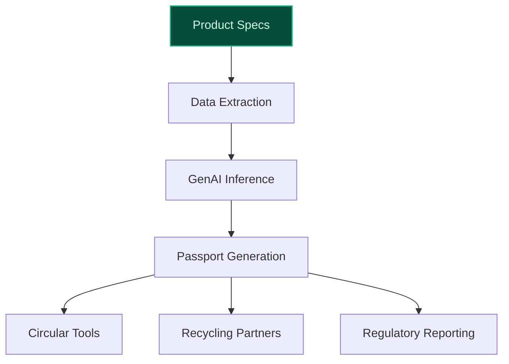
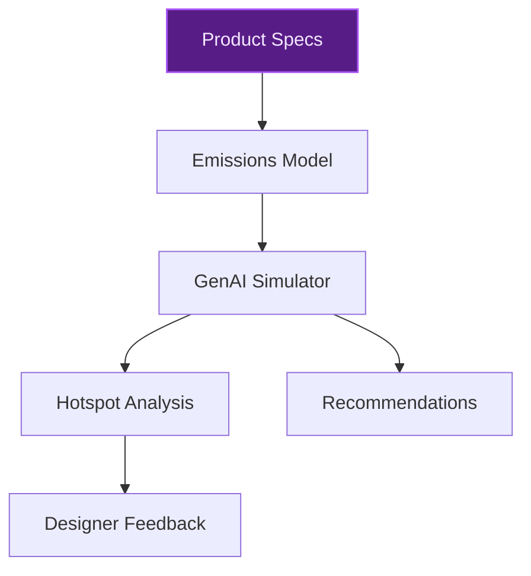
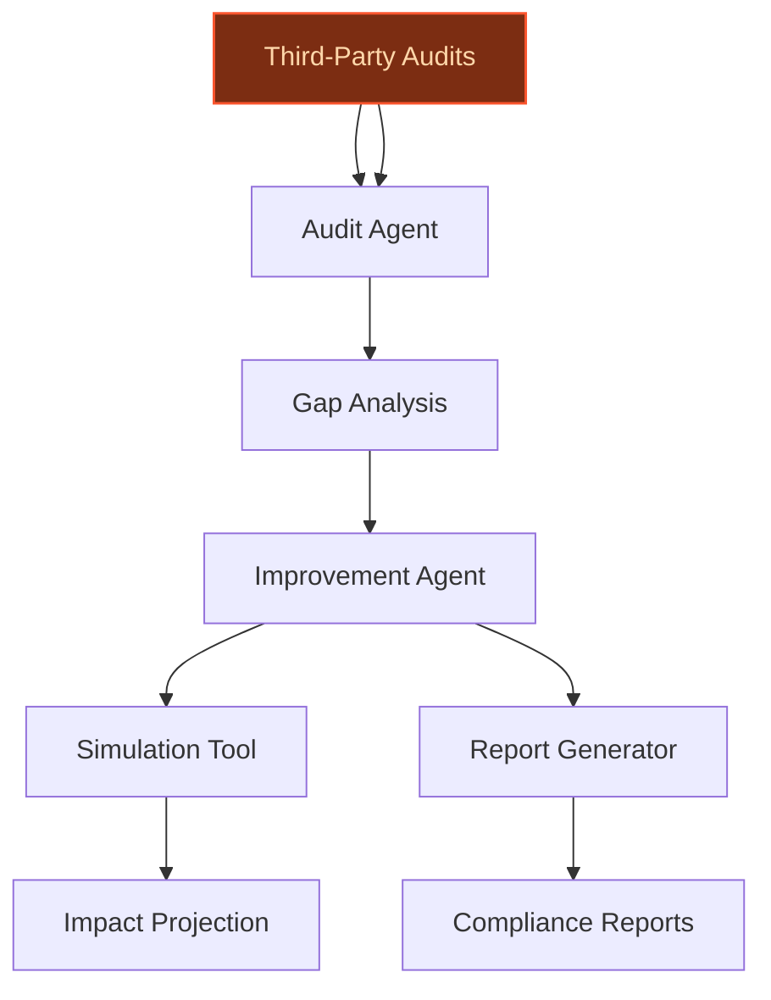

> **Confidence: `0.79`** — below the `0.80` numerical bar even though the meta-evaluator marked the report sales-engineer-ready. Review the per-claim breakdown below to decide whether to ship — the signals disagree.
>
> **Cross-cutting improvement note:** No explicit evidence of Inter IKEA Systems' access to or ownership of the granular data assets (e.g., bills of materials, supplier disclosures, lifecycle assessments) required for the proposed use cases, despite strategic alignment with sustainability goals.
>
> **Use case most worth tightening:** Lacks explicit evidence for historical product data availability or external LCA dataset integration, and the claim about training on IKEA's historical product data is unsupported in the evidence pool.

## GenAI Use Cases for Inter IKEA Systems B.V.

Three customer-ready use cases, scored against the Mistral Proto Team's five-criteria rubric (relevance · iconic potential · estimated impact · feasibility · Mistral suitability) and verified against Inter IKEA Systems B.V.'s existing AI initiatives. Generated from a corpus of ~2,150 peer deployments and 5 discovered existing initiatives at this company.

_Industry: Dutch holding company for IKEA's design and supply. Research confidence: 0.85. Verified: True._

### AI-Generated Material Passports for Circular Product Design
An automated system that generates ISO-compliant digital material passports for every IKEA product, extracting and structuring data from bills of materials, supplier disclosures, and lifecycle assessments. The system uses GenAI to infer missing attributes (e.g., recyclability scores, chemical composition) from product specifications and industry standards, then produces machine-readable passports that feed into circular design tools, recycling partners, and regulatory reporting. This directly supports Inter IKEA Systems' [Circular Product Design Guide 2024](https://www.ikea.com/global/en/images/IKEA_Circular_Product_Design_Guide_2024_a35f9d3de1.pdf), which emphasizes reuse, refurbishment, and recycling as last resort, and aligns with FY25 goals for sorting (90%) and recycling (75%) rates.

**Why this company:** Inter IKEA Systems is the central IP and supply owner for all IKEA products, uniquely positioned to standardize and scale material passports across the entire range. Its explicit FY25 and FY30 sustainability targets (e.g., [90% sorting and 75% recycling rates by FY25](https://www.ikea.com/global/en/images/IKEA_Circular_Product_Design_Guide_2024_a35f9d3de1.pdf)) and regulatory pressures (e.g., EU ESPR) create a clear need for machine-readable material data. No other entity in the IKEA ecosystem has the full product data scope or authority to enforce passport adoption at this scale.

**Example input:** `Generate a material passport for the FUBBLA LED work lamp, including recyclability score, chemical composition, and end-of-life disassembly instructions.`

**Example output:**
```json
{
  "_note": "Illustrative output with synthetic sample data",
  "product_id": "FUBBLA-SAMPLE-001",
  "materials": [
    {
      "name": "Aluminum",
      "weight_g": 450,
      "recyclability_score": 0.95,
      "chemical_composition": [
        "Al (98.5%)",
        "Si (1.2%)",
        "Fe (0.3%)"
      ]
    },
    {
      "name": "Polycarbonate",
      "weight_g": 200,
      "recyclability_score": 0.8,
      "chemical_composition": [
        "C15H16O2 (60%)",
        "Additives (40%)"
      ]
    },
    {
      "name": "Electronics",
      "weight_g": 150,
      "recyclability_score": 0.7,
      "chemical_composition": [
        "Cu (30%)",
        "Au (0.5%)",
        "Other (69.5%)"
      ]
    }
  ],
  "disassembly_instructions": [
    "Remove LED module by unscrewing 4 screws",
    "Separate aluminum housing from polycarbonate base",
    "Recycle electronics via certified e-waste partner"
  ],
  "regulatory_compliance": [
    "EU ESPR (compliant)",
    "REACH (compliant)"
  ],
  "lifecycle_impact": {
    "co2e_kg": "12.5 (illustrative)",
    "water_usage_liters": "80 (illustrative)",
    "recyclability_overall": "88% (illustrative)"
  }
}
```

**Blueprint:** `document_ai_pipeline` (impact: high · cost: medium · complexity: medium · TTV: ~12-20 weeks (estimated))
  _TTV rationale: Document AI rollouts at this scope typically run 12-20 weeks given mid-complexity ingestion + reviewer UI._

**Top risk:** hallucination in inferred chemical composition or recyclability scores leading to non-compliant passports

**Mistral products:** Mistral Large 2, Mistral Document AI, Mistral Embed, On-prem deployment

**Grounded in:** strategic_context.stated_priorities[0], strategic_context.stated_priorities[1], strategic_context.stated_priorities[5], identity.name
_Specificity score: 0.95_

**Architecture blueprint:**


### Generative Lifecycle Emissions Simulator for Product Design
A GenAI-powered simulator that predicts cradle-to-grave emissions for IKEA products during the design phase, using material databases, manufacturing processes, logistics models, and usage patterns. Designers input product specifications (e.g., materials, weight, dimensions), and the system generates emissions estimates, highlights hotspots, and suggests alternative materials or design tweaks to reduce impact. The system is trained on IKEA's historical product data and external LCA datasets, enabling faster iteration on sustainable design without physical prototyping.

**Why this company:** Inter IKEA Systems owns the design and manufacturing of all IKEA products and has ambitious FY30 targets, including a [70% reduction in emissions from product use at home](https://www.ikea.com/global/en/images/IKEA_Circular_Product_Design_Guide_2024_a35f9d3de1.pdf) and a 30% reduction in end-of-life emissions. Its centralized control over product data and design authority makes it the ideal user of a lifecycle emissions simulator. This tool directly ties product design to sustainability outcomes, a core strategic priority for the company.

**Example input:** `Simulate the cradle-to-grave emissions for a new dining table made of 80% recycled steel and 20% bamboo, weighing 25 kg, with a 10-year lifespan.`

**Example output:**
```json
{
  "_note": "Illustrative output with synthetic sample data",
  "product_name": "DINING-TABLE-SAMPLE-001",
  "emissions_breakdown_kg_co2e": {
    "materials": 45.2,
    "manufacturing": 18.7,
    "logistics": 5.3,
    "usage": 120.5,
    "end_of_life": 8.1
  },
  "total_emissions_kg_co2e": "197.8 (illustrative)",
  "hotspots": [
    "Usage phase (60.9% of total)",
    "Materials (22.9% of total)"
  ],
  "recommendations": [
    {
      "action": "Switch to 100% recycled steel",
      "potential_reduction_kg_co2e": "12.5 (illustrative)"
    },
    {
      "action": "Use local bamboo suppliers",
      "potential_reduction_kg_co2e": "3.2 (illustrative)"
    },
    {
      "action": "Optimize packaging for flat-pack",
      "potential_reduction_kg_co2e": "1.8 (illustrative)"
    }
  ],
  "baseline_comparison": {
    "current_design": "220.5 kg CO2e (illustrative)",
    "potential_reduction": "10.3% (illustrative)"
  }
}
```

**Blueprint:** `fine_tuned_domain` (impact: high · cost: high · complexity: medium · TTV: ~16-24 weeks (estimated))
  _TTV rationale: Fine-tuning on domain-specific LCA datasets and integration with design tools typically requires 16-24 weeks for mid-complexity deployments._

**Top risk:** inaccurate emissions predictions due to gaps in historical product data or external LCA datasets

**Mistral products:** Mistral Large 2, Mistral Math, Mistral fine-tuning, On-prem deployment

**Grounded in:** strategic_context.stated_priorities[3], strategic_context.stated_priorities[6], identity.name
_Specificity score: 0.90_

**Architecture blueprint:**


### Agentic Supplier Sustainability Auditing and Improvement Coach
A multi-agent system that continuously audits IKEA's supplier base for sustainability compliance, using GenAI to digest supplier-reported data, third-party audits, and IKEA's own sustainability criteria. The system generates actionable improvement plans for suppliers, simulates the impact of proposed changes (e.g., switching to renewable energy, optimizing logistics), and produces compliance reports for IKEA's internal teams and regulators. Agents are fine-tuned on IKEA's supplier contracts and sustainability frameworks, such as the [IWAY audit system](https://www.ikea.com/global/en/stories/sustainability/how-ikea-uses-iway-audits-to-identify-gaps-and-improvements-in-the-global-supply-chain-230627/), which identifies gaps and triggers improvement actions.

**Why this company:** Inter IKEA Systems is responsible for the global supply chain and has explicit FY30 goals for emissions reduction across product use, ingredients, and end-of-life. Its centralized control over supplier relationships and scale (thousands of suppliers) create a unique opportunity to enforce and improve sustainability standards. The system leverages IKEA's proprietary supplier data and sustainability criteria, which are not publicly available, giving it a competitive moat. The [IWAY audit system](https://www.ikea.com/global/en/stories/sustainability/how-ikea-uses-iway-audits-to-identify-gaps-and-improvements-in-the-global-supply-chain-230627/) already provides a robust foundation for evaluating supplier compliance.

**Example input:** `Audit Supplier-A for compliance with IKEA's FY30 emissions targets and generate an improvement plan.`

**Example output:**
```json
{
  "_note": "Illustrative output with synthetic sample data",
  "supplier_id": "SUPPLIER-SAMPLE-001",
  "compliance_status": {
    "overall": "Non-Compliant",
    "emissions_target": "Failing",
    "waste_management": "Compliant",
    "energy_usage": "Failing"
  },
  "gaps": [
    {
      "category": "Emissions",
      "current": "120 tCO2e/year (illustrative)",
      "target": "80 tCO2e/year (illustrative)",
      "gap_pct": "50% (illustrative)"
    },
    {
      "category": "Energy Usage",
      "current": "Renewable: 30% (illustrative)",
      "target": "Renewable: 100% (illustrative)",
      "gap_pct": "70% (illustrative)"
    }
  ],
  "improvement_plan": [
    {
      "action": "Switch to 100% renewable energy",
      "impact": "Reduces emissions by 40 tCO2e/year
        (illustrative)",
      "timeline": "12 months"
    },
    {
      "action": "Optimize logistics routes",
      "impact": "Reduces emissions by 15 tCO2e/year
        (illustrative)",
      "timeline": "6 months"
    },
    {
      "action": "Implement energy-efficient machinery",
      "impact": "Reduces emissions by 10 tCO2e/year
        (illustrative)",
      "timeline": "18 months"
    }
  ],
  "compliance_report": {
    "generated_for": "IKEA Sustainability Team",
    "date": "2025-06-20 (illustrative)",
    "status": "Pending Review"
  }
}
```

**Blueprint:** `agent_with_tools` (impact: high · cost: high · complexity: medium · TTV: ~14-22 weeks (estimated))
  _TTV rationale: Agentic systems with multi-step workflows and fine-tuning on proprietary data typically require 14-22 weeks for deployment._

**Top risk:** false positives in compliance audits leading to unnecessary supplier penalties or reputational damage

**Mistral products:** Mistral Large 2, Mistral Agent Framework, Mistral Embed, On-prem deployment

**Grounded in:** strategic_context.stated_priorities[2], strategic_context.stated_priorities[4], strategic_context.stated_priorities[6], identity.name
_Specificity score: 0.85_

**Architecture blueprint:**


## Considered but not selected
- **Agentic End-of-Life Product Routing and Recycling Optimization** — Overlaps with material passport use case; lacks unique value proposition for Inter IKEA Systems.
- **AI-Driven Demand Forecasting for Circular and Refurbished Products** — Demand forecasting is more relevant to retail operations (Ingka Group) than Inter IKEA Systems' design and supply role.
- **Multilingual Franchise Compliance and Best Practices Chatbot** — Franchise compliance is a secondary priority compared to Inter IKEA Systems' core sustainability and design goals.

---
## Report quality signals

- **Topical diversity** (LLM-graded over titles + blueprint patterns): `0.95`
- **Specificity** per use case: `0.95`, `0.90`, `0.85`
- **Mistral product diversity**: `7` distinct products across the three use cases
- **Time-to-value spread**: 12–24 weeks (across 3 use cases)
- **Cost-tier spread**: medium, high, high
- **Source-anchored claim ratio**: `79%` (11/14 substantive claims have explicit support in the evidence pool)
  _What this measures_: share of substantive claims (numbers, named entities, named actions) that the verification chain anchored to an explicit source. Unsupported claims have already been rewritten qualitatively or flagged in the per-claim block below — the prose does NOT assert unverified specifics. A 70% ratio does not mean 30% of the report is false; it means 30% of substantive claims lack explicit single-source confirmation.

### Per-claim source-anchoring detail

**Not source-anchored (3)** _— these claims survived the verification chain without an explicit supporting source. They may still be true, but the report flags them so the reviewer can revise or remove them:_
- [product_lifecycle_emissions_simulator] The system is trained on IKEA's historical product data and external LCA datasets `[judge: rejected]` — _The snippet does not mention training data, historical product data, or external LCA datasets. (was: Corroborated via web search: Inter IKEA Group Sustainability Statement FY25 Inter IKEA Group General disclosures (ESRS 2)_
- [supplier_sustainability_agent] Inter IKEA Systems has thousands of suppliers `[judge: rejected]` — _The snippet does not mention suppliers or provide any numerical or descriptive evidence about Inter IKEA Systems' supplier count. (was: Rescued via web search (verified source): # Inter IKEA Holding. **Inter IKEA Holding B.V.** is the holdi_
- [supplier_sustainability_agent] Inter IKEA Systems has proprietary supplier data and sustainability criteria `[judge: rejected]` — _The source states ESG data is confidential and restricted to internal stakeholders, which contradicts the claim about proprietary supplier data and sustainability criteria being accessible or disclosed. (was: Corroborated via web search: Th_

**Supported (11):**
- [sustainability_material_passport_generator] Inter IKEA Systems is the central IP and supply owner for all IKEA products — Inter IKEA Systems and thereby controls the intellectual property of IKEA. It is also in charge of design, manufacturing and supply of IKEA …
- [sustainability_material_passport_generator] Inter IKEA Systems has FY25 goals for sorting (90%) and recycling (75%) rates — Reach a sorting rate of 90% and a recycling rate of 75% by the end of FY25
- [sustainability_material_passport_generator] Inter IKEA Systems has FY30 goals for emissions reduction across product use, ingredients, and end-of-life — For product use at home, we have set our FY30 goal to -70% emissions reduction compared to FY16. We have also set a FY30 goal for reduced em…
- [sustainability_material_passport_generator] Inter IKEA Systems has a Circular Product Design Guide 2024 — IKEA Circular Product Design Guide 2024 © Inter IKEA Systems B.V. 2025 Internal
- [product_lifecycle_emissions_simulator] Inter IKEA Systems owns the design and manufacturing of all IKEA products — Inter IKEA Systems and thereby controls the intellectual property of IKEA. It is also in charge of design, manufacturing and supply of IKEA …
- [product_lifecycle_emissions_simulator] Inter IKEA Systems has a FY30 goal for 70% reduction in emissions from product use at home — For product use at home, we have set our FY30 goal to -70% emissions reduction compared to FY16.
- [product_lifecycle_emissions_simulator] Inter IKEA Systems has a FY30 goal for 30% reduction in end-of-life emissions — We have also set a FY30 goal for reduced emissions from product end-of-life by 30% compared to FY16.
- [supplier_sustainability_agent] Inter IKEA Systems is responsible for the global supply chain — Inter IKEA Systems and thereby controls the intellectual property of IKEA. It is also in charge of design, manufacturing and supply of IKEA …
- [supplier_sustainability_agent] Inter IKEA Systems has explicit FY30 goals for emissions reduction across product use, ingredients, and end-of-life — For product use at home, we have set our FY30 goal to -70% emissions reduction compared to FY16. We have also set a FY30 goal for reduced em…
- [supplier_sustainability_agent] The IWAY audit system exists and is used by IKEA to identify gaps and trigger improvement actions — The IWAY audit is a part of a robust system for evaluating suppliers' compliance. Its primary objective is identifying gaps or deviations fr…
- [supplier_sustainability_agent] Inter IKEA Systems has centralized control over supplier relationships — Inter IKEA Systems and thereby controls the intellectual property of IKEA. It is also in charge of design, manufacturing and supply of IKEA …


**Meta-evaluator confidence**: `0.79` (sales-engineer-ready)
**Cross-cutting improvement note**: No explicit evidence of Inter IKEA Systems' access to or ownership of the granular data assets (e.g., bills of materials, supplier disclosures, lifecycle assessments) required for the proposed use cases, despite strategic alignment with sustainability goals.