# Trace

## Execution trace — IKEA

Started: `2026-05-11T03:28:41.236561+00:00`. Total wall time: `125.7s` across `37` recorded actions.

### Per-step time totals

| Step | Calls | Total time | Avg time |
|---|---:|---:|---:|
| `resolve_entity` | 1 | 0.53s | 527ms |
| `research` | 1 | 6.48s | 6475ms |
| `gap_fill` | 4 | 3.17s | 791ms |
| `retrieve` | 2 | 0.22s | 108ms |
| `generate` | 1 | 24.88s | 24883ms |
| `score` | 2 | 29.04s | 14521ms |
| `verify` | 6 | 16.16s | 2694ms |
| `enrich` | 1 | 16.47s | 16466ms |
| `meta_eval` | 1 | 9.34s | 9336ms |
| `web_verify` | 1 | 1.93s | 1931ms |
| `source_judge` | 15 | 101.42s | 6761ms |
| `quality_signals` | 2 | 3.97s | 1985ms |

### Chronological event log

- `03:28:41.236` **[resolve_entity]** `mistral-small-2603.chat.complete` — 527ms
   - inputs: user_input='IKEA'
   - outputs: resolved=True → 'Inter IKEA Systems B.V.'
- `03:28:54.920` **[research]** `mistral-medium-2604.chat.complete` — 6475ms
   - inputs: synthesize CompanyContext for Inter IKEA Systems B.V. | depth=medium
   - outputs: industry="Dutch holding company for IKEA's design and supply" verified=True conf=0.75
- `03:29:01.396` **[gap_fill]** `mistral-small-2603.chat.complete` — 851ms
   - inputs: generate gap queries | fields=['business_model', 'products', 'data_assets', 'priorities']
   - outputs: queries=4
- `03:29:08.667` **[gap_fill]** `mistral-small-2603.chat.complete` — 1192ms
   - inputs: layer-2 extract field=priorities
   - outputs: items=7
- `03:29:08.673` **[gap_fill]** `mistral-small-2603.chat.complete` — 509ms
   - inputs: layer-2 extract field=data_assets
   - outputs: items=0
- `03:29:08.678` **[gap_fill]** `mistral-small-2603.chat.complete` — 612ms
   - inputs: layer-2 extract field=products
   - outputs: items=5
- `03:29:09.860` **[retrieve]** `mistral-embed.embeddings.create` — 211ms
   - inputs: company_query | industries="Dutch holding company for IKEA's design and supply"
   - outputs: embedded 1024-dim query vector
- `03:29:10.071` **[retrieve]** `precedent_corpus.cosine_topk` — 5ms
   - inputs: k=8 min_depth=0.4 target='Inter IKEA Systems B.V.'
   - outputs: retrieved 8 | mmr=True | top_sim=0.756
- `03:29:11.861` **[generate]** `mistral-medium-2604.chat.complete` — 24883ms
   - inputs: iteration=0 tool_calls_used=0/0 tools=off
   - outputs: tool_calls=0 | content_chars=17404
- `03:29:37.095` **[score]** `mistral-small-2603.chat.complete` — 16349ms
   - inputs: self-consistency pass T=0.2
   - outputs: scored 8 candidates
- `03:29:37.100` **[score]** `mistral-small-2603.chat.complete` — 12694ms
   - inputs: self-consistency pass T=0.4
   - outputs: scored 8 candidates
- `03:29:53.483` **[verify]** `tavily.search` — 2075ms
   - inputs: candidate=sustainability_material_passport_generator | query='Inter IKEA Systems B.V. AI-Generated Material Passports for '
   - outputs: 4 results
- `03:29:53.483` **[verify]** `tavily.search` — 1747ms
   - inputs: candidate=product_lifecycle_emissions_simulator | query='Inter IKEA Systems B.V. Generative Lifecycle Emissions Simul'
   - outputs: 4 results
- `03:29:53.484` **[verify]** `tavily.search` — 1954ms
   - inputs: candidate=supplier_sustainability_agent | query='Inter IKEA Systems B.V. Agentic Supplier Sustainability Audi'
   - outputs: 4 results
- `03:29:55.649` **[verify]** `mistral-small-2603.chat.complete` — 1647ms
   - inputs: verdict for product_lifecycle_emissions_simulator
   - outputs: verdict='pass'
- `03:29:55.964` **[verify]** `mistral-small-2603.chat.complete` — 4399ms
   - inputs: verdict for sustainability_material_passport_generator
   - outputs: verdict='pass'
- `03:29:56.875` **[verify]** `mistral-small-2603.chat.complete` — 4338ms
   - inputs: verdict for supplier_sustainability_agent
   - outputs: verdict='pass'
- `03:30:01.216` **[enrich]** `mistral-medium-2604.chat.complete` — 16466ms
   - inputs: tier=fast parallel=False ids=['sustainability_material_passport_generator', 'product_lifecycle_emissions_simulator', 'supplier_sustainability_agent']
   - outputs: enriched 3 use cases
- `03:30:17.712` **[meta_eval]** `mistral-medium-2604.chat.complete` — 9336ms
   - inputs: reviewing 3 use cases
   - outputs: review + claims
- `03:30:27.063` **[web_verify]** `tavily.search.rescue_unsupported_claims` — 1931ms
   - inputs: company='Inter IKEA Systems B.V.' unsupported=3 budget=12
   - outputs: rescued: verified=1 corroborated=2 of 3 attempted
- `03:30:28.997` **[source_judge]** `mistral-small-2603.judge_claim_sources` — 11673ms
   - inputs: pairs=14
   - outputs: judged 14 pairs
- `03:30:28.997` **[source_judge]** `mistral-small-2603.chat.complete` — 10167ms
   - inputs: claim='Inter IKEA Systems is the central IP and supply owner for al'
   - outputs: verdict=supported
- `03:30:29.003` **[source_judge]** `mistral-small-2603.chat.complete` — 10110ms
   - inputs: claim='Inter IKEA Systems has FY25 goals for sorting (90%) and recy'
   - outputs: verdict=supported
- `03:30:29.008` **[source_judge]** `mistral-small-2603.chat.complete` — 9605ms
   - inputs: claim='Inter IKEA Systems has FY30 goals for emissions reduction ac'
   - outputs: verdict=supported
- `03:30:29.012` **[source_judge]** `mistral-small-2603.chat.complete` — 10662ms
   - inputs: claim='Inter IKEA Systems has a Circular Product Design Guide 2024'
   - outputs: verdict=supported
- `03:30:29.018` **[source_judge]** `mistral-small-2603.chat.complete` — 10567ms
   - inputs: claim='Inter IKEA Systems owns the design and manufacturing of all '
   - outputs: verdict=supported
- `03:30:29.022` **[source_judge]** `mistral-small-2603.chat.complete` — 10380ms
   - inputs: claim='Inter IKEA Systems has a FY30 goal for 70% reduction in emis'
   - outputs: verdict=supported
- `03:30:29.025` **[source_judge]** `mistral-small-2603.chat.complete` — 10192ms
   - inputs: claim='Inter IKEA Systems has a FY30 goal for 30% reduction in end-'
   - outputs: verdict=supported
- `03:30:29.028` **[source_judge]** `mistral-small-2603.chat.complete` — 10148ms
   - inputs: claim="The system is trained on IKEA's historical product data and "
   - outputs: verdict=unsupported
- `03:30:38.613` **[source_judge]** `mistral-small-2603.chat.complete` — 1613ms
   - inputs: claim='Inter IKEA Systems is responsible for the global supply chai'
   - outputs: verdict=supported
- `03:30:39.114` **[source_judge]** `mistral-small-2603.chat.complete` — 1550ms
   - inputs: claim='Inter IKEA Systems has explicit FY30 goals for emissions red'
   - outputs: verdict=supported
- `03:30:39.165` **[source_judge]** `mistral-small-2603.chat.complete` — 1035ms
   - inputs: claim='Inter IKEA Systems has thousands of suppliers'
   - outputs: verdict=unsupported
- `03:30:39.176` **[source_judge]** `mistral-small-2603.chat.complete` — 1488ms
   - inputs: claim='Inter IKEA Systems has proprietary supplier data and sustain'
   - outputs: verdict=unsupported
- `03:30:39.218` **[source_judge]** `mistral-small-2603.chat.complete` — 958ms
   - inputs: claim='The IWAY audit system exists and is used by IKEA to identify'
   - outputs: verdict=supported
- `03:30:39.402` **[source_judge]** `mistral-small-2603.chat.complete` — 1269ms
   - inputs: claim='Inter IKEA Systems has centralized control over supplier rel'
   - outputs: verdict=supported
- `03:30:42.950` **[quality_signals]** `mistral-small-2603.chat.complete` — 2548ms
   - inputs: specificity grade (3 use cases)
   - outputs: scored 3 use cases
- `03:30:45.499` **[quality_signals]** `mistral-small-2603.chat.complete` — 1421ms
   - inputs: diversity grade
   - outputs: diversity=0.95

## Mermaid sequence

```mermaid
sequenceDiagram
    autonumber
    participant pipeline as pipeline
    participant mistral_small_2603 as mistral-small-2603
    participant mistral_medium_2604 as mistral-medium-2604
    participant mistral_embed as mistral-embed
    participant precedent_corpus as precedent_corpus
    participant tavily as tavily
    participant tavily_search as tavily.search
    pipeline->>mistral_small_2603: resolve_entity: chat.complete (527ms)
    mistral_small_2603-->>pipeline: resolved=True → 'Inter IKEA Systems B.V.'
    pipeline->>mistral_medium_2604: research: chat.complete (6475ms)
    mistral_medium_2604-->>pipeline: industry='Dutch holding company for IKEA's design and supply
    pipeline->>mistral_small_2603: gap_fill: chat.complete (851ms)
    mistral_small_2603-->>pipeline: queries=4
    pipeline->>mistral_small_2603: gap_fill: chat.complete (1192ms)
    mistral_small_2603-->>pipeline: items=7
    pipeline->>mistral_small_2603: gap_fill: chat.complete (509ms)
    mistral_small_2603-->>pipeline: items=0
    pipeline->>mistral_small_2603: gap_fill: chat.complete (612ms)
    mistral_small_2603-->>pipeline: items=5
    pipeline->>mistral_embed: retrieve: embeddings.create (211ms)
    mistral_embed-->>pipeline: embedded 1024-dim query vector
    pipeline->>precedent_corpus: retrieve: cosine_topk (5ms)
    precedent_corpus-->>pipeline: retrieved 8 | mmr=True | top_sim=0.756
    pipeline->>mistral_medium_2604: generate: chat.complete (24883ms)
    mistral_medium_2604-->>pipeline: tool_calls=0 | content_chars=17404
    pipeline->>mistral_small_2603: score: chat.complete (16349ms)
    mistral_small_2603-->>pipeline: scored 8 candidates
    pipeline->>mistral_small_2603: score: chat.complete (12694ms)
    mistral_small_2603-->>pipeline: scored 8 candidates
    pipeline->>tavily: verify: search (2075ms)
    tavily-->>pipeline: 4 results
    pipeline->>tavily: verify: search (1747ms)
    tavily-->>pipeline: 4 results
    pipeline->>tavily: verify: search (1954ms)
    tavily-->>pipeline: 4 results
    pipeline->>mistral_small_2603: verify: chat.complete (1647ms)
    mistral_small_2603-->>pipeline: verdict='pass'
    pipeline->>mistral_small_2603: verify: chat.complete (4399ms)
    mistral_small_2603-->>pipeline: verdict='pass'
    pipeline->>mistral_small_2603: verify: chat.complete (4338ms)
    mistral_small_2603-->>pipeline: verdict='pass'
    pipeline->>mistral_medium_2604: enrich: chat.complete (16466ms)
    mistral_medium_2604-->>pipeline: enriched 3 use cases
    pipeline->>mistral_medium_2604: meta_eval: chat.complete (9336ms)
    mistral_medium_2604-->>pipeline: review + claims
    pipeline->>tavily_search: web_verify: rescue_unsupported_claims (1931ms)
    tavily_search-->>pipeline: rescued: verified=1 corroborated=2 of 3 attempted
    pipeline->>mistral_small_2603: source_judge: judge_claim_sources (11673ms)
    mistral_small_2603-->>pipeline: judged 14 pairs
    pipeline->>mistral_small_2603: source_judge: chat.complete (10167ms)
    mistral_small_2603-->>pipeline: verdict=supported
    pipeline->>mistral_small_2603: source_judge: chat.complete (10110ms)
    mistral_small_2603-->>pipeline: verdict=supported
    pipeline->>mistral_small_2603: source_judge: chat.complete (9605ms)
    mistral_small_2603-->>pipeline: verdict=supported
    pipeline->>mistral_small_2603: source_judge: chat.complete (10662ms)
    mistral_small_2603-->>pipeline: verdict=supported
    pipeline->>mistral_small_2603: source_judge: chat.complete (10567ms)
    mistral_small_2603-->>pipeline: verdict=supported
    pipeline->>mistral_small_2603: source_judge: chat.complete (10380ms)
    mistral_small_2603-->>pipeline: verdict=supported
    pipeline->>mistral_small_2603: source_judge: chat.complete (10192ms)
    mistral_small_2603-->>pipeline: verdict=supported
    pipeline->>mistral_small_2603: source_judge: chat.complete (10148ms)
    mistral_small_2603-->>pipeline: verdict=unsupported
    pipeline->>mistral_small_2603: source_judge: chat.complete (1613ms)
    mistral_small_2603-->>pipeline: verdict=supported
    pipeline->>mistral_small_2603: source_judge: chat.complete (1550ms)
    mistral_small_2603-->>pipeline: verdict=supported
    pipeline->>mistral_small_2603: source_judge: chat.complete (1035ms)
    mistral_small_2603-->>pipeline: verdict=unsupported
    pipeline->>mistral_small_2603: source_judge: chat.complete (1488ms)
    mistral_small_2603-->>pipeline: verdict=unsupported
    pipeline->>mistral_small_2603: source_judge: chat.complete (958ms)
    mistral_small_2603-->>pipeline: verdict=supported
    pipeline->>mistral_small_2603: source_judge: chat.complete (1269ms)
    mistral_small_2603-->>pipeline: verdict=supported
    pipeline->>mistral_small_2603: quality_signals: chat.complete (2548ms)
    mistral_small_2603-->>pipeline: scored 3 use cases
    pipeline->>mistral_small_2603: quality_signals: chat.complete (1421ms)
    mistral_small_2603-->>pipeline: diversity=0.95
```

