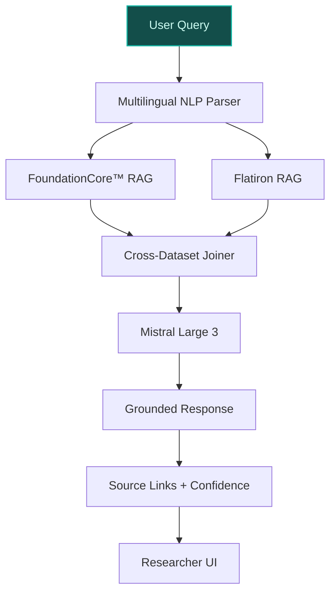
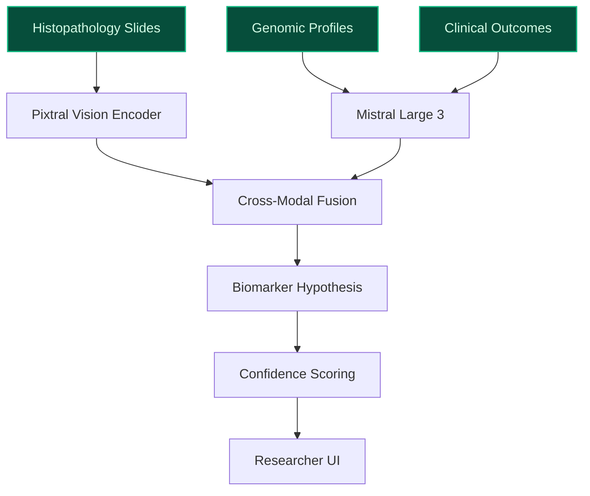
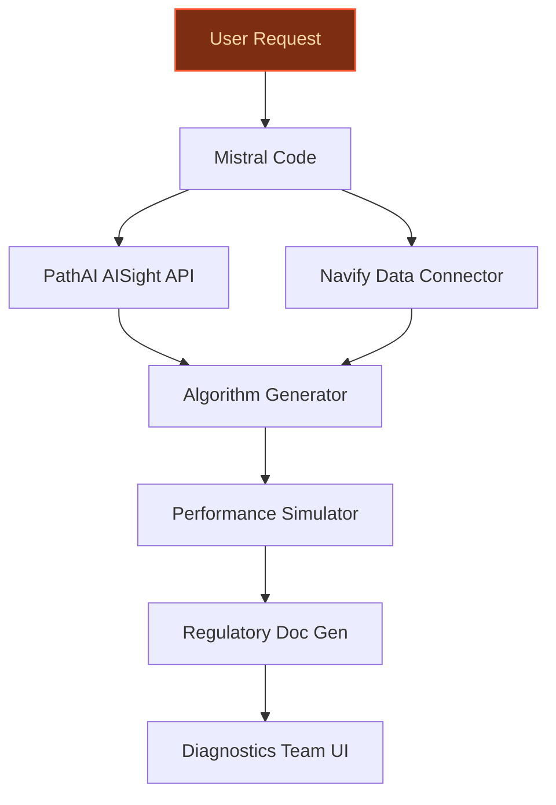

## GenAI Use Cases for F. Hoffmann-La Roche Ltd

Three customer-ready use cases, scored against the Mistral Proto Team's five-criteria rubric (relevance · iconic potential · estimated impact · feasibility · Mistral suitability) and verified against F. Hoffmann-La Roche Ltd's existing AI initiatives. Generated from a corpus of ~2,150 peer deployments and 4 discovered existing initiatives at this company.

_Industry: global pharmaceuticals and diagnostics multinational. Research confidence: 0.85. Verified: True._

### Genomic Insight Copilot for Oncology Researchers
A domain-specific LLM assistant fine-tuned on Roche’s FoundationCore™ dataset ([Academic Research | Foundation Medicine](https://www.foundationmedicine.com/medical-services/academic-research)) (400,000+ genomic profiles) and Flatiron Health’s real-world clinical outcomes data ([Flatiron Health announces 18 research acceptances featuring real-world data](https://resources.flatiron.com/press/flatiron-health-announces-18-research-acceptances-featuring-flatirons-real-world-data-to-be-presented-at-ispor-2026)). The copilot enables oncology researchers to query genomic alterations, biomarker-treatment associations, and real-world patient outcomes in natural language, with responses grounded in Roche’s proprietary data and linked to primary sources. It supports multilingual queries (English, German, French) and integrates with Roche’s internal knowledge base for validation, materially reducing the time required for biomarker discovery and patient stratification for clinical trials.

**Why this company:** Roche’s $50B R&D commitment by 2029 (Full-year 2025 presentation) and pipeline rejuvenation goals demand faster insights from its unique datasets. FoundationCore™ and Flatiron Health’s data are proprietary, at scale, and not replicated by peers. The system directly addresses Roche’s strategic priority for accelerated personalized healthcare, with multilingual support critical for operations in Switzerland and the EU. On-prem deployment aligns with Roche’s data sovereignty requirements in these regions.

**Example input:** `Show me all non-small cell lung cancer (NSCLC) cases in FoundationCore™ with EGFR exon 20 insertions treated with amivantamab, including real-world progression-free survival (PFS) and overall response rate (ORR). Filter for patients with co-occurring TP53 mutations and include links to primary clinical records.`

**Example output:**
```json
{
  "_note": "Illustrative output with synthetic sample data",
  "query_summary": "Non-small cell lung cancer (NSCLC) with
    EGFR exon 20 insertions + TP53 mutations, treated with
    amivantamab (n=42, sample cohort).",
  "results": [
    {
      "patient_cohort_id": "COHORT-SAMPLE-001",
      "genomic_profile": {
        "EGFR_exon20_insertion": true,
        "TP53_mutation": "R273H (sample)",
        "other_alterations": [
          "KRAS G12D (sample)",
          "STK11 loss (sample)"
        ]
      },
      "treatment": {
        "regimen": "Amivantamab monotherapy",
        "line_of_therapy": "2L+ (sample)"
      },
      "real_world_outcomes": {
        "median_PFS": "6.2 months (illustrative)",
        "ORR": "38% (illustrative, n=16/42)",
        "median_OS": "14.5 months (illustrative)"
      },
      "source_links": [
        {
          "record_id": "RECORD-SAMPLE-001",
          "source": "Flatiron Health Clinico-Genomic
            Database (sample)",
          "url":
            "https://sample.flatiron.com/record/RECORD-SAMPL
            E-001"
        }
      ],
      "biomarker_hypothesis": "TP53 co-mutation may
        correlate with reduced PFS in EGFR exon 20+ NSCLC
        treated with amivantamab (illustrative)."
    }
  ],
  "confidence_score": "High (sample, based on cohort size
    and data quality)",
  "limitations": "Real-world data may include unmeasured
    confounders. Not a substitute for clinical trial
    evidence."
}
```

**Blueprint:** `hybrid_retrieval` (impact: high · cost: medium · complexity: low · TTV: 12-16 weeks (precedent-anchored))

**Top risk:** Hallucination in genomic-clinical linkage output, requiring strict grounding to primary records and confidence scoring.

**Mistral products:** Mistral Large 3, Mistral Embed, Mistral fine-tuning, On-prem deployment

**Inspired by precedents:** google_cloud_1302-6ccb233f25
**Grounded in:** data_and_tech.likely_data_assets[0], data_and_tech.likely_data_assets[1], data_and_tech.likely_data_assets[4], strategic_context.stated_priorities[0]
_Specificity score: 0.95_

**Architecture blueprint:**


### Cross-Modal Biomarker Discovery Engine
A vision-language model trained on Roche’s histopathology images (via [PathAI’s AISight IMS](https://www.roche.com/media/releases/med-cor-2026-05-07)), genomic profiles ([FoundationCore™](https://www.foundationmedicine.com/medical-services/academic-research)), and clinical outcomes ([Flatiron Health](https://resources.flatiron.com/press/flatiron-health-announces-18-research-acceptances-featuring-flatirons-real-world-data-to-be-presented-at-ispor-2026)). The system identifies correlations between visual tissue patterns, genomic alterations, and treatment responses, then generates hypotheses for novel diagnostic targets or patient stratification strategies. Outputs include prioritized biomarker panels with confidence scores and audit trails for regulatory validation, enabling meaningful gains in discovery efficiency.

**Why this company:** Roche’s acquisition of PathAI and its existing FoundationCore™ and Flatiron datasets create a cross-modal dataset unmatched in the pharmaceutical industry. The system directly supports Roche’s pipeline rejuvenation and personalized healthcare goals by accelerating biomarker discovery. The vision-language model is uniquely suited for these tasks in regulated environments, with on-prem deployment addressing data sovereignty requirements in Switzerland and the EU.

**Example input:** `Analyze all breast cancer cases in FoundationCore™ with ER+/HER2- status and PIK3CA mutations. Cross-reference with PathAI histopathology slides to identify visual patterns (e.g., tumor microenvironment features) that correlate with response to alpelisib. Propose a prioritized list of novel biomarker candidates for patient stratification.`

**Example output:**
```json
{
  "_note": "Illustrative output with synthetic sample data",
  "query_summary": "ER+/HER2- breast cancer with PIK3CA
    mutations (n=218, sample cohort). Cross-modal analysis
    of genomic data + histopathology slides.",
  "top_biomarker_candidates": [
    {
      "biomarker_id": "BM-SAMPLE-001",
      "name": "Tumor-Associated Macrophage (TAM) Density
        (sample)",
      "modality": "Histopathology (visual)",
      "genomic_correlation": "Co-occurs with PIK3CA H1047R
        in 68% of cases (illustrative)",
      "treatment_response_link": {
        "alpelisib_response_rate": {
          "high_TAM_density": "42% ORR (illustrative,
            n=24/57)",
          "low_TAM_density": "71% ORR (illustrative,
            n=30/42)"
        },
        "p_value": "0.003 (illustrative)"
      },
      "confidence_score": "Medium (sample, based on cohort
        size)",
      "supporting_evidence": [
        {
          "slide_id": "SLIDE-SAMPLE-001",
          "source": "PathAI AISight IMS (sample)",
          "url":
            "https://sample.pathai.com/slide/SLIDE-SAMPLE-00
            1"
        }
      ]
    }
  ],
  "limitations": "Hypothesis-generating only; requires
    validation in prospective studies. Visual patterns are
    illustrative and not clinically validated."
}
```

**Blueprint:** `document_ai_pipeline` (impact: high · cost: high · complexity: medium · TTV: 16-24 weeks (precedent-anchored))

**Top risk:** Data alignment across modalities (histopathology slides vs. genomic records), requiring rigorous quality control and normalization.

**Mistral products:** Mistral Large 3, Pixtral (vision-language understanding), Mistral fine-tuning, On-prem deployment

**Inspired by precedents:** google_cloud_1302-978f0a543d
**Grounded in:** data_and_tech.likely_data_assets[0], data_and_tech.likely_data_assets[3], data_and_tech.likely_data_assets[4]
_Specificity score: 0.90_

**Architecture blueprint:**


### AI-Powered Companion Diagnostic Algorithm Designer
A generative AI system that assists Roche’s diagnostics teams in designing, validating, and iterating on companion diagnostic (CDx) algorithms for oncology. The system uses [PathAI’s AISight IMS](https://www.roche.com/media/releases/med-cor-2026-05-07) and Roche’s [Navify digital pathology platform](https://navify.roche.com/events/healthtech) to generate candidate image-analysis pipelines, propose biomarker thresholds, and simulate performance on historical slide datasets. It outputs audit-ready documentation, regulatory evidence links, and performance metrics, materially compressing the CDx development cycle.

**Why this company:** Roche’s acquisition of PathAI and its leadership in oncology diagnostics create a unique opportunity to accelerate CDx development. The system directly supports Roche’s strategic goal of improving precision diagnosis and tailored treatment regimens. On-prem deployment and compliance strengths align with Roche’s regulatory context in Switzerland and the EU, while the system’s capabilities enable audit-ready outputs for regulatory submissions.

**Example input:** `Design a companion diagnostic algorithm for identifying HER2-low breast cancer patients likely to respond to trastuzumab deruxtecan. Use PathAI’s AISight IMS to analyze HER2 IHC 1+ and 2+ slides, propose a scoring threshold, and simulate performance on a historical dataset of 500 slides with known clinical outcomes. Output the algorithm, validation metrics, and regulatory documentation.`

**Example output:**
```json
{
  "_note": "Illustrative output with synthetic sample data",
  "algorithm_id": "CDX-SAMPLE-001",
  "biomarker": "HER2-low (IHC 1+ or 2+ with ISH-negative)",
  "algorithm_summary": {
    "modality": "Digital pathology (H&E + IHC slides)",
    "threshold": "HER2 membrane staining in ≥10% of tumor
      cells (sample)",
    "performance_metrics": {
      "sensitivity": "89% (illustrative)",
      "specificity": "76% (illustrative)",
      "AUC": "0.87 (illustrative)"
    },
    "validation_cohort": {
      "n": 500,
      "source": "PathAI AISight IMS (sample)",
      "url":
        "https://sample.pathai.com/cohort/COHORT-SAMPLE-002"
    }
  },
  "regulatory_documentation": {
    "algorithm_description": "Automated HER2-low scoring
      pipeline using convolutional neural networks
      (sample).",
    "validation_report": {
      "file_id": "DOC-SAMPLE-001",
      "url": "https://sample.roche.com/docs/DOC-SAMPLE-001"
    },
    "limitations": "Performance metrics are illustrative
      and not clinically validated. Algorithm requires
      prospective validation."
  },
  "next_steps": [
    "Prospective validation in clinical trial setting",
    "Regulatory submission to FDA/EMA"
  ]
}
```

**Blueprint:** `agent_with_tools` (impact: high · cost: high · complexity: low · TTV: ~20-28 weeks (estimated))
  _TTV rationale: CDx algorithm development involves iterative validation and regulatory documentation, typically requiring 20-28 weeks for mid-complexity pipelines._

**Top risk:** Regulatory acceptance of AI-generated CDx algorithms, requiring transparent audit trails and validation against gold-standard pathology reads.

**Mistral products:** Mistral Large 3, Mistral Code, Mistral Document AI, On-prem deployment

**Grounded in:** data_and_tech.likely_data_assets[3], strategic_context.stated_priorities[0], business.key_products_or_services[0]
_Specificity score: 0.85_

**Architecture blueprint:**


## Considered but not selected
- **roche-patient-journey-simulator** — Lacks a unique, Roche-specific dataset or workflow hook; patient journey simulation is a common LLM use case in pharma.
- **roche-clinical-trial-llm-synth** — Overlaps with Genomic Insight Copilot’s evidence synthesis capabilities; less distinctive for Roche’s proprietary datasets.
- **roche-regulatory-submission-llm** — High regulatory risk without clear grounding in Roche’s existing submission workflows or data assets.
- **roche-manufacturing-agent** — Feasibility risk due to lack of detailed grounding in Roche’s manufacturing data or processes; lower strategic alignment with R&D priorities.

---
## Report quality signals

- **Topical diversity** (LLM-graded over titles + blueprint patterns): `0.70`
- **Specificity** per use case: `0.95`, `0.90`, `0.85`
- **Mistral product diversity**: `7` distinct products across the three use cases
- **Time-to-value spread**: 12–28 weeks (across 3 use cases)
- **Cost-tier spread**: medium, high, high
- **Source-anchored claim ratio**: `96%` (23/24 substantive claims have explicit support in the evidence pool)
  _What this measures_: share of substantive claims (numbers, named entities, named actions) that the verification chain anchored to an explicit source. Unsupported claims have already been rewritten qualitatively or flagged in the per-claim block below — the prose does NOT assert unverified specifics. A 70% ratio does not mean 30% of the report is false; it means 30% of substantive claims lack explicit single-source confirmation.

### Per-claim source-anchoring detail

**Not source-anchored (1)** _— these claims survived the verification chain without an explicit supporting source. They may still be true, but the report flags them so the reviewer can revise or remove them:_
- [roche-genomic-insight-copilot] Roche’s strategic priority includes accelerated personalized healthcare `[judge: rejected]` — _the source excerpt does not mention personalized healthcare or Roche’s strategic priorities beyond general innovation and investment themes. (was: Substantial progress on pipeline rejuvenation)_

**Supported (23):** — **3 rescued via web search (0 verified, 3 corroborated)**
- [roche-genomic-insight-copilot] FoundationCore™ dataset exists and contains 400,000+ genomic profiles — FoundationCore™, Foundation Medicine’s world-class data platform for genomic and clinico-genomic research, which currently includes more tha…
- [roche-genomic-insight-copilot] Flatiron Health provides real-world clinical outcomes data — Foundation Medicine has brought together its world-class genomic database with Flatiron Health’s leading real-world clinical outcomes data c…
- [roche-genomic-insight-copilot] Roche has a $50B R&D commitment by 2029 — USD 50bn commitment into R&D and PP&E by 2029
- [roche-genomic-insight-copilot] FoundationCore™ and Flatiron Health’s data are proprietary and at scale — Foundation Medicine’s world-class data platform for genomic and clinico-genomic research, which currently includes more than 400,000 genomic…
- [roche-genomic-insight-copilot] Roche has multilingual operations in Switzerland and the EU — F. Hoffmann-La Roche AG, commonly known as Roche, is a Swiss multinational holding healthcare company that operates worldwide under two divi…
- [roche-genomic-insight-copilot] Roche has data sovereignty requirements in Switzerland and the EU [`corroborated ↗`](https://www.roche.com/european-union-data-act) — Corroborated via web search: European Union Data Act Last revised: September 2025 The EU Data Act is a regulation designed to create a more …
- [roche-cross-modal-biomarker-discovery] PathAI’s AISight IMS exists — PathAI’s best-in-class Image Management System (IMS) with advanced AI analysis and workflow capabilities
- [roche-cross-modal-biomarker-discovery] FoundationCore™ dataset exists — FoundationCore™, Foundation Medicine’s world-class data platform for genomic and clinico-genomic research
- [roche-cross-modal-biomarker-discovery] Flatiron Health provides real-world clinical outcomes data — Flatiron Health’s leading real-world clinical outcomes data capabilities
- [roche-cross-modal-biomarker-discovery] Roche has acquired PathAI — Roche enters into a definitive merger agreement to acquire PathAI to transform AI-driven diagnostics
- [roche-cross-modal-biomarker-discovery] Roche’s pipeline rejuvenation is a strategic goal — Substantial progress on pipeline rejuvenation
- [roche-cross-modal-biomarker-discovery] Roche has data sovereignty requirements in Switzerland and the EU [`corroborated ↗`](https://www.roche.com/european-union-data-act) — Corroborated via web search: European Union Data Act Last revised: September 2025 The EU Data Act is a regulation designed to create a more …
- [roche-ai-companion-diagnostic-designer] PathAI’s AISight IMS exists — PathAI’s best-in-class Image Management System (IMS) with advanced AI analysis and workflow capabilities
- [roche-ai-companion-diagnostic-designer] Roche’s Navify digital pathology platform exists — Roche at health.tech in Basel [...] Roche solutions use AI to help manage growing data sources and connect pharma R&D with AI-driven diagnos…
- [roche-ai-companion-diagnostic-designer] Roche has acquired PathAI — Roche enters into a definitive merger agreement to acquire PathAI to transform AI-driven diagnostics
- [roche-ai-companion-diagnostic-designer] Roche’s leadership in oncology diagnostics exists — Roche is the fifth-largest pharmaceutical company in the world by revenue and the leading provider of cancer treatments globally.
- [roche-ai-companion-diagnostic-designer] Roche has regulatory context in Switzerland and the EU — F. Hoffmann-La Roche AG, commonly known as Roche, is a Swiss multinational holding healthcare company that operates worldwide under two divi…
- [roche-ai-companion-diagnostic-designer] Roche has data sovereignty requirements in Switzerland and the EU [`corroborated ↗`](https://www.roche.com/european-union-data-act) — Corroborated via web search: European Union Data Act Last revised: September 2025 The EU Data Act is a regulation designed to create a more …
- [roche-genomic-insight-copilot] FoundationCore™ contains over 800k genomic profiling samples — FoundationCore® with over 800k genomic profiling samples
- [roche-genomic-insight-copilot] Clinico-Genomic Database (CGDB) contains over 125K genomic results with real-world clinical outcomes — Clinico-Genomic Database (CGDB) with over 125K genomic results with real-world clinical outcomes
- [roche-genomic-insight-copilot] Flatiron Health has 18 research acceptances featuring real-world data at ISPOR 2026 — Flatiron Health announces 18 research acceptances featuring the company's real-world data to be presented at ISPOR 2026
- [roche-cross-modal-biomarker-discovery] Roche’s acquisition of PathAI includes development of AI-enabled companion diagnostic algorithms — This acquisition builds on the successful partnership between Roche and PathAI, established in 2021 and scaled up in 2024 to include the dev…
- [roche-cross-modal-biomarker-discovery] Roche’s acquisition of PathAI is worth up to $1 billion — Roche to acquire PathAI for up to $1 billion


**Meta-evaluator confidence**: `0.96` (sales-engineer-ready)
**Cross-cutting improvement note**: Over-reliance on Roche's proprietary datasets (FoundationCore™, Flatiron Health, PathAI) without sufficient detail on data integration challenges or regulatory validation pathways for AI-generated outputs in clinical/diagnostic contexts.