# Trace

## Execution trace — Roche

Started: `2026-05-11T03:30:46.922984+00:00`. Total wall time: `206.9s` across `54` recorded actions.

### Per-step time totals

| Step | Calls | Total time | Avg time |
|---|---:|---:|---:|
| `resolve_entity` | 1 | 0.64s | 637ms |
| `research` | 1 | 9.67s | 9666ms |
| `gap_fill` | 4 | 4.30s | 1074ms |
| `retrieve` | 2 | 0.16s | 78ms |
| `generate` | 2 | 26.32s | 13159ms |
| `generate.web_search` | 4 | 14.14s | 3534ms |
| `score` | 2 | 27.34s | 13671ms |
| `verify` | 6 | 12.27s | 2045ms |
| `enrich` | 1 | 61.19s | 61194ms |
| `critique_revise` | 1 | 14.67s | 14672ms |
| `polish` | 1 | 7.19s | 7190ms |
| `meta_eval` | 1 | 14.45s | 14446ms |
| `web_verify` | 1 | 2.18s | 2179ms |
| `source_judge` | 25 | 16.83s | 673ms |
| `quality_signals` | 2 | 4.09s | 2044ms |

### Chronological event log

- `03:30:46.923` **[resolve_entity]** `mistral-small-2603.chat.complete` — 637ms
   - inputs: user_input='Roche'
   - outputs: resolved=True → 'F. Hoffmann-La Roche Ltd'
- `03:30:57.242` **[research]** `mistral-medium-2604.chat.complete` — 9666ms
   - inputs: synthesize CompanyContext for F. Hoffmann-La Roche Ltd | depth=medium
   - outputs: industry='global pharmaceuticals and diagnostics multinational' verified=True conf=0.75
- `03:31:06.909` **[gap_fill]** `mistral-small-2603.chat.complete` — 888ms
   - inputs: generate gap queries | fields=['business_model', 'products', 'data_assets', 'priorities']
   - outputs: queries=4
- `03:31:12.861` **[gap_fill]** `mistral-small-2603.chat.complete` — 719ms
   - inputs: layer-2 extract field=priorities
   - outputs: items=6
- `03:31:12.864` **[gap_fill]** `mistral-small-2603.chat.complete` — 870ms
   - inputs: layer-2 extract field=data_assets
   - outputs: items=6
- `03:31:12.867` **[gap_fill]** `mistral-small-2603.chat.complete` — 1820ms
   - inputs: layer-2 extract field=products
   - outputs: items=31
- `03:31:14.689` **[retrieve]** `mistral-embed.embeddings.create` — 147ms
   - inputs: company_query | industries='global pharmaceuticals and diagnostics multinational'
   - outputs: embedded 1024-dim query vector
- `03:31:14.836` **[retrieve]** `precedent_corpus.cosine_topk` — 8ms
   - inputs: k=8 min_depth=0.4 target='F. Hoffmann-La Roche Ltd'
   - outputs: retrieved 8 | mmr=True | top_sim=0.808
- `03:31:16.691` **[generate]** `mistral-medium-2604.chat.complete` — 1794ms
   - inputs: iteration=0 tool_calls_used=0/6 tools=on
   - outputs: tool_calls=4 | content_chars=0
- `03:31:18.498` **[generate.web_search]** `tavily.search` — 3803ms
   - inputs: query='Roche FoundationCore genomic clinico-genomic database details 2026'
   - outputs: 2 raw results
- `03:31:22.812` **[generate.web_search]** `tavily.search` — 2316ms
   - inputs: query='Roche PathAI acquisition digital pathology AI companion diagnostics 2026'
   - outputs: 2 raw results
- `03:31:27.280` **[generate.web_search]** `tavily.search` — 3938ms
   - inputs: query='Roche Navify digital pathology platform AI integration 2026'
   - outputs: 2 raw results
- `03:31:31.865` **[generate.web_search]** `tavily.search` — 4080ms
   - inputs: query='Roche Flatiron Health real-world clinical outcomes data AI use cases 2026'
   - outputs: 2 raw results
- `03:31:41.623` **[generate]** `mistral-medium-2604.chat.complete` — 24525ms
   - inputs: iteration=1 tool_calls_used=4/6 tools=on
   - outputs: tool_calls=0 | content_chars=16296
- `03:32:06.471` **[score]** `mistral-small-2603.chat.complete` — 13460ms
   - inputs: self-consistency pass T=0.2
   - outputs: scored 8 candidates
- `03:32:06.486` **[score]** `mistral-small-2603.chat.complete` — 13881ms
   - inputs: self-consistency pass T=0.4
   - outputs: scored 8 candidates
- `03:32:20.391` **[verify]** `tavily.search` — 2009ms
   - inputs: candidate=roche-genomic-insight-copilot | query='F. Hoffmann-La Roche Ltd Genomic Insight Copilot for Oncolog'
   - outputs: 4 results
- `03:32:20.392` **[verify]** `tavily.search` — 2192ms
   - inputs: candidate=roche-cross-modal-biomarker-discovery | query='F. Hoffmann-La Roche Ltd Cross-Modal Biomarker Discovery Eng'
   - outputs: 4 results
- `03:32:20.392` **[verify]** `tavily.search` — 2698ms
   - inputs: candidate=roche-ai-companion-diagnostic-designer | query='F. Hoffmann-La Roche Ltd AI-Powered Companion Diagnostic Alg'
   - outputs: 4 results
- `03:32:22.830` **[verify]** `mistral-small-2603.chat.complete` — 1727ms
   - inputs: verdict for roche-genomic-insight-copilot
   - outputs: verdict='pass'
- `03:32:23.661` **[verify]** `mistral-small-2603.chat.complete` — 1830ms
   - inputs: verdict for roche-cross-modal-biomarker-discovery
   - outputs: verdict='pass'
- `03:32:23.673` **[verify]** `mistral-small-2603.chat.complete` — 1817ms
   - inputs: verdict for roche-ai-companion-diagnostic-designer
   - outputs: verdict='pass'
- `03:32:25.494` **[enrich]** `mistral-large-2512.chat.complete` — 61194ms
   - inputs: tier=max parallel=False ids=['roche-genomic-insight-copilot', 'roche-cross-modal-biomarker-discovery', 'roche-ai-companion-diagnostic-designer']
   - outputs: enriched 3 use cases
- `03:33:26.688` **[critique_revise]** `mistral-large-2512.chat.complete` — 14672ms
   - inputs: critiquing 3 use cases (max tier)
   - outputs: received 3 revisions
- `03:33:41.401` **[polish]** `mistral-large-2512.chat.complete` — 7190ms
   - inputs: use_case=roche-genomic-insight-copilot unanchored=True opaque_ev=False
   - outputs: polished 5 fields
- `03:33:48.593` **[meta_eval]** `mistral-medium-2604.chat.complete` — 14446ms
   - inputs: reviewing 3 use cases
   - outputs: review + claims
- `03:34:03.063` **[web_verify]** `tavily.search.rescue_unsupported_claims` — 2179ms
   - inputs: company='F. Hoffmann-La Roche Ltd' unsupported=3 budget=18
   - outputs: rescued: verified=0 corroborated=3 of 3 attempted
- `03:34:05.244` **[source_judge]** `mistral-small-2603.judge_claim_sources` — 2131ms
   - inputs: pairs=24
   - outputs: judged 24 pairs
- `03:34:05.244` **[source_judge]** `mistral-small-2603.chat.complete` — 666ms
   - inputs: claim='FoundationCore™ dataset exists and contains 400,000+ genomic'
   - outputs: verdict=supported
- `03:34:05.248` **[source_judge]** `mistral-small-2603.chat.complete` — 631ms
   - inputs: claim='Flatiron Health provides real-world clinical outcomes data'
   - outputs: verdict=supported
- `03:34:05.251` **[source_judge]** `mistral-small-2603.chat.complete` — 559ms
   - inputs: claim='Roche has a $50B R&D commitment by 2029'
   - outputs: verdict=supported
- `03:34:05.254` **[source_judge]** `mistral-small-2603.chat.complete` — 774ms
   - inputs: claim='FoundationCore™ and Flatiron Health’s data are proprietary a'
   - outputs: verdict=supported
- `03:34:05.257` **[source_judge]** `mistral-small-2603.chat.complete` — 901ms
   - inputs: claim='Roche’s strategic priority includes accelerated personalized'
   - outputs: verdict=unsupported
- `03:34:05.265` **[source_judge]** `mistral-small-2603.chat.complete` — 887ms
   - inputs: claim='Roche has multilingual operations in Switzerland and the EU'
   - outputs: verdict=supported
- `03:34:05.268` **[source_judge]** `mistral-small-2603.chat.complete` — 776ms
   - inputs: claim='Roche has data sovereignty requirements in Switzerland and t'
   - outputs: verdict=supported
- `03:34:05.271` **[source_judge]** `mistral-small-2603.chat.complete` — 648ms
   - inputs: claim='PathAI’s AISight IMS exists'
   - outputs: verdict=supported
- `03:34:05.811` **[source_judge]** `mistral-small-2603.chat.complete` — 522ms
   - inputs: claim='FoundationCore™ dataset exists'
   - outputs: verdict=supported
- `03:34:05.879` **[source_judge]** `mistral-small-2603.chat.complete` — 499ms
   - inputs: claim='Flatiron Health provides real-world clinical outcomes data'
   - outputs: verdict=supported
- `03:34:05.910` **[source_judge]** `mistral-small-2603.chat.complete` — 445ms
   - inputs: claim='Roche has acquired PathAI'
   - outputs: verdict=supported
- `03:34:05.919` **[source_judge]** `mistral-small-2603.chat.complete` — 556ms
   - inputs: claim='Roche’s pipeline rejuvenation is a strategic goal'
   - outputs: verdict=supported
- `03:34:06.029` **[source_judge]** `mistral-small-2603.chat.complete` — 822ms
   - inputs: claim='Roche has data sovereignty requirements in Switzerland and t'
   - outputs: verdict=supported
- `03:34:06.044` **[source_judge]** `mistral-small-2603.chat.complete` — 520ms
   - inputs: claim='PathAI’s AISight IMS exists'
   - outputs: verdict=supported
- `03:34:06.153` **[source_judge]** `mistral-small-2603.chat.complete` — 567ms
   - inputs: claim='Roche’s Navify digital pathology platform exists'
   - outputs: verdict=supported
- `03:34:06.158` **[source_judge]** `mistral-small-2603.chat.complete` — 504ms
   - inputs: claim='Roche has acquired PathAI'
   - outputs: verdict=supported
- `03:34:06.333` **[source_judge]** `mistral-small-2603.chat.complete` — 485ms
   - inputs: claim='Roche’s leadership in oncology diagnostics exists'
   - outputs: verdict=supported
- `03:34:06.355` **[source_judge]** `mistral-small-2603.chat.complete` — 594ms
   - inputs: claim='Roche has regulatory context in Switzerland and the EU'
   - outputs: verdict=supported
- `03:34:06.378` **[source_judge]** `mistral-small-2603.chat.complete` — 551ms
   - inputs: claim='Roche has data sovereignty requirements in Switzerland and t'
   - outputs: verdict=supported
- `03:34:06.474` **[source_judge]** `mistral-small-2603.chat.complete` — 489ms
   - inputs: claim='FoundationCore™ contains over 800k genomic profiling samples'
   - outputs: verdict=supported
- `03:34:06.565` **[source_judge]** `mistral-small-2603.chat.complete` — 636ms
   - inputs: claim='Clinico-Genomic Database (CGDB) contains over 125K genomic r'
   - outputs: verdict=supported
- `03:34:06.662` **[source_judge]** `mistral-small-2603.chat.complete` — 577ms
   - inputs: claim='Flatiron Health has 18 research acceptances featuring real-w'
   - outputs: verdict=supported
- `03:34:06.720` **[source_judge]** `mistral-small-2603.chat.complete` — 530ms
   - inputs: claim='Roche’s acquisition of PathAI includes development of AI-ena'
   - outputs: verdict=supported
- `03:34:06.818` **[source_judge]** `mistral-small-2603.chat.complete` — 556ms
   - inputs: claim='Roche’s acquisition of PathAI is worth up to $1 billion'
   - outputs: verdict=supported
- `03:34:09.698` **[quality_signals]** `mistral-small-2603.chat.complete` — 2552ms
   - inputs: specificity grade (3 use cases)
   - outputs: scored 3 use cases
- `03:34:12.250` **[quality_signals]** `mistral-small-2603.chat.complete` — 1536ms
   - inputs: diversity grade
   - outputs: diversity=0.7

## Mermaid sequence

```mermaid
sequenceDiagram
    autonumber
    participant pipeline as pipeline
    participant mistral_small_2603 as mistral-small-2603
    participant mistral_medium_2604 as mistral-medium-2604
    participant mistral_embed as mistral-embed
    participant precedent_corpus as precedent_corpus
    participant tavily as tavily
    participant mistral_large_2512 as mistral-large-2512
    participant tavily_search as tavily.search
    pipeline->>mistral_small_2603: resolve_entity: chat.complete (637ms)
    mistral_small_2603-->>pipeline: resolved=True → 'F. Hoffmann-La Roche Ltd'
    pipeline->>mistral_medium_2604: research: chat.complete (9666ms)
    mistral_medium_2604-->>pipeline: industry='global pharmaceuticals and diagnostics multination
    pipeline->>mistral_small_2603: gap_fill: chat.complete (888ms)
    mistral_small_2603-->>pipeline: queries=4
    pipeline->>mistral_small_2603: gap_fill: chat.complete (719ms)
    mistral_small_2603-->>pipeline: items=6
    pipeline->>mistral_small_2603: gap_fill: chat.complete (870ms)
    mistral_small_2603-->>pipeline: items=6
    pipeline->>mistral_small_2603: gap_fill: chat.complete (1820ms)
    mistral_small_2603-->>pipeline: items=31
    pipeline->>mistral_embed: retrieve: embeddings.create (147ms)
    mistral_embed-->>pipeline: embedded 1024-dim query vector
    pipeline->>precedent_corpus: retrieve: cosine_topk (8ms)
    precedent_corpus-->>pipeline: retrieved 8 | mmr=True | top_sim=0.808
    pipeline->>mistral_medium_2604: generate: chat.complete (1794ms)
    mistral_medium_2604-->>pipeline: tool_calls=4 | content_chars=0
    pipeline->>tavily: generate.web_search: search (3803ms)
    tavily-->>pipeline: 2 raw results
    pipeline->>tavily: generate.web_search: search (2316ms)
    tavily-->>pipeline: 2 raw results
    pipeline->>tavily: generate.web_search: search (3938ms)
    tavily-->>pipeline: 2 raw results
    pipeline->>tavily: generate.web_search: search (4080ms)
    tavily-->>pipeline: 2 raw results
    pipeline->>mistral_medium_2604: generate: chat.complete (24525ms)
    mistral_medium_2604-->>pipeline: tool_calls=0 | content_chars=16296
    pipeline->>mistral_small_2603: score: chat.complete (13460ms)
    mistral_small_2603-->>pipeline: scored 8 candidates
    pipeline->>mistral_small_2603: score: chat.complete (13881ms)
    mistral_small_2603-->>pipeline: scored 8 candidates
    pipeline->>tavily: verify: search (2009ms)
    tavily-->>pipeline: 4 results
    pipeline->>tavily: verify: search (2192ms)
    tavily-->>pipeline: 4 results
    pipeline->>tavily: verify: search (2698ms)
    tavily-->>pipeline: 4 results
    pipeline->>mistral_small_2603: verify: chat.complete (1727ms)
    mistral_small_2603-->>pipeline: verdict='pass'
    pipeline->>mistral_small_2603: verify: chat.complete (1830ms)
    mistral_small_2603-->>pipeline: verdict='pass'
    pipeline->>mistral_small_2603: verify: chat.complete (1817ms)
    mistral_small_2603-->>pipeline: verdict='pass'
    pipeline->>mistral_large_2512: enrich: chat.complete (61194ms)
    mistral_large_2512-->>pipeline: enriched 3 use cases
    pipeline->>mistral_large_2512: critique_revise: chat.complete (14672ms)
    mistral_large_2512-->>pipeline: received 3 revisions
    pipeline->>mistral_large_2512: polish: chat.complete (7190ms)
    mistral_large_2512-->>pipeline: polished 5 fields
    pipeline->>mistral_medium_2604: meta_eval: chat.complete (14446ms)
    mistral_medium_2604-->>pipeline: review + claims
    pipeline->>tavily_search: web_verify: rescue_unsupported_claims (2179ms)
    tavily_search-->>pipeline: rescued: verified=0 corroborated=3 of 3 attempted
    pipeline->>mistral_small_2603: source_judge: judge_claim_sources (2131ms)
    mistral_small_2603-->>pipeline: judged 24 pairs
    pipeline->>mistral_small_2603: source_judge: chat.complete (666ms)
    mistral_small_2603-->>pipeline: verdict=supported
    pipeline->>mistral_small_2603: source_judge: chat.complete (631ms)
    mistral_small_2603-->>pipeline: verdict=supported
    pipeline->>mistral_small_2603: source_judge: chat.complete (559ms)
    mistral_small_2603-->>pipeline: verdict=supported
    pipeline->>mistral_small_2603: source_judge: chat.complete (774ms)
    mistral_small_2603-->>pipeline: verdict=supported
    pipeline->>mistral_small_2603: source_judge: chat.complete (901ms)
    mistral_small_2603-->>pipeline: verdict=unsupported
    pipeline->>mistral_small_2603: source_judge: chat.complete (887ms)
    mistral_small_2603-->>pipeline: verdict=supported
    pipeline->>mistral_small_2603: source_judge: chat.complete (776ms)
    mistral_small_2603-->>pipeline: verdict=supported
    pipeline->>mistral_small_2603: source_judge: chat.complete (648ms)
    mistral_small_2603-->>pipeline: verdict=supported
    pipeline->>mistral_small_2603: source_judge: chat.complete (522ms)
    mistral_small_2603-->>pipeline: verdict=supported
    pipeline->>mistral_small_2603: source_judge: chat.complete (499ms)
    mistral_small_2603-->>pipeline: verdict=supported
    pipeline->>mistral_small_2603: source_judge: chat.complete (445ms)
    mistral_small_2603-->>pipeline: verdict=supported
    pipeline->>mistral_small_2603: source_judge: chat.complete (556ms)
    mistral_small_2603-->>pipeline: verdict=supported
    pipeline->>mistral_small_2603: source_judge: chat.complete (822ms)
    mistral_small_2603-->>pipeline: verdict=supported
    pipeline->>mistral_small_2603: source_judge: chat.complete (520ms)
    mistral_small_2603-->>pipeline: verdict=supported
    pipeline->>mistral_small_2603: source_judge: chat.complete (567ms)
    mistral_small_2603-->>pipeline: verdict=supported
    pipeline->>mistral_small_2603: source_judge: chat.complete (504ms)
    mistral_small_2603-->>pipeline: verdict=supported
    pipeline->>mistral_small_2603: source_judge: chat.complete (485ms)
    mistral_small_2603-->>pipeline: verdict=supported
    pipeline->>mistral_small_2603: source_judge: chat.complete (594ms)
    mistral_small_2603-->>pipeline: verdict=supported
    pipeline->>mistral_small_2603: source_judge: chat.complete (551ms)
    mistral_small_2603-->>pipeline: verdict=supported
    pipeline->>mistral_small_2603: source_judge: chat.complete (489ms)
    mistral_small_2603-->>pipeline: verdict=supported
    pipeline->>mistral_small_2603: source_judge: chat.complete (636ms)
    mistral_small_2603-->>pipeline: verdict=supported
    pipeline->>mistral_small_2603: source_judge: chat.complete (577ms)
    mistral_small_2603-->>pipeline: verdict=supported
    pipeline->>mistral_small_2603: source_judge: chat.complete (530ms)
    mistral_small_2603-->>pipeline: verdict=supported
    pipeline->>mistral_small_2603: source_judge: chat.complete (556ms)
    mistral_small_2603-->>pipeline: verdict=supported
    pipeline->>mistral_small_2603: quality_signals: chat.complete (2552ms)
    mistral_small_2603-->>pipeline: scored 3 use cases
    pipeline->>mistral_small_2603: quality_signals: chat.complete (1536ms)
    mistral_small_2603-->>pipeline: diversity=0.7
```

