# Trace

## Execution trace — TotalEnergies

Started: `2026-05-11T03:23:27.887418+00:00`. Total wall time: `191.1s` across `53` recorded actions.

### Per-step time totals

| Step | Calls | Total time | Avg time |
|---|---:|---:|---:|
| `resolve_entity` | 1 | 0.44s | 444ms |
| `research` | 1 | 6.65s | 6648ms |
| `gap_fill` | 4 | 8.68s | 2169ms |
| `retrieve` | 2 | 0.21s | 103ms |
| `generate` | 2 | 25.64s | 12818ms |
| `generate.web_search` | 2 | 5.92s | 2958ms |
| `score` | 2 | 25.22s | 12610ms |
| `verify` | 6 | 19.98s | 3330ms |
| `enrich` | 1 | 63.56s | 63559ms |
| `meta_eval` | 1 | 15.79s | 15792ms |
| `web_verify` | 1 | 2.13s | 2130ms |
| `source_judge` | 27 | 20.11s | 745ms |
| `final_qualify` | 1 | 2.19s | 2189ms |
| `quality_signals` | 2 | 10.20s | 5098ms |

### Chronological event log

- `03:23:27.887` **[resolve_entity]** `mistral-small-2603.chat.complete` — 444ms
   - inputs: user_input='TotalEnergies'
   - outputs: resolved=True → 'TotalEnergies SE'
- `03:23:37.901` **[research]** `mistral-medium-2604.chat.complete` — 6648ms
   - inputs: synthesize CompanyContext for TotalEnergies SE | depth=medium
   - outputs: industry='French integrated energy and petroleum multinational' verified=True conf=0.75
- `03:23:44.551` **[gap_fill]** `mistral-small-2603.chat.complete` — 839ms
   - inputs: generate gap queries | fields=['business_model', 'products', 'data_assets', 'priorities']
   - outputs: queries=4
- `03:23:50.148` **[gap_fill]** `mistral-small-2603.chat.complete` — 1103ms
   - inputs: layer-2 extract field=priorities
   - outputs: items=8
- `03:23:50.153` **[gap_fill]** `mistral-small-2603.chat.complete` — 6174ms
   - inputs: layer-2 extract field=data_assets
   - outputs: items=6
- `03:23:50.156` **[gap_fill]** `mistral-small-2603.chat.complete` — 561ms
   - inputs: layer-2 extract field=products
   - outputs: items=6
- `03:23:56.328` **[retrieve]** `mistral-embed.embeddings.create` — 196ms
   - inputs: company_query | industries='French integrated energy and petroleum multinational'
   - outputs: embedded 1024-dim query vector
- `03:23:56.524` **[retrieve]** `precedent_corpus.cosine_topk` — 9ms
   - inputs: k=8 min_depth=0.4 target='TotalEnergies SE'
   - outputs: retrieved 8 | mmr=True | top_sim=0.794
- `03:23:58.330` **[generate]** `mistral-medium-2604.chat.complete` — 2323ms
   - inputs: iteration=0 tool_calls_used=0/2 tools=on
   - outputs: tool_calls=4 | content_chars=0
- `03:24:00.673` **[generate.web_search]** `tavily.search` — 2695ms
   - inputs: query='TotalEnergies La Mède platform renewable fuels projects 2025'
   - outputs: 2 raw results
- `03:24:03.397` **[generate.web_search]** `tavily.search` — 3221ms
   - inputs: query='TotalEnergies Northern Endurance Partnership CCS project details'
   - outputs: 2 raw results
- `03:24:16.984` **[generate]** `mistral-medium-2604.chat.complete` — 23312ms
   - inputs: iteration=1 tool_calls_used=2/2 tools=off
   - outputs: tool_calls=0 | content_chars=16837
- `03:24:40.525` **[score]** `mistral-small-2603.chat.complete` — 11098ms
   - inputs: self-consistency pass T=0.2
   - outputs: scored 8 candidates
- `03:24:40.531` **[score]** `mistral-small-2603.chat.complete` — 14123ms
   - inputs: self-consistency pass T=0.4
   - outputs: scored 8 candidates
- `03:24:54.688` **[verify]** `tavily.search` — 2152ms
   - inputs: candidate=ccs-monitoring-agent | query='TotalEnergies SE Agentic CO2 Storage Well Integrity Monitori'
   - outputs: 4 results
- `03:24:54.689` **[verify]** `tavily.search` — 2311ms
   - inputs: candidate=biorefinery-optimization | query='TotalEnergies SE AI-Optimized Feedstock Sourcing and Biorefi'
   - outputs: 4 results
- `03:24:54.689` **[verify]** `tavily.search` — 2137ms
   - inputs: candidate=saf-supply-chain-traceability | query='TotalEnergies SE Blockchain-Enhanced SAF Supply Chain Tracea'
   - outputs: 4 results
- `03:24:57.237` **[verify]** `mistral-small-2603.chat.complete` — 4338ms
   - inputs: verdict for biorefinery-optimization
   - outputs: verdict='pass'
- `03:24:57.448` **[verify]** `mistral-small-2603.chat.complete` — 4586ms
   - inputs: verdict for ccs-monitoring-agent
   - outputs: verdict='pass'
- `03:24:57.548` **[verify]** `mistral-small-2603.chat.complete` — 4455ms
   - inputs: verdict for saf-supply-chain-traceability
   - outputs: verdict='pass'
- `03:25:02.039` **[enrich]** `mistral-large-2512.chat.complete` — 63559ms
   - inputs: tier=standard parallel=False ids=['ccs-monitoring-agent', 'biorefinery-optimization', 'saf-supply-chain-traceability']
   - outputs: enriched 3 use cases
- `03:26:05.618` **[meta_eval]** `mistral-medium-2604.chat.complete` — 15792ms
   - inputs: reviewing 3 use cases
   - outputs: review + claims
- `03:26:21.428` **[web_verify]** `tavily.search.rescue_unsupported_claims` — 2130ms
   - inputs: company='TotalEnergies SE' unsupported=3 budget=12
   - outputs: rescued: verified=2 corroborated=1 of 3 attempted
- `03:26:23.559` **[source_judge]** `mistral-small-2603.judge_claim_sources` — 2631ms
   - inputs: pairs=26
   - outputs: judged 26 pairs
- `03:26:23.559` **[source_judge]** `mistral-small-2603.chat.complete` — 570ms
   - inputs: claim='TotalEnergies holds a 10% stake in the Northern Endurance Pa'
   - outputs: verdict=supported
- `03:26:23.566` **[source_judge]** `mistral-small-2603.chat.complete` — 711ms
   - inputs: claim='NEP will store up to 4 million tonnes of CO2 annually starti'
   - outputs: verdict=supported
- `03:26:23.568` **[source_judge]** `mistral-small-2603.chat.complete` — 712ms
   - inputs: claim='NEP infrastructure includes a 145 km offshore pipeline and s'
   - outputs: verdict=supported
- `03:26:23.571` **[source_judge]** `mistral-small-2603.chat.complete` — 792ms
   - inputs: claim='NEP was granted the first Carbon Dioxide Transport and Stora'
   - outputs: verdict=unsupported
- `03:26:23.573` **[source_judge]** `mistral-small-2603.chat.complete` — 678ms
   - inputs: claim='TotalEnergies has a net-zero-by-2050 commitment'
   - outputs: verdict=supported
- `03:26:23.575` **[source_judge]** `mistral-small-2603.chat.complete` — 914ms
   - inputs: claim='TotalEnergies has existing subsea infrastructure, sensor dat'
   - outputs: verdict=supported
- `03:26:23.579` **[source_judge]** `mistral-small-2603.chat.complete` — 933ms
   - inputs: claim='La Mède biorefinery produces 500,000 metric tons of renewabl'
   - outputs: verdict=supported
- `03:26:23.581` **[source_judge]** `mistral-small-2603.chat.complete` — 794ms
   - inputs: claim='La Mède was converted from a traditional refinery in 2019'
   - outputs: verdict=supported
- `03:26:24.129` **[source_judge]** `mistral-small-2603.chat.complete` — 656ms
   - inputs: claim='La Mède produces renewable diesel from certified sustainable'
   - outputs: verdict=supported
- `03:26:24.251` **[source_judge]** `mistral-small-2603.chat.complete` — 773ms
   - inputs: claim='La Mède excludes palm oil since 2023'
   - outputs: verdict=supported
- `03:26:24.276` **[source_judge]** `mistral-small-2603.chat.complete` — 690ms
   - inputs: claim='TotalEnergies aims to become a major player in SAF'
   - outputs: verdict=unsupported
- `03:26:24.281` **[source_judge]** `mistral-small-2603.chat.complete` — 582ms
   - inputs: claim='TotalEnergies has a 100 GW renewable power generation target'
   - outputs: verdict=supported
- `03:26:24.362` **[source_judge]** `mistral-small-2603.chat.complete` — 527ms
   - inputs: claim='TotalEnergies has a Digital Factory'
   - outputs: verdict=supported
- `03:26:24.375` **[source_judge]** `mistral-small-2603.chat.complete` — 631ms
   - inputs: claim='TotalEnergies produces SAF at its La Mède and Grandpuits bio'
   - outputs: verdict=supported
- `03:26:24.490` **[source_judge]** `mistral-small-2603.chat.complete` — 555ms
   - inputs: claim='TotalEnergies uses waste and residue-based feedstocks for SA'
   - outputs: verdict=supported
- `03:26:24.512` **[source_judge]** `mistral-small-2603.chat.complete` — 1165ms
   - inputs: claim='TotalEnergies excludes palm oil since 2023 for SAF feedstock'
   - outputs: verdict=supported
- `03:26:24.785` **[source_judge]** `mistral-small-2603.chat.complete` — 557ms
   - inputs: claim='TotalEnergies aims to be a top 5 actor in renewable energies'
   - outputs: verdict=supported
- `03:26:24.863` **[source_judge]** `mistral-small-2603.chat.complete` — 535ms
   - inputs: claim='TotalEnergies has a Digital Factory'
   - outputs: verdict=supported
- `03:26:24.889` **[source_judge]** `mistral-small-2603.chat.complete` — 515ms
   - inputs: claim='TotalEnergies has laser scans of all UK assets'
   - outputs: verdict=supported
- `03:26:24.966` **[source_judge]** `mistral-small-2603.chat.complete` — 523ms
   - inputs: claim='TotalEnergies has 15,000 audited laser scans'
   - outputs: verdict=supported
- `03:26:25.006` **[source_judge]** `mistral-small-2603.chat.complete` — 613ms
   - inputs: claim='TotalEnergies has a Quantum Master Data Model (MDM) for glob'
   - outputs: verdict=supported
- `03:26:25.024` **[source_judge]** `mistral-small-2603.chat.complete` — 596ms
   - inputs: claim='TotalEnergies has technical information and documentation fo'
   - outputs: verdict=supported
- `03:26:25.044` **[source_judge]** `mistral-small-2603.chat.complete` — 532ms
   - inputs: claim='TotalEnergies has a reduction in lifecycle carbon intensity '
   - outputs: verdict=supported
- `03:26:25.343` **[source_judge]** `mistral-small-2603.chat.complete` — 577ms
   - inputs: claim='TotalEnergies has a 100 TWh/year net electricity production '
   - outputs: verdict=supported
- `03:26:25.398` **[source_judge]** `mistral-small-2603.chat.complete` — 565ms
   - inputs: claim='TotalEnergies has a 50% of energy mix from gas sales, especi'
   - outputs: verdict=supported
- `03:26:25.404` **[source_judge]** `mistral-small-2603.chat.complete` — 786ms
   - inputs: claim='TotalEnergies allocates $4 to $5 billion annually to low-car'
   - outputs: verdict=supported
- `03:26:26.190` **[final_qualify]** `mistral-small-2603.chat.complete` — 2189ms
   - inputs: use_case=ccs-monitoring-agent unsupported=1
   - outputs: qualified 4 fields
- `03:26:28.784` **[quality_signals]** `mistral-small-2603.chat.complete` — 8739ms
   - inputs: specificity grade (3 use cases)
   - outputs: scored 3 use cases
- `03:26:37.524` **[quality_signals]** `mistral-small-2603.chat.complete` — 1456ms
   - inputs: diversity grade
   - outputs: diversity=0.9

## Mermaid sequence

```mermaid
sequenceDiagram
    autonumber
    participant pipeline as pipeline
    participant mistral_small_2603 as mistral-small-2603
    participant mistral_medium_2604 as mistral-medium-2604
    participant mistral_embed as mistral-embed
    participant precedent_corpus as precedent_corpus
    participant tavily as tavily
    participant mistral_large_2512 as mistral-large-2512
    participant tavily_search as tavily.search
    pipeline->>mistral_small_2603: resolve_entity: chat.complete (444ms)
    mistral_small_2603-->>pipeline: resolved=True → 'TotalEnergies SE'
    pipeline->>mistral_medium_2604: research: chat.complete (6648ms)
    mistral_medium_2604-->>pipeline: industry='French integrated energy and petroleum multination
    pipeline->>mistral_small_2603: gap_fill: chat.complete (839ms)
    mistral_small_2603-->>pipeline: queries=4
    pipeline->>mistral_small_2603: gap_fill: chat.complete (1103ms)
    mistral_small_2603-->>pipeline: items=8
    pipeline->>mistral_small_2603: gap_fill: chat.complete (6174ms)
    mistral_small_2603-->>pipeline: items=6
    pipeline->>mistral_small_2603: gap_fill: chat.complete (561ms)
    mistral_small_2603-->>pipeline: items=6
    pipeline->>mistral_embed: retrieve: embeddings.create (196ms)
    mistral_embed-->>pipeline: embedded 1024-dim query vector
    pipeline->>precedent_corpus: retrieve: cosine_topk (9ms)
    precedent_corpus-->>pipeline: retrieved 8 | mmr=True | top_sim=0.794
    pipeline->>mistral_medium_2604: generate: chat.complete (2323ms)
    mistral_medium_2604-->>pipeline: tool_calls=4 | content_chars=0
    pipeline->>tavily: generate.web_search: search (2695ms)
    tavily-->>pipeline: 2 raw results
    pipeline->>tavily: generate.web_search: search (3221ms)
    tavily-->>pipeline: 2 raw results
    pipeline->>mistral_medium_2604: generate: chat.complete (23312ms)
    mistral_medium_2604-->>pipeline: tool_calls=0 | content_chars=16837
    pipeline->>mistral_small_2603: score: chat.complete (11098ms)
    mistral_small_2603-->>pipeline: scored 8 candidates
    pipeline->>mistral_small_2603: score: chat.complete (14123ms)
    mistral_small_2603-->>pipeline: scored 8 candidates
    pipeline->>tavily: verify: search (2152ms)
    tavily-->>pipeline: 4 results
    pipeline->>tavily: verify: search (2311ms)
    tavily-->>pipeline: 4 results
    pipeline->>tavily: verify: search (2137ms)
    tavily-->>pipeline: 4 results
    pipeline->>mistral_small_2603: verify: chat.complete (4338ms)
    mistral_small_2603-->>pipeline: verdict='pass'
    pipeline->>mistral_small_2603: verify: chat.complete (4586ms)
    mistral_small_2603-->>pipeline: verdict='pass'
    pipeline->>mistral_small_2603: verify: chat.complete (4455ms)
    mistral_small_2603-->>pipeline: verdict='pass'
    pipeline->>mistral_large_2512: enrich: chat.complete (63559ms)
    mistral_large_2512-->>pipeline: enriched 3 use cases
    pipeline->>mistral_medium_2604: meta_eval: chat.complete (15792ms)
    mistral_medium_2604-->>pipeline: review + claims
    pipeline->>tavily_search: web_verify: rescue_unsupported_claims (2130ms)
    tavily_search-->>pipeline: rescued: verified=2 corroborated=1 of 3 attempted
    pipeline->>mistral_small_2603: source_judge: judge_claim_sources (2631ms)
    mistral_small_2603-->>pipeline: judged 26 pairs
    pipeline->>mistral_small_2603: source_judge: chat.complete (570ms)
    mistral_small_2603-->>pipeline: verdict=supported
    pipeline->>mistral_small_2603: source_judge: chat.complete (711ms)
    mistral_small_2603-->>pipeline: verdict=supported
    pipeline->>mistral_small_2603: source_judge: chat.complete (712ms)
    mistral_small_2603-->>pipeline: verdict=supported
    pipeline->>mistral_small_2603: source_judge: chat.complete (792ms)
    mistral_small_2603-->>pipeline: verdict=unsupported
    pipeline->>mistral_small_2603: source_judge: chat.complete (678ms)
    mistral_small_2603-->>pipeline: verdict=supported
    pipeline->>mistral_small_2603: source_judge: chat.complete (914ms)
    mistral_small_2603-->>pipeline: verdict=supported
    pipeline->>mistral_small_2603: source_judge: chat.complete (933ms)
    mistral_small_2603-->>pipeline: verdict=supported
    pipeline->>mistral_small_2603: source_judge: chat.complete (794ms)
    mistral_small_2603-->>pipeline: verdict=supported
    pipeline->>mistral_small_2603: source_judge: chat.complete (656ms)
    mistral_small_2603-->>pipeline: verdict=supported
    pipeline->>mistral_small_2603: source_judge: chat.complete (773ms)
    mistral_small_2603-->>pipeline: verdict=supported
    pipeline->>mistral_small_2603: source_judge: chat.complete (690ms)
    mistral_small_2603-->>pipeline: verdict=unsupported
    pipeline->>mistral_small_2603: source_judge: chat.complete (582ms)
    mistral_small_2603-->>pipeline: verdict=supported
    pipeline->>mistral_small_2603: source_judge: chat.complete (527ms)
    mistral_small_2603-->>pipeline: verdict=supported
    pipeline->>mistral_small_2603: source_judge: chat.complete (631ms)
    mistral_small_2603-->>pipeline: verdict=supported
    pipeline->>mistral_small_2603: source_judge: chat.complete (555ms)
    mistral_small_2603-->>pipeline: verdict=supported
    pipeline->>mistral_small_2603: source_judge: chat.complete (1165ms)
    mistral_small_2603-->>pipeline: verdict=supported
    pipeline->>mistral_small_2603: source_judge: chat.complete (557ms)
    mistral_small_2603-->>pipeline: verdict=supported
    pipeline->>mistral_small_2603: source_judge: chat.complete (535ms)
    mistral_small_2603-->>pipeline: verdict=supported
    pipeline->>mistral_small_2603: source_judge: chat.complete (515ms)
    mistral_small_2603-->>pipeline: verdict=supported
    pipeline->>mistral_small_2603: source_judge: chat.complete (523ms)
    mistral_small_2603-->>pipeline: verdict=supported
    pipeline->>mistral_small_2603: source_judge: chat.complete (613ms)
    mistral_small_2603-->>pipeline: verdict=supported
    pipeline->>mistral_small_2603: source_judge: chat.complete (596ms)
    mistral_small_2603-->>pipeline: verdict=supported
    pipeline->>mistral_small_2603: source_judge: chat.complete (532ms)
    mistral_small_2603-->>pipeline: verdict=supported
    pipeline->>mistral_small_2603: source_judge: chat.complete (577ms)
    mistral_small_2603-->>pipeline: verdict=supported
    pipeline->>mistral_small_2603: source_judge: chat.complete (565ms)
    mistral_small_2603-->>pipeline: verdict=supported
    pipeline->>mistral_small_2603: source_judge: chat.complete (786ms)
    mistral_small_2603-->>pipeline: verdict=supported
    pipeline->>mistral_small_2603: final_qualify: chat.complete (2189ms)
    mistral_small_2603-->>pipeline: qualified 4 fields
    pipeline->>mistral_small_2603: quality_signals: chat.complete (8739ms)
    mistral_small_2603-->>pipeline: scored 3 use cases
    pipeline->>mistral_small_2603: quality_signals: chat.complete (1456ms)
    mistral_small_2603-->>pipeline: diversity=0.9
```

