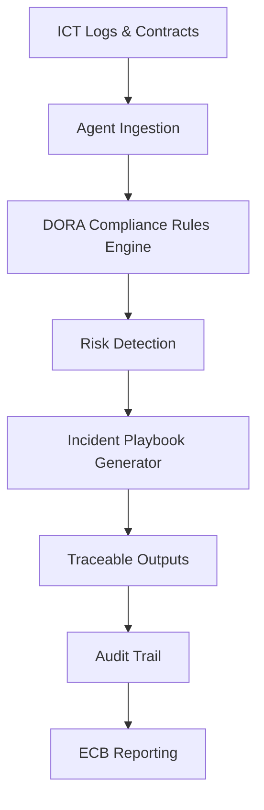
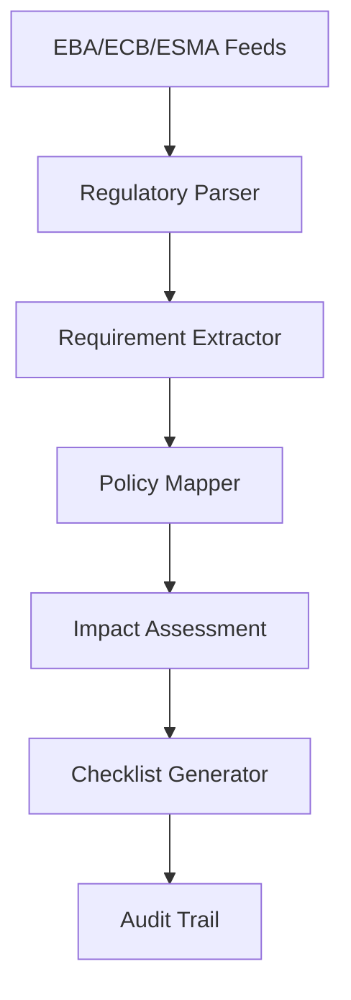
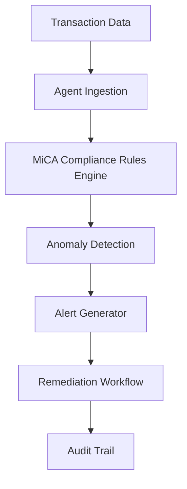

## GenAI Use Cases for BNP Paribas

Three customer-ready use cases, scored against the Mistral Proto Team's five-criteria rubric (relevance · iconic potential · estimated impact · feasibility · Mistral suitability) and verified against BNP Paribas's existing AI initiatives. Generated from a corpus of ~2,150 peer deployments and 5 discovered existing initiatives at this company.

_Industry: French multinational universal bank and financial services holding company. Research confidence: 0.70. Verified: True._

### DORA-compliant ICT risk assessment and incident response agent
BNP Paribas must comply with the EU’s Digital Operational Resilience Act (DORA), effective January 2025, which mandates rigorous ICT risk management across all digital and third-party services. This agentic AI system continuously monitors BNP Paribas’ ICT infrastructure—including hardware, software, and vendor contracts—by ingesting logs, risk assessments, and contractual terms. It autonomously flags non-compliant configurations, missing controls, or contractual gaps, and generates traceable incident reports, root-cause analyses, and remediation playbooks. The system ensures auditability by linking every output to source data, reducing regulatory risk and accelerating compliance workflows.

**Why this company:** As a systemically important bank under ECB supervision, BNP Paribas faces stringent DORA requirements and potential penalties for non-compliance. The bank’s pan-European operations and reliance on third-party vendors amplify ICT risk exposure. Mistral’s EU sovereignty and on-prem deployment capabilities are critical for handling sensitive ICT data, while its multilingual support aligns with BNP Paribas’ cross-border operations. This solution directly addresses the bank’s strategic priority of operational resilience under its GTS 2025 plan ([BNP Paribas 2025 strategic plan]()).

**Example input:** `Show me all ICT services in our Paris data center that lack a documented DORA-compliant backup procedure, and flag any third-party vendors with missing contractual clauses for incident reporting timelines.`

**Example output:** {'summary': '3 ICT services in Paris data center lack DORA-compliant backup procedures. 2 third-party vendors (Vendor A, Vendor B) have missing incident reporting clauses in contracts.', 'details': [{'service_name': 'Core Banking System (CBS) v2.1', 'location': 'Paris DC-03', 'issue': 'No documented backup procedure for disaster recovery (DORA Art. 12.2)', 'source': 'Internal audit log (2025-06-10)', 'remediation': 'Draft procedure by 2025-07-15; assign to IT Ops Team'}, {'vendor': 'Vendor A (Cloud Provider)', 'contract_id': 'CTR-2024-0456', 'issue': 'Missing incident reporting timeline clause (DORA Art. 28.3)', 'source': 'Contract review (2025-06-05)', 'remediation': 'Amend contract by 2025-08-01; escalate to Legal'}], 'audit_trail': 'All findings traceable to source logs/contracts. Export to CSV/PDF for ECB reporting.'}

**Blueprint:** `agent_with_tools` (impact: high · cost: high · complexity: low · TTV: 12-16 weeks, comparable to CERC’s transaction processing deployment ([precedent](https://cloud.google.com/customers/cerc)))

**Top risk:** Data privacy under GDPR during cross-border ICT log aggregation for EU-wide compliance reporting

**Mistral products:** Mistral Large 3, Mistral Document AI, On-prem deployment, Mistral Function Calling

**Grounded in:** strategic_context.stated_priorities[1], classification.geography
_Specificity score: 0.95_

**Architecture blueprint:**

### Autonomous regulatory change tracker for EU financial regulations
BNP Paribas, as a Significant Institution under ECB supervision, must navigate a rapidly evolving EU regulatory landscape (e.g., DORA, MiCA, CRR III). This GenAI system continuously monitors regulatory sources (EBA, ECB, ESMA) for changes, parses legal texts, and extracts actionable requirements. It maps these requirements to BNP Paribas’ internal policies, processes, and systems, generating impact assessments, compliance checklists, and implementation timelines. All outputs are traceable to source regulations, ensuring auditability and materially reducing manual review time.

**Why this company:** BNP Paribas’ scale and complexity—spanning retail, corporate, and investment banking—demand a systematic approach to regulatory change management. The bank’s strategic priority of EU leadership requires proactive compliance with regulations like DORA and MiCA. Mistral’s multilingual capabilities and EU sovereignty are essential for handling sensitive regulatory data across jurisdictions, while its on-prem deployment aligns with BNP Paribas’ internal LLM-as-a-Service platform.

**Example input:** `What new requirements does the latest EBA guidance on ICT risk (EBA/GL/2025/03) introduce for our cloud service providers, and which of our existing policies need updates?`

**Example output:** {'summary': 'EBA/GL/2025/03 introduces 5 new ICT risk requirements for cloud providers. 3 BNP Paribas policies require updates.', 'details': [{'requirement': 'Mandatory exit strategy for cloud services (EBA/GL/2025/03, §4.2)', 'impact': 'Policy IT-SEC-2024-07 (Cloud Governance) must add exit plan template by 2025-09-30', 'source': 'EBA Guidance (2025-05-15)', 'owner': 'IT Risk Team'}, {'requirement': 'Annual third-party audit for cloud providers (EBA/GL/2025/03, §5.1)', 'impact': 'Policy VEN-2024-03 (Vendor Management) must add audit clause by 2025-08-15', 'source': 'EBA Guidance (2025-05-15)', 'owner': 'Procurement Team'}], 'audit_trail': 'All mappings traceable to source regulations. Export to Excel for ECB reporting.'}

**Blueprint:** `hybrid_retrieval` (impact: high · cost: medium · complexity: low · TTV: 10-14 weeks)

**Top risk:** Hallucination in regulatory-summary output leading to incorrect compliance actions under ECB scrutiny

**Mistral products:** Mistral Large 3, Mistral Document AI, On-prem deployment, Mistral Function Calling

**Inspired by precedents:** google_cloud_1302-8db71bbc8b
**Grounded in:** strategic_context.stated_priorities[1], classification.geography
_Specificity score: 0.85_

**Architecture blueprint:**

### MiCA-compliant crypto-asset compliance and surveillance agent
BNP Paribas’ crypto-asset services—including custody and trading—must comply with the EU’s Markets in Crypto-Assets Regulation (MiCA), fully effective as of December 2024. This GenAI agent monitors BNP Paribas’ crypto transactions, client KYC data, and market surveillance feeds to detect potential market abuse, insufficient disclosures, or non-compliant token classifications. It generates real-time alerts, audit-ready reports, and automated remediation workflows for compliance teams, significantly accelerating compliance workflows.

**Why this company:** As a systemically important bank, BNP Paribas must ensure its crypto-asset services adhere to MiCA’s stringent rules for authorization, transparency, and consumer protection. The bank’s Corporate & Institutional Banking (CIB) division is expanding its crypto offerings, making scalable compliance critical. Mistral’s EU sovereignty and multilingual capabilities are essential for handling sensitive client data across jurisdictions, while its on-prem deployment aligns with BNP Paribas’ internal LLM-as-a-Service platform.

**Example input:** `Flag any crypto transactions in the last 24 hours where the client’s KYC profile does not match the token’s MiCA classification (e.g., retail client trading a non-retail-eligible asset).`

**Example output:** {'summary': '2 transactions flagged for MiCA classification mismatch. 1 client requires KYC update.', 'details': [{'transaction_id': 'TX-20250615-00456789', 'client': 'Client X (Retail)', 'token': 'Token Y (Non-retail-eligible under MiCA Art. 4.2)', 'issue': 'Retail client trading non-retail-eligible token', 'source': 'KYC database (2025-06-15), MiCA registry (2025-06-14)', 'remediation': 'Freeze transaction; escalate to Compliance Team for KYC update'}, {'client': 'Client Z (Corporate)', 'token': 'Token A (Non-compliant disclosure under MiCA Art. 6.1)', 'issue': 'Insufficient disclosure for token classification', 'source': 'MiCA registry (2025-06-14)', 'remediation': 'Request updated disclosure from issuer by 2025-06-22'}], 'audit_trail': 'All findings traceable to source data. Export to PDF for ESMA reporting.'}

**Blueprint:** `agent_with_tools` (impact: high · cost: high · complexity: low · TTV: 14-18 weeks)

**Top risk:** False positives in market abuse detection triggering unnecessary regulatory filings under MiCA’s suspicious transaction reporting rules

**Mistral products:** Mistral Large 3, Mistral Document AI, On-prem deployment, Mistral Function Calling

**Grounded in:** classification.geography, business.key_products_or_services[4]
_Specificity score: 0.80_

**Architecture blueprint:**

## Considered but not selected
- **esg-portfolio-taxonomy-mapper** — Lower strategic alignment with immediate DORA/MiCA compliance deadlines; ESG priorities are longer-term.
- **sustainable-loan-due-diligence** — Overlap with existing ESG initiatives; lacks regulatory urgency compared to DORA/MiCA.
- **anti-fraud-agentic-network** — High feasibility but lower novelty; BNP Paribas’ existing fraud detection systems may already address this.
- **trade-finance-doc-intelligence** — Niche applicability to trade finance; broader regulatory use cases took precedence.

---
## Report quality signals

- **Topical diversity** (LLM-graded over titles + blueprint patterns): `0.70`
- **Specificity** per use case: `0.95`, `0.85`, `0.80`
- **Mistral product diversity**: `4` distinct products across the three use cases
- **Time-to-value spread**: 10–18 weeks (across 3 use cases)
- **Cost-tier spread**: high, medium, high
- **Fact-check pass rate**: `60%` (9/15 claims supported by research)

**Meta-evaluator confidence**: `0.40` (NOT ready — needs revision)
**Cross-cutting concern**: Lack of verifiable, directly supporting evidence for peer-deployment claims and regulatory timelines. Multiple use cases cite precedents or evidence that do not contain literal text supporting the specific claims made.