# Pipeline trace — BNP Paribas

Started: `2026-05-08T13:56:22.541483+00:00`. Total wall time: `356.9s` across `39` recorded actions.

## Per-step time totals

| Step | Calls | Total time | Avg time |
|---|---:|---:|---:|
| `research` | 1 | 11.73s | 11728ms |
| `gap_fill` | 5 | 14.50s | 2900ms |
| `retrieve` | 2 | 1.39s | 694ms |
| `generate` | 4 | 78.08s | 19520ms |
| `generate.web_search` | 8 | 29.30s | 3663ms |
| `score` | 2 | 37.52s | 18761ms |
| `verify` | 6 | 12.74s | 2123ms |
| `enrich` | 2 | 109.00s | 54498ms |
| `polish` | 5 | 9.77s | 1955ms |
| `meta_eval` | 2 | 17.87s | 8936ms |
| `quality_signals` | 2 | 4.46s | 2232ms |

## Chronological event log

- `13:56:25.121` **[research]** `mistral-medium-2604.chat.complete` — 11728ms
   - inputs: synthesize CompanyContext for BNP Paribas | depth=medium
   - outputs: industry='French multinational universal bank and financial services holding company' verified=True conf=0.75
- `13:56:37.826` **[gap_fill]** `mistral-small-2603.chat.complete` — 1245ms
   - inputs: generate gap queries | fields=['business_model', 'products', 'data_assets', 'priorities']
   - outputs: queries=4
- `13:56:53.744` **[gap_fill]** `mistral-medium-2604.chat.complete` — 9898ms
   - inputs: re-synthesize w/ 4 gap-fill blocks
   - outputs: priorities=0 data_assets=0 products=0
- `13:57:03.672` **[gap_fill]** `mistral-small-2603.chat.complete` — 1008ms
   - inputs: layer-2 extract field=priorities
   - outputs: items=6
- `13:57:04.713` **[gap_fill]** `mistral-small-2603.chat.complete` — 1041ms
   - inputs: layer-2 extract field=data_assets
   - outputs: items=6
- `13:57:05.791` **[gap_fill]** `mistral-small-2603.chat.complete` — 1306ms
   - inputs: layer-2 extract field=products
   - outputs: items=5
- `13:57:07.118` **[retrieve]** `mistral-embed.embeddings.create` — 1025ms
   - inputs: company_query | industries='French multinational universal bank and financial services holding company'
   - outputs: embedded 1024-dim query vector
- `13:57:08.144` **[retrieve]** `precedent_corpus.cosine_topk` — 363ms
   - inputs: k=8 min_depth=0.4 target='BNP Paribas'
   - outputs: retrieved 8 | mmr=True | top_sim=0.780
- `13:57:10.116` **[generate]** `mistral-medium-2604.chat.complete` — 3265ms
   - inputs: iteration=0 tool_calls_used=0/4 tools=on
   - outputs: tool_calls=4 | content_chars=0
- `13:57:13.398` **[generate.web_search]** `tavily.search` — 2767ms
   - inputs: query='BNP Paribas sustainable finance ESG loans 2025'
   - outputs: 2 raw results
- `13:57:27.114` **[generate.web_search]** `tavily.search` — 3493ms
   - inputs: query='BNP Paribas Corporate & Institutional Banking CIB client onboarding process'
   - outputs: 2 raw results
- `13:57:33.394` **[generate.web_search]** `tavily.search` — 4724ms
   - inputs: query='BNP Paribas Fortis retail banking digital transformation 2025'
   - outputs: 2 raw results
- `13:57:40.616` **[generate.web_search]** `tavily.search` — 4122ms
   - inputs: query='BNP Paribas EU regulatory compliance MiCA DORA 2025'
   - outputs: 2 raw results
- `13:57:45.481` **[generate]** `mistral-medium-2604.chat.complete` — 39585ms
   - inputs: iteration=1 tool_calls_used=4/4 tools=off
   - outputs: tool_calls=0 | content_chars=22749
- `13:58:25.392` **[generate]** `mistral-medium-2604.chat.complete` — 2030ms
   - inputs: iteration=0 tool_calls_used=0/4 tools=on
   - outputs: tool_calls=4 | content_chars=0
- `13:58:27.442` **[generate.web_search]** `tavily.search` — 614ms
   - inputs: query='BNP Paribas sustainable finance ESG loans 2025'
   - outputs: 2 raw results
- `13:58:38.532` **[generate.web_search]** `tavily.search` — 4374ms
   - inputs: query='BNP Paribas Corporate & Institutional Banking CIB regulatory reporting requirements'
   - outputs: 2 raw results
- `13:58:45.377` **[generate.web_search]** `tavily.search` — 4599ms
   - inputs: query='BNP Paribas Fortis Belgium digital banking customer experience 2025'
   - outputs: 2 raw results
- `13:58:51.929` **[generate.web_search]** `tavily.search` — 4612ms
   - inputs: query='BNP Paribas Investment & Protection Services IPS AI initiatives'
   - outputs: 2 raw results
- `13:58:59.135` **[generate]** `mistral-medium-2604.chat.complete` — 33200ms
   - inputs: iteration=1 tool_calls_used=4/4 tools=off
   - outputs: tool_calls=0 | content_chars=21459
- `13:59:32.736` **[score]** `mistral-small-2603.chat.complete` — 17508ms
   - inputs: self-consistency pass T=0.4
   - outputs: scored 12 candidates
- `13:59:32.733` **[score]** `mistral-small-2603.chat.complete` — 20014ms
   - inputs: self-consistency pass T=0.2
   - outputs: scored 12 candidates
- `13:59:52.803` **[verify]** `tavily.search` — 2286ms
   - inputs: candidate=dora-ict-risk-agent | query='BNP Paribas DORA-compliant ICT risk assessment and incident '
   - outputs: 4 results
- `13:59:52.803` **[verify]** `tavily.search` — 2287ms
   - inputs: candidate=mica-crypto-compliance-agent | query='BNP Paribas MiCA-compliant crypto-asset compliance and surve'
   - outputs: 4 results
- `13:59:52.803` **[verify]** `tavily.search` — 2438ms
   - inputs: candidate=regulatory-change-tracker | query='BNP Paribas Autonomous regulatory change tracker for EU fina'
   - outputs: 4 results
- `13:59:55.783` **[verify]** `mistral-small-2603.chat.complete` — 1652ms
   - inputs: verdict for mica-crypto-compliance-agent
   - outputs: verdict='pass'
- `13:59:55.476` **[verify]** `mistral-small-2603.chat.complete` — 1974ms
   - inputs: verdict for regulatory-change-tracker
   - outputs: verdict='pass'
- `13:59:55.660` **[verify]** `mistral-small-2603.chat.complete` — 2101ms
   - inputs: verdict for dora-ict-risk-agent
   - outputs: verdict='pass'
- `13:59:57.793` **[enrich]** `mistral-large-2512.chat.complete` — 54229ms
   - inputs: top_3 candidates=['dora-ict-risk-agent', 'regulatory-change-tracker', 'mica-crypto-compliance-agent']
   - outputs: enriched 3 use cases
- `14:00:52.025` **[polish]** `mistral-small-2603.chat.complete` — 1629ms
   - inputs: use_case=regulatory-change-tracker unanchored=True opaque_ev=False
   - outputs: polished 4 fields
- `14:00:53.655` **[polish]** `mistral-small-2603.chat.complete` — 1967ms
   - inputs: use_case=mica-crypto-compliance-agent unanchored=True opaque_ev=False
   - outputs: polished 4 fields
- `14:00:55.663` **[meta_eval]** `mistral-medium-2604.chat.complete` — 9152ms
   - inputs: reviewing 3 use cases
   - outputs: review + claims
- `14:01:04.851` **[enrich]** `mistral-large-2512.chat.complete` — 54766ms
   - inputs: top_3 candidates=['dora-ict-risk-agent', 'mica-crypto-compliance-agent', 'esg-portfolio-taxonomy-mapper']
   - outputs: enriched 3 use cases
- `14:01:59.621` **[polish]** `mistral-small-2603.chat.complete` — 2154ms
   - inputs: use_case=dora-ict-risk-agent unanchored=True opaque_ev=False
   - outputs: polished 4 fields
- `14:02:01.775` **[polish]** `mistral-small-2603.chat.complete` — 1914ms
   - inputs: use_case=mica-crypto-compliance-agent unanchored=True opaque_ev=False
   - outputs: polished 4 fields
- `14:02:03.690` **[polish]** `mistral-small-2603.chat.complete` — 2109ms
   - inputs: use_case=esg-portfolio-taxonomy-mapper unanchored=True opaque_ev=False
   - outputs: polished 4 fields
- `14:02:05.831` **[meta_eval]** `mistral-medium-2604.chat.complete` — 8720ms
   - inputs: reviewing 3 use cases
   - outputs: review + claims
- `14:02:15.016` **[quality_signals]** `mistral-small-2603.chat.complete` — 2881ms
   - inputs: specificity grade (3 use cases)
   - outputs: scored 3 use cases
- `14:02:17.896` **[quality_signals]** `mistral-small-2603.chat.complete` — 1584ms
   - inputs: diversity grade
   - outputs: diversity=0.7

## Mermaid sequence diagram

```mermaid
sequenceDiagram
    autonumber
    participant pipeline as pipeline
    participant mistral_medium_2604 as mistral-medium-2604
    participant mistral_small_2603 as mistral-small-2603
    participant mistral_embed as mistral-embed
    participant precedent_corpus as precedent_corpus
    participant tavily as tavily
    participant mistral_large_2512 as mistral-large-2512
    pipeline->>mistral_medium_2604: research: chat.complete (11728ms)
    mistral_medium_2604-->>pipeline: industry='French multinational universal bank and financial 
    pipeline->>mistral_small_2603: gap_fill: chat.complete (1245ms)
    mistral_small_2603-->>pipeline: queries=4
    pipeline->>mistral_medium_2604: gap_fill: chat.complete (9898ms)
    mistral_medium_2604-->>pipeline: priorities=0 data_assets=0 products=0
    pipeline->>mistral_small_2603: gap_fill: chat.complete (1008ms)
    mistral_small_2603-->>pipeline: items=6
    pipeline->>mistral_small_2603: gap_fill: chat.complete (1041ms)
    mistral_small_2603-->>pipeline: items=6
    pipeline->>mistral_small_2603: gap_fill: chat.complete (1306ms)
    mistral_small_2603-->>pipeline: items=5
    pipeline->>mistral_embed: retrieve: embeddings.create (1025ms)
    mistral_embed-->>pipeline: embedded 1024-dim query vector
    pipeline->>precedent_corpus: retrieve: cosine_topk (363ms)
    precedent_corpus-->>pipeline: retrieved 8 | mmr=True | top_sim=0.780
    pipeline->>mistral_medium_2604: generate: chat.complete (3265ms)
    mistral_medium_2604-->>pipeline: tool_calls=4 | content_chars=0
    pipeline->>tavily: generate.web_search: search (2767ms)
    tavily-->>pipeline: 2 raw results
    pipeline->>tavily: generate.web_search: search (3493ms)
    tavily-->>pipeline: 2 raw results
    pipeline->>tavily: generate.web_search: search (4724ms)
    tavily-->>pipeline: 2 raw results
    pipeline->>tavily: generate.web_search: search (4122ms)
    tavily-->>pipeline: 2 raw results
    pipeline->>mistral_medium_2604: generate: chat.complete (39585ms)
    mistral_medium_2604-->>pipeline: tool_calls=0 | content_chars=22749
    pipeline->>mistral_medium_2604: generate: chat.complete (2030ms)
    mistral_medium_2604-->>pipeline: tool_calls=4 | content_chars=0
    pipeline->>tavily: generate.web_search: search (614ms)
    tavily-->>pipeline: 2 raw results
    pipeline->>tavily: generate.web_search: search (4374ms)
    tavily-->>pipeline: 2 raw results
    pipeline->>tavily: generate.web_search: search (4599ms)
    tavily-->>pipeline: 2 raw results
    pipeline->>tavily: generate.web_search: search (4612ms)
    tavily-->>pipeline: 2 raw results
    pipeline->>mistral_medium_2604: generate: chat.complete (33200ms)
    mistral_medium_2604-->>pipeline: tool_calls=0 | content_chars=21459
    pipeline->>mistral_small_2603: score: chat.complete (17508ms)
    mistral_small_2603-->>pipeline: scored 12 candidates
    pipeline->>mistral_small_2603: score: chat.complete (20014ms)
    mistral_small_2603-->>pipeline: scored 12 candidates
    pipeline->>tavily: verify: search (2286ms)
    tavily-->>pipeline: 4 results
    pipeline->>tavily: verify: search (2287ms)
    tavily-->>pipeline: 4 results
    pipeline->>tavily: verify: search (2438ms)
    tavily-->>pipeline: 4 results
    pipeline->>mistral_small_2603: verify: chat.complete (1652ms)
    mistral_small_2603-->>pipeline: verdict='pass'
    pipeline->>mistral_small_2603: verify: chat.complete (1974ms)
    mistral_small_2603-->>pipeline: verdict='pass'
    pipeline->>mistral_small_2603: verify: chat.complete (2101ms)
    mistral_small_2603-->>pipeline: verdict='pass'
    pipeline->>mistral_large_2512: enrich: chat.complete (54229ms)
    mistral_large_2512-->>pipeline: enriched 3 use cases
    pipeline->>mistral_small_2603: polish: chat.complete (1629ms)
    mistral_small_2603-->>pipeline: polished 4 fields
    pipeline->>mistral_small_2603: polish: chat.complete (1967ms)
    mistral_small_2603-->>pipeline: polished 4 fields
    pipeline->>mistral_medium_2604: meta_eval: chat.complete (9152ms)
    mistral_medium_2604-->>pipeline: review + claims
    pipeline->>mistral_large_2512: enrich: chat.complete (54766ms)
    mistral_large_2512-->>pipeline: enriched 3 use cases
    pipeline->>mistral_small_2603: polish: chat.complete (2154ms)
    mistral_small_2603-->>pipeline: polished 4 fields
    pipeline->>mistral_small_2603: polish: chat.complete (1914ms)
    mistral_small_2603-->>pipeline: polished 4 fields
    pipeline->>mistral_small_2603: polish: chat.complete (2109ms)
    mistral_small_2603-->>pipeline: polished 4 fields
    pipeline->>mistral_medium_2604: meta_eval: chat.complete (8720ms)
    mistral_medium_2604-->>pipeline: review + claims
    pipeline->>mistral_small_2603: quality_signals: chat.complete (2881ms)
    mistral_small_2603-->>pipeline: scored 3 use cases
    pipeline->>mistral_small_2603: quality_signals: chat.complete (1584ms)
    mistral_small_2603-->>pipeline: diversity=0.7
```

