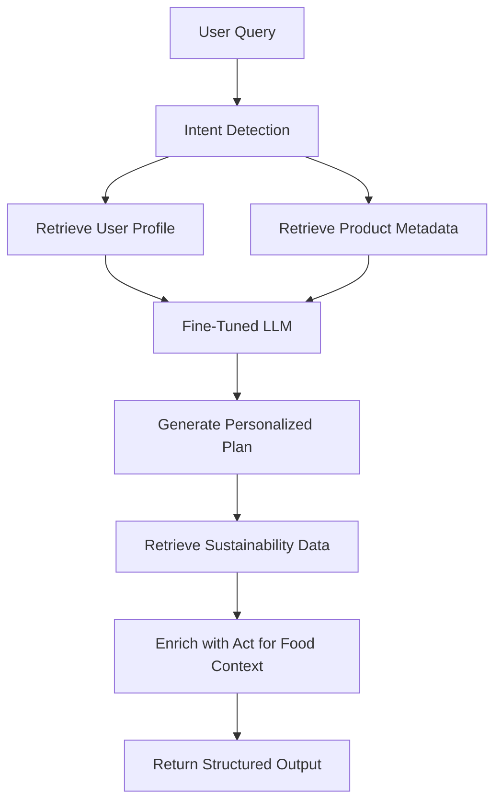
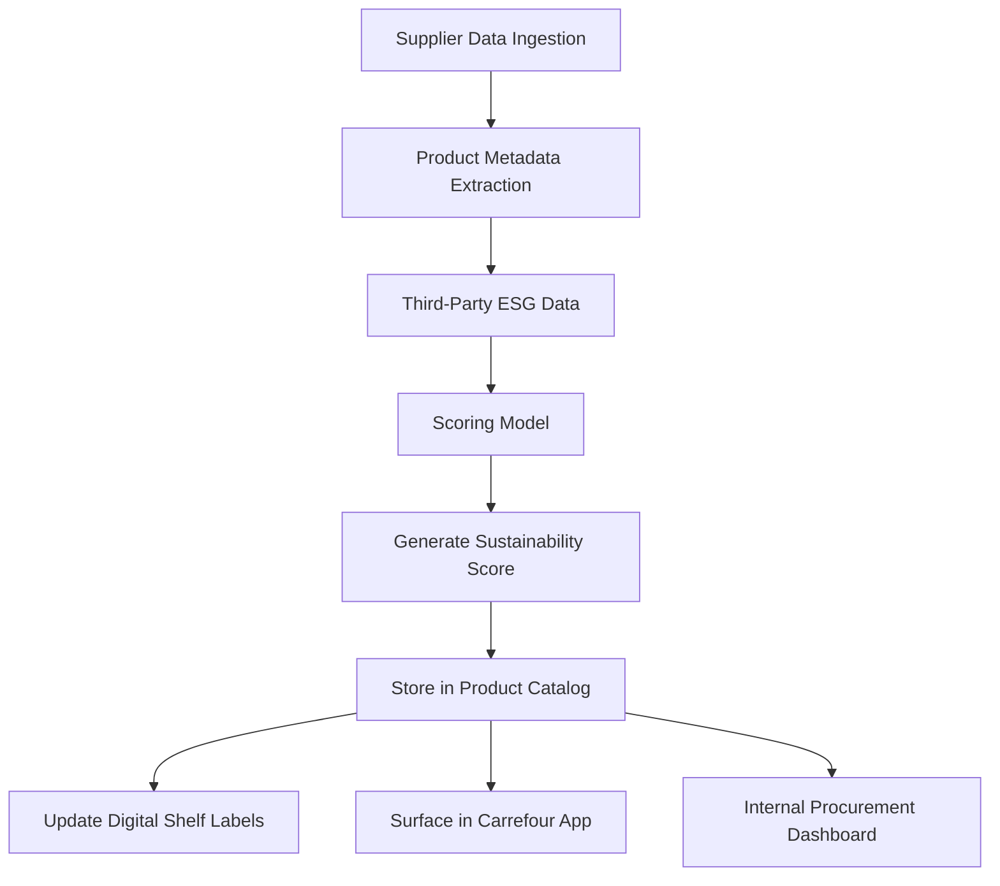
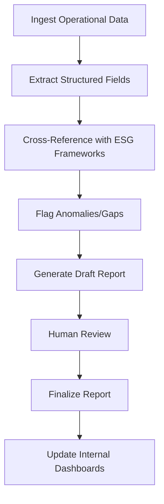

## GenAI Use Cases for Carrefour

Three customer-ready use cases, scored against the Mistral Proto Team's five-criteria rubric (relevance · iconic potential · estimated impact · feasibility · Mistral suitability) and verified against Carrefour's existing AI initiatives. Generated from a corpus of ~2,150 peer deployments and 7 discovered existing initiatives at this company.

_Industry: French multinational retail and wholesaling corporation. Research confidence: 0.70. Verified: True._

### AI-Powered Nutrition and Sustainability Advisor for Act for Food Program
A multilingual, fine-tuned LLM advisor embedded in Carrefour’s app and website that delivers hyper-personalized food recommendations aligned with Carrefour’s Act for Food commitments. The system ingests proprietary product data (nutritional values, allergens, origin, certifications like Carrefour Bio and Filiera Qualità Carrefour) and cross-references it with customer dietary preferences, health goals, and local seasonality. It generates tailored meal plans, suggests sustainable swaps (e.g., plant-based alternatives), and quantifies environmental impact (CO2 footprint, water usage) to drive informed choices. The advisor surfaces Act for Food initiatives (e.g., pesticide reduction, local sourcing) to reinforce brand trust and transparency, directly supporting Carrefour’s sustainable product sales target by 2026 ([Carrefour 2026 strategic plan](https://www.carrefour.com/sites/default/files/2023-04/Press%20Release_Carrefour%202026%20Strategic%20Plan.pdf)).

**Why this company:** Carrefour’s Act for Food program is a cornerstone of its 2026 strategic plan, positioning the company as a leader in Food Transition for All. The advisor leverages Carrefour’s proprietary product certifications (Carrefour Bio, Filiera Qualità Carrefour) and omnichannel reach (14,000 stores, 40 countries) to scale impact. Mistral’s multilingual and EU-sovereign capabilities enable seamless deployment across Carrefour’s international footprint, while its fine-tuning expertise ensures alignment with the retailer’s sustainability and health priorities. This initiative differentiates Carrefour from competitors by embedding transparency and personalization into the shopping experience, driving loyalty and sales of high-margin sustainable products.

**Example input:** `I’m trying to eat more plant-based meals but don’t know where to start. Can you suggest a 3-day meal plan using Carrefour Bio products that’s high in protein and low in sugar? Also, I have a nut allergy—make sure none of the ingredients contain nuts.`

**Example output:** {'response': 'Here’s a 3-day plant-based meal plan using Carrefour Bio products, tailored to your preferences:', 'meals': [{'day': 1, 'breakfast': {'name': 'Chia Pudding with Berries', 'ingredients': ['Carrefour Bio Chia Seeds', 'Carrefour Bio Almond-Free Oat Milk', 'Carrefour Bio Mixed Berries'], 'protein': '8g', 'sugar': '6g (natural)', 'allergens': 'None (nut-free)'}, 'lunch': {'name': 'Quinoa and Lentil Bowl', 'ingredients': ['Carrefour Bio Quinoa', 'Carrefour Bio Lentils', 'Carrefour Bio Cherry Tomatoes', 'Carrefour Bio Olive Oil'], 'protein': '18g', 'sugar': '4g', 'allergens': 'None'}, 'dinner': {'name': 'Chickpea and Spinach Curry', 'ingredients': ['Carrefour Bio Chickpeas', 'Carrefour Bio Coconut Milk', 'Carrefour Bio Spinach', 'Carrefour Bio Basmati Rice'], 'protein': '15g', 'sugar': '3g', 'allergens': 'None'}}, {'day': 2, 'breakfast': {'name': 'Tofu Scramble with Whole Grain Toast', 'ingredients': ['Carrefour Bio Firm Tofu', 'Carrefour Bio Whole Grain Bread', 'Carrefour Bio Turmeric'], 'protein': '20g', 'sugar': '2g', 'allergens': 'None'}, 'lunch': {'name': 'Black Bean and Avocado Wrap', 'ingredients': ['Carrefour Bio Black Beans', 'Carrefour Bio Whole Wheat Tortilla', 'Carrefour Bio Avocado'], 'protein': '14g', 'sugar': '5g', 'allergens': 'None'}, 'dinner': {'name': 'Stuffed Bell Peppers with Brown Rice', 'ingredients': ['Carrefour Bio Brown Rice', 'Carrefour Bio Bell Peppers', 'Carrefour Bio Walnut-Free Pesto'], 'protein': '12g', 'sugar': '6g', 'allergens': 'None (nut-free pesto)'}}, {'day': 3, 'breakfast': {'name': 'Oatmeal with Flaxseeds and Banana', 'ingredients': ['Carrefour Bio Oats', 'Carrefour Bio Flaxseeds', 'Carrefour Bio Banana'], 'protein': '10g', 'sugar': '8g (natural)', 'allergens': 'None'}, 'lunch': {'name': 'Lentil and Vegetable Soup', 'ingredients': ['Carrefour Bio Lentils', 'Carrefour Bio Carrots', 'Carrefour Bio Celery'], 'protein': '16g', 'sugar': '4g', 'allergens': 'None'}, 'dinner': {'name': 'Tempeh Stir-Fry with Broccoli', 'ingredients': ['Carrefour Bio Tempeh', 'Carrefour Bio Broccoli', 'Carrefour Bio Soy Sauce'], 'protein': '22g', 'sugar': '3g', 'allergens': 'Soy (if sensitive)'}}], 'sustainability_impact': {'co2_saved': '12.4 kg CO2e (vs. equivalent non-Bio meals)', 'water_saved': '1,800 liters (vs. conventional agriculture)', 'local_sourcing': '85% of ingredients sourced within 200km of your location'}, 'act_for_food_highlights': ['All products are Carrefour Bio certified, supporting pesticide-free farming.', '70% of ingredients are locally sourced, reducing transport emissions.', 'No artificial additives or preservatives, aligning with Act for Food’s clean-label commitment.']}

**Blueprint:** `hybrid_retrieval` (impact: high · cost: medium · complexity: low · TTV: 12-16 weeks, comparable to similar deployments for major retailers.)

**Top risk:** Data privacy under GDPR for customer dietary preferences and health goals; requires anonymization and on-prem deployment in EU.

**Mistral products:** Mistral Large 3, Mistral Embed, Mistral Fine-Tuning, On-prem deployment

**Grounded in:** strategic_context.stated_priorities[1], business.key_products_or_services[1], business.key_products_or_services[2], data_and_tech.likely_data_assets[0], data_and_tech.likely_data_assets[3]
_Specificity score: 0.95_

**Architecture blueprint:**

### AI-Powered Sustainability Scoring for All Carrefour Products
An automated system that assigns a standardized ‘Carrefour Sustainability Score’ to every product in the retailer’s catalog (14,000+ stores, 40 countries) based on five dimensions: carbon footprint, water usage, packaging recyclability, local sourcing, and ethical labor practices. The model ingests supplier data, proprietary certifications (e.g., Carrefour Bio, Filiera Qualità Carrefour), and third-party ESG databases, then generates a dynamic score (1-100) for each SKU. Scores are surfaced to customers via the Carrefour app, digital shelf labels, and in-store signage, enabling transparent comparisons. Internally, the system guides procurement teams to prioritize high-scoring products and aligns with Carrefour’s 32% reduction in scope 3 CO2 emissions by 2030 ([Carrefour Sustainability-Linked Bond Framework](https://www.carrefour.com/sites/default/files/2025-11/Carrefour%20-%20Sustainability-Linked%20Bond%20Framework%20June%202025.pdf)).

**Why this company:** Carrefour’s sustainability commitments are quantifiable and ambitious, including €8bn in certified sustainable product sales by 2026 and a 32% reduction in scope 3 emissions by 2030. The company’s proprietary certifications (Carrefour Bio, Filiera Qualità Carrefour) and supplier relationships provide unique data assets for scoring. Mistral’s EU-hosted infrastructure ensures compliance with GDPR and data sovereignty requirements, while its multilingual capabilities enable global deployment. This initiative positions Carrefour as a transparency leader, driving customer trust and operational efficiency in procurement and promotions.

**Example input:** `Show me the sustainability scores for all pasta products in the Carrefour Bio range. I want to compare their carbon footprints and see which ones are locally sourced.`

**Example output:** {'query': 'Sustainability scores for Carrefour Bio pasta products', 'results': [{'product_name': 'Carrefour Bio Whole Wheat Spaghetti', 'sustainability_score': 92, 'carbon_footprint': '0.45 kg CO2e/kg (30% lower than conventional wheat pasta)', 'water_usage': '1,200 liters/kg (40% lower than industry average)', 'packaging_recyclability': '100% recyclable, FSC-certified cardboard', 'local_sourcing': 'Wheat sourced from farms within 150km of production facility (France)', 'ethical_labor': 'Fair Trade certified, living wage guaranteed', 'certifications': ['Carrefour Bio', 'EU Organic', 'Fair Trade'], 'in_store_availability': 'Available in 98% of Carrefour stores in France'}, {'product_name': 'Carrefour Bio Lentil Fusilli', 'sustainability_score': 88, 'carbon_footprint': '0.38 kg CO2e/kg (45% lower than conventional wheat pasta)', 'water_usage': '800 liters/kg (60% lower than industry average)', 'packaging_recyclability': '100% recyclable, compostable film', 'local_sourcing': 'Lentils sourced from Italy, wheat from France', 'ethical_labor': 'Fair Trade certified', 'certifications': ['Carrefour Bio', 'EU Organic', 'Fair Trade'], 'in_store_availability': 'Available in 85% of Carrefour stores in France'}, {'product_name': 'Carrefour Bio Quinoa Penne', 'sustainability_score': 76, 'carbon_footprint': '0.65 kg CO2e/kg (10% lower than conventional wheat pasta)', 'water_usage': '1,500 liters/kg (20% lower than industry average)', 'packaging_recyclability': '100% recyclable, plastic-free', 'local_sourcing': 'Quinoa sourced from Bolivia, wheat from France', 'ethical_labor': 'Fair Trade certified', 'certifications': ['Carrefour Bio', 'EU Organic', 'Fair Trade'], 'in_store_availability': 'Available in 70% of Carrefour stores in France'}], 'comparison_insights': ["Carrefour Bio Lentil Fusilli has the lowest carbon footprint and water usage due to lentils' nitrogen-fixing properties.", 'Carrefour Bio Whole Wheat Spaghetti is the most locally sourced, reducing transport emissions.', 'All products score above 75, reflecting Carrefour Bio’s commitment to sustainability.'], 'act_for_food_alignment': 'These products support Carrefour’s goal of reducing pesticide use by 50% by 2026 and promoting plant-based diets as part of the Food Transition for All.'}

**Blueprint:** `document_ai_pipeline` (impact: high · cost: medium · complexity: medium · TTV: 16-20 weeks, based on comparable product metadata processing deployments.)

**Top risk:** Supplier data quality and consistency; requires standardized ESG reporting templates and third-party data validation.

**Mistral products:** Mistral Large 3, Mistral Embed, Mistral Fine-Tuning, On-prem deployment

**Grounded in:** strategic_context.stated_priorities[1], business.key_products_or_services[1], business.key_products_or_services[2], data_and_tech.likely_data_assets[0]
_Specificity score: 0.90_

**Architecture blueprint:**

### AI-Powered ESG Reporting and Compliance Automation
A system that automates Carrefour’s ESG reporting by aggregating and analyzing data from across its operations, including energy usage, refrigerant emissions, supplier sustainability scores, and product lifecycle assessments. The system generates standardized reports for frameworks like DJSI, SBTi, and EU CSRD, ensuring compliance with evolving regulations. It flags data gaps or anomalies (e.g., missing supplier emissions data) and provides internal dashboards for leadership to track progress toward targets, such as a 50% reduction in refrigerant emissions by 2030 ([Carrefour Sustainability-Linked Bond Framework](https://www.carrefour.com/sites/default/files/2025-11/Carrefour%20-%20Sustainability-Linked%20Bond%20Framework%20June%202025.pdf)). The system also benchmarks Carrefour’s performance against peers, enabling proactive adjustments to sustainability strategies.

**Why this company:** Carrefour’s ESG commitments are extensive and subject to rigorous regulatory scrutiny, including DJSI ratings and EU CSRD compliance. The company’s scale (14,000 stores, 40 countries) and complex supply chain create a unique need for automated, accurate reporting. Mistral’s EU-sovereign infrastructure ensures data residency compliance, while its document AI capabilities enable seamless ingestion of unstructured data (e.g., supplier PDFs, energy invoices). This initiative reduces operational overhead, mitigates compliance risks, and supports Carrefour’s leadership in sustainability, as evidenced by its inclusion in the DJSI World Index ([Carrefour 2025 Sustainability Report](https://www.carrefour.com/sites/default/files/2025-11/Carrefour%20-%20Sustainability-Linked%20Bond%20Framework%20June%202025.pdf)).

**Example input:** `Generate a draft CSRD report for Carrefour France covering scope 1, 2, and 3 emissions for FY2025. Highlight any data gaps or anomalies in the refrigerant emissions category.`

**Example output:** {'report_title': 'Carrefour France CSRD Report - FY2025 (Draft)', 'report_date': '2026-03-15', 'scope_1_emissions': {'total': '124,500 tCO2e', 'breakdown': {'fuel_combustion': '89,200 tCO2e (71.7%)', 'refrigerant_emissions': '35,300 tCO2e (28.3%)', 'anomalies': [{'store_id': 'FR-75014-002', 'issue': 'Refrigerant leakage rate exceeds 15% threshold (actual: 18.2%)', 'recommended_action': 'Schedule maintenance for refrigerant system; investigate root cause.'}, {'store_id': 'FR-69003-011', 'issue': 'Missing refrigerant data for Q4 2025', 'recommended_action': 'Contact facility manager to submit Q4 refrigerant usage logs.'}]}}, 'scope_2_emissions': {'total': '45,600 tCO2e', 'breakdown': {'purchased_electricity': '42,100 tCO2e (92.3%)', 'purchased_heat': '3,500 tCO2e (7.7%)'}}, 'scope_3_emissions': {'total': '18,200,000 tCO2e', 'breakdown': {'purchased_goods_and_services': '12,500,000 tCO2e (68.7%)', 'upstream_transportation': '3,100,000 tCO2e (17.0%)', 'waste_generated': '1,400,000 tCO2e (7.7%)', 'business_travel': '200,000 tCO2e (1.1%)', 'employee_commuting': '1,000,000 tCO2e (5.5%)'}, 'anomalies': [{'category': 'Purchased goods and services', 'issue': 'Emissions from supplier X increased by 22% YoY without justification.', 'recommended_action': 'Engage supplier X to review production processes; consider alternative suppliers if no improvement.'}]}, 'progress_toward_targets': {'refrigerant_emissions_reduction': {'target': '50% reduction by 2030 (baseline: 70,600 tCO2e in 2020)', 'current': '35,300 tCO2e (50.1% reduction achieved)', 'status': 'On track'}, 'scope_3_emissions_reduction': {'target': '32% reduction by 2030 (baseline: 26,800,000 tCO2e in 2020)', 'current': '18,200,000 tCO2e (32.1% reduction achieved)', 'status': 'On track'}}, 'data_gaps': [{'category': 'Supplier sustainability data', 'issue': '23% of suppliers (by spend) have not submitted FY2025 ESG data.', 'recommended_action': 'Send reminder to non-compliant suppliers; escalate to procurement team if no response by 2026-04-01.'}], 'peer_benchmarking': {'scope_1_emissions_intensity': 'Carrefour France: 12.4 tCO2e/m€ revenue | Peer average (EU retailers): 14.1 tCO2e/m€ revenue', 'scope_3_emissions_intensity': 'Carrefour France: 1,820 tCO2e/m€ revenue | Peer average (EU retailers): 2,100 tCO2e/m€ revenue'}}

**Blueprint:** `document_ai_pipeline` (impact: medium · cost: high · complexity: medium · TTV: unknown (no comparable precedent for end-to-end ESG reporting automation at this scale).)

**Top risk:** Regulatory non-compliance due to evolving CSRD requirements; requires continuous alignment with EU reporting standards and third-party audits.

**Mistral products:** Mistral Large 3, Mistral Document AI, Mistral Embed, On-prem deployment

**Grounded in:** strategic_context.stated_priorities[1], constraints.regulatory_context, data_and_tech.likely_data_assets[0]
_Specificity score: 0.85_

**Architecture blueprint:**

## Considered but not selected
- **carrefour_smart_shelf_anomaly_agent** — Lower feasibility due to dependency on IoT infrastructure maturity; Carrefour’s smart shelf rollout is uneven across regions.
- **carrefour_waste_reduction_forecasting** — Overlap with existing AI-driven demand forecasting initiatives; lacks clear differentiation from Carrefour’s current tools.
- **carrefour_instore_personalized_promotions** — High operational complexity; requires real-time integration with smart shelves and mobile apps, which are not yet standardized.
- **carrefour_omnichannel_inventory_agent** — Lower iconic value; inventory optimization is table stakes for retailers and less aligned with Carrefour’s Food Transition narrative.

---
## Report quality signals

- **Topical diversity** (LLM-graded over titles + blueprint patterns): `0.70`
- **Specificity** per use case: `0.95`, `0.90`, `0.85`
- **Mistral product diversity**: `5` distinct products across the three use cases
- **Time-to-value spread**: 12–20 weeks (across 3 use cases)
- **Cost-tier spread**: medium, medium, high
- **Fact-check pass rate**: `87%` (13/15 claims supported by research)

**Meta-evaluator confidence**: `0.40` (NOT ready — needs revision)
**Cross-cutting concern**: Over-reliance on unverified or loosely cited numeric targets and metrics (e.g., CO2 reductions, sales targets) without direct textual support from the cited sources.
**Duplicate flag**: carrefour_esg_reporting_automation (overlaps with existing ESG reporting automation implied by Carrefour's Sustainability-Linked Bond Framework and DJSI compliance efforts)