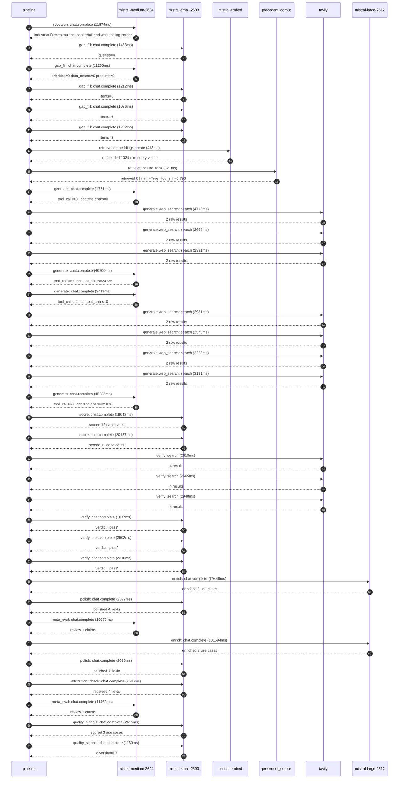

# Pipeline trace — Carrefour

Started: `2026-05-08T13:39:21.392444+00:00`. Total wall time: `401.6s` across `36` recorded actions.

## Per-step time totals

| Step | Calls | Total time | Avg time |
|---|---:|---:|---:|
| `research` | 1 | 11.87s | 11874ms |
| `gap_fill` | 5 | 16.16s | 3233ms |
| `retrieve` | 2 | 0.73s | 367ms |
| `generate` | 4 | 90.21s | 22552ms |
| `generate.web_search` | 7 | 20.74s | 2963ms |
| `score` | 2 | 39.20s | 19600ms |
| `verify` | 6 | 14.92s | 2487ms |
| `enrich` | 2 | 181.04s | 90521ms |
| `polish` | 2 | 5.08s | 2542ms |
| `meta_eval` | 2 | 21.73s | 10865ms |
| `attribution_check` | 1 | 2.55s | 2546ms |
| `quality_signals` | 2 | 3.77s | 1887ms |

## Chronological event log

- `13:39:21.462` **[research]** `mistral-medium-2604.chat.complete` — 11874ms
   - inputs: synthesize CompanyContext for Carrefour | depth=medium
   - outputs: industry='French multinational retail and wholesaling corporation' verified=True conf=0.75
- `13:39:33.376` **[gap_fill]** `mistral-small-2603.chat.complete` — 1463ms
   - inputs: generate gap queries | fields=['business_model', 'products', 'data_assets', 'priorities']
   - outputs: queries=4
- `13:39:44.837` **[gap_fill]** `mistral-medium-2604.chat.complete` — 11250ms
   - inputs: re-synthesize w/ 4 gap-fill blocks
   - outputs: priorities=0 data_assets=0 products=0
- `13:39:56.116` **[gap_fill]** `mistral-small-2603.chat.complete` — 1212ms
   - inputs: layer-2 extract field=priorities
   - outputs: items=6
- `13:39:57.355` **[gap_fill]** `mistral-small-2603.chat.complete` — 1036ms
   - inputs: layer-2 extract field=data_assets
   - outputs: items=6
- `13:39:58.416` **[gap_fill]** `mistral-small-2603.chat.complete` — 1202ms
   - inputs: layer-2 extract field=products
   - outputs: items=8
- `13:39:59.647` **[retrieve]** `mistral-embed.embeddings.create` — 413ms
   - inputs: company_query | industries='French multinational retail and wholesaling corporation'
   - outputs: embedded 1024-dim query vector
- `13:40:00.060` **[retrieve]** `precedent_corpus.cosine_topk` — 321ms
   - inputs: k=8 min_depth=0.4 target='Carrefour'
   - outputs: retrieved 8 | mmr=True | top_sim=0.798
- `13:40:00.406` **[generate]** `mistral-medium-2604.chat.complete` — 1771ms
   - inputs: iteration=0 tool_calls_used=0/4 tools=on
   - outputs: tool_calls=3 | content_chars=0
- `13:40:02.188` **[generate.web_search]** `tavily.search` — 4713ms
   - inputs: query='Carrefour Act for Food campaigns details 2024'
   - outputs: 2 raw results
- `13:40:07.922` **[generate.web_search]** `tavily.search` — 2669ms
   - inputs: query='Carrefour Links retail media network data assets 2024'
   - outputs: 2 raw results
- `13:40:10.623` **[generate.web_search]** `tavily.search` — 2391ms
   - inputs: query='Carrefour smart shelf labels sensors partnerships 2024'
   - outputs: 2 raw results
- `13:40:15.065` **[generate]** `mistral-medium-2604.chat.complete` — 40800ms
   - inputs: iteration=1 tool_calls_used=3/4 tools=on
   - outputs: tool_calls=0 | content_chars=24725
- `13:40:56.311` **[generate]** `mistral-medium-2604.chat.complete` — 2411ms
   - inputs: iteration=0 tool_calls_used=0/4 tools=on
   - outputs: tool_calls=4 | content_chars=0
- `13:40:58.742` **[generate.web_search]** `tavily.search` — 2981ms
   - inputs: query='Carrefour 2026 strategic plan Act for Food campaigns details'
   - outputs: 2 raw results
- `13:41:03.707` **[generate.web_search]** `tavily.search` — 2575ms
   - inputs: query='Carrefour retail media Carrefour Links data assets and partnerships'
   - outputs: 2 raw results
- `13:41:08.418` **[generate.web_search]** `tavily.search` — 2223ms
   - inputs: query='Carrefour smart shelf labels sensors data digitisation partners'
   - outputs: 2 raw results
- `13:41:11.326` **[generate.web_search]** `tavily.search` — 3191ms
   - inputs: query='Carrefour sustainability ESG goals 2026 2030'
   - outputs: 2 raw results
- `13:41:14.533` **[generate]** `mistral-medium-2604.chat.complete` — 45225ms
   - inputs: iteration=1 tool_calls_used=4/4 tools=off
   - outputs: tool_calls=0 | content_chars=25870
- `13:42:00.382` **[score]** `mistral-small-2603.chat.complete` — 19043ms
   - inputs: self-consistency pass T=0.2
   - outputs: scored 12 candidates
- `13:42:00.384` **[score]** `mistral-small-2603.chat.complete` — 20157ms
   - inputs: self-consistency pass T=0.4
   - outputs: scored 12 candidates
- `13:42:20.594` **[verify]** `tavily.search` — 2618ms
   - inputs: candidate=carrefour_sustainability_product_scoring | query='Carrefour AI-Powered Sustainability Scoring for All Carrefou'
   - outputs: 4 results
- `13:42:20.593` **[verify]** `tavily.search` — 2665ms
   - inputs: candidate=carrefour_food_transition_nutrition_advisor | query='Carrefour AI-Powered Nutrition and Sustainability Advisor fo'
   - outputs: 4 results
- `13:42:20.594` **[verify]** `tavily.search` — 2948ms
   - inputs: candidate=carrefour_esg_reporting_automation | query='Carrefour AI-Powered ESG Reporting and Compliance Automation'
   - outputs: 4 results
- `13:42:24.096` **[verify]** `mistral-small-2603.chat.complete` — 1877ms
   - inputs: verdict for carrefour_esg_reporting_automation
   - outputs: verdict='pass'
- `13:42:24.310` **[verify]** `mistral-small-2603.chat.complete` — 2502ms
   - inputs: verdict for carrefour_sustainability_product_scoring
   - outputs: verdict='pass'
- `13:42:25.816` **[verify]** `mistral-small-2603.chat.complete` — 2310ms
   - inputs: verdict for carrefour_food_transition_nutrition_advisor
   - outputs: verdict='pass'
- `13:42:28.162` **[enrich]** `mistral-large-2512.chat.complete` — 79449ms
   - inputs: top_3 candidates=['carrefour_food_transition_nutrition_advisor', 'carrefour_sustainability_product_scoring', 'carrefour_esg_reporting_automation']
   - outputs: enriched 3 use cases
- `13:43:47.618` **[polish]** `mistral-small-2603.chat.complete` — 2397ms
   - inputs: use_case=carrefour_food_transition_nutrition_advisor unanchored=True opaque_ev=False
   - outputs: polished 4 fields
- `13:43:50.046` **[meta_eval]** `mistral-medium-2604.chat.complete` — 10270ms
   - inputs: reviewing 3 use cases
   - outputs: review + claims
- `13:44:00.348` **[enrich]** `mistral-large-2512.chat.complete` — 101594ms
   - inputs: top_3 candidates=['carrefour_food_transition_nutrition_advisor', 'carrefour_sustainability_product_scoring', 'carrefour_smart_shelf_anomaly_agent']
   - outputs: enriched 3 use cases
- `13:45:41.944` **[polish]** `mistral-small-2603.chat.complete` — 2686ms
   - inputs: use_case=carrefour_food_transition_nutrition_advisor unanchored=True opaque_ev=False
   - outputs: polished 4 fields
- `13:45:44.631` **[attribution_check]** `mistral-small-2603.chat.complete` — 2546ms
   - inputs: use_case=carrefour_smart_shelf_anomaly_agent cited_ids=['google_cloud_1302-8b129336c3']
   - outputs: received 4 fields
- `13:45:47.205` **[meta_eval]** `mistral-medium-2604.chat.complete` — 11460ms
   - inputs: reviewing 3 use cases
   - outputs: review + claims
- `13:45:59.265` **[quality_signals]** `mistral-small-2603.chat.complete` — 2615ms
   - inputs: specificity grade (3 use cases)
   - outputs: scored 3 use cases
- `13:46:01.880` **[quality_signals]** `mistral-small-2603.chat.complete` — 1160ms
   - inputs: diversity grade
   - outputs: diversity=0.7

## Mermaid sequence diagram

