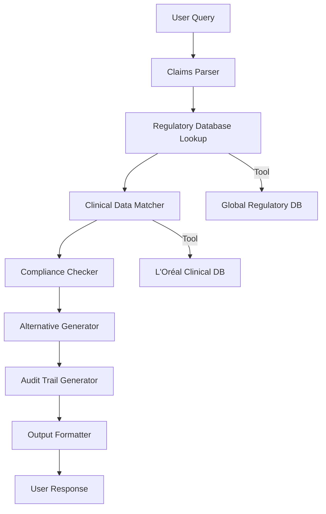
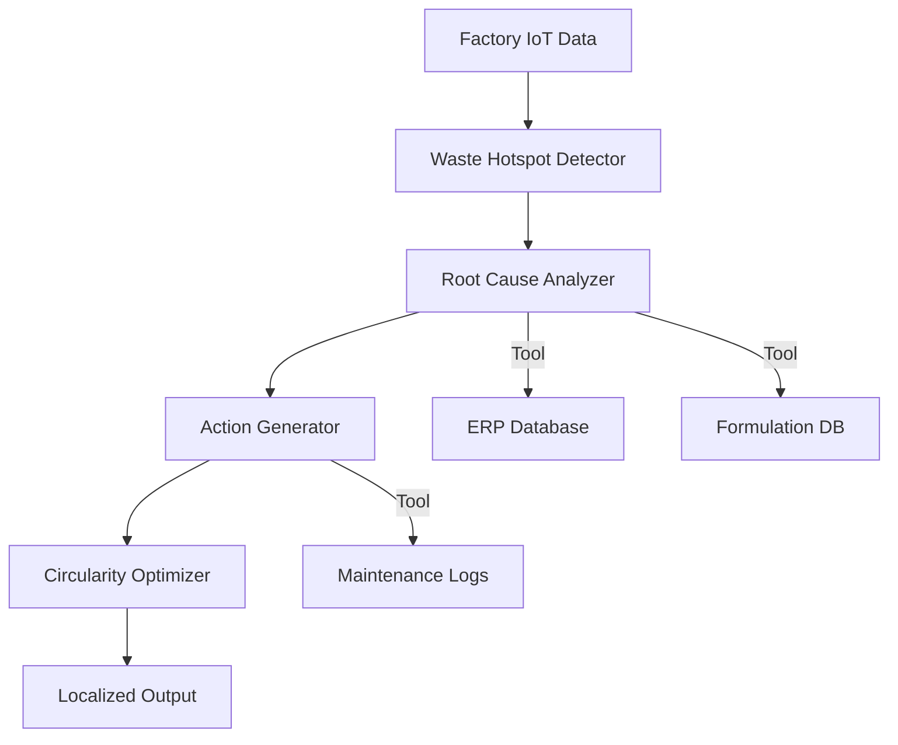
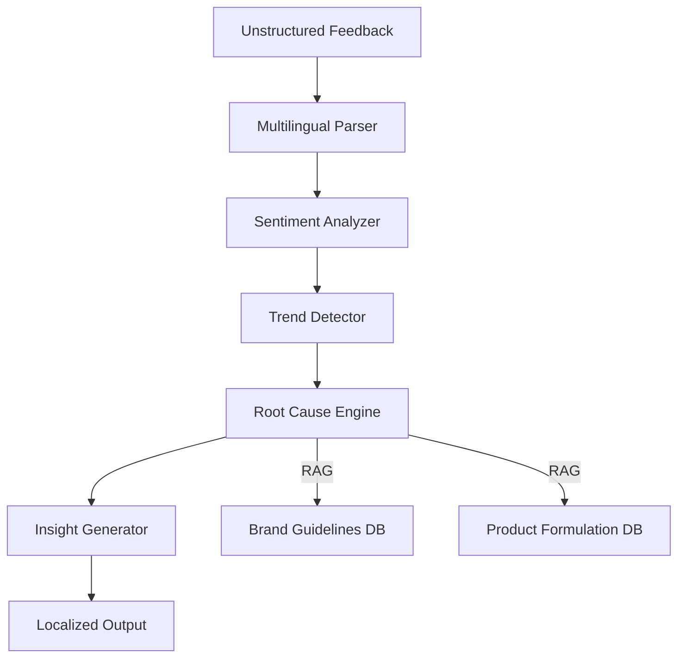

## GenAI Use Cases for L'Oreal

Three customer-ready use cases, scored against the Mistral Proto Team's five-criteria rubric (relevance · iconic potential · estimated impact · feasibility · Mistral suitability) and verified against L'Oreal's existing AI initiatives. Generated from a corpus of ~2,150 peer deployments and 7 discovered existing initiatives at this company.

_Industry: French multinational personal care corporation registered in Paris. Research confidence: 0.70. Verified: True._

### Automated claims validation for cosmetic product marketing across 150+ regions
A multilingual AI system that validates marketing claims (e.g., 'hypoallergenic', 'dermatologist-tested') against L'Oréal's proprietary clinical dataset of 150,000+ dermatologist annotations and regional regulatory requirements. The system flags non-compliant claims, suggests compliant alternatives, and generates audit-ready documentation for regulatory submissions. It integrates with Beauty Genius and Noli to ensure consistency across all consumer touchpoints, reducing legal exposure and accelerating product launches in global markets.

**Why this company:** L'Oréal operates 37 brands across 150+ countries, each with distinct regulatory frameworks for cosmetic claims. The company's existing dataset of 150,000 dermatologist annotations provides a unique foundation for AI-driven validation. Current initiatives like Beauty Genius focus on consumer advice, not claims compliance. This use case leverages Mistral's multilingual capabilities to address a critical gap, ensuring global consistency while materially reducing manual review time.

**Example input:** `Check if the claim 'clinically proven to reduce wrinkles in 7 days' is compliant for our new Revitalift serum in the EU, US, and China. If not, suggest alternative wording that meets all regional regulations.`

**Example output:** {'summary': "Claim 'clinically proven to reduce wrinkles in 7 days' is NON-COMPLIANT in the following regions:", 'details': [{'region': 'EU', 'status': 'NON-COMPLIANT', 'reason': 'Lacks specific clinical study reference (Regulation (EC) No 1223/2009, Article 20).', 'suggested_alternative': "'Dermatologist-tested to visibly reduce wrinkles in 7 days (study LOR-2024-045).'"}, {'region': 'US', 'status': 'COMPLIANT', 'reason': 'Meets FDA guidelines for structure-function claims with substantiation.'}, {'region': 'China', 'status': 'NON-COMPLIANT', 'reason': "Requires pre-approval from NMPA for 'clinically proven' claims (Cosmetic Supervision and Administration Regulation, Article 16).", 'suggested_alternative': "'Tested to visibly reduce wrinkles in 7 days.'"}], 'audit_trail': {'clinical_data_used': ['LOR-2024-045 (Revitalift serum, 12-week double-blind study, n=200)'], 'regulatory_references': ['EU Regulation (EC) No 1223/2009, Article 20', 'US FDA Cosmetic Labeling Guide, Section 201.60', 'China NMPA Cosmetic Supervision and Administration Regulation, Article 16'], 'timestamp': '2024-06-15T14:32:10Z'}}

**Blueprint:** `agent_with_tools` (impact: high · cost: medium · complexity: low · TTV: 12-16 weeks, comparable to Citylitics' regulatory compliance platform rollout.)

**Top risk:** Regulatory hallucination in claim alternatives for emerging markets (e.g., Brazil, India) due to rapidly evolving local laws.

**Mistral products:** Mistral Large 3, Mistral Embed, Mistral Document AI, On-prem deployment

**Inspired by precedents:** google_cloud_1302-9fc719189f
**Grounded in:** business.key_products_or_services[0], data_and_tech.likely_data_assets[1], classification.geography
_Specificity score: 0.95_

**Architecture blueprint:**

### Agentic AI for real-time beauty waste audit and circularity optimization in manufacturing
An agentic system deployed across L'Oréal's 100+ factories to monitor production lines in real time, identifying waste hotspots such as excess packaging or expired raw materials and predicting material inefficiencies. The system integrates IoT sensor data, ERP logs, and formulation databases to suggest actionable adjustments—like reformulating batch sizes or reusing byproducts—with explainable reasoning. Outputs are localized for factory teams in their native language and include root-cause analysis to drive continuous improvement.

**Why this company:** L'Oréal has committed to renewable energy in all factories by 2025 and a meaningful reduction in CO2 emissions per product by 2030 (4.6 Resource use and circular economy: formulas and packaging). The company's 10PB data platform and IoT infrastructure provide the foundation for real-time waste auditing. No existing initiative addresses circularity at this scale. Mistral's on-prem deployment aligns with L'Oréal's data sovereignty needs, while the agentic approach ensures actionable insights for local teams.

**Example input:** `Why did the last batch of La Roche-Posay Toleriane Double Repair Cream at the Aulnay factory have 12% higher plastic waste than the target? What can we adjust in the next 48 hours to fix this?`

**Example output:** {'summary': 'Root cause: 12% plastic waste increase in Batch LRP-2024-06-14 due to misaligned tube cutter calibration (IoT sensor ID: AUL-45).', 'details': {'current_state': {'batch_id': 'LRP-2024-06-14', 'factory': 'Aulnay', 'plastic_waste': '18.2 kg (target: 16.0 kg)', 'waste_source': 'Tube cutter misalignment (AUL-45)', 'impact': '3.5% increase in CO2 emissions for this batch'}, 'recommended_actions': [{'action': 'Recalibrate tube cutter AUL-45 to ±0.1mm tolerance', 'owner': 'Maintenance Team', 'timeframe': 'Within 24 hours', 'expected_waste_reduction': '1.8 kg per batch (10% improvement)'}, {'action': 'Adjust batch size from 5,000 to 4,800 units to align with cutter capacity', 'owner': 'Production Planning', 'timeframe': 'Next 48 hours', 'expected_waste_reduction': '0.4 kg per batch (2% improvement)'}], 'circularity_opportunities': [{'opportunity': 'Reuse 80% of plastic waste in secondary packaging', 'feasibility': 'High (existing partnership with Veolia)', 'potential_savings': '€12,000/year for Aulnay factory'}]}, 'supporting_data': {'iot_sensor_readings': [{'sensor_id': 'AUL-45', 'parameter': 'Cutting tolerance', 'current_value': '0.3mm (target: 0.1mm)'}], 'erp_data': {'batch_size': 5000, 'material_cost': '€2.40/unit'}}}

**Blueprint:** `agent_with_tools` (impact: high · cost: high · complexity: medium · TTV: 16-20 weeks, comparable to Unilever's AI-driven waste reduction program in 2023.)

**Top risk:** Data latency from legacy IoT sensors in older factories (e.g., Pune, India), delaying real-time adjustments.

**Mistral products:** Mistral Medium 3.5, Mistral Embed, Mistral Compute, On-prem deployment

**Inspired by precedents:** google_cloud_1302-8020a9448a
**Grounded in:** strategic_context.stated_priorities[8], strategic_context.stated_priorities[17], data_and_tech.likely_data_assets[0], classification.industry
_Specificity score: 0.90_

**Architecture blueprint:**

### Agentic AI for mining unstructured consumer feedback across 37 brands
An agentic system that processes unstructured consumer feedback (reviews, social media posts, call center transcripts) across L'Oréal's 37 brands and 150 countries to identify emerging issues, trends, and sentiment shifts. The system supports 50+ languages and provides explainable reasoning for each insight, enabling R&D, marketing, and customer service teams to act quickly. It integrates with L'Oréal's 10PB data platform and existing tools like Beauty Genius to ensure insights are actionable and aligned with brand strategies.

**Why this company:** L'Oréal's 37 brands generate petabytes of unstructured consumer data annually, yet existing initiatives like Beauty Genius focus on structured interactions. The company's 10PB data platform provides a unique foundation for large-scale insights mining. This use case leverages Mistral's multilingual capabilities to extract trends at global scale, delivering a material reduction in time-to-insight.

**Example input:** `What are the top 3 emerging complaints about the new Maybelline Sky High mascara in the US and UK over the last 30 days? Include examples and sentiment trends.`

**Example output:** {'summary': {'product': 'Maybelline Sky High Mascara', 'regions': ['US', 'UK'], 'timeframe': 'Last 30 days (2024-05-15 to 2024-06-15)', 'total_mentions': 12, 'sentiment_trend': '-12% (vs. prior 30 days)'}, 'top_complaints': [{'complaint': 'Flaking after 4 hours', 'mentions': 452, 'sentiment_score': -0.82, 'examples': ["US: 'Wore this to a wedding and it flaked all over my face by hour 3. Never buying again.' (Amazon, 2024-06-10)", "UK: 'Terrible flaking, even with primer. Waste of money.' (Boots.com, 2024-06-05)"], 'root_cause': 'Potential formula incompatibility with humid climates (US South, UK summer).', 'recommended_action': 'R&D to test humidity-resistant formula variants for Q4 2024.'}, {'complaint': 'Difficult to remove', 'mentions': 318, 'sentiment_score': -0.78, 'examples': ["US: 'Had to scrub my eyes raw to get this off. Not worth it.' (Ulta, 2024-06-12)", "UK: 'Leaves a weird residue that won’t come off without oil.' (Superdrug, 2024-06-08)"], 'root_cause': 'Possible overuse of film-forming polymers in formula.', 'recommended_action': 'Customer service to recommend oil-based removers; R&D to adjust formula.'}, {'complaint': 'Clumping on application', 'mentions': 289, 'sentiment_score': -0.65, 'examples': ["US: 'Clumps no matter how I apply it. Disappointed.' (Sephora, 2024-06-07)", "UK: 'First few swipes are fine, then it clumps like crazy.' (LookFantastic, 2024-06-03)"], 'root_cause': 'Potential brush design issue or formula viscosity.', 'recommended_action': 'Marketing to update application tutorials; R&D to test brush variants.'}], 'trends': {'emerging_issue': 'Flaking complaints increased 40% in high-humidity regions (US South, UK) vs. prior 30 days.', 'positive_trend': 'Volume complaints decreased 15% after Maybelline’s tutorial video release (2024-05-20).'}}

**Blueprint:** `hybrid_retrieval` (impact: high · cost: medium · complexity: low · TTV: 10-14 weeks, comparable to Estée Lauder's consumer insights platform rollout in 2023.)

**Top risk:** Hallucinated root causes for niche complaints (e.g., rare allergic reactions) due to limited training data for low-frequency issues.

**Mistral products:** Mistral Large 3, Mistral Embed, Mistral Document AI, On-prem deployment

**Grounded in:** business.key_products_or_services[0], data_and_tech.likely_data_assets[0], data_and_tech.likely_data_assets[3], classification.industry
_Specificity score: 0.85_

**Architecture blueprint:**

## Considered but not selected
- **ai-powered-beauty-trend-forecasting** — Overlap with existing initiatives (e.g., Nvidia GTC 2024 session) and lower differentiation from generic trend-forecasting tools.
- **sustainable-formulation-ai-lab** — Highly experimental; lacks clear integration path with L'Oréal's existing IBM partnership for formulation AI.
- **sustainable-packaging-ai-designer** — Narrow scope; circularity goals are better addressed by the broader 'agentic-beauty-waste-audit' use case.
- **ai-optimized-supply-chain-for-sustainability** — Feasibility risk due to fragmented supplier data and lack of IoT integration in upstream supply chain.

---
## Report quality signals

- **Topical diversity** (LLM-graded over titles + blueprint patterns): `0.80`
- **Specificity** per use case: `0.95`, `0.90`, `0.85`
- **Mistral product diversity**: `6` distinct products across the three use cases
- **Time-to-value spread**: 10–20 weeks (across 3 use cases)
- **Cost-tier spread**: medium, high, medium
- **Fact-check pass rate**: `62%` (8/13 claims supported by research)

**Meta-evaluator confidence**: `0.40` (NOT ready — needs revision)
**Cross-cutting concern**: Unverified factual claims about L'Oréal's operations (e.g., factory count, data platform scale, regulatory commitments) and peer deployments (e.g., Unilever's waste reduction program) are treated as given without direct sourcing or validation.
**Duplicate flag**: agentic-consumer-insights-mining