# Pipeline trace — L'Oreal

Started: `2026-05-08T14:02:20.208260+00:00`. Total wall time: `391.4s` across `40` recorded actions.

## Per-step time totals

| Step | Calls | Total time | Avg time |
|---|---:|---:|---:|
| `research` | 1 | 11.33s | 11334ms |
| `gap_fill` | 5 | 19.16s | 3832ms |
| `retrieve` | 2 | 0.58s | 291ms |
| `generate` | 4 | 89.17s | 22292ms |
| `generate.web_search` | 8 | 27.06s | 3383ms |
| `score` | 2 | 41.50s | 20750ms |
| `verify` | 6 | 19.41s | 3235ms |
| `enrich` | 2 | 137.97s | 68987ms |
| `polish` | 6 | 16.72s | 2786ms |
| `meta_eval` | 2 | 22.14s | 11068ms |
| `quality_signals` | 2 | 5.52s | 2760ms |

## Chronological event log

- `14:02:22.805` **[research]** `mistral-medium-2604.chat.complete` — 11334ms
   - inputs: synthesize CompanyContext for L'Oreal | depth=medium
   - outputs: industry='French multinational personal care corporation registered in Paris' verified=True conf=0.75
- `14:02:34.814` **[gap_fill]** `mistral-small-2603.chat.complete` — 1111ms
   - inputs: generate gap queries | fields=['business_model', 'products', 'data_assets', 'priorities']
   - outputs: queries=4
- `14:02:42.722` **[gap_fill]** `mistral-medium-2604.chat.complete` — 14353ms
   - inputs: re-synthesize w/ 4 gap-fill blocks
   - outputs: priorities=0 data_assets=0 products=0
- `14:02:57.099` **[gap_fill]** `mistral-small-2603.chat.complete` — 1511ms
   - inputs: layer-2 extract field=priorities
   - outputs: items=19
- `14:02:58.646` **[gap_fill]** `mistral-small-2603.chat.complete` — 895ms
   - inputs: layer-2 extract field=data_assets
   - outputs: items=6
- `14:02:59.571` **[gap_fill]** `mistral-small-2603.chat.complete` — 1290ms
   - inputs: layer-2 extract field=products
   - outputs: items=21
- `14:03:00.883` **[retrieve]** `mistral-embed.embeddings.create` — 242ms
   - inputs: company_query | industries='French multinational personal care corporation registered in Paris'
   - outputs: embedded 1024-dim query vector
- `14:03:01.126` **[retrieve]** `precedent_corpus.cosine_topk` — 340ms
   - inputs: k=8 min_depth=0.4 target="L'Oreal"
   - outputs: retrieved 8 | mmr=True | top_sim=0.769
- `14:03:02.118` **[generate]** `mistral-medium-2604.chat.complete` — 3865ms
   - inputs: iteration=0 tool_calls_used=0/4 tools=on
   - outputs: tool_calls=4 | content_chars=0
- `14:03:06.005` **[generate.web_search]** `tavily.search` — 3257ms
   - inputs: query="L'Oréal 10 petabytes beauty data platform details"
   - outputs: 2 raw results
- `14:03:09.808` **[generate.web_search]** `tavily.search` — 4526ms
   - inputs: query="L'Oréal EcoBeautyScore consortium partners 2024"
   - outputs: 2 raw results
- `14:03:15.029` **[generate.web_search]** `tavily.search` — 3117ms
   - inputs: query="L'Oréal Noli AI marketplace face scan datapoints"
   - outputs: 2 raw results
- `14:03:21.208` **[generate.web_search]** `tavily.search` — 4060ms
   - inputs: query="L'Oréal patent AI formulation discovery IBM partnership"
   - outputs: 2 raw results
- `14:03:32.307` **[generate]** `mistral-medium-2604.chat.complete` — 40446ms
   - inputs: iteration=1 tool_calls_used=4/4 tools=off
   - outputs: tool_calls=0 | content_chars=23349
- `14:04:13.202` **[generate]** `mistral-medium-2604.chat.complete` — 1989ms
   - inputs: iteration=0 tool_calls_used=0/4 tools=on
   - outputs: tool_calls=4 | content_chars=0
- `14:04:15.210` **[generate.web_search]** `tavily.search` — 2452ms
   - inputs: query="L'Oréal 2024 sustainability goals EcoBeautyScore circularity"
   - outputs: 2 raw results
- `14:04:17.991` **[generate.web_search]** `tavily.search` — 2642ms
   - inputs: query="L'Oréal Noli AI marketplace face scan data points 2024"
   - outputs: 2 raw results
- `14:04:21.790` **[generate.web_search]** `tavily.search` — 3984ms
   - inputs: query="L'Oréal 37 brands data platform 10 petabytes beauty routines"
   - outputs: 2 raw results
- `14:04:26.737` **[generate.web_search]** `tavily.search` — 3022ms
   - inputs: query="L'Oréal ModiFace AR virtual try-on patents acquisitions"
   - outputs: 2 raw results
- `14:04:31.360` **[generate]** `mistral-medium-2604.chat.complete` — 42867ms
   - inputs: iteration=1 tool_calls_used=4/4 tools=off
   - outputs: tool_calls=0 | content_chars=23286
- `14:05:14.679` **[score]** `mistral-small-2603.chat.complete` — 19378ms
   - inputs: self-consistency pass T=0.4
   - outputs: scored 12 candidates
- `14:05:14.676` **[score]** `mistral-small-2603.chat.complete` — 22122ms
   - inputs: self-consistency pass T=0.2
   - outputs: scored 12 candidates
- `14:05:36.845` **[verify]** `tavily.search` — 2332ms
   - inputs: candidate=ai-claims-validation-system | query="L'Oreal Automated claims validation for cosmetic product mar"
   - outputs: 4 results
- `14:05:36.846` **[verify]** `tavily.search` — 2379ms
   - inputs: candidate=agentic-consumer-insights-mining | query="L'Oreal Agentic AI for mining unstructured consumer feedback"
   - outputs: 4 results
- `14:05:36.845` **[verify]** `tavily.search` — 3378ms
   - inputs: candidate=agentic-beauty-waste-audit | query="L'Oreal Agentic AI for real-time beauty waste audit and circ"
   - outputs: 4 results
- `14:05:40.748` **[verify]** `mistral-small-2603.chat.complete` — 1972ms
   - inputs: verdict for ai-claims-validation-system
   - outputs: verdict='pass'
- `14:05:40.312` **[verify]** `mistral-small-2603.chat.complete` — 2701ms
   - inputs: verdict for agentic-consumer-insights-mining
   - outputs: verdict='pass'
- `14:05:41.851` **[verify]** `mistral-small-2603.chat.complete` — 6650ms
   - inputs: verdict for agentic-beauty-waste-audit
   - outputs: verdict='pass'
- `14:05:48.538` **[enrich]** `mistral-large-2512.chat.complete` — 67456ms
   - inputs: top_3 candidates=['ai-claims-validation-system', 'agentic-beauty-waste-audit', 'agentic-consumer-insights-mining']
   - outputs: enriched 3 use cases
- `14:06:55.998` **[polish]** `mistral-small-2603.chat.complete` — 2876ms
   - inputs: use_case=ai-claims-validation-system unanchored=True opaque_ev=False
   - outputs: polished 4 fields
- `14:06:58.874` **[polish]** `mistral-small-2603.chat.complete` — 2459ms
   - inputs: use_case=agentic-beauty-waste-audit unanchored=True opaque_ev=False
   - outputs: polished 4 fields
- `14:07:01.334` **[polish]** `mistral-small-2603.chat.complete` — 1971ms
   - inputs: use_case=agentic-consumer-insights-mining unanchored=True opaque_ev=False
   - outputs: polished 4 fields
- `14:07:03.343` **[meta_eval]** `mistral-medium-2604.chat.complete` — 11512ms
   - inputs: reviewing 3 use cases
   - outputs: review + claims
- `14:07:14.893` **[enrich]** `mistral-large-2512.chat.complete` — 70517ms
   - inputs: top_3 candidates=['ai-claims-validation-system', 'agentic-consumer-insights-mining', 'ai-powered-beauty-trend-forecasting']
   - outputs: enriched 3 use cases
- `14:08:25.414` **[polish]** `mistral-small-2603.chat.complete` — 3123ms
   - inputs: use_case=ai-claims-validation-system unanchored=True opaque_ev=False
   - outputs: polished 4 fields
- `14:08:28.538` **[polish]** `mistral-small-2603.chat.complete` — 3359ms
   - inputs: use_case=agentic-consumer-insights-mining unanchored=True opaque_ev=False
   - outputs: polished 4 fields
- `14:08:31.897` **[polish]** `mistral-small-2603.chat.complete` — 2928ms
   - inputs: use_case=ai-powered-beauty-trend-forecasting unanchored=True opaque_ev=False
   - outputs: polished 4 fields
- `14:08:34.851` **[meta_eval]** `mistral-medium-2604.chat.complete` — 10624ms
   - inputs: reviewing 3 use cases
   - outputs: review + claims
- `14:08:46.072` **[quality_signals]** `mistral-small-2603.chat.complete` — 3653ms
   - inputs: specificity grade (3 use cases)
   - outputs: scored 3 use cases
- `14:08:49.725` **[quality_signals]** `mistral-small-2603.chat.complete` — 1868ms
   - inputs: diversity grade
   - outputs: diversity=0.8

## Mermaid sequence diagram

```mermaid
sequenceDiagram
    autonumber
    participant pipeline as pipeline
    participant mistral_medium_2604 as mistral-medium-2604
    participant mistral_small_2603 as mistral-small-2603
    participant mistral_embed as mistral-embed
    participant precedent_corpus as precedent_corpus
    participant tavily as tavily
    participant mistral_large_2512 as mistral-large-2512
    pipeline->>mistral_medium_2604: research: chat.complete (11334ms)
    mistral_medium_2604-->>pipeline: industry='French multinational personal care corporation reg
    pipeline->>mistral_small_2603: gap_fill: chat.complete (1111ms)
    mistral_small_2603-->>pipeline: queries=4
    pipeline->>mistral_medium_2604: gap_fill: chat.complete (14353ms)
    mistral_medium_2604-->>pipeline: priorities=0 data_assets=0 products=0
    pipeline->>mistral_small_2603: gap_fill: chat.complete (1511ms)
    mistral_small_2603-->>pipeline: items=19
    pipeline->>mistral_small_2603: gap_fill: chat.complete (895ms)
    mistral_small_2603-->>pipeline: items=6
    pipeline->>mistral_small_2603: gap_fill: chat.complete (1290ms)
    mistral_small_2603-->>pipeline: items=21
    pipeline->>mistral_embed: retrieve: embeddings.create (242ms)
    mistral_embed-->>pipeline: embedded 1024-dim query vector
    pipeline->>precedent_corpus: retrieve: cosine_topk (340ms)
    precedent_corpus-->>pipeline: retrieved 8 | mmr=True | top_sim=0.769
    pipeline->>mistral_medium_2604: generate: chat.complete (3865ms)
    mistral_medium_2604-->>pipeline: tool_calls=4 | content_chars=0
    pipeline->>tavily: generate.web_search: search (3257ms)
    tavily-->>pipeline: 2 raw results
    pipeline->>tavily: generate.web_search: search (4526ms)
    tavily-->>pipeline: 2 raw results
    pipeline->>tavily: generate.web_search: search (3117ms)
    tavily-->>pipeline: 2 raw results
    pipeline->>tavily: generate.web_search: search (4060ms)
    tavily-->>pipeline: 2 raw results
    pipeline->>mistral_medium_2604: generate: chat.complete (40446ms)
    mistral_medium_2604-->>pipeline: tool_calls=0 | content_chars=23349
    pipeline->>mistral_medium_2604: generate: chat.complete (1989ms)
    mistral_medium_2604-->>pipeline: tool_calls=4 | content_chars=0
    pipeline->>tavily: generate.web_search: search (2452ms)
    tavily-->>pipeline: 2 raw results
    pipeline->>tavily: generate.web_search: search (2642ms)
    tavily-->>pipeline: 2 raw results
    pipeline->>tavily: generate.web_search: search (3984ms)
    tavily-->>pipeline: 2 raw results
    pipeline->>tavily: generate.web_search: search (3022ms)
    tavily-->>pipeline: 2 raw results
    pipeline->>mistral_medium_2604: generate: chat.complete (42867ms)
    mistral_medium_2604-->>pipeline: tool_calls=0 | content_chars=23286
    pipeline->>mistral_small_2603: score: chat.complete (19378ms)
    mistral_small_2603-->>pipeline: scored 12 candidates
    pipeline->>mistral_small_2603: score: chat.complete (22122ms)
    mistral_small_2603-->>pipeline: scored 12 candidates
    pipeline->>tavily: verify: search (2332ms)
    tavily-->>pipeline: 4 results
    pipeline->>tavily: verify: search (2379ms)
    tavily-->>pipeline: 4 results
    pipeline->>tavily: verify: search (3378ms)
    tavily-->>pipeline: 4 results
    pipeline->>mistral_small_2603: verify: chat.complete (1972ms)
    mistral_small_2603-->>pipeline: verdict='pass'
    pipeline->>mistral_small_2603: verify: chat.complete (2701ms)
    mistral_small_2603-->>pipeline: verdict='pass'
    pipeline->>mistral_small_2603: verify: chat.complete (6650ms)
    mistral_small_2603-->>pipeline: verdict='pass'
    pipeline->>mistral_large_2512: enrich: chat.complete (67456ms)
    mistral_large_2512-->>pipeline: enriched 3 use cases
    pipeline->>mistral_small_2603: polish: chat.complete (2876ms)
    mistral_small_2603-->>pipeline: polished 4 fields
    pipeline->>mistral_small_2603: polish: chat.complete (2459ms)
    mistral_small_2603-->>pipeline: polished 4 fields
    pipeline->>mistral_small_2603: polish: chat.complete (1971ms)
    mistral_small_2603-->>pipeline: polished 4 fields
    pipeline->>mistral_medium_2604: meta_eval: chat.complete (11512ms)
    mistral_medium_2604-->>pipeline: review + claims
    pipeline->>mistral_large_2512: enrich: chat.complete (70517ms)
    mistral_large_2512-->>pipeline: enriched 3 use cases
    pipeline->>mistral_small_2603: polish: chat.complete (3123ms)
    mistral_small_2603-->>pipeline: polished 4 fields
    pipeline->>mistral_small_2603: polish: chat.complete (3359ms)
    mistral_small_2603-->>pipeline: polished 4 fields
    pipeline->>mistral_small_2603: polish: chat.complete (2928ms)
    mistral_small_2603-->>pipeline: polished 4 fields
    pipeline->>mistral_medium_2604: meta_eval: chat.complete (10624ms)
    mistral_medium_2604-->>pipeline: review + claims
    pipeline->>mistral_small_2603: quality_signals: chat.complete (3653ms)
    mistral_small_2603-->>pipeline: scored 3 use cases
    pipeline->>mistral_small_2603: quality_signals: chat.complete (1868ms)
    mistral_small_2603-->>pipeline: diversity=0.8
```

