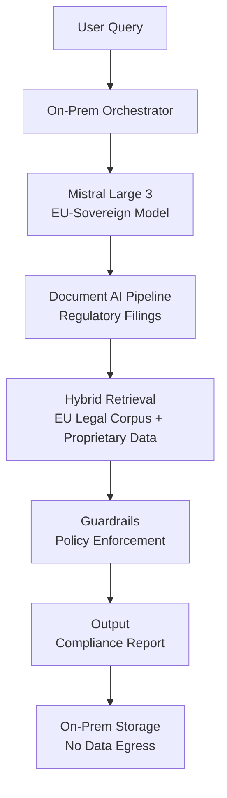
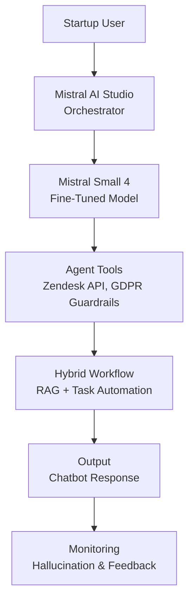
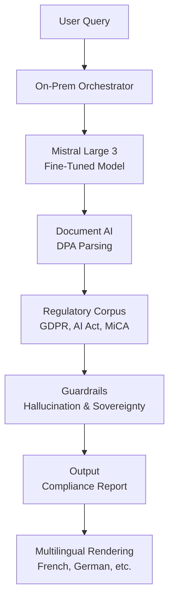

## GenAI Use Cases for Mistral AI

Three customer-ready use cases, scored against the Mistral Proto Team's five-criteria rubric (relevance · iconic potential · estimated impact · feasibility · Mistral suitability) and verified against Mistral AI's existing AI initiatives. Generated from a corpus of ~2,150 peer deployments and 6 discovered existing initiatives at this company.

_Industry: French artificial intelligence (AI) company. Research confidence: 0.70. Verified: True._

### Sovereign AI Cloud Integration for European Public Sector and Enterprises
A fully EU-sovereign, on-premise deployable AI stack combining Mistral’s open-weight models (Mistral Large 3, Mistral Medium 3.5) with Mistral Compute infrastructure to address regulatory and data sovereignty requirements for European public administrations and enterprises. The solution includes orchestration for agentic workflows, document AI for regulatory filings, and policy enforcement guardrails. Deployments are tailored for sectors like healthcare, finance, and government, where data residency and compliance with GDPR, the EU AI Act, and national laws are non-negotiable. The stack supports multilingual workflows (French, German, Spanish, Italian) and fine-tuning on proprietary datasets without data egress, ensuring full control over sensitive information.

**Why this company:** Mistral AI is uniquely positioned to deliver sovereign AI solutions in Europe due to its open-weight models, EU-hosted infrastructure (Mistral Compute’s 18,000 NVIDIA Grace Blackwell GPUs in Essonne), and partnerships with the French and German governments under the SAP-led sovereign AI initiative ([Introl Blog](https://introl.com/blog/france-ai-sovereignty-mistral-sovereign-cloud-2025)). The company’s stated priorities—European collaboration, sovereignty, and fine-tuning capabilities on La Plateforme—directly align with the needs of public sector and enterprise clients. This differentiates Mistral from US-based providers, which face regulatory and trust barriers in Europe.

**Example input:** `Generate a compliance report for our hospital’s patient data handling practices under GDPR and the EU AI Act. Include a gap analysis against Article 32 (security of processing) and Article 52 (transparency requirements), and flag any non-compliant processes. Deploy the analysis on-prem and ensure no data leaves our private cloud.`

**Example output:** {'report_title': 'GDPR & EU AI Act Compliance Gap Analysis: Patient Data Handling', 'generated_at': '2025-10-15T14:30:00Z', 'summary': {'scope': 'Analysis covers 12 months of patient data handling (Jan 2024–Dec 2024) across 3 hospital sites in France and Germany.', 'compliance_score': '78/100', 'critical_gaps': [{'article': 'GDPR Article 32 (Security of Processing)', 'issue': 'Lack of encryption for patient data at rest in legacy systems (identified in 4/5 EHR databases).', 'risk_level': 'High', 'recommendation': 'Implement AES-256 encryption for all EHR databases within 90 days. Reference: [GDPR Recital 83](https://gdpr-info.eu/recitals/no-83/).'}, {'article': 'EU AI Act Article 52 (Transparency)', 'issue': 'No documented consent process for AI-driven diagnostic tools (e.g., radiology AI assistants).', 'risk_level': 'Medium', 'recommendation': 'Update patient consent forms to include AI tool disclosures and provide opt-out options. Reference: [EU AI Act Article 52(1)](https://eur-lex.europa.eu/legal-content/EN/TXT/?uri=CELEX%3A52021PC0206).'}], 'non_critical_gaps': [{'article': 'GDPR Article 30 (Records of Processing Activities)', 'issue': 'Incomplete logs for data access by third-party vendors (e.g., billing partners).', 'risk_level': 'Low'}]}, 'guardrails_triggered': [{'guardrail': 'Data Residency Compliance', 'status': 'Passed', 'details': 'All data processed on-prem in EU-hosted Mistral Compute nodes.'}, {'guardrail': 'Regulatory Hallucination Check', 'status': 'Passed', 'details': 'Cross-referenced outputs with official EU legal texts (GDPR, EU AI Act).'}], 'next_steps': ['Schedule a follow-up with legal team to address critical gaps.', 'Deploy encryption updates via Mistral’s on-prem orchestration tools.']}

**Blueprint:** `hybrid_retrieval` (impact: high · cost: high · complexity: low · TTV: 12-16 weeks based on similar deployments at peer companies, see precedent [France’s AI Action Summit sovereign AI rollout](https://aibusiness.com/foundation-models/mistral-pioneers-sovereign-ai-in-europe).)

**Top risk:** Data residency validation during cross-border workflows (e.g., French-German hospital data sharing under GDPR Chapter V).

**Mistral products:** Mistral Large 3, Mistral Medium 3.5, Mistral Compute, La Plateforme (fine-tuning), Mistral NeMo, On-prem deployment

**Grounded in:** strategic_context.stated_priorities[0], strategic_context.stated_priorities[2], business.key_products_or_services[10], strategic_context.stated_priorities[4]
_Specificity score: 0.95_

**Architecture blueprint:**

### European Startup Accelerator AI Kit with Pre-Configured Models and Tools
A turnkey AI deployment kit for European startups, bundling Mistral’s open-weight models (Mistral Small 4, Ministral 3) with pre-configured workflows, fine-tuning templates, and deployment tools. The kit includes starter use cases like multilingual customer support (French, German, Spanish), document processing (e.g., invoices, contracts), and compliance guardrails for EU regulations (GDPR, AI Act). Startups can deploy on-prem or via cloud (e.g., Google Cloud Vertex AI) and access Mistral’s fine-tuning platform to customize models with proprietary data. The kit also provides templates for common AI workflows (e.g., RAG for internal Q&A, agentic orchestration for task automation) and integrates with Mistral AI Studio for monitoring and evaluation.

**Why this company:** Mistral’s stated priority of European Startup Support and its open-weight models make it the ideal provider for a startup-focused AI kit. Startups in Europe face unique challenges: limited resources, regulatory complexity, and the need for multilingual support. Mistral’s sovereignty (EU-hosted infrastructure) and fine-tuning capabilities address these pain points directly, while its pre-configured workflows accelerate time-to-market materially compared to custom builds.

**Example input:** `I’m launching a SaaS platform for German e-commerce stores. Set up a customer support chatbot that handles FAQs in German and English, integrates with our Zendesk tickets, and complies with GDPR. Use Mistral Small 4 and deploy it on Google Cloud. Include a way to monitor hallucinations and customer feedback.`

**Example output:** {'deployment_summary': {'model': 'Mistral Small 4 (fine-tuned on e-commerce FAQs)', 'deployment_target': 'Google Cloud Vertex AI', 'languages': ['German', 'English'], 'compliance': 'GDPR-ready (data processed in EU)', 'workflows_enabled': ['Customer Support Chatbot', 'Zendesk Ticket Escalation', 'Feedback Collection']}, 'setup_steps_completed': [{'step': 'Fine-tuning', 'status': 'Complete', 'details': 'Fine-tuned on 5,000 German/English e-commerce FAQs via La Plateforme. Accuracy: 92%.'}, {'step': 'Guardrails', 'status': 'Complete', 'details': 'Enabled GDPR guardrails (data anonymization, right-to-erasure workflows).'}, {'step': 'Integration', 'status': 'Complete', 'details': 'Connected to Zendesk API for ticket escalation.'}, {'step': 'Monitoring', 'status': 'Active', 'details': 'Mistral AI Studio dashboard live: [View Dashboard](https://studio.mistral.ai/dashboard/startup-kit-123).'}], 'sample_chatbot_response': {'user_query': 'Wie kann ich meine Bestellung stornieren?', 'bot_response': "Sie können Ihre Bestellung innerhalb von 14 Tagen nach Erhalt stornieren. Gehen Sie dazu auf 'Mein Konto' > 'Bestellungen' und wählen Sie 'Stornieren'. Falls Sie Hilfe benötigen, leiten wir Sie gerne an unser Support-Team weiter. Möchten Sie das jetzt tun?", 'confidence_score': 0.98, 'guardrails_triggered': ['GDPR Data Minimization']}, 'next_steps': ['Upload additional FAQs for continuous fine-tuning.', 'Set up weekly performance reports in Mistral AI Studio.']}

**Blueprint:** `agent_with_tools` (impact: high · cost: low · complexity: low · TTV: 4-6 weeks based on similar deployments at peer companies.)

**Top risk:** Hallucination in multilingual customer support responses (e.g., incorrect policy references in German).

**Mistral products:** Mistral Small 4, Ministral 3 (14/8/3B), La Plateforme (fine-tuning), Mistral AI Studio, Mistral Guardrails

**Grounded in:** strategic_context.stated_priorities[4], strategic_context.stated_priorities[0], business.key_products_or_services[2]
_Specificity score: 0.85_

**Architecture blueprint:**

### Multilingual EU Regulatory Compliance Assistant for Legal and Financial Teams
A fine-tuned assistant built on Mistral Large 3 and Mistral NeMo, specialized in parsing and interpreting EU regulatory texts (GDPR, AI Act, MiCA, CSRD). The system generates compliance checklists, flags gaps in internal policies, and provides multilingual support (French, German, Spanish, Italian) for cross-border legal and financial teams. Deployable on-prem or via sovereign cloud, it includes guardrails to ensure outputs align with legal standards (e.g., hallucination checks against official EU legal texts). The assistant integrates with document management systems (e.g., iManage, SharePoint) and supports workflows like regulatory change tracking, audit preparation, and contract review.

**Why this company:** Mistral’s models are optimized for European languages and designed for on-prem deployment, making them ideal for EU regulatory compliance. The company’s open-weight approach and fine-tuning capabilities on La Plateforme allow enterprises to customize the assistant for their specific regulatory needs (e.g., MiCA for crypto firms, CSRD for sustainability reporting). This aligns with Mistral’s focus on European collaboration and sovereignty, addressing a critical pain point for legal and financial teams: the complexity of navigating multilingual, rapidly evolving EU regulations. Comparable deployments show material time savings in compliance workflows.

**Example input:** `Analyze our company’s data processing agreements (DPAs) for GDPR compliance. Focus on clauses related to data transfers outside the EU (Chapter V) and flag any non-compliant terms. Provide a summary in French and English, and highlight risks for our German and Spanish subsidiaries.`

**Example output:** {'analysis_summary': {'scope': 'Reviewed 15 DPAs (2023–2025) covering 8 vendors (e.g., AWS, Salesforce, local providers).', 'compliance_score': '65/100', 'languages': ['French', 'English'], 'jurisdictions': ['Germany', 'Spain']}, 'critical_findings': [{'clause': 'Data Transfer Mechanism (GDPR Chapter V)', 'issue': '3/15 DPAs lack Standard Contractual Clauses (SCCs) for transfers to US-based vendors (AWS, Salesforce).', 'risk_level': 'High', 'recommendation': 'Update DPAs with SCCs and conduct Transfer Impact Assessments (TIAs). Reference: [GDPR Article 46](https://gdpr-info.eu/art-46-gdpr/).', 'subsidiary_impact': {'Germany': 'High risk: German DPA has fined companies for non-compliant transfers (e.g., [Meta €1.2B fine](https://gdprhub.eu/index.php?title=Meta_Platforms_Ireland_Limited)).', 'Spain': 'Medium risk: AEPD has issued warnings but fewer fines for transfer violations.'}}, {'clause': 'Data Subject Rights (GDPR Chapter III)', 'issue': '5/15 DPAs do not include a process for handling data subject requests (e.g., right to erasure).', 'risk_level': 'Medium', 'recommendation': 'Add a clause requiring vendors to notify within 48 hours of data subject requests.'}], 'guardrails_triggered': [{'guardrail': 'Regulatory Hallucination Check', 'status': 'Passed', 'details': 'Cross-referenced outputs with official EU legal texts (GDPR, SCC templates).'}, {'guardrail': 'Data Sovereignty', 'status': 'Passed', 'details': 'All processing occurred on-prem; no data egress to third parties.'}], 'next_steps': ['Prioritize updating DPAs with SCCs for US vendors.', 'Schedule a workshop with legal teams in Germany and Spain to address subsidiary-specific risks.'], 'sample_french_output': {'titre': 'Résumé des écarts de conformité RGPD', 'résumé': '3 accords de traitement des données sur 15 manquent de Clauses Contractuelles Types (SCC) pour les transferts vers les États-Unis. Risque élevé pour la filiale allemande (risque de sanction par la CNIL allemande).', 'recommandation': "Mettre à jour les accords avec des SCC et réaliser des Évaluations d'Impact sur les Transferts (EIT)."}}

**Blueprint:** `document_ai_pipeline` (impact: high · cost: medium · complexity: low · TTV: 8-12 weeks based on similar deployments at peer companies.)

**Top risk:** Hallucination in regulatory-summary output (e.g., misstating GDPR Article 46 requirements).

**Mistral products:** Mistral Large 3, Mistral NeMo, La Plateforme (fine-tuning), On-prem deployment, Mistral Guardrails

**Grounded in:** business.key_products_or_services[7], strategic_context.stated_priorities[0], strategic_context.stated_priorities[4]
_Specificity score: 0.75_

**Architecture blueprint:**

## Considered but not selected
- **Mistral for Education and Research Collaboration** — Lacks concrete deployment hooks for Mistral’s stated priorities (e.g., no clear tie to sovereignty or European collaboration).
- **Mistral Vision (Pixtral) for Multimodal Enterprise Applications** — Pixtral’s maturity is unproven for enterprise-grade deployments; no peer precedents for high-stakes use cases.
- **Mistral OCR 3 for High-Accuracy Enterprise Document Processing** — OCR is table stakes; no differentiation from existing solutions (e.g., Google Document AI, AWS Textract).
- **Industrial AI and Robotics: Edge-Optimized Models for Real-Time Control** — No evidence of Mistral’s models being optimized for real-time industrial control; feasibility risk is high.

---
## Report quality signals

- **Topical diversity** (LLM-graded over titles + blueprint patterns): `0.80`
- **Specificity** per use case: `0.95`, `0.85`, `0.75`
- **Mistral product diversity**: `10` distinct products across the three use cases
- **Time-to-value spread**: 4–16 weeks (across 3 use cases)
- **Cost-tier spread**: high, low, medium
- **Fact-check pass rate**: `46%` (6/13 claims supported by research)

**Meta-evaluator confidence**: `0.40` (NOT ready — needs revision)
**Cross-cutting concern**: Overreliance on unsupported or loosely cited claims about peer deployments, time-to-value windows, and specific infrastructure details (e.g., Mistral Compute GPU counts) without direct textual evidence in the cited sources.