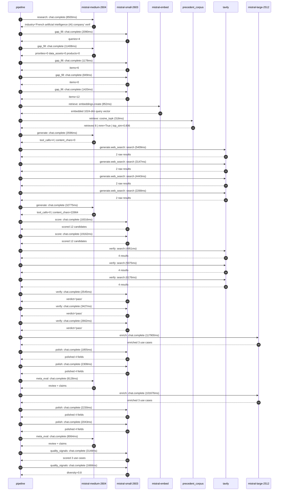

# Pipeline trace — Mistral AI

Started: `2026-05-08T14:08:52.475681+00:00`. Total wall time: `395.6s` across `32` recorded actions.

## Per-step time totals

| Step | Calls | Total time | Avg time |
|---|---:|---:|---:|
| `research` | 1 | 8.50s | 8500ms |
| `gap_fill` | 5 | 16.94s | 3389ms |
| `retrieve` | 2 | 1.17s | 585ms |
| `generate` | 2 | 36.37s | 18186ms |
| `generate.web_search` | 4 | 15.27s | 3817ms |
| `score` | 2 | 37.48s | 18739ms |
| `verify` | 6 | 24.84s | 4139ms |
| `enrich` | 2 | 219.58s | 109788ms |
| `polish` | 4 | 8.44s | 2109ms |
| `meta_eval` | 2 | 16.19s | 8096ms |
| `quality_signals` | 2 | 4.82s | 2408ms |

## Chronological event log

- `14:08:59.613` **[research]** `mistral-medium-2604.chat.complete` — 8500ms
   - inputs: synthesize CompanyContext for Mistral AI | depth=medium
   - outputs: industry='French artificial intelligence (AI) company' verified=True conf=0.75
- `14:09:10.118` **[gap_fill]** `mistral-small-2603.chat.complete` — 2090ms
   - inputs: generate gap queries | fields=['business_model', 'products', 'data_assets', 'priorities']
   - outputs: queries=4
- `14:09:24.884` **[gap_fill]** `mistral-medium-2604.chat.complete` — 11408ms
   - inputs: re-synthesize w/ 4 gap-fill blocks
   - outputs: priorities=0 data_assets=0 products=0
- `14:09:36.321` **[gap_fill]** `mistral-small-2603.chat.complete` — 1178ms
   - inputs: layer-2 extract field=priorities
   - outputs: items=6
- `14:09:37.526` **[gap_fill]** `mistral-small-2603.chat.complete` — 849ms
   - inputs: layer-2 extract field=data_assets
   - outputs: items=0
- `14:09:38.400` **[gap_fill]** `mistral-small-2603.chat.complete` — 1420ms
   - inputs: layer-2 extract field=products
   - outputs: items=12
- `14:09:39.852` **[retrieve]** `mistral-embed.embeddings.create` — 852ms
   - inputs: company_query | industries='French artificial intelligence (AI) company'
   - outputs: embedded 1024-dim query vector
- `14:09:40.704` **[retrieve]** `precedent_corpus.cosine_topk` — 318ms
   - inputs: k=8 min_depth=0.4 target='Mistral AI'
   - outputs: retrieved 8 | mmr=True | top_sim=0.806
- `14:09:42.619` **[generate]** `mistral-medium-2604.chat.complete` — 3596ms
   - inputs: iteration=0 tool_calls_used=0/4 tools=on
   - outputs: tool_calls=4 | content_chars=0
- `14:09:46.230` **[generate.web_search]** `tavily.search` — 5409ms
   - inputs: query='Mistral AI La Plateforme fine-tuning features 2025'
   - outputs: 2 raw results
- `14:09:55.828` **[generate.web_search]** `tavily.search` — 3147ms
   - inputs: query='Mistral AI partnerships with European cloud providers 2025'
   - outputs: 2 raw results
- `14:10:00.662` **[generate.web_search]** `tavily.search` — 4443ms
   - inputs: query='Mistral AI open-source models adoption in European enterprises 2025'
   - outputs: 2 raw results
- `14:10:09.016` **[generate.web_search]** `tavily.search` — 2268ms
   - inputs: query='Mistral AI product releases 2025 Le Chat Mistral NeMo Pixtral'
   - outputs: 2 raw results
- `14:10:13.632` **[generate]** `mistral-medium-2604.chat.complete` — 32775ms
   - inputs: iteration=1 tool_calls_used=4/4 tools=off
   - outputs: tool_calls=0 | content_chars=22664
- `14:10:47.311` **[score]** `mistral-small-2603.chat.complete` — 18316ms
   - inputs: self-consistency pass T=0.4
   - outputs: scored 12 candidates
- `14:10:47.308` **[score]** `mistral-small-2603.chat.complete` — 19162ms
   - inputs: self-consistency pass T=0.2
   - outputs: scored 12 candidates
- `14:11:06.522` **[verify]** `tavily.search` — 4951ms
   - inputs: candidate=European-startup-accelerator-ai-kit | query='Mistral AI European Startup Accelerator AI Kit with Pre-Conf'
   - outputs: 4 results
- `14:11:06.522` **[verify]** `tavily.search` — 5075ms
   - inputs: candidate=sovereign-ai-cloud-integration | query='Mistral AI Sovereign AI Cloud Integration for European Publi'
   - outputs: 4 results
- `14:11:06.522` **[verify]** `tavily.search` — 6176ms
   - inputs: candidate=multilingual-eu-regulatory-compliance-assistant | query='Mistral AI Multilingual EU Regulatory Compliance Assistant f'
   - outputs: 4 results
- `14:11:12.982` **[verify]** `mistral-small-2603.chat.complete` — 2545ms
   - inputs: verdict for European-startup-accelerator-ai-kit
   - outputs: verdict='pass'
- `14:11:13.779` **[verify]** `mistral-small-2603.chat.complete` — 3427ms
   - inputs: verdict for sovereign-ai-cloud-integration
   - outputs: verdict='pass'
- `14:11:15.779` **[verify]** `mistral-small-2603.chat.complete` — 2662ms
   - inputs: verdict for multilingual-eu-regulatory-compliance-assistant
   - outputs: verdict='pass'
- `14:11:18.478` **[enrich]** `mistral-large-2512.chat.complete` — 117900ms
   - inputs: top_3 candidates=['sovereign-ai-cloud-integration', 'European-startup-accelerator-ai-kit', 'multilingual-eu-regulatory-compliance-assistant']
   - outputs: enriched 3 use cases
- `14:13:16.381` **[polish]** `mistral-small-2603.chat.complete` — 1855ms
   - inputs: use_case=European-startup-accelerator-ai-kit unanchored=True opaque_ev=False
   - outputs: polished 4 fields
- `14:13:18.236` **[polish]** `mistral-small-2603.chat.complete` — 2308ms
   - inputs: use_case=multilingual-eu-regulatory-compliance-assistant unanchored=True opaque_ev=False
   - outputs: polished 4 fields
- `14:13:20.571` **[meta_eval]** `mistral-medium-2604.chat.complete` — 8128ms
   - inputs: reviewing 3 use cases
   - outputs: review + claims
- `14:13:28.731` **[enrich]** `mistral-large-2512.chat.complete` — 101676ms
   - inputs: top_3 candidates=['sovereign-ai-cloud-integration', 'multilingual-eu-regulatory-compliance-assistant', 'mistral-for-education-and-research']
   - outputs: enriched 3 use cases
- `14:15:10.409` **[polish]** `mistral-small-2603.chat.complete` — 2230ms
   - inputs: use_case=multilingual-eu-regulatory-compliance-assistant unanchored=True opaque_ev=False
   - outputs: polished 4 fields
- `14:15:12.640` **[polish]** `mistral-small-2603.chat.complete` — 2043ms
   - inputs: use_case=mistral-for-education-and-research unanchored=True opaque_ev=False
   - outputs: polished 4 fields
- `14:15:14.718` **[meta_eval]** `mistral-medium-2604.chat.complete` — 8064ms
   - inputs: reviewing 3 use cases
   - outputs: review + claims
- `14:15:23.231` **[quality_signals]** `mistral-small-2603.chat.complete` — 3148ms
   - inputs: specificity grade (3 use cases)
   - outputs: scored 3 use cases
- `14:15:26.379` **[quality_signals]** `mistral-small-2603.chat.complete` — 1668ms
   - inputs: diversity grade
   - outputs: diversity=0.8

## Mermaid sequence diagram

