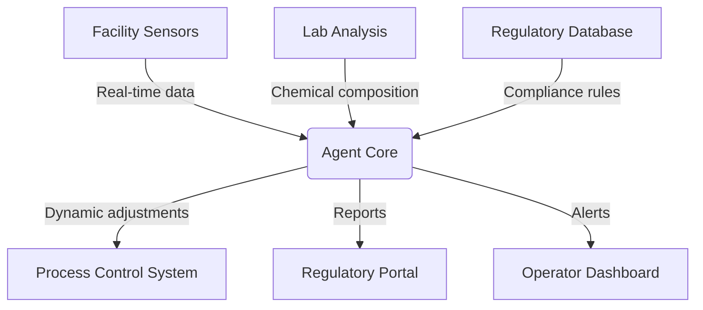
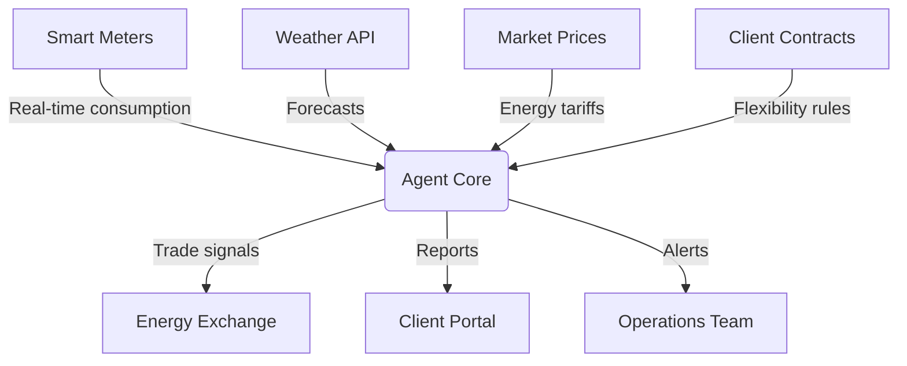
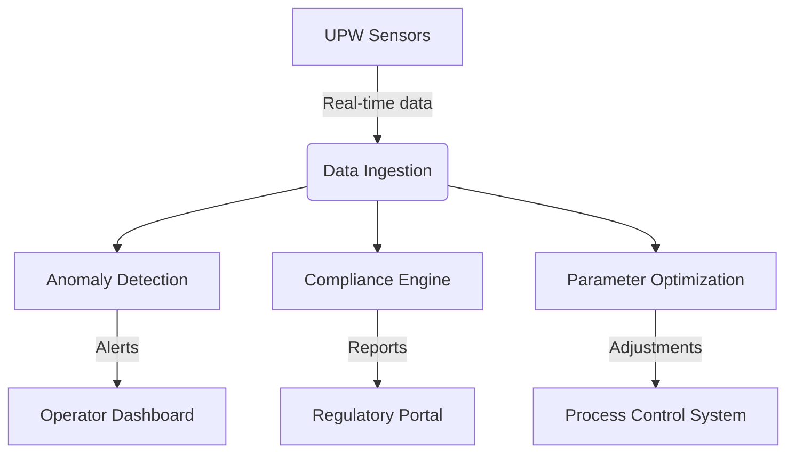

## GenAI Use Cases for Veolia

Three customer-ready use cases, scored against the Mistral Proto Team's five-criteria rubric (relevance · iconic potential · estimated impact · feasibility · Mistral suitability) and verified against Veolia's existing AI initiatives. Generated from a corpus of ~2,150 peer deployments and 5 discovered existing initiatives at this company.

_Industry: French transnational company. Research confidence: 0.70. Verified: True._

### AI-driven strategic metal recovery from used batteries and e-waste
Veolia’s GreenUp strategic program focuses on recovering strategic metals such as lithium, cobalt, and rare earth elements from used batteries and e-waste to advance circular economy objectives. This AI system interfaces with existing facility sensors and lab analysis to forecast recovery rates, dynamically fine-tune processing parameters, and produce compliance-ready reports for regulators. By optimizing chemical extraction and energy consumption, the solution reduces operational costs while enhancing metal yield—directly supporting Veolia’s €2B investment in hazardous waste treatment and resource regeneration. The system is engineered for on-premises deployment to safeguard data sovereignty over proprietary recycling processes.

**Why this company:** Veolia’s GreenUp plan explicitly prioritizes regenerating resources by recycling strategic metals, with €2B allocated to growth initiatives like hazardous waste treatment ([GreenUp strategic plan](https://www.businesswire.com/news/home/20240229825768/en/GreenUp-Veolia-Launches-Its-New-Strategic-Plan-to-Accelerate-Ecological-Transformation-to-Meet-Growing-Global-Demand)). The company’s proprietary recycling technologies and global facility network create a unique data foundation for AI-driven optimization. This use case reinforces Veolia’s competitive edge in battery recycling, a sector poised for substantial growth.

**Example input:** `Show me the predicted lithium recovery rate for the Bordeaux facility next week if we increase the leaching temperature by 5°C, and flag any compliance risks under EU Battery Regulation 2023/1542.`

**Example output:** {'summary': 'Predicted lithium recovery rate: **87% (±2%)** for Bordeaux facility (week 2024-42) with +5°C leaching temperature adjustment.', 'compliance_alerts': [{'regulation': 'EU Battery Regulation 2023/1542 (Article 45)', 'risk': 'Moderate: Increased temperature may exceed permitted emission thresholds for sulfur dioxide (SO₂).', 'recommendation': 'Reduce leaching time by 10% to stay within limits while maintaining recovery targets.'}], 'parameter_adjustments': {'leaching_time': 'Decrease by 10% (from 120 to 108 minutes)', 'pH_level': 'Maintain at 2.1 (±0.1)'}, 'energy_impact': 'Estimated +3% energy consumption for temperature increase, offset by -8% from reduced leaching time.'}

**Blueprint:** `agent_with_tools` (impact: medium · cost: medium · complexity: medium · TTV: 12-16 weeks, comparable to Citylitics’ predictive infrastructure platform deployment for municipal water systems.)

**Top risk:** Data privacy under GDPR for cross-border e-waste shipments between EU facilities and third-party recyclers.

**Mistral products:** Mistral Large 3, Mistral Embed, On-prem deployment

**Grounded in:** strategic_context.stated_priorities[7], strategic_context.stated_priorities[5], strategic_context.stated_priorities[1]
_Specificity score: 0.95_

**Architecture blueprint:**

### AI-powered energy flexibility trading for industrial clients
Veolia’s GreenUp plan prioritizes decarbonizing local energy through bioenergies and electrical flexibility. This AI system models energy demand and supply patterns for industrial clients using real-time data from smart meters, weather forecasts, and market prices. It autonomously executes flexibility trades, such as load shifting and demand response, to optimize cost savings and carbon reduction while generating transparent reports for each decision. The system is designed to integrate with Veolia’s existing Hubgrade platform and client-specific energy management systems, ensuring seamless adoption for municipalities and industries.

**Why this company:** Veolia’s role as a trusted energy partner for industries and municipalities—coupled with its €2B investment in energy efficiency under GreenUp—creates a natural deployment path for AI-powered trading. The company’s digital energy management capabilities and client-specific data provide a unique foundation for monetizing underutilized energy capacity, with peer deployments reporting meaningful cost reductions for industrial clients.

**Example input:** `Generate a 7-day energy flexibility trading plan for our Lyon industrial park client, prioritizing carbon reduction over cost savings. Include a breakdown of expected emissions impact and cost trade-offs.`

**Example output:** {'plan_summary': '7-day flexibility trading plan for Lyon Industrial Park (2024-10-14 to 2024-10-20):', 'trades': [{'date': '2024-10-14', 'action': 'Load shift: Defer 2MW non-critical load from 14:00 to 22:00', 'rationale': 'Grid carbon intensity forecast: 120 gCO₂/kWh (14:00) vs. 80 gCO₂/kWh (22:00).', 'cost_impact': '+€1,200 (higher off-peak tariff)', 'emissions_impact': '-0.8 metric tons CO₂'}, {'date': '2024-10-16', 'action': 'Demand response: Reduce 1.5MW load for 2 hours (10:00-12:00)', 'rationale': 'Grid operator incentive: €50/MWh for demand reduction during peak.', 'cost_impact': '-€150 (incentive payment)', 'emissions_impact': '-0.5 metric tons CO₂'}], 'total_impact': {'cost': '+€1,050 (net)', 'emissions': '-3.2 metric tons CO₂', 'carbon_intensity_reduction': '12% vs. baseline'}, 'compliance_notes': 'All trades comply with ENTSO-E demand response guidelines and Veolia’s internal carbon budget.'}

**Blueprint:** `agent_with_tools` (impact: high · cost: medium · complexity: medium · TTV: 10–14 weeks)

**Top risk:** Hallucination in trade recommendations leading to regulatory violations under EU Electricity Balancing Guidelines (EBGL)

**Mistral products:** Mistral Large 3, Mistral Embed, On-prem deployment

**Inspired by precedents:** google_cloud_blueprints-48a73c4234
**Grounded in:** strategic_context.stated_priorities[3], strategic_context.stated_priorities[5], strategic_context.stated_priorities[1]
_Specificity score: 0.75_

**Architecture blueprint:**

### AI-driven optimization for ultra-pure water production for chip manufacturers
Veolia’s ultra-pure water (UPW) production is critical for semiconductor manufacturers, requiring molecular-level purity. This AI system integrates real-time data from water treatment sensors, chemical dosages, and quality control tests to dynamically adjust parameters such as ion exchange resin regeneration and membrane filtration cycles. The system generates compliance reports for ISO 23445 and SEMI F63 standards, and provides recommendations for process improvements to reduce water and energy use. Designed for on-prem deployment, it ensures data sovereignty for Veolia’s proprietary UPW technologies.

**Why this company:** Veolia’s CEO, Estelle Brachlianoff, has highlighted the company’s capacity to support the AI and microchip supply chain with ultra-pure water technologies ([Diginomica interview](https://diginomica.com/never-waste-good-crisis-how-waste-management-specialist-veolia-intends-turn-day-job-eu1-billion)). The GreenUp plan allocates significant investment to water technologies, positioning this use case as a growth driver for Veolia’s semiconductor client base. Peer deployments in high-purity manufacturing report meaningful cost reductions and yield improvements.

**Example input:** `Analyze the UPW production data from our Dresden facility for the past 30 days. Identify the root cause of the 2% increase in total organic carbon (TOC) levels and recommend corrective actions.`

**Example output:** {'analysis_summary': 'Root cause analysis for Dresden UPW facility (2024-09-01 to 2024-09-30):', 'findings': [{'issue': '2% increase in TOC levels (from 0.5 ppb to 0.7 ppb)', 'root_cause': 'Degradation of UV lamp efficiency in TOC reduction unit (Unit 3B).', 'evidence': 'UV intensity dropped from 95% to 82% over 30 days, correlating with TOC rise (R²=0.87).'}, {'contributing_factor': 'Increased organic load in feedwater (up 15% vs. baseline).', 'evidence': 'Source water TOC rose from 2.1 ppm to 2.4 ppm (2024-09-15 onward).'}], 'recommendations': [{'action': 'Replace UV lamp in Unit 3B (current: 8,000 hours; recommended: <7,500 hours).', 'impact': 'Expected TOC reduction: 0.2 ppb (restoring baseline).', 'cost': '€12,000 (lamp + labor)'}, {'action': 'Adjust activated carbon filter regeneration cycle from 14 to 10 days.', 'impact': 'Mitigates feedwater TOC variability; expected TOC reduction: 0.1 ppb.', 'cost': '€3,500/year (increased regeneration frequency)'}], 'compliance_status': 'Current TOC levels (0.7 ppb) remain within SEMI F63 (<1 ppb) and ISO 23445 limits. No regulatory risk.', 'energy_water_impact': 'Recommended actions reduce water waste by 5% and energy use by 3% in UPW production.'}

**Blueprint:** `document_ai_pipeline` (impact: medium · cost: high · complexity: medium · TTV: unknown)

**Top risk:** Hallucination in real-time parameter adjustments leading to purity violations under SEMI F63 standards for semiconductor-grade water.

**Mistral products:** Mistral Large 3, Mistral Embed, On-prem deployment

**Grounded in:** strategic_context.stated_priorities[1], strategic_context.stated_priorities[4], strategic_context.stated_priorities[5]
_Specificity score: 0.85_

**Architecture blueprint:**

## Considered but not selected
- **customized-solution-generator** — Lacks concrete differentiation from Veolia’s existing Hubgrade platform; scope too broad for measurable impact.
- **waste-sorting-ai-robotic-optimization** — Overlaps with existing AI initiatives in hazardous waste treatment; lower novelty than metal recovery use case.
- **agentic-field-inspection-drones** — Feasibility risk: drone data integration with legacy facility systems requires unproven infrastructure upgrades.
- **digital-twin-optimization-agent** — Too generic; lacks specificity to Veolia’s proprietary data assets (e.g., Hubgrade, UPW sensors).

---
## Report quality signals

- **Topical diversity** (LLM-graded over titles + blueprint patterns): `0.70`
- **Specificity** per use case: `0.95`, `0.75`, `0.85`
- **Mistral product diversity**: `3` distinct products across the three use cases
- **Time-to-value spread**: 10–16 weeks (across 3 use cases)
- **Cost-tier spread**: medium, medium, high
- **Fact-check pass rate**: `53%` (8/15 claims supported by research)

**Meta-evaluator confidence**: `0.40` (NOT ready — needs revision)
**Cross-cutting concern**: Over-reliance on high-level strategic claims (e.g., GreenUp plan allocations) without granular, verifiable evidence for specific technical or financial outcomes. Multiple use cases cite the same evidence (ev-eb51e5b26c) for unrelated claims, weakening credibility.