# Pipeline trace — Veolia

Started: `2026-05-08T13:47:05.598597+00:00`. Total wall time: `556.0s` across `52` recorded actions.

## Per-step time totals

| Step | Calls | Total time | Avg time |
|---|---:|---:|---:|
| `research` | 1 | 10.41s | 10406ms |
| `gap_fill` | 5 | 23.95s | 4790ms |
| `retrieve` | 2 | 2.54s | 1271ms |
| `generate` | 8 | 143.86s | 17983ms |
| `generate.web_search` | 16 | 47.37s | 2961ms |
| `score` | 2 | 37.41s | 18705ms |
| `verify` | 6 | 15.55s | 2592ms |
| `enrich` | 2 | 134.85s | 67426ms |
| `polish` | 6 | 10.74s | 1790ms |
| `meta_eval` | 2 | 19.95s | 9976ms |
| `quality_signals` | 2 | 3.82s | 1908ms |

## Chronological event log

- `13:47:08.954` **[research]** `mistral-medium-2604.chat.complete` — 10406ms
   - inputs: synthesize CompanyContext for Veolia | depth=medium
   - outputs: industry='French transnational company' verified=True conf=0.75
- `13:47:20.972` **[gap_fill]** `mistral-small-2603.chat.complete` — 1252ms
   - inputs: generate gap queries | fields=['business_model', 'products', 'data_assets', 'priorities']
   - outputs: queries=4
- `13:47:35.339` **[gap_fill]** `mistral-medium-2604.chat.complete` — 13321ms
   - inputs: re-synthesize w/ 4 gap-fill blocks
   - outputs: priorities=0 data_assets=0 products=0
- `13:47:48.694` **[gap_fill]** `mistral-small-2603.chat.complete` — 2808ms
   - inputs: layer-2 extract field=priorities
   - outputs: items=9
- `13:47:51.538` **[gap_fill]** `mistral-small-2603.chat.complete` — 1293ms
   - inputs: layer-2 extract field=data_assets
   - outputs: items=6
- `13:47:52.866` **[gap_fill]** `mistral-small-2603.chat.complete` — 5277ms
   - inputs: layer-2 extract field=products
   - outputs: items=0
- `13:47:58.181` **[retrieve]** `mistral-embed.embeddings.create` — 2194ms
   - inputs: company_query | industries='French transnational company'
   - outputs: embedded 1024-dim query vector
- `13:48:00.374` **[retrieve]** `precedent_corpus.cosine_topk` — 349ms
   - inputs: k=8 min_depth=0.4 target='Veolia'
   - outputs: retrieved 8 | mmr=True | top_sim=0.790
- `13:48:02.859` **[generate]** `mistral-medium-2604.chat.complete` — 3606ms
   - inputs: iteration=0 tool_calls_used=0/4 tools=on
   - outputs: tool_calls=4 | content_chars=0
- `13:48:06.482` **[generate.web_search]** `tavily.search` — 4746ms
   - inputs: query='Veolia Hubgrade platform smart water waste energy details 2025'
   - outputs: 2 raw results
- `13:48:22.901` **[generate.web_search]** `tavily.search` — 2995ms
   - inputs: query='Veolia GreenUp strategic program 2024-2027 emissions recycling batteries'
   - outputs: 2 raw results
- `13:48:41.544` **[generate.web_search]** `tavily.search` — 2843ms
   - inputs: query='Veolia Suez merger 2021 environmental services expansion'
   - outputs: 2 raw results
- `13:48:45.534` **[generate.web_search]** `tavily.search` — 3630ms
   - inputs: query='Veolia data centers water reuse Amazon partnership 2026'
   - outputs: 2 raw results
- `13:48:55.392` **[generate]** `mistral-medium-2604.chat.complete` — 44078ms
   - inputs: iteration=1 tool_calls_used=4/4 tools=off
   - outputs: tool_calls=0 | content_chars=23165
- `13:49:41.112` **[generate]** `mistral-medium-2604.chat.complete` — 2667ms
   - inputs: iteration=0 tool_calls_used=0/4 tools=on
   - outputs: tool_calls=4 | content_chars=0
- `13:49:43.793` **[generate.web_search]** `tavily.search` — 3809ms
   - inputs: query='Veolia 2025 Sustainability Report water waste energy AI initiatives'
   - outputs: 2 raw results
- `13:49:49.770` **[generate.web_search]** `tavily.search` — 3147ms
   - inputs: query='Veolia Hubgrade platform features and global deployment scale'
   - outputs: 2 raw results
- `13:49:54.516` **[generate.web_search]** `tavily.search` — 3610ms
   - inputs: query='Veolia Amazon data center water reuse partnership details'
   - outputs: 2 raw results
- `13:50:01.785` **[generate.web_search]** `tavily.search` — 3190ms
   - inputs: query='Veolia GreenUp strategic program 2024-2027 key goals and projects'
   - outputs: 2 raw results
- `13:50:17.189` **[generate]** `mistral-medium-2604.chat.complete` ❌ — 16814ms
   - inputs: iteration=1 tool_calls_used=4/4 tools=off
   - error: `SDKError`
- `13:50:36.041` **[generate]** `mistral-medium-2604.chat.complete` — 2599ms
   - inputs: iteration=0 tool_calls_used=0/4 tools=on
   - outputs: tool_calls=4 | content_chars=0
- `13:50:38.658` **[generate.web_search]** `tavily.search` — 3246ms
   - inputs: query='Veolia Hubgrade smart water meter telemetry scale 2025'
   - outputs: 2 raw results
- `13:50:52.138` **[generate.web_search]** `tavily.search` — 2337ms
   - inputs: query='Veolia GreenUp strategic program 2024-2027 key initiatives'
   - outputs: 2 raw results
- `13:51:05.778` **[generate.web_search]** `tavily.search` — 2341ms
   - inputs: query='Veolia Suez merger environmental services expansion 2021'
   - outputs: 2 raw results
- `13:51:10.541` **[generate.web_search]** `tavily.search` — 3558ms
   - inputs: query='Veolia data center water reuse Amazon partnership 2026'
   - outputs: 2 raw results
- `13:51:16.745` **[generate]** `mistral-medium-2604.chat.complete` — 34792ms
   - inputs: iteration=1 tool_calls_used=4/4 tools=off
   - outputs: tool_calls=0 | content_chars=21850
- `13:51:51.879` **[generate]** `mistral-medium-2604.chat.complete` — 1797ms
   - inputs: iteration=0 tool_calls_used=0/4 tools=on
   - outputs: tool_calls=4 | content_chars=0
- `13:51:53.691` **[generate.web_search]** `tavily.search` — 535ms
   - inputs: query='Veolia Hubgrade smart water meter telemetry scale 2025'
   - outputs: 2 raw results
- `13:52:04.335` **[generate.web_search]** `tavily.search` — 618ms
   - inputs: query='Veolia GreenUp strategic program 2024-2027 key initiatives'
   - outputs: 2 raw results
- `13:52:15.830` **[generate.web_search]** `tavily.search` — 4184ms
   - inputs: query='Veolia waste management AI sorting facilities 2025'
   - outputs: 2 raw results
- `13:52:21.538` **[generate.web_search]** `tavily.search` — 2584ms
   - inputs: query='Veolia data center water reuse Amazon partnership 2026 details'
   - outputs: 2 raw results
- `13:52:25.761` **[generate]** `mistral-medium-2604.chat.complete` — 37511ms
   - inputs: iteration=1 tool_calls_used=4/4 tools=off
   - outputs: tool_calls=0 | content_chars=22531
- `13:53:03.729` **[score]** `mistral-small-2603.chat.complete` — 18060ms
   - inputs: self-consistency pass T=0.4
   - outputs: scored 12 candidates
- `13:53:03.726` **[score]** `mistral-small-2603.chat.complete` — 19350ms
   - inputs: self-consistency pass T=0.2
   - outputs: scored 12 candidates
- `13:53:23.128` **[verify]** `tavily.search` — 2855ms
   - inputs: candidate=circular-economy-metal-recovery-ai | query='Veolia AI-driven strategic metal recovery from used batterie'
   - outputs: 4 results
- `13:53:23.128` **[verify]** `tavily.search` — 2863ms
   - inputs: candidate=energy-flexibility-ai-trader | query='Veolia AI-powered energy flexibility trading for industrial '
   - outputs: 4 results
- `13:53:23.128` **[verify]** `tavily.search` — 2974ms
   - inputs: candidate=ultra-pure-water-ai-optimization | query='Veolia AI-driven optimization for ultra-pure water productio'
   - outputs: 4 results
- `13:53:27.128` **[verify]** `mistral-small-2603.chat.complete` — 2419ms
   - inputs: verdict for energy-flexibility-ai-trader
   - outputs: verdict='pass'
- `13:53:27.907` **[verify]** `mistral-small-2603.chat.complete` — 2296ms
   - inputs: verdict for ultra-pure-water-ai-optimization
   - outputs: verdict='pass'
- `13:53:29.555` **[verify]** `mistral-small-2603.chat.complete` — 2144ms
   - inputs: verdict for circular-economy-metal-recovery-ai
   - outputs: verdict='pass'
- `13:53:31.734` **[enrich]** `mistral-large-2512.chat.complete` — 54857ms
   - inputs: top_3 candidates=['circular-economy-metal-recovery-ai', 'energy-flexibility-ai-trader', 'ultra-pure-water-ai-optimization']
   - outputs: enriched 3 use cases
- `13:54:26.594` **[polish]** `mistral-small-2603.chat.complete` — 2408ms
   - inputs: use_case=circular-economy-metal-recovery-ai unanchored=True opaque_ev=False
   - outputs: polished 4 fields
- `13:54:29.002` **[polish]** `mistral-small-2603.chat.complete` — 1554ms
   - inputs: use_case=energy-flexibility-ai-trader unanchored=True opaque_ev=False
   - outputs: polished 4 fields
- `13:54:30.556` **[polish]** `mistral-small-2603.chat.complete` — 1722ms
   - inputs: use_case=ultra-pure-water-ai-optimization unanchored=True opaque_ev=False
   - outputs: polished 4 fields
- `13:54:32.310` **[meta_eval]** `mistral-medium-2604.chat.complete` — 9248ms
   - inputs: reviewing 3 use cases
   - outputs: review + claims
- `13:54:41.594` **[enrich]** `mistral-large-2512.chat.complete` — 79996ms
   - inputs: top_3 candidates=['energy-flexibility-ai-trader', 'ultra-pure-water-ai-optimization', 'customized-solution-generator']
   - outputs: enriched 3 use cases
- `13:56:01.593` **[polish]** `mistral-small-2603.chat.complete` — 1604ms
   - inputs: use_case=energy-flexibility-ai-trader unanchored=True opaque_ev=False
   - outputs: polished 4 fields
- `13:56:03.197` **[polish]** `mistral-small-2603.chat.complete` — 1895ms
   - inputs: use_case=ultra-pure-water-ai-optimization unanchored=True opaque_ev=False
   - outputs: polished 4 fields
- `13:56:05.093` **[polish]** `mistral-small-2603.chat.complete` — 1560ms
   - inputs: use_case=customized-solution-generator unanchored=True opaque_ev=False
   - outputs: polished 4 fields
- `13:56:06.684` **[meta_eval]** `mistral-medium-2604.chat.complete` — 10705ms
   - inputs: reviewing 3 use cases
   - outputs: review + claims
- `13:56:17.737` **[quality_signals]** `mistral-small-2603.chat.complete` — 2544ms
   - inputs: specificity grade (3 use cases)
   - outputs: scored 3 use cases
- `13:56:20.281` **[quality_signals]** `mistral-small-2603.chat.complete` — 1273ms
   - inputs: diversity grade
   - outputs: diversity=0.7

## Mermaid sequence diagram

```mermaid
sequenceDiagram
    autonumber
    participant pipeline as pipeline
    participant mistral_medium_2604 as mistral-medium-2604
    participant mistral_small_2603 as mistral-small-2603
    participant mistral_embed as mistral-embed
    participant precedent_corpus as precedent_corpus
    participant tavily as tavily
    participant mistral_large_2512 as mistral-large-2512
    pipeline->>mistral_medium_2604: research: chat.complete (10406ms)
    mistral_medium_2604-->>pipeline: industry='French transnational company' verified=True conf=0
    pipeline->>mistral_small_2603: gap_fill: chat.complete (1252ms)
    mistral_small_2603-->>pipeline: queries=4
    pipeline->>mistral_medium_2604: gap_fill: chat.complete (13321ms)
    mistral_medium_2604-->>pipeline: priorities=0 data_assets=0 products=0
    pipeline->>mistral_small_2603: gap_fill: chat.complete (2808ms)
    mistral_small_2603-->>pipeline: items=9
    pipeline->>mistral_small_2603: gap_fill: chat.complete (1293ms)
    mistral_small_2603-->>pipeline: items=6
    pipeline->>mistral_small_2603: gap_fill: chat.complete (5277ms)
    mistral_small_2603-->>pipeline: items=0
    pipeline->>mistral_embed: retrieve: embeddings.create (2194ms)
    mistral_embed-->>pipeline: embedded 1024-dim query vector
    pipeline->>precedent_corpus: retrieve: cosine_topk (349ms)
    precedent_corpus-->>pipeline: retrieved 8 | mmr=True | top_sim=0.790
    pipeline->>mistral_medium_2604: generate: chat.complete (3606ms)
    mistral_medium_2604-->>pipeline: tool_calls=4 | content_chars=0
    pipeline->>tavily: generate.web_search: search (4746ms)
    tavily-->>pipeline: 2 raw results
    pipeline->>tavily: generate.web_search: search (2995ms)
    tavily-->>pipeline: 2 raw results
    pipeline->>tavily: generate.web_search: search (2843ms)
    tavily-->>pipeline: 2 raw results
    pipeline->>tavily: generate.web_search: search (3630ms)
    tavily-->>pipeline: 2 raw results
    pipeline->>mistral_medium_2604: generate: chat.complete (44078ms)
    mistral_medium_2604-->>pipeline: tool_calls=0 | content_chars=23165
    pipeline->>mistral_medium_2604: generate: chat.complete (2667ms)
    mistral_medium_2604-->>pipeline: tool_calls=4 | content_chars=0
    pipeline->>tavily: generate.web_search: search (3809ms)
    tavily-->>pipeline: 2 raw results
    pipeline->>tavily: generate.web_search: search (3147ms)
    tavily-->>pipeline: 2 raw results
    pipeline->>tavily: generate.web_search: search (3610ms)
    tavily-->>pipeline: 2 raw results
    pipeline->>tavily: generate.web_search: search (3190ms)
    tavily-->>pipeline: 2 raw results
    pipeline->>mistral_medium_2604: generate: chat.complete (16814ms) ERR
    pipeline->>mistral_medium_2604: generate: chat.complete (2599ms)
    mistral_medium_2604-->>pipeline: tool_calls=4 | content_chars=0
    pipeline->>tavily: generate.web_search: search (3246ms)
    tavily-->>pipeline: 2 raw results
    pipeline->>tavily: generate.web_search: search (2337ms)
    tavily-->>pipeline: 2 raw results
    pipeline->>tavily: generate.web_search: search (2341ms)
    tavily-->>pipeline: 2 raw results
    pipeline->>tavily: generate.web_search: search (3558ms)
    tavily-->>pipeline: 2 raw results
    pipeline->>mistral_medium_2604: generate: chat.complete (34792ms)
    mistral_medium_2604-->>pipeline: tool_calls=0 | content_chars=21850
    pipeline->>mistral_medium_2604: generate: chat.complete (1797ms)
    mistral_medium_2604-->>pipeline: tool_calls=4 | content_chars=0
    pipeline->>tavily: generate.web_search: search (535ms)
    tavily-->>pipeline: 2 raw results
    pipeline->>tavily: generate.web_search: search (618ms)
    tavily-->>pipeline: 2 raw results
    pipeline->>tavily: generate.web_search: search (4184ms)
    tavily-->>pipeline: 2 raw results
    pipeline->>tavily: generate.web_search: search (2584ms)
    tavily-->>pipeline: 2 raw results
    pipeline->>mistral_medium_2604: generate: chat.complete (37511ms)
    mistral_medium_2604-->>pipeline: tool_calls=0 | content_chars=22531
    pipeline->>mistral_small_2603: score: chat.complete (18060ms)
    mistral_small_2603-->>pipeline: scored 12 candidates
    pipeline->>mistral_small_2603: score: chat.complete (19350ms)
    mistral_small_2603-->>pipeline: scored 12 candidates
    pipeline->>tavily: verify: search (2855ms)
    tavily-->>pipeline: 4 results
    pipeline->>tavily: verify: search (2863ms)
    tavily-->>pipeline: 4 results
    pipeline->>tavily: verify: search (2974ms)
    tavily-->>pipeline: 4 results
    pipeline->>mistral_small_2603: verify: chat.complete (2419ms)
    mistral_small_2603-->>pipeline: verdict='pass'
    pipeline->>mistral_small_2603: verify: chat.complete (2296ms)
    mistral_small_2603-->>pipeline: verdict='pass'
    pipeline->>mistral_small_2603: verify: chat.complete (2144ms)
    mistral_small_2603-->>pipeline: verdict='pass'
    pipeline->>mistral_large_2512: enrich: chat.complete (54857ms)
    mistral_large_2512-->>pipeline: enriched 3 use cases
    pipeline->>mistral_small_2603: polish: chat.complete (2408ms)
    mistral_small_2603-->>pipeline: polished 4 fields
    pipeline->>mistral_small_2603: polish: chat.complete (1554ms)
    mistral_small_2603-->>pipeline: polished 4 fields
    pipeline->>mistral_small_2603: polish: chat.complete (1722ms)
    mistral_small_2603-->>pipeline: polished 4 fields
    pipeline->>mistral_medium_2604: meta_eval: chat.complete (9248ms)
    mistral_medium_2604-->>pipeline: review + claims
    pipeline->>mistral_large_2512: enrich: chat.complete (79996ms)
    mistral_large_2512-->>pipeline: enriched 3 use cases
    pipeline->>mistral_small_2603: polish: chat.complete (1604ms)
    mistral_small_2603-->>pipeline: polished 4 fields
    pipeline->>mistral_small_2603: polish: chat.complete (1895ms)
    mistral_small_2603-->>pipeline: polished 4 fields
    pipeline->>mistral_small_2603: polish: chat.complete (1560ms)
    mistral_small_2603-->>pipeline: polished 4 fields
    pipeline->>mistral_medium_2604: meta_eval: chat.complete (10705ms)
    mistral_medium_2604-->>pipeline: review + claims
    pipeline->>mistral_small_2603: quality_signals: chat.complete (2544ms)
    mistral_small_2603-->>pipeline: scored 3 use cases
    pipeline->>mistral_small_2603: quality_signals: chat.complete (1273ms)
    mistral_small_2603-->>pipeline: diversity=0.7
```

