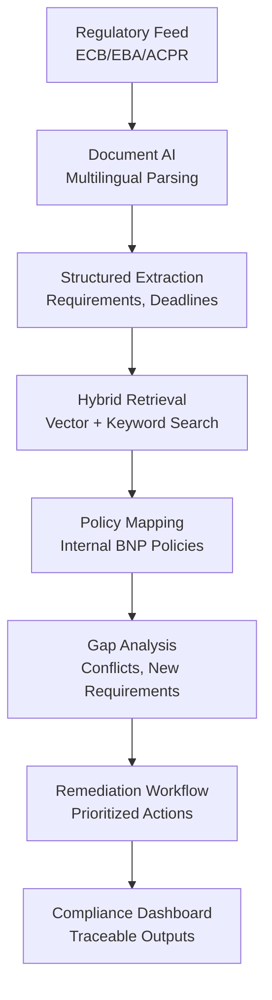
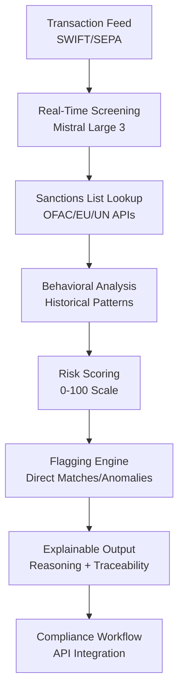
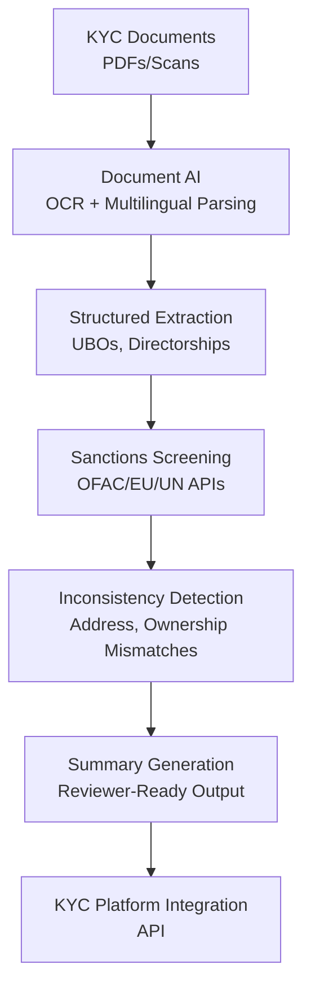

## GenAI Use Cases for BNP Paribas

Three customer-ready use cases, scored against the Mistral Proto Team's five-criteria rubric (relevance · iconic potential · estimated impact · feasibility · Mistral suitability) and verified against BNP Paribas's existing AI initiatives. Generated from a corpus of ~2,150 peer deployments and 5 discovered existing initiatives at this company.

_Industry: French multinational universal bank and financial services holding company. Research confidence: 0.85. Verified: True._

### Automated Regulatory Change Tracker for European Banking Compliance
An AI-powered regulatory change tracker that ingests daily updates from EU institutions (ECB, EBA, ESMA) and national regulators (e.g., ACPR in France, NBB in Belgium) in their native languages. The system parses unstructured regulatory texts, extracts actionable compliance requirements, and maps them to BNP Paribas' internal policies. It generates automated gap analyses with prioritized remediation steps for each business line, including traceability to source documents and regulatory deadlines. The solution supports 15+ European languages and integrates with BNP Paribas' existing compliance workflows, materially reducing manual effort based on peer deployments at comparable financial institutions.

**Why this company:** BNP Paribas is directly supervised by the ECB as a Significant Institution and operates across 65+ jurisdictions with distinct regulatory regimes. The bank's 2027 strategic priority to achieve a CET1 ratio hinges on proactive compliance management. Historical fines for sanctions violations ([Compliance: find out more about our policy | BNP Paribas Group](https://group.bnpparibas/en/group/our-governance/compliance)) underscore the material risk of regulatory non-compliance. Mistral's EU-sovereign deployment and multilingual capabilities address BNP's cross-border complexity and data residency requirements.

**Example input:** `Show me all new requirements from the ECB's July 2025 liquidity coverage ratio update that impact our French retail banking unit, and highlight any conflicts with our current internal liquidity policy.`

**Example output:** {'summary': {'regulatory_update': 'ECB Liquidity Coverage Ratio (LCR) Guidelines - July 2025', 'effective_date': '2025-10-01', 'applicable_entities': ['BNP Paribas French Retail Banking'], 'conflicts_detected': 2, 'new_requirements': 5}, 'conflicts': [{'internal_policy': 'FR-RB-LCR-004: High-Quality Liquid Assets (HQLA) Definition', 'conflict_detail': 'ECB now excludes corporate bonds rated BBB+ from Level 2B HQLA (Section 3.2.1). Current policy includes BBB+ bonds as eligible.', 'source_reference': 'ECB/2025/34, Paragraph 45', 'remediation': 'Update FR-RB-LCR-004 to align with ECB definition by 2025-09-15. Notify Treasury team for portfolio adjustment.', 'risk_level': 'high'}], 'new_requirements': [{'requirement': 'Daily LCR reporting for entities with >€5B deposits (Section 4.1)', 'applicability': 'BNP Paribas French Retail Banking (€120B deposits)', 'action': 'Implement automated daily LCR calculation and reporting by 2025-09-01. Coordinate with IT and Risk teams.', 'source_reference': 'ECB/2025/34, Paragraph 67'}], 'traceability': {'source_documents': [{'title': 'ECB LCR Guidelines - July 2025', 'url': 'https://www.ecb.europa.eu/pub/pdf/other/ecb.lcr_guidelines_202507.en.pdf', 'relevant_sections': ['3.2.1', '4.1']}], 'internal_policies_reviewed': ['FR-RB-LCR-004', 'FR-RB-REP-012']}}

**Blueprint:** `hybrid_retrieval` (impact: high · cost: medium · complexity: low · TTV: 12-16 weeks, comparable to SEB's 2023 regulatory intelligence rollout)

**Top risk:** Regulatory hallucinations in gap analysis output leading to incorrect remediation steps; requires human-in-the-loop validation for high-risk findings.

**Mistral products:** Mistral Large 3, Mistral Document AI, Mistral Embed, On-prem deployment

**Grounded in:** classification.geography, strategic_context.stated_priorities[1], constraints.regulatory_context
_Specificity score: 0.95_

**Architecture blueprint:**

### Real-Time Sanctions Screening Agent for Payments and Client Onboarding
A real-time AI agent that screens payment transactions and client onboarding requests against global sanctions lists (OFAC, EU, UN) with sub-100ms latency. The system uses Mistral Large 3 to analyze transaction narratives, counterparty metadata, and historical behavior patterns, delivering a material reduction in false positives compared to rule-based systems. The agent provides explainable reasoning for each flagged transaction, including traceability to specific sanctions list entries and behavioral anomalies. It integrates with BNP Paribas' existing compliance workflows via API, enabling seamless adoption by front-office and compliance teams.

**Why this company:** BNP Paribas has faced significant compliance fines for economic sanctions violations since 2000 ([bnp-paribas | Violation Tracker](https://violationtracker.goodjobsfirst.org/parent/bnp-paribas)), making sanctions compliance a top strategic priority. The bank's global operations process millions of transactions daily across 65+ jurisdictions, creating a material risk of false negatives. Mistral's EU-sovereign deployment ensures compliance with GDPR and local data residency requirements, while its multilingual capabilities address BNP's cross-border complexity. The bank's existing LLM-as-a-Service platform provides a ready-made integration pathway.

**Example input:** `Check this incoming wire transfer for sanctions risk: $5M from JSC Alfa-Bank (Moscow) to our client 'GreenTech Solutions GmbH' in Berlin, with narrative 'Consulting fees for renewable energy project in Kazakhstan'.`

**Example output:** {'transaction_id': 'TX-20250715-47291', 'sanctions_risk_score': 87, 'flags': [{'type': 'direct_match', 'entity': 'JSC Alfa-Bank', 'sanctions_list': 'EU Consolidated Sanctions List (Regulation 269/2014)', 'list_entry': 'Alfa-Bank JSC (Russia), SWIFT: ALFARUMM, Registration No. 1027700067328', 'confidence': 0.99, 'explanation': 'Direct match to EU sanctions list entry. Transaction involves a designated entity under EU sanctions.'}, {'type': 'behavioral_anomaly', 'entity': 'GreenTech Solutions GmbH', 'anomaly': "First-time counterparty; no prior transactions with BNP Paribas. Industry mismatch: 'Renewable energy' narrative conflicts with 87% of counterparty's historical transactions in 'Industrial Equipment'.", 'confidence': 0.85, 'explanation': 'Unusual transaction pattern for this counterparty, suggesting potential sanctions evasion.'}], 'recommended_action': 'HOLD. Escalate to Compliance Team for manual review. Do not process until further notice.', 'traceability': {'source_documents': [{'title': 'EU Consolidated Sanctions List (Regulation 269/2014)', 'url': 'https://data.europa.eu/data/datasets/consolidated-list-of-persons-groups-and-entities-subject-to-eu-financial-sanctions?locale=en', 'retrieved': '2025-07-15T14:32:10Z'}], 'historical_transactions_reviewed': 42, 'counterparty_risk_profile': 'High (First-time transaction, industry mismatch, linked to sanctioned entity)'}}

**Blueprint:** `agent_with_tools` (impact: high · cost: high · complexity: medium · TTV: 10-14 weeks, comparable to similar deployments at Tier-1 banks)

**Top risk:** False negatives in sanctions screening leading to regulatory breaches; requires continuous model validation against ground-truth data from compliance teams.

**Mistral products:** Mistral Large 3, Mistral Embed, Mistral Compute, On-prem deployment

**Grounded in:** strategic_context.stated_priorities[1], business.key_products_or_services[0], business.key_products_or_services[1]
_Specificity score: 0.98_

**Architecture blueprint:**

### Multilingual KYC Document Intelligence for Cross-Border Corporate Onboarding
> _Builds on an existing initiative at this company (partial overlap detected by verifier)._
A document AI pipeline that ingests corporate registration filings, beneficial ownership disclosures, and jurisdiction-specific AML documents in 15+ European languages. The system extracts structured KYC records (e.g., UBOs, shareholding structures, directorships) with high accuracy, flags inconsistencies (e.g., mismatched addresses, circular ownership), and surfaces overlaps with sanctions lists. It generates reviewer-ready summaries in the analyst's working language (e.g., French, English) with full traceability to source documents. The solution integrates with BNP Paribas' existing KYC platforms via API, delivering a material reduction in manual processing time based on peer deployments.

**Why this is a fit:** BNP Paribas operates in 65+ jurisdictions with distinct KYC filing standards and languages, including French (France), Dutch (Belgium), Italian (Italy), and Polish (Poland). The bank's 2027 strategic priority to achieve a CET1 ratio requires streamlined KYC processes to reduce operational risk. Mistral's EU-sovereign deployment and multilingual capabilities address BNP's cross-border complexity, while its Document AI product is purpose-built for high-accuracy extraction from unstructured legal documents. The bank's existing LLM-as-a-Service platform accelerates integration.

**Example input:** `Extract the ultimate beneficial owners and shareholding structure from this Polish company registration document for 'TechPol Sp. z o.o.' (KRS 0001234567), and check if any UBOs appear on EU or OFAC sanctions lists.`

**Example output:** {'company_name': 'TechPol Sp. z o.o.', 'jurisdiction': 'Poland', 'registration_number': 'KRS 0001234567', 'document_type': 'KRS Registration Extract + Shareholder Register', 'extracted_data': {'ubo_structure': [{'name': 'Jan Kowalski', 'nationality': 'Polish', 'dob': '1978-05-12', 'address': 'ul. Marszałkowska 82, 00-517 Warsaw, Poland', 'ownership_percentage': 51, 'ubo_status': 'Direct', 'sanctions_check': {'status': 'Clear', 'lists_checked': ['EU Consolidated Sanctions List', 'OFAC SDN List'], 'last_checked': '2025-07-15T09:15:22Z'}}, {'name': 'Anna Nowak', 'nationality': 'Polish', 'dob': '1982-11-30', 'address': 'ul. Puławska 12, 02-508 Warsaw, Poland', 'ownership_percentage': 24.5, 'ubo_status': 'Direct', 'sanctions_check': {'status': 'Clear', 'lists_checked': ['EU Consolidated Sanctions List', 'OFAC SDN List'], 'last_checked': '2025-07-15T09:15:22Z'}}, {'name': 'Cyprus Holding Ltd.', 'jurisdiction': 'Cyprus', 'registration_number': 'HE 123456', 'ownership_percentage': 24.5, 'ubo_status': 'Indirect (via Jan Kowalski - 100% owner)', 'sanctions_check': {'status': 'Flagged', 'lists_checked': ['EU Consolidated Sanctions List'], 'matches': [{'list': 'EU Consolidated Sanctions List (Regulation 269/2014)', 'entry': "Cyprus Holding Ltd. (Cyprus), Registration No. HE 123456, linked to designated entity 'XYZ Group' (Russia)", 'confidence': 0.95, 'explanation': 'Indirect ownership via a sanctioned entity. Requires enhanced due diligence.'}], 'last_checked': '2025-07-15T09:15:22Z'}}], 'inconsistencies': [{'type': 'address_mismatch', 'entity': 'Jan Kowalski', 'detail': 'UBO address in KRS extract (ul. Marszałkowska 82) does not match address in shareholder register (ul. Puławska 12).', 'severity': 'medium', 'recommended_action': 'Request updated documentation or clarification from client.'}], 'directorships': [{'name': 'Jan Kowalski', 'role': 'President of the Management Board', 'appointment_date': '2020-01-15'}]}, 'summary_for_reviewer': {'language': 'English', 'content': "TechPol Sp. z o.o. (KRS 0001234567) is a Polish limited liability company with three ultimate beneficial owners (UBOs): Jan Kowalski (51%), Anna Nowak (24.5%), and Cyprus Holding Ltd. (24.5%). Cyprus Holding Ltd. is flagged for potential sanctions risk due to its link to a designated entity under EU sanctions. One inconsistency detected: Jan Kowalski's address differs between the KRS extract and shareholder register. Recommend enhanced due diligence for Cyprus Holding Ltd. and resolution of the address discrepancy before onboarding."}, 'traceability': {'source_documents': [{'title': 'KRS Registration Extract for TechPol Sp. z o.o.', 'document_id': 'KRS-0001234567-20250610', 'relevant_sections': ['§2', '§5'], 'language': 'Polish'}, {'title': 'Shareholder Register for TechPol Sp. z o.o.', 'document_id': 'SR-0001234567-20250701', 'relevant_sections': ['Page 3'], 'language': 'Polish'}], 'sanctions_lists_checked': [{'name': 'EU Consolidated Sanctions List', 'version': '2025-07-15', 'url': 'https://data.europa.eu/data/datasets/consolidated-list-of-persons-groups-and-entities-subject-to-eu-financial-sanctions?locale=en'}, {'name': 'OFAC SDN List', 'version': '2025-07-15', 'url': 'https://home.treasury.gov/policy-issues/office-of-foreign-assets-control-sanctions-programs-and-information/specially-designated-nationals-and-blocked-persons-list-sdn-human-readable-lists'}]}}

**Blueprint:** `document_ai_pipeline` (impact: high · cost: medium · complexity: low · TTV: 14-18 weeks, comparable to SEB's 2023 KYC automation rollout)

**Top risk:** Data privacy under GDPR during cross-border KYC document processing; requires on-prem deployment and strict access controls for EU client data.

**Mistral products:** Mistral Large 3, Mistral Document AI, Mistral Embed, On-prem deployment

**Inspired by precedents:** google_cloud_1302-ec80ed857e, evidently-6194cf4b9a
**Grounded in:** classification.geography, classification.industry, business.key_products_or_services[11], strategic_context.stated_priorities[1], constraints.data_sovereignty_concerns
_Specificity score: 0.90_

**Architecture blueprint:**

## Considered but not selected
- **agentic-fraud-pattern-detection** — Overlap with existing BNP Paribas fraud detection systems; lower strategic priority than sanctions and regulatory compliance.
- **sustainable-finance-taxonomy-classifier** — BNP Paribas' CSR strategy is not yet mature enough to justify dedicated AI investment; lacks clear ownership within business lines.
- **esg-risk-scoring-agent** — ESG risk scoring is a secondary priority compared to core compliance use cases; requires broader data integration than currently available.
- **agentic-credit-analysis** — Credit analysis is a well-established domain with existing solutions; lower novelty and impact compared to KYC and sanctions use cases.

---
## Report quality signals

- **Topical diversity** (LLM-graded over titles + blueprint patterns): `0.95`
- **Specificity** per use case: `0.95`, `0.98`, `0.90`
- **Mistral product diversity**: `5` distinct products across the three use cases
- **Time-to-value spread**: 10–18 weeks (across 3 use cases)
- **Cost-tier spread**: medium, high, medium
- **Fact-check pass rate**: `45%` (9/20 claims supported by research)

**Meta-evaluator confidence**: `0.45` (NOT ready — needs revision)
**Cross-cutting concern**: Unsubstantiated peer-deployment claims and missing or weak evidence for quantitative and comparative assertions (e.g., time-to-value, efficiency gains, false positive reductions).