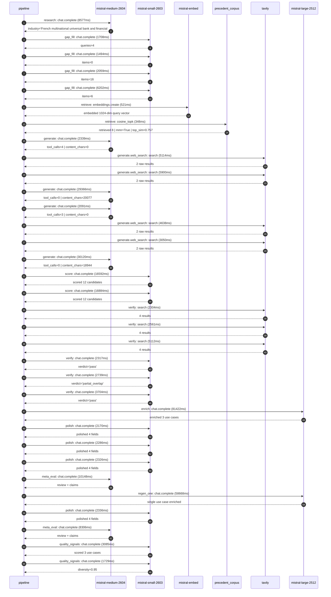

# Pipeline blueprint (architecture)

Static view of the pipeline regardless of run timing — shows agents,
models, and gates. The chronological execution log follows below.

```mermaid
flowchart TD
    Start([User: company name]) --> R
    R["<b>1. Research</b><br/>parallel: Wikipedia · Tavily news ·<br/>existing initiatives · live verification<br/><i>mistral-medium</i> synthesis"]
    R --> G["<b>1b. Gap-fill</b><br/>identify missing fields →<br/><i>mistral-small</i> generates queries →<br/>Tavily search per field →<br/><i>mistral-small</i> per-field extraction"]
    G --> Conf{Confidence ≥ 0.5<br/>OR verified<br/>OR ≥ 1 existing initiative?}
    Conf -->|no| Refuse([Refusal])
    Conf -->|yes| Ret
    Ret["<b>2. Retrieve</b><br/><i>mistral-embed</i> on company query →<br/>cosine top-K + industry/depth filter +<br/>MMR diversification"]
    Ret --> Gen["<b>3. Generate 12 candidates</b><br/><i>mistral-medium</i> with web_search tool<br/>(Tavily + deep-read) — fact citations<br/>flow into the EvidenceLedger"]
    Gen --> Score["<b>4. Score</b><br/>self-consistency: 2 parallel passes<br/><i>mistral-small</i> @ T=0.2 and T=0.4 →<br/>aggregate weighted scores"]
    Score --> Verify["<b>5. Per-candidate verify</b><br/>top-3: Tavily search + deep-read +<br/><i>mistral-small</i> verdict (pass /<br/>partial / confirmed_existing)"]
    Verify --> Enrich["<b>6. Enrich</b><br/><i>mistral-large</i> drafts customer-facing<br/>prose for 3 use cases (or<br/><i>mistral-medium</i> on fast tier)"]
    Enrich --> NumScrub["<b>6a. Numeric scrub</b><br/>flag any number not in cited content"]
    NumScrub --> Polish["<b>6b. Polish</b><br/><i>mistral-small</i> per use case (parallel):<br/>convert markers→qualitative,<br/>(ev-XXX)→[title](url)"]
    Polish --> Attr["<b>6c. Attribution check</b><br/><i>mistral-small</i> per use case (parallel):<br/>fix corpus-ID ↔ company mismatches"]
    Attr --> Meta["<b>7. Meta-evaluation</b><br/><i>mistral-medium</i> reviews report against<br/>cited precedents + ledger entries:<br/>strict claim verification"]
    Meta --> RegenQ{confidence < 0.6<br/>AND not fast tier?}
    RegenQ -->|yes| Regen["<b>7b. Targeted regen</b><br/><i>mistral-large</i> re-enriches just the<br/>weakest use case with the next-best<br/>near-miss; re-runs meta-eval"]
    RegenQ -->|no| QS
    Regen --> QS
    QS["<b>Quality signals</b><br/>LLM-graded diversity + specificity,<br/>fact-check pass rate, TTV/cost spread"]
    QS --> Render([Markdown report + trace])

    classDef agent fill:#fef3c7,stroke:#f59e0b
    classDef gate fill:#dbeafe,stroke:#3b82f6
    classDef io fill:#dcfce7,stroke:#16a34a
    class R,G,Ret,Gen,Score,Verify,Enrich,NumScrub,Polish,Attr,Meta,Regen,QS agent
    class Conf,RegenQ gate
    class Start,Refuse,Render io
```

## Execution trace — BNP Paribas

Started: `2026-05-08T17:34:27.775505+00:00`. Total wall time: `319.4s` across `33` recorded actions.

### Per-step time totals

| Step | Calls | Total time | Avg time |
|---|---:|---:|---:|
| `research` | 1 | 8.58s | 8577ms |
| `gap_fill` | 4 | 11.46s | 2866ms |
| `retrieve` | 2 | 0.87s | 435ms |
| `generate` | 4 | 63.92s | 15979ms |
| `generate.web_search` | 4 | 18.70s | 4675ms |
| `score` | 2 | 33.48s | 16738ms |
| `verify` | 6 | 18.74s | 3123ms |
| `enrich` | 1 | 81.42s | 81422ms |
| `polish` | 4 | 9.12s | 2280ms |
| `meta_eval` | 2 | 18.45s | 9227ms |
| `regen_one` | 1 | 58.67s | 58668ms |
| `quality_signals` | 2 | 4.81s | 2407ms |

### Chronological event log

- `17:34:30.525` **[research]** `mistral-medium-2604.chat.complete` — 8577ms
   - inputs: synthesize CompanyContext for BNP Paribas | depth=medium
   - outputs: industry='French multinational universal bank and financial services holding company' verified=True conf=0.75
- `17:34:45.717` **[gap_fill]** `mistral-small-2603.chat.complete` — 1708ms
   - inputs: generate gap queries | fields=['business_model', 'products', 'data_assets', 'priorities']
   - outputs: queries=4
- `17:34:56.051` **[gap_fill]** `mistral-small-2603.chat.complete` — 1494ms
   - inputs: layer-2 extract field=data_assets
   - outputs: items=0
- `17:34:56.073` **[gap_fill]** `mistral-small-2603.chat.complete` — 2059ms
   - inputs: layer-2 extract field=products
   - outputs: items=16
- `17:34:56.026` **[gap_fill]** `mistral-small-2603.chat.complete` — 6202ms
   - inputs: layer-2 extract field=priorities
   - outputs: items=6
- `17:35:02.260` **[retrieve]** `mistral-embed.embeddings.create` — 521ms
   - inputs: company_query | industries='French multinational universal bank and financial services holding company'
   - outputs: embedded 1024-dim query vector
- `17:35:02.781` **[retrieve]** `precedent_corpus.cosine_topk` — 348ms
   - inputs: k=8 min_depth=0.4 target='BNP Paribas'
   - outputs: retrieved 8 | mmr=True | top_sim=0.757
- `17:35:04.071` **[generate]** `mistral-medium-2604.chat.complete` — 2339ms
   - inputs: iteration=0 tool_calls_used=0/2 tools=on
   - outputs: tool_calls=4 | content_chars=0
- `17:35:06.432` **[generate.web_search]** `tavily.search` — 5114ms
   - inputs: query='BNP Paribas recent AI initiatives 2025 2026'
   - outputs: 2 raw results
- `17:35:13.516` **[generate.web_search]** `tavily.search` — 5900ms
   - inputs: query='BNP Paribas regulatory compliance challenges 2025'
   - outputs: 2 raw results
- `17:35:19.433` **[generate]** `mistral-medium-2604.chat.complete` — 29366ms
   - inputs: iteration=1 tool_calls_used=2/2 tools=off
   - outputs: tool_calls=0 | content_chars=20077
- `17:35:49.231` **[generate]** `mistral-medium-2604.chat.complete` — 2091ms
   - inputs: iteration=0 tool_calls_used=0/2 tools=on
   - outputs: tool_calls=3 | content_chars=0
- `17:35:51.336` **[generate.web_search]** `tavily.search` — 4638ms
   - inputs: query='BNP Paribas recent AI initiatives 2025 KYC fraud compliance'
   - outputs: 2 raw results
- `17:35:56.721` **[generate.web_search]** `tavily.search` — 3050ms
   - inputs: query='BNP Paribas regulatory fines 2023 2024 2025'
   - outputs: 2 raw results
- `17:36:00.191` **[generate]** `mistral-medium-2604.chat.complete` — 30120ms
   - inputs: iteration=1 tool_calls_used=2/2 tools=off
   - outputs: tool_calls=0 | content_chars=18944
- `17:36:30.791` **[score]** `mistral-small-2603.chat.complete` — 16592ms
   - inputs: self-consistency pass T=0.2
   - outputs: scored 12 candidates
- `17:36:30.807` **[score]** `mistral-small-2603.chat.complete` — 16884ms
   - inputs: self-consistency pass T=0.4
   - outputs: scored 12 candidates
- `17:36:47.749` **[verify]** `tavily.search` — 2304ms
   - inputs: candidate=multilingual-kyc-document-intelligence | query='BNP Paribas Multilingual KYC Document Intelligence for Cross'
   - outputs: 4 results
- `17:36:47.749` **[verify]** `tavily.search` — 2561ms
   - inputs: candidate=regulatory-change-tracker | query='BNP Paribas Automated Regulatory Change Tracker for European'
   - outputs: 4 results
- `17:36:47.749` **[verify]** `tavily.search` — 5112ms
   - inputs: candidate=sanctions-screening-agent | query='BNP Paribas Real-Time Sanctions Screening Agent for Payments'
   - outputs: 4 results
- `17:36:50.664` **[verify]** `mistral-small-2603.chat.complete` — 2317ms
   - inputs: verdict for regulatory-change-tracker
   - outputs: verdict='pass'
- `17:36:52.814` **[verify]** `mistral-small-2603.chat.complete` — 2739ms
   - inputs: verdict for multilingual-kyc-document-intelligence
   - outputs: verdict='partial_overlap'
- `17:36:54.825` **[verify]** `mistral-small-2603.chat.complete` — 3704ms
   - inputs: verdict for sanctions-screening-agent
   - outputs: verdict='pass'
- `17:36:58.562` **[enrich]** `mistral-large-2512.chat.complete` — 81422ms
   - inputs: tier=standard top_3=['regulatory-change-tracker', 'sanctions-screening-agent', 'multilingual-kyc-document-intelligence']
   - outputs: enriched 3 use cases
- `17:38:20.002` **[polish]** `mistral-small-2603.chat.complete` — 2170ms
   - inputs: use_case=sanctions-screening-agent unanchored=True opaque_ev=False
   - outputs: polished 4 fields
- `17:38:20.006` **[polish]** `mistral-small-2603.chat.complete` — 2286ms
   - inputs: use_case=multilingual-kyc-document-intelligence unanchored=True opaque_ev=False
   - outputs: polished 4 fields
- `17:38:19.988` **[polish]** `mistral-small-2603.chat.complete` — 2326ms
   - inputs: use_case=regulatory-change-tracker unanchored=True opaque_ev=False
   - outputs: polished 4 fields
- `17:38:22.355` **[meta_eval]** `mistral-medium-2604.chat.complete` — 10148ms
   - inputs: reviewing 3 use cases
   - outputs: review + claims
- `17:38:32.527` **[regen_one]** `mistral-large-2512.chat.complete` — 58668ms
   - inputs: replace weakest=regulatory-change-tracker with agentic-fraud-pattern-detection
   - outputs: single use case enriched
- `17:39:31.197` **[polish]** `mistral-small-2603.chat.complete` — 2336ms
   - inputs: use_case=agentic-fraud-pattern-detection unanchored=True opaque_ev=False
   - outputs: polished 4 fields
- `17:39:33.569` **[meta_eval]** `mistral-medium-2604.chat.complete` — 8306ms
   - inputs: reviewing 3 use cases
   - outputs: review + claims
- `17:39:42.345` **[quality_signals]** `mistral-small-2603.chat.complete` — 3085ms
   - inputs: specificity grade (3 use cases)
   - outputs: scored 3 use cases
- `17:39:45.430` **[quality_signals]** `mistral-small-2603.chat.complete` — 1729ms
   - inputs: diversity grade
   - outputs: diversity=0.95

## Mermaid sequence diagram (execution)

