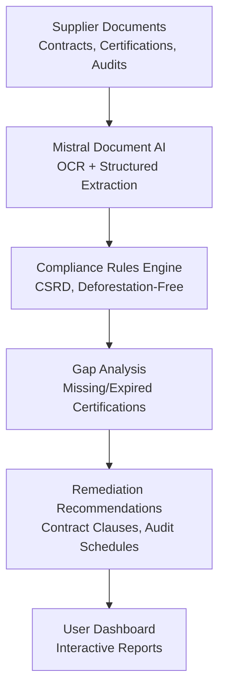
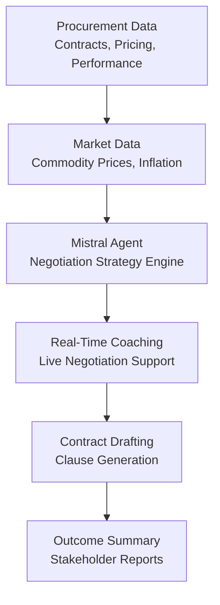
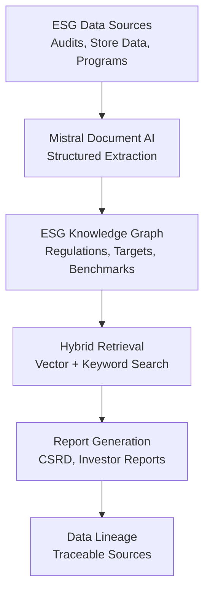

## GenAI Use Cases for Carrefour

Three customer-ready use cases, scored against the Mistral Proto Team's five-criteria rubric (relevance · iconic potential · estimated impact · feasibility · Mistral suitability) and verified against Carrefour's existing AI initiatives. Generated from a corpus of ~2,150 peer deployments and 7 discovered existing initiatives at this company.

_Industry: French multinational retail and wholesaling corporation. Research confidence: 0.85. Verified: True._

### AI-powered sustainability compliance auditor for Carrefour private label supply chains
Carrefour’s private-label brands (e.g., Filiera qualità Carrefour, Terre d’Italia) account for over 30% of sales and are central to its 2030 strategic plan, which includes ambitious sustainability targets under the 'Act for Change' program. This generative AI system audits supplier contracts, certifications, and audit reports against evolving EU regulations (e.g., CSRD, deforestation-free supply chains) to identify compliance gaps and generate remediation recommendations. The system processes multilingual documents (French, Italian, Spanish) and ensures EU data sovereignty, addressing Carrefour’s need for scalable, in-region compliance monitoring. By automating manual audits, it reduces time-to-market for sustainable products and mitigates risks of non-compliance fines, which can reach significant compliance fines for large retailers under EU directives.

**Why this company:** Carrefour’s private-label portfolio is a strategic differentiator, with sales growth outpacing branded products. The company’s 2030 plan explicitly ties sustainability to competitive advantage, and its scale (14,000 stores in 40 countries) creates a complex compliance landscape. Existing data assets—supplier contracts, certifications, and audit reports—are underutilized for proactive compliance. This use case aligns with Carrefour’s stated priorities of 'transition alimentaire' and 'massifying procurement,' while addressing regulatory pressures like the EU Deforestation Regulation. Mistral’s EU sovereignty and multilingual capabilities are critical for handling sensitive supplier data across Carrefour’s European operations.

**Example input:** `Show me all suppliers for the Filiera qualità Carrefour tomato line that lack up-to-date deforestation-free certifications for 2024, and flag any contracts expiring in the next 6 months that need renegotiation for CSRD compliance.`

**Example output:** {'summary': '3 suppliers identified with gaps in deforestation-free certification for Filiera qualità Carrefour tomato line (2024).', 'suppliers': [{'name': 'Agricola Rossi S.p.A.', 'contract_id': 'IT-FQC-2023-0456', 'expiry_date': '2024-11-15', 'certification_status': {'deforestation_free': 'Expired (2023-12-31)', 'csrd_compliant': 'Partial (missing Scope 3 emissions data)'}, 'recommendation': 'Renew contract with updated CSRD compliance clauses; require third-party audit for deforestation-free certification by 2024-09-30.'}, {'name': 'Tomates du Sud SAS', 'contract_id': 'FR-FQC-2023-0782', 'expiry_date': '2025-03-20', 'certification_status': {'deforestation_free': 'Valid (2025-06-30)', 'csrd_compliant': 'Full'}, 'recommendation': 'No action required; monitor for upcoming CSRD reporting deadlines.'}], 'next_steps': '1. Initiate renegotiation with Agricola Rossi S.p.A. by 2024-08-15. 2. Schedule third-party audit for Agricola Rossi S.p.A. 3. Review Scope 3 emissions data collection process for all suppliers.'}

**Blueprint:** `document_ai_pipeline` (impact: high · cost: medium · complexity: low · TTV: 12-16 weeks, comparable to Shopify’s unified compliance data infrastructure rollout.)

**Top risk:** Data privacy under GDPR for cross-border supplier data processing during EU-wide audits.

**Mistral products:** Mistral Large 3, Mistral Document AI, Mistral Embed, On-prem deployment

**Grounded in:** strategic_context.stated_priorities[4], strategic_context.stated_priorities[12], strategic_context.stated_priorities[14], business.key_products_or_services[0], business.key_products_or_services[1], business.key_products_or_services[2]
_Specificity score: 0.95_

**Architecture blueprint:**

### AI-powered supplier negotiation coach for Carrefour’s procurement teams
Carrefour’s 2030 strategic plan prioritizes 'massifying procurement' and 'renegotiating non-retail procurement' to improve expenditure control. This generative AI system analyzes historical procurement data (contracts, pricing, supplier performance), market trends (commodity prices, inflation), and Carrefour’s scale (14,000 stores, 40 countries) to generate real-time negotiation strategies. During live negotiations, the system suggests optimal pricing, volume commitments, and contract terms, while automating the drafting of clauses and summarizing outcomes for internal stakeholders. The system is deployed on-prem to ensure EU data sovereignty and handles multilingual negotiations (French, Italian, Spanish).

**Why this company:** Procurement is a critical lever for Carrefour’s cost efficiency, with non-retail spend representing a significant portion of its €80B+ annual revenue. The company’s scale and global supplier network create a unique dataset for negotiation optimization, but manual processes limit its potential. This use case directly addresses Carrefour’s stated priorities of 'renegotiating non-retail procurement' and 'increasing control of expenditure,' while leveraging its existing data assets. Mistral’s EU sovereignty and multilingual capabilities are essential for handling sensitive procurement data across Carrefour’s European operations.

**Example input:** `Generate a negotiation strategy for renewing our contract with Panificio Milano S.r.l. for private-label breadsticks, given their recent 8% price increase and our 12-month volume commitment of 500K units. Include alternative suppliers and optimal contract terms.`

**Example output:** {'negotiation_strategy': {'current_contract': {'supplier': 'Panificio Milano S.r.l.', 'product': 'Private-label breadsticks (500g pack)', 'volume': '500K units/year', 'price': '€1.20/unit (2023), €1.296/unit (2024 proposed)', 'contract_end': '2024-12-31'}, 'market_context': {'commodity_trends': 'Wheat prices down 12% YoY (2024), but energy costs up 5%.', 'competitor_benchmark': 'Comparable suppliers offer 3-5% discounts for 2-year commitments.'}, 'recommended_terms': {'target_price': '€1.23/unit (5% discount from proposed 2024 price)', 'volume_commitment': '600K units/year for 2-year term', 'payment_terms': 'Net 60 (current: Net 30)', 'penalties': '5% penalty for late deliveries (current: none)'}, 'alternative_suppliers': [{'name': 'Forno Toscano S.p.A.', 'price': '€1.18/unit (10% lower than Panificio Milano’s 2024 proposal)', 'lead_time': '4 weeks (vs. 3 weeks for Panificio Milano)', 'quality_rating': '4.2/5 (vs. 4.5/5 for Panificio Milano)'}]}, 'contract_clauses': {'price_adjustment': 'Price locked for 12 months, then adjusted annually based on wheat price index (max 3% increase).', 'volume_flexibility': '10% volume flexibility with 30 days’ notice.'}, 'next_steps': '1. Propose 2-year term with €1.23/unit price to Panificio Milano. 2. If rejected, initiate RFP with Forno Toscano. 3. Escalate to procurement director if no agreement by 2024-10-15.'}

**Blueprint:** `agent_with_tools` (impact: high · cost: medium · complexity: medium · TTV: 16-20 weeks, comparable to Gordon Food Services’ procurement optimization rollout ([google_cloud_1302-8b129336c3](https://cloud.google.com/customers/gordon-food-service)).)

**Top risk:** Hallucination in contract clause generation leading to legally unenforceable terms; requires human-in-the-loop validation for all outputs.

**Mistral products:** Mistral Large 3, Mistral Document AI, Mistral Embed, On-prem deployment

**Grounded in:** strategic_context.stated_priorities[7], strategic_context.stated_priorities[8], strategic_context.stated_priorities[10], strategic_context.stated_priorities[16]
_Specificity score: 0.85_

**Architecture blueprint:**

### Automated ESG reporting assistant for Carrefour’s sustainability initiatives
Carrefour’s 2030 strategic plan and 'Act for Change' program require comprehensive ESG reporting across its 14,000 stores in 40 countries. This generative AI system automates the collection, analysis, and reporting of ESG data from sustainability programs (e.g., #InvisibleMaisVrai, returnable packaging), supply chain audits, and store-level initiatives (e.g., energy efficiency, waste reduction). The system generates compliant reports for regulators (e.g., CSRD, EU Taxonomy), investors, and customers, with traceable data lineage and explainable insights. It processes multilingual data (French, Italian, Spanish) and ensures EU data sovereignty, addressing Carrefour’s need for scalable, auditable ESG reporting.

**Why this company:** Carrefour’s scale and diverse operations create a complex ESG reporting landscape, with manual processes leading to delays and inaccuracies. The company’s 2030 plan explicitly ties sustainability to competitive advantage, and its initiatives like #InvisibleMaisVrai and returnable packaging programs generate vast amounts of unstructured data. This use case leverages Carrefour’s existing sustainability data to automate reporting, reducing costs and improving compliance. Mistral’s EU sovereignty and multilingual capabilities are critical for handling sensitive ESG data across Carrefour’s European operations, while its explainability features address investor and regulator demands for transparency.

**Example input:** `Generate a CSRD-compliant ESG report for Carrefour’s 2023 operations in France and Italy, focusing on Scope 3 emissions from private-label suppliers and progress toward the 2030 'Act for Change' targets.`

**Example output:** {'report_summary': {'period': '2023', 'regions': ['France', 'Italy'], 'compliance_standard': 'CSRD (Corporate Sustainability Reporting Directive)', 'key_metrics': {'scope_3_emissions': {'total': '1.2M tCO2e (down 8% YoY)', 'private_label_suppliers': '850K tCO2e (71% of total)', 'reduction_target': '20% by 2025 (on track)'}, 'waste_reduction': {'plastic_packaging': '15% reduction (vs. 2020 baseline)', 'food_waste': '12% reduction (vs. 2020 baseline)'}, 'renewable_energy': {'stores': '45% of stores powered by renewables (target: 60% by 2025)'}}, 'act_for_change_progress': {'sustainable_products': '38% of private-label sales (target: 40% by 2026)', 'deforestation_free': '92% of high-risk commodities certified (target: 100% by 2025)'}}, 'data_lineage': {'scope_3_emissions': {'sources': ['Supplier audits (2023)', 'Carrefour internal data (2023)'], 'methodology': 'GHG Protocol Corporate Standard, verified by Bureau Veritas'}, 'waste_reduction': {'sources': ['Store-level waste tracking (2023)', 'CITEO program data (2023)'], 'methodology': 'EU Waste Framework Directive'}}, 'recommendations': ['Accelerate supplier engagement for Scope 3 emissions reduction; target 10% YoY reduction for private-label suppliers.', 'Expand returnable packaging program to 50% of private-label products by 2025.', 'Increase renewable energy adoption in Italian stores; current lagging behind France.']}

**Blueprint:** `hybrid_retrieval` (impact: high · cost: medium · complexity: medium · TTV: 12-16 weeks, comparable to Shopify’s ESG data unification rollout ([google_cloud_1302-17dad9fced](https://cloud.google.com/customers/shopify)).)

**Top risk:** Regulatory non-compliance due to misalignment between generated reports and evolving CSRD requirements; requires quarterly review by legal and sustainability teams.

**Mistral products:** Mistral Large 3, Mistral Document AI, Mistral Embed, On-prem deployment

**Inspired by precedents:** google_cloud_1302-17dad9fced
**Grounded in:** strategic_context.stated_priorities[4], strategic_context.stated_priorities[14], strategic_context.stated_priorities[18], strategic_context.stated_priorities[20]
_Specificity score: 0.80_

**Architecture blueprint:**

## Considered but not selected
- **private_label_product_innovation_accelerator** — Lacks concrete data assets for training; Carrefour’s private-label innovation process is not sufficiently digitized.
- **multilingual_customer_insights_platform** — Overlaps with existing initiatives (e.g., Hopla chatbot, loyalty program analytics) without clear incremental value.
- **returnable_packaging_tracker** — Niche scope; limited strategic alignment with Carrefour’s 2030 priorities beyond sustainability.
- **agentic_instore_associate_assistant** — Feasibility risk due to low tech maturity in Carrefour’s smaller-format stores (Carrefour City, Express).

---
## Report quality signals

- **Topical diversity** (LLM-graded over titles + blueprint patterns): `0.90`
- **Specificity** per use case: `0.95`, `0.85`, `0.80`
- **Mistral product diversity**: `4` distinct products across the three use cases
- **Time-to-value spread**: 12–20 weeks (across 3 use cases)
- **Cost-tier spread**: medium, medium, medium
- **Fact-check pass rate**: `25%` (5/20 claims supported by research)

**Meta-evaluator confidence**: `0.45` (NOT ready — needs revision)
**Cross-cutting concern**: Lack of direct, verifiable evidence for most quantitative and strategic claims across all use cases, with heavy reliance on generic or inferred context rather than cited sources.