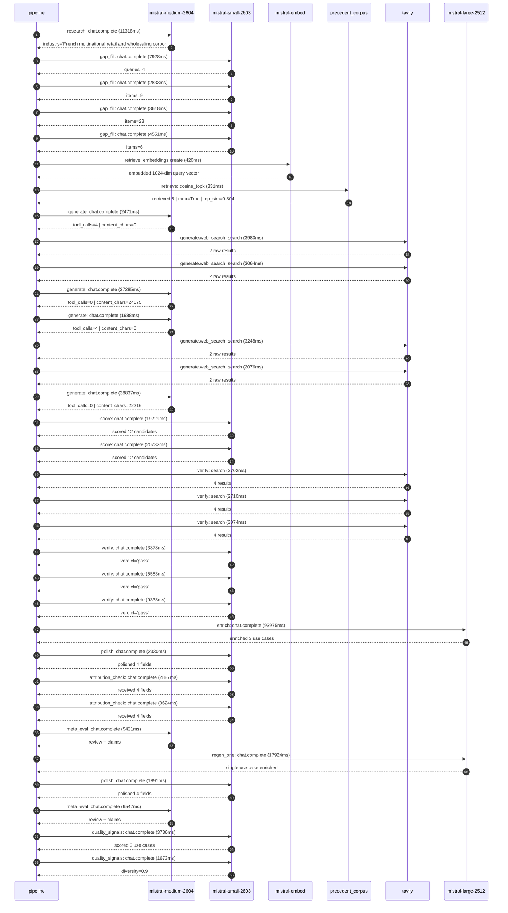

# Pipeline blueprint (architecture)

Static view of the pipeline regardless of run timing — shows agents,
models, and gates. The chronological execution log follows below.

```mermaid
flowchart TD
    Start([User: company name]) --> R
    R["<b>1. Research</b><br/>parallel: Wikipedia · Tavily news ·<br/>existing initiatives · live verification<br/><i>mistral-medium</i> synthesis"]
    R --> G["<b>1b. Gap-fill</b><br/>identify missing fields →<br/><i>mistral-small</i> generates queries →<br/>Tavily search per field →<br/><i>mistral-small</i> per-field extraction"]
    G --> Conf{Confidence ≥ 0.5<br/>OR verified<br/>OR ≥ 1 existing initiative?}
    Conf -->|no| Refuse([Refusal])
    Conf -->|yes| Ret
    Ret["<b>2. Retrieve</b><br/><i>mistral-embed</i> on company query →<br/>cosine top-K + industry/depth filter +<br/>MMR diversification"]
    Ret --> Gen["<b>3. Generate 12 candidates</b><br/><i>mistral-medium</i> with web_search tool<br/>(Tavily + deep-read) — fact citations<br/>flow into the EvidenceLedger"]
    Gen --> Score["<b>4. Score</b><br/>self-consistency: 2 parallel passes<br/><i>mistral-small</i> @ T=0.2 and T=0.4 →<br/>aggregate weighted scores"]
    Score --> Verify["<b>5. Per-candidate verify</b><br/>top-3: Tavily search + deep-read +<br/><i>mistral-small</i> verdict (pass /<br/>partial / confirmed_existing)"]
    Verify --> Enrich["<b>6. Enrich</b><br/><i>mistral-large</i> drafts customer-facing<br/>prose for 3 use cases (or<br/><i>mistral-medium</i> on fast tier)"]
    Enrich --> NumScrub["<b>6a. Numeric scrub</b><br/>flag any number not in cited content"]
    NumScrub --> Polish["<b>6b. Polish</b><br/><i>mistral-small</i> per use case (parallel):<br/>convert markers→qualitative,<br/>(ev-XXX)→[title](url)"]
    Polish --> Attr["<b>6c. Attribution check</b><br/><i>mistral-small</i> per use case (parallel):<br/>fix corpus-ID ↔ company mismatches"]
    Attr --> Meta["<b>7. Meta-evaluation</b><br/><i>mistral-medium</i> reviews report against<br/>cited precedents + ledger entries:<br/>strict claim verification"]
    Meta --> RegenQ{confidence < 0.6<br/>AND not fast tier?}
    RegenQ -->|yes| Regen["<b>7b. Targeted regen</b><br/><i>mistral-large</i> re-enriches just the<br/>weakest use case with the next-best<br/>near-miss; re-runs meta-eval"]
    RegenQ -->|no| QS
    Regen --> QS
    QS["<b>Quality signals</b><br/>LLM-graded diversity + specificity,<br/>fact-check pass rate, TTV/cost spread"]
    QS --> Render([Markdown report + trace])

    classDef agent fill:#fef3c7,stroke:#f59e0b
    classDef gate fill:#dbeafe,stroke:#3b82f6
    classDef io fill:#dcfce7,stroke:#16a34a
    class R,G,Ret,Gen,Score,Verify,Enrich,NumScrub,Polish,Attr,Meta,Regen,QS agent
    class Conf,RegenQ gate
    class Start,Refuse,Render io
```

## Execution trace — Carrefour

Started: `2026-05-08T17:23:12.781577+00:00`. Total wall time: `309.0s` across `33` recorded actions.

### Per-step time totals

| Step | Calls | Total time | Avg time |
|---|---:|---:|---:|
| `research` | 1 | 11.32s | 11318ms |
| `gap_fill` | 4 | 18.93s | 4732ms |
| `retrieve` | 2 | 0.75s | 376ms |
| `generate` | 4 | 80.58s | 20146ms |
| `generate.web_search` | 4 | 12.37s | 3092ms |
| `score` | 2 | 39.96s | 19980ms |
| `verify` | 6 | 27.28s | 4547ms |
| `enrich` | 1 | 93.97s | 93975ms |
| `polish` | 2 | 4.22s | 2111ms |
| `attribution_check` | 2 | 6.51s | 3255ms |
| `meta_eval` | 2 | 18.97s | 9484ms |
| `regen_one` | 1 | 17.92s | 17924ms |
| `quality_signals` | 2 | 5.41s | 2704ms |

### Chronological event log

- `17:23:12.861` **[research]** `mistral-medium-2604.chat.complete` — 11318ms
   - inputs: synthesize CompanyContext for Carrefour | depth=medium
   - outputs: industry='French multinational retail and wholesaling corporation' verified=True conf=0.75
- `17:23:24.211` **[gap_fill]** `mistral-small-2603.chat.complete` — 7928ms
   - inputs: generate gap queries | fields=['business_model', 'products', 'data_assets', 'priorities']
   - outputs: queries=4
- `17:23:39.188` **[gap_fill]** `mistral-small-2603.chat.complete` — 2833ms
   - inputs: layer-2 extract field=products
   - outputs: items=9
- `17:23:39.145` **[gap_fill]** `mistral-small-2603.chat.complete` — 3618ms
   - inputs: layer-2 extract field=priorities
   - outputs: items=23
- `17:23:39.166` **[gap_fill]** `mistral-small-2603.chat.complete` — 4551ms
   - inputs: layer-2 extract field=data_assets
   - outputs: items=6
- `17:23:43.746` **[retrieve]** `mistral-embed.embeddings.create` — 420ms
   - inputs: company_query | industries='French multinational retail and wholesaling corporation'
   - outputs: embedded 1024-dim query vector
- `17:23:44.166` **[retrieve]** `precedent_corpus.cosine_topk` — 331ms
   - inputs: k=8 min_depth=0.4 target='Carrefour'
   - outputs: retrieved 8 | mmr=True | top_sim=0.804
- `17:23:44.522` **[generate]** `mistral-medium-2604.chat.complete` — 2471ms
   - inputs: iteration=0 tool_calls_used=0/2 tools=on
   - outputs: tool_calls=4 | content_chars=0
- `17:23:47.006` **[generate.web_search]** `tavily.search` — 3980ms
   - inputs: query='Carrefour 14 million loyalty program Le Club Carrefour data assets'
   - outputs: 2 raw results
- `17:23:51.818` **[generate.web_search]** `tavily.search` — 3064ms
   - inputs: query='Carrefour private label brands Filiera qualità Carrefour Terre d’Italia product data'
   - outputs: 2 raw results
- `17:23:57.289` **[generate]** `mistral-medium-2604.chat.complete` — 37285ms
   - inputs: iteration=1 tool_calls_used=2/2 tools=off
   - outputs: tool_calls=0 | content_chars=24675
- `17:24:35.047` **[generate]** `mistral-medium-2604.chat.complete` — 1988ms
   - inputs: iteration=0 tool_calls_used=0/2 tools=on
   - outputs: tool_calls=4 | content_chars=0
- `17:24:37.054` **[generate.web_search]** `tavily.search` — 3248ms
   - inputs: query='Carrefour 2024 sustainability goals Act for Change'
   - outputs: 2 raw results
- `17:24:40.333` **[generate.web_search]** `tavily.search` — 2076ms
   - inputs: query='Carrefour private label brands Filiera qualità Carrefour Terre d’Italia'
   - outputs: 2 raw results
- `17:24:43.092` **[generate]** `mistral-medium-2604.chat.complete` — 38837ms
   - inputs: iteration=1 tool_calls_used=2/2 tools=off
   - outputs: tool_calls=0 | content_chars=22216
- `17:25:22.373` **[score]** `mistral-small-2603.chat.complete` — 19229ms
   - inputs: self-consistency pass T=0.2
   - outputs: scored 12 candidates
- `17:25:22.387` **[score]** `mistral-small-2603.chat.complete` — 20732ms
   - inputs: self-consistency pass T=0.4
   - outputs: scored 12 candidates
- `17:25:43.178` **[verify]** `tavily.search` — 2702ms
   - inputs: candidate=ai_sustainability_compliance_auditor | query='Carrefour AI-powered sustainability compliance auditor for C'
   - outputs: 4 results
- `17:25:43.179` **[verify]** `tavily.search` — 2710ms
   - inputs: candidate=automated_esg_reporting_assistant | query='Carrefour Automated ESG reporting assistant for Carrefour’s '
   - outputs: 4 results
- `17:25:43.179` **[verify]** `tavily.search` — 3074ms
   - inputs: candidate=automated_supplier_negotiation_coach | query='Carrefour AI-powered supplier negotiation coach for Carrefou'
   - outputs: 4 results
- `17:25:47.227` **[verify]** `mistral-small-2603.chat.complete` — 3878ms
   - inputs: verdict for automated_supplier_negotiation_coach
   - outputs: verdict='pass'
- `17:25:47.057` **[verify]** `mistral-small-2603.chat.complete` — 5583ms
   - inputs: verdict for automated_esg_reporting_assistant
   - outputs: verdict='pass'
- `17:25:47.604` **[verify]** `mistral-small-2603.chat.complete` — 9338ms
   - inputs: verdict for ai_sustainability_compliance_auditor
   - outputs: verdict='pass'
- `17:25:56.970` **[enrich]** `mistral-large-2512.chat.complete` — 93975ms
   - inputs: tier=standard top_3=['ai_sustainability_compliance_auditor', 'automated_supplier_negotiation_coach', 'automated_esg_reporting_assistant']
   - outputs: enriched 3 use cases
- `17:27:30.948` **[polish]** `mistral-small-2603.chat.complete` — 2330ms
   - inputs: use_case=ai_sustainability_compliance_auditor unanchored=True opaque_ev=False
   - outputs: polished 4 fields
- `17:27:33.278` **[attribution_check]** `mistral-small-2603.chat.complete` — 2887ms
   - inputs: use_case=automated_supplier_negotiation_coach cited_ids=['google_cloud_1302-8b129336c3']
   - outputs: received 4 fields
- `17:27:33.288` **[attribution_check]** `mistral-small-2603.chat.complete` — 3624ms
   - inputs: use_case=automated_esg_reporting_assistant cited_ids=['google_cloud_1302-17dad9fced']
   - outputs: received 4 fields
- `17:27:36.944` **[meta_eval]** `mistral-medium-2604.chat.complete` — 9421ms
   - inputs: reviewing 3 use cases
   - outputs: review + claims
- `17:27:46.402` **[regen_one]** `mistral-large-2512.chat.complete` — 17924ms
   - inputs: replace weakest=automated_supplier_negotiation_coach with private_label_product_innovation_accelerator
   - outputs: single use case enriched
- `17:28:04.327` **[polish]** `mistral-small-2603.chat.complete` — 1891ms
   - inputs: use_case=private_label_product_innovation_accelerator unanchored=True opaque_ev=False
   - outputs: polished 4 fields
- `17:28:06.248` **[meta_eval]** `mistral-medium-2604.chat.complete` — 9547ms
   - inputs: reviewing 3 use cases
   - outputs: review + claims
- `17:28:16.356` **[quality_signals]** `mistral-small-2603.chat.complete` — 3736ms
   - inputs: specificity grade (3 use cases)
   - outputs: scored 3 use cases
- `17:28:20.092` **[quality_signals]** `mistral-small-2603.chat.complete` — 1673ms
   - inputs: diversity grade
   - outputs: diversity=0.9

## Mermaid sequence diagram (execution)

