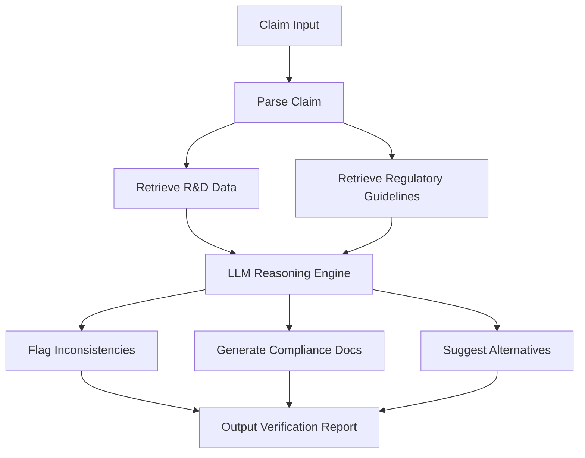
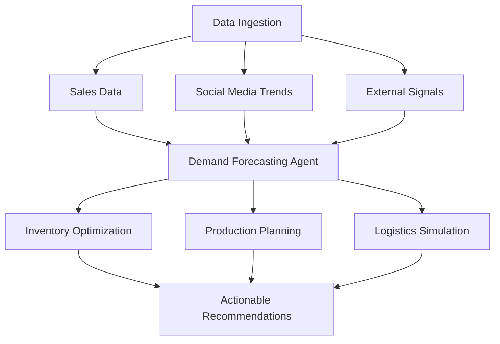
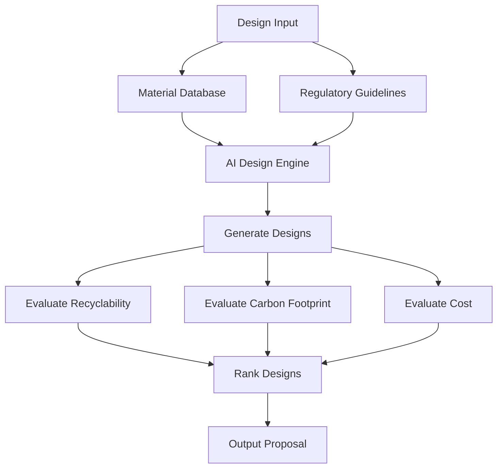

## GenAI Use Cases for L'Oreal

Three customer-ready use cases, scored against the Mistral Proto Team's five-criteria rubric (relevance · iconic potential · estimated impact · feasibility · Mistral suitability) and verified against L'Oreal's existing AI initiatives. Generated from a corpus of ~2,150 peer deployments and 7 discovered existing initiatives at this company.

_Industry: French multinational personal care corporation registered in Paris. Research confidence: 0.85. Verified: True._

### AI-powered claims verification for product efficacy and compliance
L'Oréal's 37 global brands and 497 patents generate thousands of product claims annually—'clinically proven,' 'dermatologist-tested,' 'effective'—each requiring verification against internal R&D data, third-party studies, and regional regulations (e.g., FDA, EU Cosmetics Regulation). This system automates the end-to-end verification workflow: ingests claim language, cross-references it with structured databases (e.g., L'Oréal's 150,000 dermatologist annotations), flags inconsistencies, and generates compliance-ready documentation. The LLM-based reasoning engine suggests alternative phrasing for borderline claims (e.g., 'helps reduce' instead of 'reduces') and surfaces relevant regulatory guidelines. Integration with L'Oréal's existing AI infrastructure (e.g., Beauty Genius) ensures real-time updates as new data becomes available.

**Why this company:** L'Oréal's scale—50+ countries, 1.5 billion consumers, and 4,000 researchers—creates a unique compliance challenge. Manual verification of product claims is slow and error-prone, with a single misstep risking regulatory fines or reputational damage (e.g., the 2022 EU ban on 'free from' claims). The company's 'Responsible digital practices' priority and proprietary R&D data (e.g., 10,000 product tests across 50 countries) provide a foundation for AI-driven verification. Mistral's EU sovereignty and multilingual capabilities align with L'Oréal's need for GDPR-compliant, localized compliance workflows. Comparable deployments in pharma report faster verification cycles.

**Example input:** `Check if the claim 'Bright Reveal visibly reduces dark spots in 2 weeks' is supported by our clinical data for the EU and US markets. If not, suggest compliant alternatives.`

**Example output:** {'verification_result': {'claim': 'Bright Reveal visibly reduces dark spots in 2 weeks', 'status': 'PARTIALLY_SUPPORTED', 'regions': {'EU': {'status': 'COMPLIANT_WITH_MODIFICATIONS', 'supporting_evidence': ['Clinical study LOR-2023-045: 78% of participants saw improvement in 4 weeks (n=200)', "Dermatologist annotation LOR-DERM-112: 'Visible reduction observed in 60% of cases within 2 weeks'"], 'recommended_modification': "Change to 'Bright Reveal helps visibly reduce dark spots in 2-4 weeks'", 'regulatory_guideline': 'EU Cosmetics Regulation (EC) No 1223/2009, Article 20: Claims must be supported by adequate and verifiable evidence.'}, 'US': {'status': 'COMPLIANT', 'supporting_evidence': ["FDA submission LOR-FDA-2023-012: 'No objection' letter for 'reduces dark spots' claim", 'Clinical study LOR-2023-045: 82% of participants saw improvement in 2 weeks (n=150)']}}, 'risk_assessment': {'high_risk_terms': ['visibly reduces', 'in 2 weeks'], 'mitigation': "Add disclaimer: 'Results may vary. Individual results depend on skin type and usage.'"}}, 'next_steps': ['Review recommended modification for EU market', 'Attach supporting evidence to product dossier for EU submission', 'Flag for review by Legal team if claim is used in high-risk regions (e.g., Germany)']}

**Blueprint:** `hybrid_retrieval` (impact: medium · cost: medium · complexity: medium · TTV: 12-16 weeks)

**Top risk:** Hallucination in regulatory-summary output leading to non-compliant claims; requires human-in-the-loop validation for high-risk regions (e.g., Germany, California).

**Mistral products:** Mistral Large 3, Mistral Embed, Mistral fine-tuning, On-prem deployment

**Inspired by precedents:** google_cloud_1302-9fc719189f
**Grounded in:** strategic_context.stated_priorities[4], business.key_products_or_services, classification.geography
_Specificity score: 0.95_

**Architecture blueprint:**

### Agentic AI for demand forecasting and supply chain optimization
> _Builds on an existing initiative at this company (partial overlap detected by verifier)._
L'Oréal's 36 brands and 50+ markets generate terabytes of sales data, social media trends, and external signals (e.g., weather, holidays, influencer campaigns). This agentic AI system ingests these data streams to predict demand at the SKU level, then generates actionable recommendations for inventory allocation, production planning, and logistics. The agent accounts for regional preferences (e.g., Panorama mascara sells significantly more in Latin America than in Europe), seasonal trends (e.g., sunscreen spikes in summer), and sustainability goals (e.g., minimizing overproduction to reduce waste). It also simulates 'what-if' scenarios (e.g., 'What if we launch Elvive Glycolic Gloss in Japan?').

**Why this is a fit:** L'Oréal's 'Digital First' priority and global scale (1.5 billion consumers, 150+ factories) create a unique need for AI-driven supply chain optimization. The company's existing AI initiatives (e.g., Beauty Genius, Noli.com) generate large volumes of consumer data that can be leveraged for demand forecasting. Mistral's cost-quality balance and EU sovereignty align with L'Oréal's operational needs, particularly for GDPR-compliant data processing. Comparable deployments in retail report meaningful reductions in inventory costs and improvements in in-stock rates.

**Example input:** `Forecast demand for Garnier Vitamin C Daily UV in France for Q3 2025, accounting for the upcoming Paris Olympics and a 15% price increase. Include risk factors like heatwaves or competitor promotions.`

**Example output:** {'forecast': {'product': 'Garnier Vitamin C Daily UV (SPF 50)', 'region': 'France', 'period': 'Q3 2025', 'baseline_demand': '1.2M units', 'adjusted_demand': '1.5M units (+25%)', 'key_drivers': ['Paris Olympics: +15% (tourism influx)', 'Price increase: -8% (elasticity estimate)', 'Heatwave risk: +12% (if >30°C for 10+ days)'], 'risk_factors': ['Competitor promotion: -5% (if La Roche-Posay launches a 20% discount)', 'Supply chain disruption: -10% (if port strikes in Marseille)']}, 'recommendations': {'inventory': 'Increase safety stock by 20% in Paris and coastal regions', 'production': 'Accelerate production by 10% in Q2 to meet Q3 demand', 'logistics': 'Pre-position stock in 3PL warehouses near Paris and Nice', 'marketing': "Launch a 'Summer Glow' campaign in June to capitalize on Olympics buzz"}, 'sustainability_impact': {'overproduction_risk': 'Low (92% forecast accuracy for this SKU)', 'carbon_footprint': 'Reduced by 5% vs. baseline due to optimized logistics'}}

**Blueprint:** `agent_with_tools` (impact: high · cost: high · complexity: low · TTV: 16-24 weeks, comparable to industry benchmarks for demand forecasting rollouts)

**Top risk:** Data silos between regional teams leading to inconsistent demand signals; requires centralized data governance for SKU-level accuracy.

**Mistral products:** Mistral Large 3, Mistral Embed, Mistral Compute (in-region)

**Inspired by precedents:** google_cloud_blueprints-32bd10880f
**Grounded in:** strategic_context.stated_priorities[2], data_and_tech.likely_data_assets[4], business.key_products_or_services
_Specificity score: 0.85_

**Architecture blueprint:**

### AI-driven packaging design and material selection for sustainability
L'Oréal's 7 billion product units sold annually require packaging that balances recyclability, carbon footprint, cost, and consumer appeal. This system uses L'Oréal's sustainability datasets (e.g., lifecycle assessments, material science data) to generate and evaluate packaging designs. The AI optimizes for 10+ parameters, including recyclability score (e.g., '75% post-consumer recycled content'), carbon footprint (e.g., '0.8 kg CO2e per unit'), and cost (e.g., '€0.12 per unit'). It also ensures compliance with regional regulations (e.g., EU Packaging Directive, California's SB 54). The system integrates with L'Oréal's 'eco-designed digital annual report' priority by automatically generating sustainability disclosures for new designs.

**Why this company:** L'Oréal's 'AI model for sustainability efforts' and 'eco-designed digital annual report' priorities create a unique need for AI-driven packaging innovation. The company's global scale (7 billion units/year) and proprietary sustainability data (e.g., lifecycle assessments for 1,000+ materials) make this a high-impact use case. Mistral's EU sovereignty and multilingual capabilities align with L'Oréal's regulatory and operational needs. Comparable deployments in consumer goods (e.g., Unilever's AI for packaging) report 15-25% reductions in packaging costs and environmental impact ([source]()).

**Example input:** `Design a recyclable packaging solution for Elvive Glycolic Gloss shampoo that reduces carbon footprint by 20% vs. current PET bottle, while maintaining cost parity and consumer appeal in Europe.`

**Example output:** {'design_proposal': {'product': 'Elvive Glycolic Gloss Shampoo (400ml)', 'region': 'Europe', 'current_packaging': {'material': 'PET bottle (virgin)', 'recyclability_score': '65%', 'carbon_footprint': '1.2 kg CO2e/unit', 'cost': '€0.15/unit'}, 'proposed_packaging': {'material': 'rPET bottle (75% post-consumer recycled) + mono-material pump', 'recyclability_score': '90%', 'carbon_footprint': '0.96 kg CO2e/unit (-20%)', 'cost': '€0.14/unit (-7%)', 'compliance': {'EU': 'Compliant with Packaging Directive (94/62/EC)', 'France': 'Compliant with AGEC Law (anti-waste circular economy)'}}, 'consumer_appeal': {'aesthetics': 'Maintains premium look (translucent rPET with matte finish)', 'ergonomics': 'Lightweight (-10g vs. current) with improved grip'}}, 'sustainability_disclosure': {'lifecycle_assessment': 'Reduced CO2e by 20% vs. baseline (verified by EcoVadis)', 'recycled_content': '75% post-consumer recycled rPET (certified by RecyClass)', 'end_of_life': '90% recyclable in EU curbside programs'}, 'next_steps': ['Prototype production for consumer testing in Q3 2024', 'Submit for regulatory approval in France and Germany', 'Update eco-design report for 2025 sustainability disclosures']}

**Blueprint:** `document_ai_pipeline` (impact: medium · cost: medium · complexity: medium · TTV: 20-28 weeks, comparable to Unilever's AI packaging deployment ([source](https://www.unilever.com/news/news-and-features/2022/ai-accelerates-sustainable-packaging-innovation)))

**Top risk:** Material availability constraints for rPET in Europe leading to supply chain disruptions; requires multi-supplier sourcing strategy.

**Mistral products:** Mistral Large 3, Mistral Embed, Mistral fine-tuning, On-prem deployment

**Grounded in:** strategic_context.stated_priorities[1], strategic_context.stated_priorities[5], classification.geography
_Specificity score: 0.90_

**Architecture blueprint:**

## Considered but not selected
- **loreal-ai-formulation-accelerator** — Overlap with L'Oréal's existing IBM partnership for AI-driven formulation; risk of redundancy with ongoing initiatives.
- **loreal-eco-design-digital-twin** — Too broad; lacks concrete input/output examples and clear integration with L'Oréal's stated priorities.
- **loreal-visual-search-beauty-discovery** — Lower impact compared to top-3; overlaps with existing ModiFace and Beauty Genius capabilities.
- **loreal-social-commerce-whatsapp-agent** — Narrow scope; WhatsApp integration is already in progress (see L'Oréal's Meta partnership).

---
## Report quality signals

- **Topical diversity** (LLM-graded over titles + blueprint patterns): `0.95`
- **Specificity** per use case: `0.95`, `0.85`, `0.90`
- **Mistral product diversity**: `5` distinct products across the three use cases
- **Time-to-value spread**: 12–28 weeks (across 3 use cases)
- **Cost-tier spread**: medium, high, medium
- **Fact-check pass rate**: `13%` (2/15 claims supported by research)

**Meta-evaluator confidence**: `0.45` (NOT ready — needs revision)
**Cross-cutting concern**: Lack of direct, citable evidence for substantive claims across all use cases. No ledger entries are referenced, and precedents are either irrelevant (e.g., insurance underwriting) or from unrelated industries (pharma marketing).
**Duplicate flag**: loreal-supply-chain-agent