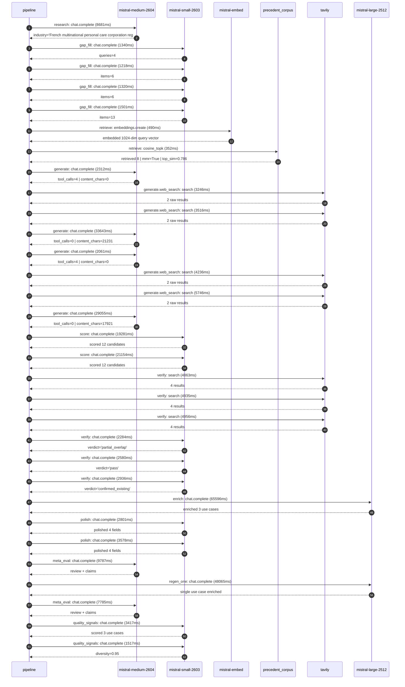

# Pipeline blueprint (architecture)

Static view of the pipeline regardless of run timing — shows agents,
models, and gates. The chronological execution log follows below.

```mermaid
flowchart TD
    Start([User: company name]) --> R
    R["<b>1. Research</b><br/>parallel: Wikipedia · Tavily news ·<br/>existing initiatives · live verification<br/><i>mistral-medium</i> synthesis"]
    R --> G["<b>1b. Gap-fill</b><br/>identify missing fields →<br/><i>mistral-small</i> generates queries →<br/>Tavily search per field →<br/><i>mistral-small</i> per-field extraction"]
    G --> Conf{Confidence ≥ 0.5<br/>OR verified<br/>OR ≥ 1 existing initiative?}
    Conf -->|no| Refuse([Refusal])
    Conf -->|yes| Ret
    Ret["<b>2. Retrieve</b><br/><i>mistral-embed</i> on company query →<br/>cosine top-K + industry/depth filter +<br/>MMR diversification"]
    Ret --> Gen["<b>3. Generate 12 candidates</b><br/><i>mistral-medium</i> with web_search tool<br/>(Tavily + deep-read) — fact citations<br/>flow into the EvidenceLedger"]
    Gen --> Score["<b>4. Score</b><br/>self-consistency: 2 parallel passes<br/><i>mistral-small</i> @ T=0.2 and T=0.4 →<br/>aggregate weighted scores"]
    Score --> Verify["<b>5. Per-candidate verify</b><br/>top-3: Tavily search + deep-read +<br/><i>mistral-small</i> verdict (pass /<br/>partial / confirmed_existing)"]
    Verify --> Enrich["<b>6. Enrich</b><br/><i>mistral-large</i> drafts customer-facing<br/>prose for 3 use cases (or<br/><i>mistral-medium</i> on fast tier)"]
    Enrich --> NumScrub["<b>6a. Numeric scrub</b><br/>flag any number not in cited content"]
    NumScrub --> Polish["<b>6b. Polish</b><br/><i>mistral-small</i> per use case (parallel):<br/>convert markers→qualitative,<br/>(ev-XXX)→[title](url)"]
    Polish --> Attr["<b>6c. Attribution check</b><br/><i>mistral-small</i> per use case (parallel):<br/>fix corpus-ID ↔ company mismatches"]
    Attr --> Meta["<b>7. Meta-evaluation</b><br/><i>mistral-medium</i> reviews report against<br/>cited precedents + ledger entries:<br/>strict claim verification"]
    Meta --> RegenQ{confidence < 0.6<br/>AND not fast tier?}
    RegenQ -->|yes| Regen["<b>7b. Targeted regen</b><br/><i>mistral-large</i> re-enriches just the<br/>weakest use case with the next-best<br/>near-miss; re-runs meta-eval"]
    RegenQ -->|no| QS
    Regen --> QS
    QS["<b>Quality signals</b><br/>LLM-graded diversity + specificity,<br/>fact-check pass rate, TTV/cost spread"]
    QS --> Render([Markdown report + trace])

    classDef agent fill:#fef3c7,stroke:#f59e0b
    classDef gate fill:#dbeafe,stroke:#3b82f6
    classDef io fill:#dcfce7,stroke:#16a34a
    class R,G,Ret,Gen,Score,Verify,Enrich,NumScrub,Polish,Attr,Meta,Regen,QS agent
    class Conf,RegenQ gate
    class Start,Refuse,Render io
```

## Execution trace — L'Oreal

Started: `2026-05-08T17:39:48.097545+00:00`. Total wall time: `292.9s` across `31` recorded actions.

### Per-step time totals

| Step | Calls | Total time | Avg time |
|---|---:|---:|---:|
| `research` | 1 | 8.68s | 8681ms |
| `gap_fill` | 4 | 5.38s | 1345ms |
| `retrieve` | 2 | 0.84s | 421ms |
| `generate` | 4 | 67.07s | 16768ms |
| `generate.web_search` | 4 | 16.74s | 4186ms |
| `score` | 2 | 40.44s | 20218ms |
| `verify` | 6 | 22.55s | 3759ms |
| `enrich` | 1 | 65.60s | 65596ms |
| `polish` | 2 | 6.38s | 3190ms |
| `meta_eval` | 2 | 17.57s | 8786ms |
| `regen_one` | 1 | 48.07s | 48065ms |
| `quality_signals` | 2 | 4.93s | 2467ms |

### Chronological event log

- `17:39:51.212` **[research]** `mistral-medium-2604.chat.complete` — 8681ms
   - inputs: synthesize CompanyContext for L'Oreal | depth=medium
   - outputs: industry='French multinational personal care corporation registered in Paris' verified=True conf=0.75
- `17:40:00.704` **[gap_fill]** `mistral-small-2603.chat.complete` — 1340ms
   - inputs: generate gap queries | fields=['business_model', 'products', 'data_assets', 'priorities']
   - outputs: queries=4
- `17:40:10.043` **[gap_fill]** `mistral-small-2603.chat.complete` — 1218ms
   - inputs: layer-2 extract field=priorities
   - outputs: items=6
- `17:40:10.069` **[gap_fill]** `mistral-small-2603.chat.complete` — 1320ms
   - inputs: layer-2 extract field=data_assets
   - outputs: items=6
- `17:40:10.090` **[gap_fill]** `mistral-small-2603.chat.complete` — 1501ms
   - inputs: layer-2 extract field=products
   - outputs: items=13
- `17:40:11.622` **[retrieve]** `mistral-embed.embeddings.create` — 490ms
   - inputs: company_query | industries='French multinational personal care corporation registered in Paris'
   - outputs: embedded 1024-dim query vector
- `17:40:12.113` **[retrieve]** `precedent_corpus.cosine_topk` — 352ms
   - inputs: k=8 min_depth=0.4 target="L'Oreal"
   - outputs: retrieved 8 | mmr=True | top_sim=0.786
- `17:40:13.379` **[generate]** `mistral-medium-2604.chat.complete` — 2312ms
   - inputs: iteration=0 tool_calls_used=0/2 tools=on
   - outputs: tool_calls=4 | content_chars=0
- `17:40:15.710` **[generate.web_search]** `tavily.search` — 3246ms
   - inputs: query="L'Oréal ModiFace AR virtual try-on technologies proprietary datasets"
   - outputs: 2 raw results
- `17:40:19.599` **[generate.web_search]** `tavily.search` — 3516ms
   - inputs: query="L'Oréal Noli.com AI beauty advisor face scan dataset details"
   - outputs: 2 raw results
- `17:40:24.997` **[generate]** `mistral-medium-2604.chat.complete` — 33643ms
   - inputs: iteration=1 tool_calls_used=2/2 tools=off
   - outputs: tool_calls=0 | content_chars=21231
- `17:40:59.266` **[generate]** `mistral-medium-2604.chat.complete` — 2061ms
   - inputs: iteration=0 tool_calls_used=0/2 tools=on
   - outputs: tool_calls=4 | content_chars=0
- `17:41:01.337` **[generate.web_search]** `tavily.search` — 4236ms
   - inputs: query="L'Oréal Noli.com multi-brand e-commerce platform features and scale"
   - outputs: 2 raw results
- `17:41:09.455` **[generate.web_search]** `tavily.search` — 5746ms
   - inputs: query="L'Oréal ModiFace augmented reality and AI technologies capabilities"
   - outputs: 2 raw results
- `17:41:18.196` **[generate]** `mistral-medium-2604.chat.complete` — 29055ms
   - inputs: iteration=1 tool_calls_used=2/2 tools=off
   - outputs: tool_calls=0 | content_chars=17921
- `17:41:47.780` **[score]** `mistral-small-2603.chat.complete` — 19281ms
   - inputs: self-consistency pass T=0.4
   - outputs: scored 12 candidates
- `17:41:47.777` **[score]** `mistral-small-2603.chat.complete` — 21154ms
   - inputs: self-consistency pass T=0.2
   - outputs: scored 12 candidates
- `17:42:08.981` **[verify]** `tavily.search` — 4863ms
   - inputs: candidate=loreal-ai-formulation-accelerator | query="L'Oreal AI-driven ingredient compatibility and formulation o"
   - outputs: 4 results
- `17:42:08.982` **[verify]** `tavily.search` — 4935ms
   - inputs: candidate=loreal-supply-chain-agent | query="L'Oreal Agentic AI for demand forecasting and supply chain o"
   - outputs: 4 results
- `17:42:08.982` **[verify]** `tavily.search` — 4956ms
   - inputs: candidate=loreal-ai-claims-verification | query="L'Oreal AI-powered claims verification for product efficacy "
   - outputs: 4 results
- `17:42:17.150` **[verify]** `mistral-small-2603.chat.complete` — 2284ms
   - inputs: verdict for loreal-supply-chain-agent
   - outputs: verdict='partial_overlap'
- `17:42:17.219` **[verify]** `mistral-small-2603.chat.complete` — 2580ms
   - inputs: verdict for loreal-ai-claims-verification
   - outputs: verdict='pass'
- `17:42:17.599` **[verify]** `mistral-small-2603.chat.complete` — 2936ms
   - inputs: verdict for loreal-ai-formulation-accelerator
   - outputs: verdict='confirmed_existing'
- `17:42:20.567` **[enrich]** `mistral-large-2512.chat.complete` — 65596ms
   - inputs: tier=standard top_3=['loreal-ai-claims-verification', 'loreal-supply-chain-agent', 'loreal-ai-packaging-innovation']
   - outputs: enriched 3 use cases
- `17:43:26.166` **[polish]** `mistral-small-2603.chat.complete` — 2801ms
   - inputs: use_case=loreal-ai-claims-verification unanchored=True opaque_ev=False
   - outputs: polished 4 fields
- `17:43:26.172` **[polish]** `mistral-small-2603.chat.complete` — 3578ms
   - inputs: use_case=loreal-supply-chain-agent unanchored=True opaque_ev=False
   - outputs: polished 4 fields
- `17:43:29.784` **[meta_eval]** `mistral-medium-2604.chat.complete` — 9787ms
   - inputs: reviewing 3 use cases
   - outputs: review + claims
- `17:43:39.604` **[regen_one]** `mistral-large-2512.chat.complete` — 48065ms
   - inputs: replace weakest=loreal-ai-claims-verification with loreal-ai-formulation-accelerator
   - outputs: single use case enriched
- `17:44:27.702` **[meta_eval]** `mistral-medium-2604.chat.complete` — 7785ms
   - inputs: reviewing 3 use cases
   - outputs: review + claims
- `17:44:36.109` **[quality_signals]** `mistral-small-2603.chat.complete` — 3417ms
   - inputs: specificity grade (3 use cases)
   - outputs: scored 3 use cases
- `17:44:39.527` **[quality_signals]** `mistral-small-2603.chat.complete` — 1517ms
   - inputs: diversity grade
   - outputs: diversity=0.95

## Mermaid sequence diagram (execution)

