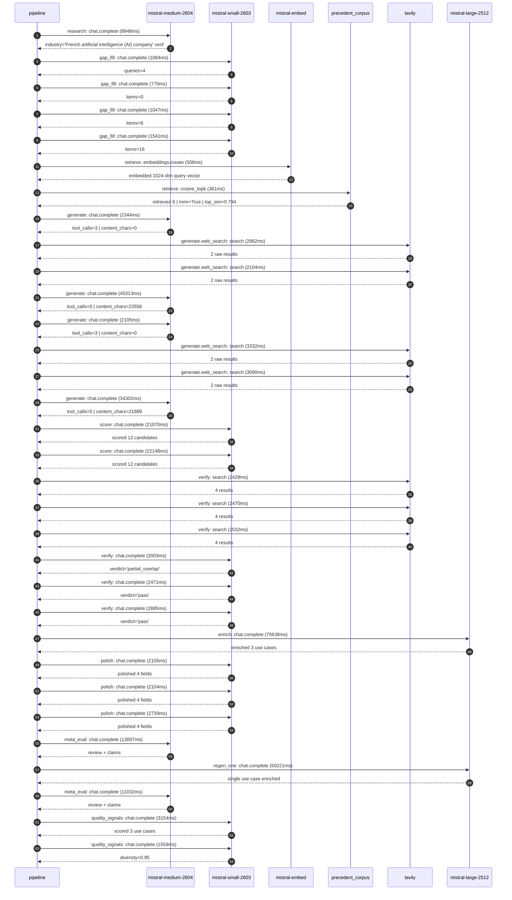

# Pipeline blueprint (architecture)

Static view of the pipeline regardless of run timing — shows agents,
models, and gates. The chronological execution log follows below.

```mermaid
flowchart TD
    Start([User: company name]) --> R
    R["<b>1. Research</b><br/>parallel: Wikipedia · Tavily news ·<br/>existing initiatives · live verification<br/><i>mistral-medium</i> synthesis"]
    R --> G["<b>1b. Gap-fill</b><br/>identify missing fields →<br/><i>mistral-small</i> generates queries →<br/>Tavily search per field →<br/><i>mistral-small</i> per-field extraction"]
    G --> Conf{Confidence ≥ 0.5<br/>OR verified<br/>OR ≥ 1 existing initiative?}
    Conf -->|no| Refuse([Refusal])
    Conf -->|yes| Ret
    Ret["<b>2. Retrieve</b><br/><i>mistral-embed</i> on company query →<br/>cosine top-K + industry/depth filter +<br/>MMR diversification"]
    Ret --> Gen["<b>3. Generate 12 candidates</b><br/><i>mistral-medium</i> with web_search tool<br/>(Tavily + deep-read) — fact citations<br/>flow into the EvidenceLedger"]
    Gen --> Score["<b>4. Score</b><br/>self-consistency: 2 parallel passes<br/><i>mistral-small</i> @ T=0.2 and T=0.4 →<br/>aggregate weighted scores"]
    Score --> Verify["<b>5. Per-candidate verify</b><br/>top-3: Tavily search + deep-read +<br/><i>mistral-small</i> verdict (pass /<br/>partial / confirmed_existing)"]
    Verify --> Enrich["<b>6. Enrich</b><br/><i>mistral-large</i> drafts customer-facing<br/>prose for 3 use cases (or<br/><i>mistral-medium</i> on fast tier)"]
    Enrich --> NumScrub["<b>6a. Numeric scrub</b><br/>flag any number not in cited content"]
    NumScrub --> Polish["<b>6b. Polish</b><br/><i>mistral-small</i> per use case (parallel):<br/>convert markers→qualitative,<br/>(ev-XXX)→[title](url)"]
    Polish --> Attr["<b>6c. Attribution check</b><br/><i>mistral-small</i> per use case (parallel):<br/>fix corpus-ID ↔ company mismatches"]
    Attr --> Meta["<b>7. Meta-evaluation</b><br/><i>mistral-medium</i> reviews report against<br/>cited precedents + ledger entries:<br/>strict claim verification"]
    Meta --> RegenQ{confidence < 0.6<br/>AND not fast tier?}
    RegenQ -->|yes| Regen["<b>7b. Targeted regen</b><br/><i>mistral-large</i> re-enriches just the<br/>weakest use case with the next-best<br/>near-miss; re-runs meta-eval"]
    RegenQ -->|no| QS
    Regen --> QS
    QS["<b>Quality signals</b><br/>LLM-graded diversity + specificity,<br/>fact-check pass rate, TTV/cost spread"]
    QS --> Render([Markdown report + trace])

    classDef agent fill:#fef3c7,stroke:#f59e0b
    classDef gate fill:#dbeafe,stroke:#3b82f6
    classDef io fill:#dcfce7,stroke:#16a34a
    class R,G,Ret,Gen,Score,Verify,Enrich,NumScrub,Polish,Attr,Meta,Regen,QS agent
    class Conf,RegenQ gate
    class Start,Refuse,Render io
```

## Execution trace — Mistral AI

Started: `2026-05-08T17:44:42.026659+00:00`. Total wall time: `316.2s` across `32` recorded actions.

### Per-step time totals

| Step | Calls | Total time | Avg time |
|---|---:|---:|---:|
| `research` | 1 | 8.95s | 8948ms |
| `gap_fill` | 4 | 4.44s | 1111ms |
| `retrieve` | 2 | 0.87s | 434ms |
| `generate` | 4 | 79.06s | 19766ms |
| `generate.web_search` | 4 | 11.49s | 2872ms |
| `score` | 2 | 43.22s | 21609ms |
| `verify` | 6 | 14.79s | 2465ms |
| `enrich` | 1 | 75.64s | 75638ms |
| `polish` | 3 | 6.95s | 2316ms |
| `meta_eval` | 2 | 24.04s | 12019ms |
| `regen_one` | 1 | 50.22s | 50221ms |
| `quality_signals` | 2 | 4.71s | 2356ms |

### Chronological event log

- `17:44:44.600` **[research]** `mistral-medium-2604.chat.complete` — 8948ms
   - inputs: synthesize CompanyContext for Mistral AI | depth=medium
   - outputs: industry='French artificial intelligence (AI) company' verified=True conf=0.75
- `17:44:54.567` **[gap_fill]** `mistral-small-2603.chat.complete` — 1084ms
   - inputs: generate gap queries | fields=['business_model', 'products', 'data_assets', 'priorities']
   - outputs: queries=4
- `17:45:07.679` **[gap_fill]** `mistral-small-2603.chat.complete` — 770ms
   - inputs: layer-2 extract field=data_assets
   - outputs: items=0
- `17:45:07.652` **[gap_fill]** `mistral-small-2603.chat.complete` — 1047ms
   - inputs: layer-2 extract field=priorities
   - outputs: items=6
- `17:45:07.702` **[gap_fill]** `mistral-small-2603.chat.complete` — 1541ms
   - inputs: layer-2 extract field=products
   - outputs: items=16
- `17:45:09.279` **[retrieve]** `mistral-embed.embeddings.create` — 508ms
   - inputs: company_query | industries='French artificial intelligence (AI) company'
   - outputs: embedded 1024-dim query vector
- `17:45:09.786` **[retrieve]** `precedent_corpus.cosine_topk` — 361ms
   - inputs: k=8 min_depth=0.4 target='Mistral AI'
   - outputs: retrieved 8 | mmr=True | top_sim=0.794
- `17:45:11.203` **[generate]** `mistral-medium-2604.chat.complete` — 2344ms
   - inputs: iteration=0 tool_calls_used=0/2 tools=on
   - outputs: tool_calls=3 | content_chars=0
- `17:45:13.568` **[generate.web_search]** `tavily.search` — 2962ms
   - inputs: query='Mistral AI 2025 2026 product roadmap Clay integration agentic AI'
   - outputs: 2 raw results
- `17:45:19.423` **[generate.web_search]** `tavily.search` — 2104ms
   - inputs: query='Mistral AI Le Chat user base and features 2025'
   - outputs: 2 raw results
- `17:45:23.007` **[generate]** `mistral-medium-2604.chat.complete` — 40313ms
   - inputs: iteration=1 tool_calls_used=2/2 tools=off
   - outputs: tool_calls=0 | content_chars=23556
- `17:46:03.944` **[generate]** `mistral-medium-2604.chat.complete` — 2105ms
   - inputs: iteration=0 tool_calls_used=0/2 tools=on
   - outputs: tool_calls=3 | content_chars=0
- `17:46:06.062` **[generate.web_search]** `tavily.search` — 3332ms
   - inputs: query='Mistral AI Clay integration 2026'
   - outputs: 2 raw results
- `17:46:11.007` **[generate.web_search]** `tavily.search` — 3090ms
   - inputs: query='Mistral AI 24/7 Agents product details'
   - outputs: 2 raw results
- `17:46:15.418` **[generate]** `mistral-medium-2604.chat.complete` — 34302ms
   - inputs: iteration=1 tool_calls_used=2/2 tools=off
   - outputs: tool_calls=0 | content_chars=21889
- `17:46:50.716` **[score]** `mistral-small-2603.chat.complete` — 21070ms
   - inputs: self-consistency pass T=0.2
   - outputs: scored 12 candidates
- `17:46:50.718` **[score]** `mistral-small-2603.chat.complete` — 22148ms
   - inputs: self-consistency pass T=0.4
   - outputs: scored 12 candidates
- `17:47:12.925` **[verify]** `tavily.search` — 2428ms
   - inputs: candidate=agentic-competitive-intel-pipeline | query='Mistral AI 24/7 Agentic Competitive Intelligence Pipeline wi'
   - outputs: 4 results
- `17:47:12.925` **[verify]** `tavily.search` — 2470ms
   - inputs: candidate=agentic-compliance-audit-for-enterprise | query='Mistral AI Agentic Compliance Audit for Enterprise Model Dep'
   - outputs: 4 results
- `17:47:12.925` **[verify]** `tavily.search` — 2532ms
   - inputs: candidate=revenue-engine-agent-for-enterprise-deals | query='Mistral AI Revenue Engine Agent for Enterprise Deal Accelera'
   - outputs: 4 results
- `17:47:16.287` **[verify]** `mistral-small-2603.chat.complete` — 2003ms
   - inputs: verdict for agentic-competitive-intel-pipeline
   - outputs: verdict='partial_overlap'
- `17:47:16.599` **[verify]** `mistral-small-2603.chat.complete` — 2471ms
   - inputs: verdict for agentic-compliance-audit-for-enterprise
   - outputs: verdict='pass'
- `17:47:16.828` **[verify]** `mistral-small-2603.chat.complete` — 2885ms
   - inputs: verdict for revenue-engine-agent-for-enterprise-deals
   - outputs: verdict='pass'
- `17:47:19.750` **[enrich]** `mistral-large-2512.chat.complete` — 75638ms
   - inputs: tier=standard top_3=['revenue-engine-agent-for-enterprise-deals', 'agentic-compliance-audit-for-enterprise', 'agentic-competitive-intel-pipeline']
   - outputs: enriched 3 use cases
- `17:48:35.392` **[polish]** `mistral-small-2603.chat.complete` — 2105ms
   - inputs: use_case=revenue-engine-agent-for-enterprise-deals unanchored=True opaque_ev=False
   - outputs: polished 4 fields
- `17:48:35.397` **[polish]** `mistral-small-2603.chat.complete` — 2104ms
   - inputs: use_case=agentic-compliance-audit-for-enterprise unanchored=True opaque_ev=False
   - outputs: polished 4 fields
- `17:48:35.399` **[polish]** `mistral-small-2603.chat.complete` — 2739ms
   - inputs: use_case=agentic-competitive-intel-pipeline unanchored=True opaque_ev=False
   - outputs: polished 4 fields
- `17:48:38.160` **[meta_eval]** `mistral-medium-2604.chat.complete` — 13007ms
   - inputs: reviewing 3 use cases
   - outputs: review + claims
- `17:48:51.197` **[regen_one]** `mistral-large-2512.chat.complete` — 50221ms
   - inputs: replace weakest=agentic-compliance-audit-for-enterprise with multimodal-code-review-agent
   - outputs: single use case enriched
- `17:49:41.451` **[meta_eval]** `mistral-medium-2604.chat.complete` — 11032ms
   - inputs: reviewing 3 use cases
   - outputs: review + claims
- `17:49:53.510` **[quality_signals]** `mistral-small-2603.chat.complete` — 3154ms
   - inputs: specificity grade (3 use cases)
   - outputs: scored 3 use cases
- `17:49:56.664` **[quality_signals]** `mistral-small-2603.chat.complete` — 1558ms
   - inputs: diversity grade
   - outputs: diversity=0.95

## Mermaid sequence diagram (execution)

