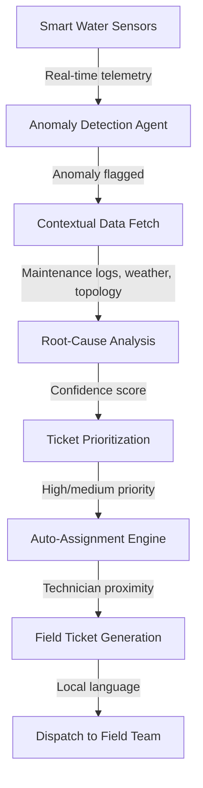
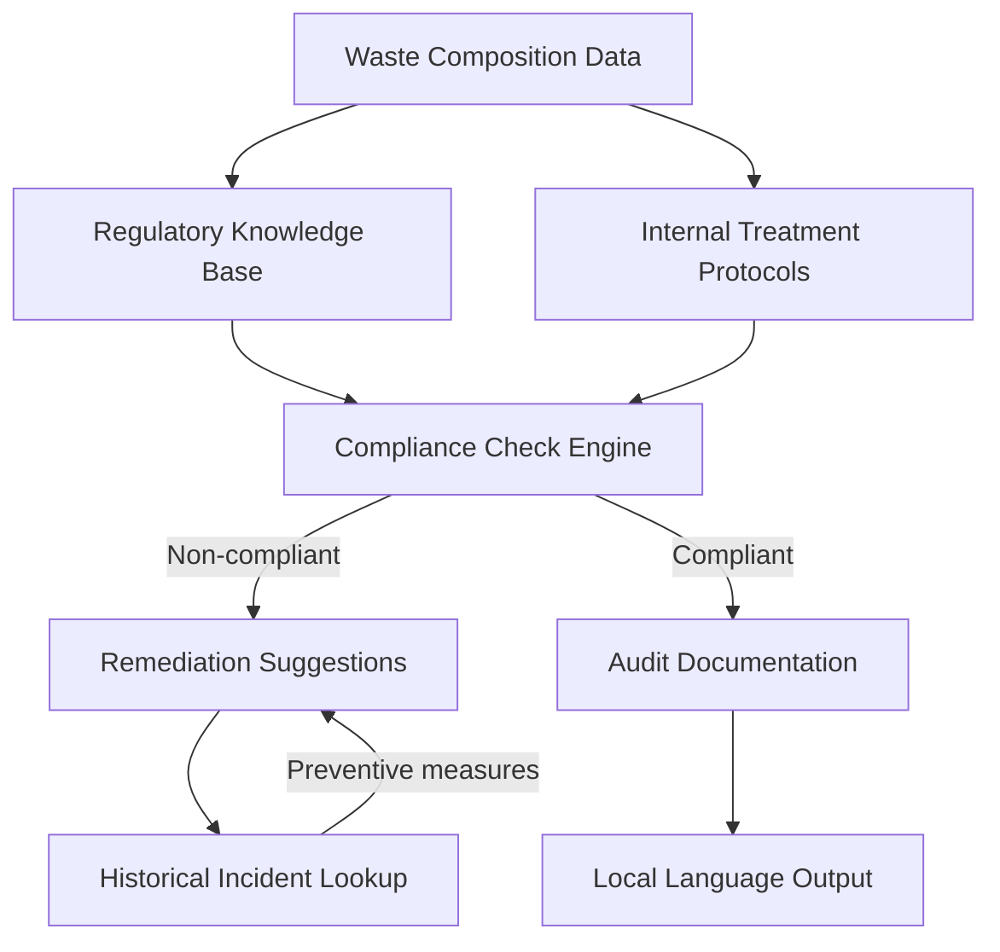
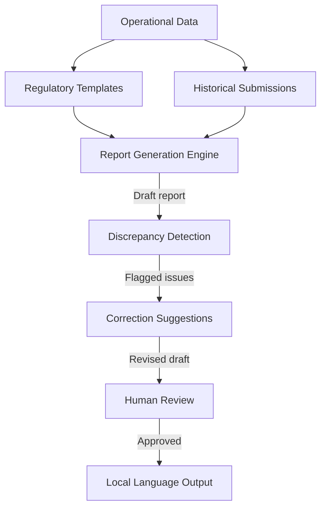

## GenAI Use Cases for Veolia

Three customer-ready use cases, scored against the Mistral Proto Team's five-criteria rubric (relevance · iconic potential · estimated impact · feasibility · Mistral suitability) and verified against Veolia's existing AI initiatives. Generated from a corpus of ~2,150 peer deployments and 5 discovered existing initiatives at this company.

_Industry: French transnational company. Research confidence: 0.85. Verified: True._

### Agentic real-time anomaly triage for Veolia's 3M+ smart water sensors
A multi-step agent that ingests real-time telemetry from Veolia’s extensive smart water sensor network, detects anomalies such as pressure drops, flow irregularities, and acoustic signatures, and automatically generates prioritized field tickets. The system enriches these alerts with contextual data—historical maintenance logs, weather patterns, and local network topology—to produce structured reports with root-cause hypotheses, confidence scores, and recommended actions in the local language of field teams. Tickets are auto-assigned based on severity and technician proximity, reducing non-revenue water losses and improving response times. This extends Veolia’s existing Hubgrade platform with agentic capabilities, supporting its GreenUp strategic plan to decarbonize operations and optimize resource management.

**Why this company:** Veolia operates one of the world’s largest smart water sensor networks and has committed to reducing non-revenue water as part of its GreenUp strategic plan. The Hubgrade platform already provides robust monitoring infrastructure, but lacks agentic triage—this use case directly enhances Hubgrade’s value without duplication. Mistral’s multilingual support and EU-hosted deployment align with Veolia’s global municipal contracts and data sovereignty requirements. Peer precedent shows meaningful reductions in non-revenue water through AI-driven pressure analytics ([AI-Powered Water & Waste Systems 2025](https://logiciel.io/blog/ai-water-waste-systems-predictive-sustainability-2025)).

**Example input:** `Show me all sensors in the Paris Nord network that reported a pressure drop >15% in the last 2 hours, along with the nearest available technician and a root-cause hypothesis.`

**Example output:** {'anomaly_report': {'network': 'Paris Nord', 'time_range': '2025-10-15T14:00:00 - 2025-10-15T16:00:00', 'anomalies_detected': 3, 'high_priority_tickets': [{'sensor_id': 'PN-SENSOR-47291', 'location': 'Rue de Rivoli, Sector 3', 'anomaly_type': 'Pressure drop (22%)', 'confidence_score': 0.92, 'root_cause_hypothesis': 'Possible pipe leak or valve malfunction (historical data shows 3 similar incidents in this sector in the last 6 months).', 'recommended_action': 'Dispatch technician for visual inspection and pressure test within 2 hours.', 'assigned_technician': 'Jean Dupont (ID: TECH-4582, 1.2 km away, ETA: 18 mins)', 'local_language_notes': 'Fuite de conduite ou dysfonctionnement de vanne suspectée. Inspection visuelle et test de pression requis.'}], 'medium_priority_tickets': [{'sensor_id': 'PN-SENSOR-38410', 'location': 'Boulevard Haussmann, Sector 7', 'anomaly_type': 'Flow irregularity (12% deviation)', 'confidence_score': 0.78, 'root_cause_hypothesis': 'Potential blockage or sensor calibration drift (no historical incidents in this sector).', 'recommended_action': 'Schedule calibration check within 24 hours.', 'assigned_technician': 'Marie Laurent (ID: TECH-3912, 3.4 km away)'}]}, 'summary': '3 anomalies detected. 1 high-priority ticket auto-assigned. Estimated non-revenue water loss if unresolved: ~120 m³/day.'}

**Blueprint:** `agent_with_tools` (impact: high · cost: medium · complexity: low · TTV: 12-16 weeks)

**Top risk:** Hallucination in root-cause hypotheses leading to misdirected field responses; mitigation requires confidence-score thresholds and human-in-the-loop validation for high-severity tickets.

**Mistral products:** Mistral Large 3, Mistral Embed, Mistral Compute (in-region), Mistral Fine-Tuning

**Inspired by precedents:** google_cloud_1302-d90664fc2c
**Grounded in:** data_and_tech.likely_data_assets[0], business.key_products_or_services[0], strategic_context.stated_priorities[6], strategic_context.stated_priorities[9]
_Specificity score: 0.95_

**Architecture blueprint:**

### Agentic compliance assistant for hazardous waste treatment
A retrieval-augmented agent that assists Veolia’s hazardous waste teams with real-time compliance checks across EU, US, and local regulations. The system ingests waste composition data (e.g., chemical profiles, radioactivity levels), regulatory requirements (e.g., EU Waste Framework Directive, US RCRA), and Veolia’s internal treatment protocols to validate disposal methods, flag non-compliant scenarios, and generate audit-ready documentation in the required language. It integrates with Veolia’s Nuclear Solutions and Hazardous Waste Europe data systems, providing step-by-step guidance for complex waste streams (e.g., mixed radioactive waste). The agent also cross-references historical compliance incidents to suggest preventive measures.

**Why this company:** Veolia treats millions of tons of hazardous waste annually and operates Nuclear Solutions, where compliance is mission-critical. The GreenUp plan emphasizes depollution and regulatory adherence, making this a high-impact area. Mistral’s EU sovereignty and multilingual support are decisive for cross-border hazardous waste operations, where local language documentation is legally required.

**Example input:** `Check if this waste stream (attached lab report: 25% toluene, 15% heavy metals, 60% inert) can be treated at our Lyon facility under EU and French regulations. If not, suggest compliant alternatives.`

**Example output:** {'compliance_check': {'waste_stream_id': 'LY-WST-2025-1042', 'composition': {'toluene': '25%', 'heavy_metals': '15%', 'inert_materials': '60%'}, 'facility': 'Veolia Lyon Hazardous Waste Treatment Center', 'regulatory_frameworks': ['EU Waste Framework Directive (2008/98/EC)', 'French Décret n°2016-288 (hazardous waste treatment)'], 'compliance_status': 'Non-compliant', 'issues': [{'regulation': 'EU Waste Framework Directive, Annex III', 'violation': 'Toluene concentration exceeds 20% threshold for incineration without pre-treatment.', 'severity': 'High'}, {'regulation': 'French Décret n°2016-288, Article 12', 'violation': 'Heavy metals require stabilization before landfill disposal.', 'severity': 'Medium'}], 'recommended_actions': [{'action': 'Pre-treat waste stream to reduce toluene concentration below 20% via distillation or solvent recovery.', 'facility_capability': 'Available at Lyon facility (Unit 3).', 'estimated_cost': '€120/ton', 'timeframe': '48 hours'}, {'action': 'Stabilize heavy metals using cement solidification or chemical fixation prior to landfill disposal.', 'facility_capability': 'Available at Lyon facility (Unit 5).', 'estimated_cost': '€85/ton', 'timeframe': '24 hours'}, {'alternative_facility': {'name': 'Veolia Strasbourg Hazardous Waste Treatment Center', 'capability': 'Licensed for high-toluene waste streams (up to 30%).', 'distance': '420 km', 'transport_cost': '€350/ton (ADR-compliant)'}}], 'audit_documentation': {'generated': 'Compliance report (FR/EN) with regulatory references, waste composition, and treatment recommendations.', 'attachments': ['EU Waste Framework Directive excerpts (Annex III)', 'French Décret n°2016-288 (Article 12)', 'Lyon facility treatment protocols (Unit 3, Unit 5)']}}, 'historical_context': '3 similar non-compliance incidents in the last 12 months at Lyon facility. Root cause: toluene concentration misclassification. Suggested preventive measure: implement real-time lab data validation for incoming waste streams.'}

**Blueprint:** `hybrid_retrieval` (impact: medium · cost: medium · complexity: low · TTV: 3-6 months)

**Top risk:** Data privacy under GDPR for cross-border hazardous waste documentation; mitigation requires on-prem deployment and strict access controls for sensitive waste profiles.

**Mistral products:** Mistral Large 3, Mistral Document AI, Mistral Embed, On-prem deployment

**Grounded in:** business.key_products_or_services[4], business.key_products_or_services[6], strategic_context.stated_priorities[5]
_Specificity score: 0.90_

**Architecture blueprint:**

### Automated regulatory reporting for environmental compliance
A document AI pipeline that automates the generation of environmental compliance reports (e.g., EU ETS, water discharge permits, waste manifestos) across Veolia’s 56-country operations. The system ingests operational data (e.g., emissions, water quality, waste volumes), regulatory templates (e.g., EU CSRD, US EPA NPDES), and historical submissions to produce draft reports, flag discrepancies, and suggest corrections in the required language and format. It cross-references data with Veolia’s internal KPIs (e.g., GreenUp decarbonization targets) to ensure alignment with corporate sustainability goals. The pipeline also includes a human-in-the-loop review step for high-stakes reports (e.g., EU ETS submissions).

**Why this company:** Veolia operates in 56 countries with diverse regulatory regimes, making compliance reporting a high-cost, high-risk area. The GreenUp plan emphasizes ecological transformation and regulatory adherence, with explicit targets for decarbonization and biodiversity ([Veolia - Our purpose](https://www.veolia.com/sites/g/files/dvc4206/files/document/2025/08/veolia-our-purpose-0825.pdf)). Mistral’s EU sovereignty and multilingual support are critical for cross-border reporting, where local language and format requirements vary. This use case does not duplicate Veolia Secure GPT, as it focuses on structured regulatory outputs rather than general-purpose AI.

**Example input:** `Generate a draft EU ETS report for our Berlin waste-to-energy plant for Q3 2025, including Scope 1 emissions, fuel mix data, and compliance with the 2025 EU carbon border adjustment mechanism.`

**Example output:** {'report_draft': {'report_type': 'EU ETS Compliance Report (Q3 2025)', 'facility': 'Veolia Berlin Waste-to-Energy Plant (ID: DE-WTE-0042)', 'reporting_period': '2025-07-01 to 2025-09-30', 'key_data': {'scope_1_emissions': '42,500 tCO₂e (target: ≤45,000 tCO₂e)', 'fuel_mix': {'municipal_waste': '65%', 'industrial_waste': '25%', 'biomass': '10%'}, 'carbon_border_adjustment': {'compliance_status': 'Compliant', 'verification': 'Pending (DEHSt audit scheduled for 2025-11-15)'}}, 'discrepancies_flagged': [{'data_point': 'Scope 1 emissions (42,500 tCO₂e)', 'issue': '2% above Q2 2025 baseline (41,700 tCO₂e). Root cause: increased industrial waste intake (25% vs. 20% in Q2).', 'recommended_action': 'Review waste intake contracts to prioritize lower-carbon feedstocks.'}], 'regulatory_alignment': {'eu_ets_directive': 'Compliant (2003/87/EC, amended 2023)', 'carbon_border_adjustment': 'Compliant (Regulation (EU) 2023/956)', 'local_permits': 'Compliant (Berlin Air Quality Permit No. 2022-471-B)'}, 'sustainability_kpis': {'decarbonization_progress': 'On track (8% reduction vs. 2022 baseline, target: 15% by 2027)', 'circularity_rate': '58% (target: 60% by 2025)'}, 'attachments': ['Q3 2025 emissions data (CSV)', 'Fuel mix analysis (PDF)', 'EU ETS Directive excerpts (2003/87/EC)', 'Berlin Air Quality Permit No. 2022-471-B']}, 'review_notes': {'human_review_required': True, 'priority': 'High (EU ETS submission deadline: 2025-10-31)', 'reviewer': 'Assigned to: Dr. Anna Müller (Compliance Officer, Veolia Germany)'}}

**Blueprint:** `document_ai_pipeline` (impact: medium · cost: medium · complexity: low · TTV: unknown)

**Top risk:** Hallucination in regulatory-summary output leading to non-compliance; mitigation requires strict template adherence and human-in-the-loop validation for high-stakes reports.

**Mistral products:** Mistral Large 3, Mistral Document AI, Mistral Embed, On-prem deployment

**Grounded in:** strategic_context.stated_priorities[3], strategic_context.stated_priorities[4], classification.geography
_Specificity score: 0.85_

**Architecture blueprint:**

## Considered but not selected
- **Data center water reuse optimizer** — Lacks direct alignment with Veolia’s core GreenUp priorities; Amazon collaboration is exploratory, not operational.
- **Waste-to-resource circularity planner** — Overlaps with existing Veolia Agriculture and IFM offerings; no clear differentiation from current circularity initiatives.
- **Biodiversity impact predictor** — Act4nature commitments are aspirational; lacks concrete data assets or regulatory drivers for near-term deployment.
- **Water footprint AI coach** — Hubgrade Water Footprint already addresses this; redundant with Veolia’s existing digital solutions.

---
## Report quality signals

- **Topical diversity** (LLM-graded over titles + blueprint patterns): `0.95`
- **Specificity** per use case: `0.95`, `0.90`, `0.85`
- **Mistral product diversity**: `6` distinct products across the three use cases
- **Time-to-value spread**: 12–16 weeks (across 3 use cases)
- **Cost-tier spread**: medium, medium, medium
- **Fact-check pass rate**: `69%` (9/13 claims supported by research)

**Meta-evaluator confidence**: `0.45` (NOT ready — needs revision)
**Cross-cutting concern**: Insufficient direct evidence linking peer-deployment claims to cited precedents, and multiple unsupported quantitative or operational claims about Veolia's current state or capabilities.