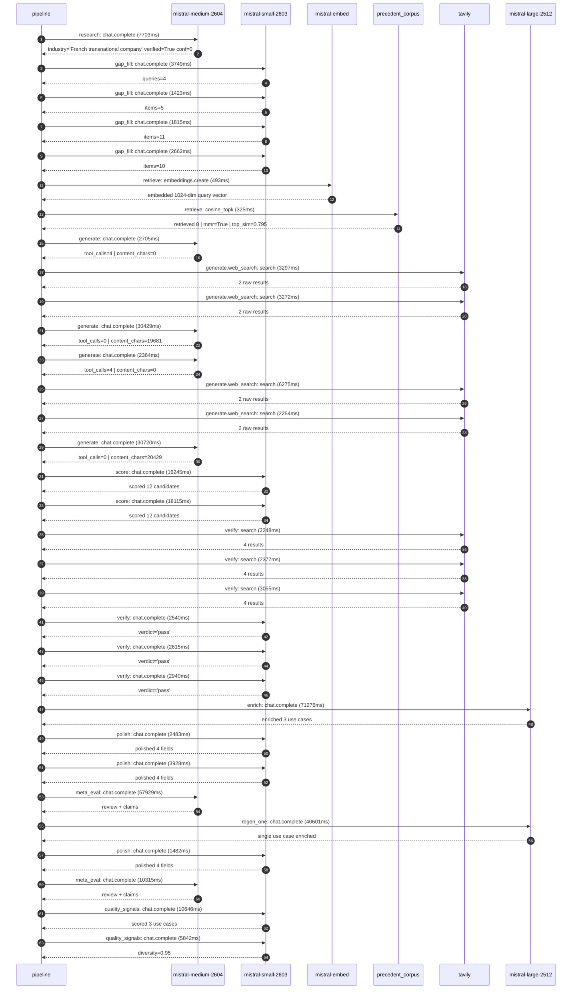

# Pipeline blueprint (architecture)

Static view of the pipeline regardless of run timing — shows agents,
models, and gates. The chronological execution log follows below.

```mermaid
flowchart TD
    Start([User: company name]) --> R
    R["<b>1. Research</b><br/>parallel: Wikipedia · Tavily news ·<br/>existing initiatives · live verification<br/><i>mistral-medium</i> synthesis"]
    R --> G["<b>1b. Gap-fill</b><br/>identify missing fields →<br/><i>mistral-small</i> generates queries →<br/>Tavily search per field →<br/><i>mistral-small</i> per-field extraction"]
    G --> Conf{Confidence ≥ 0.5<br/>OR verified<br/>OR ≥ 1 existing initiative?}
    Conf -->|no| Refuse([Refusal])
    Conf -->|yes| Ret
    Ret["<b>2. Retrieve</b><br/><i>mistral-embed</i> on company query →<br/>cosine top-K + industry/depth filter +<br/>MMR diversification"]
    Ret --> Gen["<b>3. Generate 12 candidates</b><br/><i>mistral-medium</i> with web_search tool<br/>(Tavily + deep-read) — fact citations<br/>flow into the EvidenceLedger"]
    Gen --> Score["<b>4. Score</b><br/>self-consistency: 2 parallel passes<br/><i>mistral-small</i> @ T=0.2 and T=0.4 →<br/>aggregate weighted scores"]
    Score --> Verify["<b>5. Per-candidate verify</b><br/>top-3: Tavily search + deep-read +<br/><i>mistral-small</i> verdict (pass /<br/>partial / confirmed_existing)"]
    Verify --> Enrich["<b>6. Enrich</b><br/><i>mistral-large</i> drafts customer-facing<br/>prose for 3 use cases (or<br/><i>mistral-medium</i> on fast tier)"]
    Enrich --> NumScrub["<b>6a. Numeric scrub</b><br/>flag any number not in cited content"]
    NumScrub --> Polish["<b>6b. Polish</b><br/><i>mistral-small</i> per use case (parallel):<br/>convert markers→qualitative,<br/>(ev-XXX)→[title](url)"]
    Polish --> Attr["<b>6c. Attribution check</b><br/><i>mistral-small</i> per use case (parallel):<br/>fix corpus-ID ↔ company mismatches"]
    Attr --> Meta["<b>7. Meta-evaluation</b><br/><i>mistral-medium</i> reviews report against<br/>cited precedents + ledger entries:<br/>strict claim verification"]
    Meta --> RegenQ{confidence < 0.6<br/>AND not fast tier?}
    RegenQ -->|yes| Regen["<b>7b. Targeted regen</b><br/><i>mistral-large</i> re-enriches just the<br/>weakest use case with the next-best<br/>near-miss; re-runs meta-eval"]
    RegenQ -->|no| QS
    Regen --> QS
    QS["<b>Quality signals</b><br/>LLM-graded diversity + specificity,<br/>fact-check pass rate, TTV/cost spread"]
    QS --> Render([Markdown report + trace])

    classDef agent fill:#fef3c7,stroke:#f59e0b
    classDef gate fill:#dbeafe,stroke:#3b82f6
    classDef io fill:#dcfce7,stroke:#16a34a
    class R,G,Ret,Gen,Score,Verify,Enrich,NumScrub,Polish,Attr,Meta,Regen,QS agent
    class Conf,RegenQ gate
    class Start,Refuse,Render io
```

## Execution trace — Veolia

Started: `2026-05-08T17:28:22.645964+00:00`. Total wall time: `364.2s` across `32` recorded actions.

### Per-step time totals

| Step | Calls | Total time | Avg time |
|---|---:|---:|---:|
| `research` | 1 | 7.70s | 7703ms |
| `gap_fill` | 4 | 9.65s | 2412ms |
| `retrieve` | 2 | 0.82s | 409ms |
| `generate` | 4 | 66.22s | 16554ms |
| `generate.web_search` | 4 | 15.10s | 3775ms |
| `score` | 2 | 34.36s | 17180ms |
| `verify` | 6 | 15.78s | 2629ms |
| `enrich` | 1 | 71.28s | 71276ms |
| `polish` | 3 | 7.89s | 2631ms |
| `meta_eval` | 2 | 68.24s | 34122ms |
| `regen_one` | 1 | 40.60s | 40601ms |
| `quality_signals` | 2 | 16.49s | 8244ms |

### Chronological event log

- `17:28:25.259` **[research]** `mistral-medium-2604.chat.complete` — 7703ms
   - inputs: synthesize CompanyContext for Veolia | depth=medium
   - outputs: industry='French transnational company' verified=True conf=0.75
- `17:28:40.703` **[gap_fill]** `mistral-small-2603.chat.complete` — 3749ms
   - inputs: generate gap queries | fields=['business_model', 'products', 'data_assets', 'priorities']
   - outputs: queries=4
- `17:28:53.053` **[gap_fill]** `mistral-small-2603.chat.complete` — 1423ms
   - inputs: layer-2 extract field=data_assets
   - outputs: items=5
- `17:28:53.026` **[gap_fill]** `mistral-small-2603.chat.complete` — 1815ms
   - inputs: layer-2 extract field=priorities
   - outputs: items=11
- `17:28:53.072` **[gap_fill]** `mistral-small-2603.chat.complete` — 2662ms
   - inputs: layer-2 extract field=products
   - outputs: items=10
- `17:28:55.761` **[retrieve]** `mistral-embed.embeddings.create` — 493ms
   - inputs: company_query | industries='French transnational company'
   - outputs: embedded 1024-dim query vector
- `17:28:56.253` **[retrieve]** `precedent_corpus.cosine_topk` — 325ms
   - inputs: k=8 min_depth=0.4 target='Veolia'
   - outputs: retrieved 8 | mmr=True | top_sim=0.795
- `17:28:57.568` **[generate]** `mistral-medium-2604.chat.complete` — 2705ms
   - inputs: iteration=0 tool_calls_used=0/2 tools=on
   - outputs: tool_calls=4 | content_chars=0
- `17:29:00.293` **[generate.web_search]** `tavily.search` — 3297ms
   - inputs: query='Veolia smart water sensors real-time monitoring cities 2025'
   - outputs: 2 raw results
- `17:29:19.035` **[generate.web_search]** `tavily.search` — 3272ms
   - inputs: query='Veolia GreenUp strategic plan decarbonization biodiversity 2025'
   - outputs: 2 raw results
- `17:29:22.322` **[generate]** `mistral-medium-2604.chat.complete` — 30429ms
   - inputs: iteration=1 tool_calls_used=2/2 tools=off
   - outputs: tool_calls=0 | content_chars=19681
- `17:29:53.117` **[generate]** `mistral-medium-2604.chat.complete` — 2364ms
   - inputs: iteration=0 tool_calls_used=0/2 tools=on
   - outputs: tool_calls=4 | content_chars=0
- `17:29:55.499` **[generate.web_search]** `tavily.search` — 6275ms
   - inputs: query='Veolia smart water sensors leak detection scale 2025'
   - outputs: 2 raw results
- `17:30:03.514` **[generate.web_search]** `tavily.search` — 2254ms
   - inputs: query='Veolia GreenUp strategic plan 2025 zero carbon biodiversity'
   - outputs: 2 raw results
- `17:30:06.917` **[generate]** `mistral-medium-2604.chat.complete` — 30720ms
   - inputs: iteration=1 tool_calls_used=2/2 tools=off
   - outputs: tool_calls=0 | content_chars=20429
- `17:30:38.037` **[score]** `mistral-small-2603.chat.complete` — 16245ms
   - inputs: self-consistency pass T=0.2
   - outputs: scored 12 candidates
- `17:30:38.039` **[score]** `mistral-small-2603.chat.complete` — 18115ms
   - inputs: self-consistency pass T=0.4
   - outputs: scored 12 candidates
- `17:30:56.215` **[verify]** `tavily.search` — 2248ms
   - inputs: candidate=regulatory_reporting_automation | query='Veolia Automated regulatory reporting for environmental comp'
   - outputs: 4 results
- `17:30:56.214` **[verify]** `tavily.search` — 2377ms
   - inputs: candidate=smart_meter_agentic_anomaly_triage | query="Veolia Agentic real-time anomaly triage for Veolia's 3M+ sma"
   - outputs: 4 results
- `17:30:56.214` **[verify]** `tavily.search` — 3055ms
   - inputs: candidate=hazardous_waste_compliance_agent | query='Veolia Agentic compliance assistant for hazardous waste trea'
   - outputs: 4 results
- `17:31:00.061` **[verify]** `mistral-small-2603.chat.complete` — 2540ms
   - inputs: verdict for hazardous_waste_compliance_agent
   - outputs: verdict='pass'
- `17:31:00.361` **[verify]** `mistral-small-2603.chat.complete` — 2615ms
   - inputs: verdict for regulatory_reporting_automation
   - outputs: verdict='pass'
- `17:31:01.296` **[verify]** `mistral-small-2603.chat.complete` — 2940ms
   - inputs: verdict for smart_meter_agentic_anomaly_triage
   - outputs: verdict='pass'
- `17:31:04.262` **[enrich]** `mistral-large-2512.chat.complete` — 71276ms
   - inputs: tier=standard top_3=['smart_meter_agentic_anomaly_triage', 'hazardous_waste_compliance_agent', 'regulatory_reporting_automation']
   - outputs: enriched 3 use cases
- `17:32:15.542` **[polish]** `mistral-small-2603.chat.complete` — 2483ms
   - inputs: use_case=smart_meter_agentic_anomaly_triage unanchored=True opaque_ev=False
   - outputs: polished 4 fields
- `17:32:15.549` **[polish]** `mistral-small-2603.chat.complete` — 3928ms
   - inputs: use_case=hazardous_waste_compliance_agent unanchored=True opaque_ev=False
   - outputs: polished 4 fields
- `17:32:19.512` **[meta_eval]** `mistral-medium-2604.chat.complete` — 57929ms
   - inputs: reviewing 3 use cases
   - outputs: review + claims
- `17:33:17.469` **[regen_one]** `mistral-large-2512.chat.complete` — 40601ms
   - inputs: replace weakest=regulatory_reporting_automation with data_center_water_reuse_optimizer
   - outputs: single use case enriched
- `17:33:58.071` **[polish]** `mistral-small-2603.chat.complete` — 1482ms
   - inputs: use_case=data_center_water_reuse_optimizer unanchored=False opaque_ev=True
   - outputs: polished 4 fields
- `17:33:59.591` **[meta_eval]** `mistral-medium-2604.chat.complete` — 10315ms
   - inputs: reviewing 3 use cases
   - outputs: review + claims
- `17:34:10.404` **[quality_signals]** `mistral-small-2603.chat.complete` — 10646ms
   - inputs: specificity grade (3 use cases)
   - outputs: scored 3 use cases
- `17:34:21.050` **[quality_signals]** `mistral-small-2603.chat.complete` — 5842ms
   - inputs: diversity grade
   - outputs: diversity=0.95

## Mermaid sequence diagram (execution)

