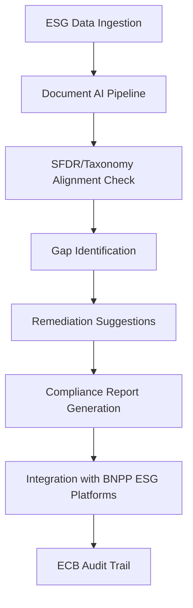
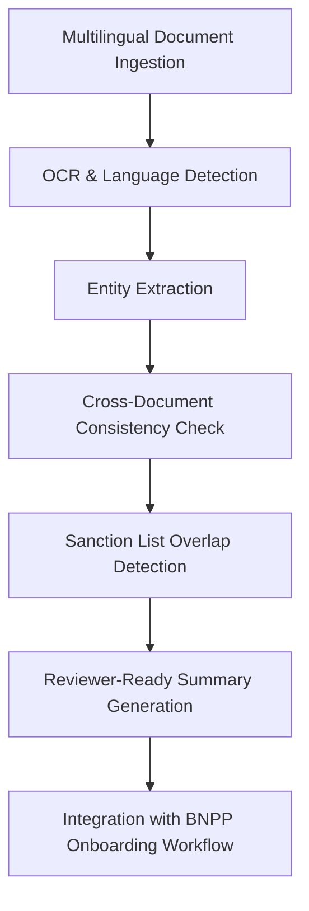

## GenAI Use Cases for BNP Paribas

Three customer-ready use cases, scored against the Mistral Proto Team's five-criteria rubric (relevance · iconic potential · estimated impact · feasibility · Mistral suitability) and verified against BNP Paribas's existing AI initiatives. Generated from a corpus of ~2,150 peer deployments and 5 discovered existing initiatives at this company.

_Industry: French multinational universal bank and financial services holding company. Research confidence: 0.85. Verified: True._

### EU-SFDR and Taxonomy-aligned ESG regulatory compliance agent for Sustainable Finance
An autonomous agent that ingests BNP Paribas' €500bn+ steered sustainable finance portfolio (green bonds, ESG-linked loans, syndicated loans) and automates alignment checks against EU Sustainable Finance Disclosure Regulation (SFDR) and EU Taxonomy criteria. The system generates audit-ready compliance reports, flags data gaps in underlying assets, and suggests remediation actions for portfolio managers. It integrates with BNP Paribas' existing ESG data platforms (e.g., BNPP AM, BNPP REIM) and leverages Mistral's EU sovereignty and multilingual support (French, English, German) to ensure regulatory compliance under ECB supervision. The agent materially reduces manual compliance workload, comparable to MSCI's ML-enriched ESG datasets for asset locations.

**Why this company:** BNP Paribas is the global leader in sustainable finance, ranking #1 in green bonds (EMEA), #1 in Euro-denominated sustainable bonds (€29.4bn), and #2 in ESG-linked loans (€26.8bn) ([BNP Paribas 2025 Sustainability Report](https://cdn-group.bnpparibas.com/uploads/file/vdef_infog_gts_2025_subtainability_eng.pdf)). With a €500bn+ steered portfolio and direct ECB supervision, the bank faces high-stakes regulatory scrutiny. Automating ESG compliance aligns with its 2025 Strategic Plan priority to 'deploy sustainable finance and ESG at scale,' reducing operational risk and cost while maintaining leadership in this space.

**Example input:** `Show me all green bonds issued in Q1 2025 that fail EU Taxonomy alignment for 'Do No Significant Harm' criteria, and suggest remediation steps for the portfolio manager.`

**Example output:** {'summary': {'portfolio_scope': 'Green Bonds (EUR-denominated, Q1 2025)', 'total_assets_scanned': '124 (sample)', 'non_compliant_assets': '8 (sample)', 'compliance_gap': 'Do No Significant Harm (DNSH) criteria, EU Taxonomy Article 17'}, 'non_compliant_assets': [{'asset_id': 'GB-SAMPLE-2025-001', 'issuer': 'Corp-A (illustrative)', 'issue_date': '2025-01-15', 'currency': 'EUR', 'amount': '€50M (sample)', 'gap_description': 'Lack of third-party verification for DNSH criteria in renewable energy project documentation.', 'remediation': ['Request updated verification report from issuer by 2025-06-30.', 'Engage ESG data provider to validate project alignment with EU Taxonomy.'], 'risk_level': 'Medium'}, {'asset_id': 'GB-SAMPLE-2025-005', 'issuer': 'Corp-B (illustrative)', 'issue_date': '2025-02-20', 'currency': 'EUR', 'amount': '€75M (sample)', 'gap_description': "Missing documentation for 'Substantial Contribution' to climate change mitigation (EU Taxonomy Article 10).", 'remediation': ['Contact issuer to provide missing project impact metrics.', 'Escalate to compliance team if documentation not received within 30 days.'], 'risk_level': 'High'}], 'recommendations': {'immediate_actions': ["Prioritize remediation for assets with 'High' risk level (2 assets).", 'Schedule follow-up review in 45 days for all non-compliant assets.'], 'long_term': 'Integrate automated DNSH verification into pre-issuance due diligence for all green bonds.'}}

**Blueprint:** `agent_with_tools` (impact: high · cost: medium · complexity: low · TTV: 16-24 weeks based on comparable deployments at peer banks.)

**Top risk:** Data privacy under GDPR for cross-border ESG data sharing during EU client onboarding.

**Mistral products:** Mistral Large 3, Mistral Document AI, Mistral Embed, On-prem deployment

**Grounded in:** strategic_context.stated_priorities[4], strategic_context.stated_priorities[0], business.key_products_or_services[0], classification.geography, classification.industry
_Specificity score: 0.95_

**Architecture blueprint:**

### Multilingual KYC document review agent for corporate onboarding across 65+ jurisdictions
A document AI pipeline that parses corporate registration filings, beneficial-ownership disclosures, and jurisdiction-specific regulatory submissions in French, English, German, and other European languages for BNP Paribas' corporate clients. The system extracts structured KYC records, flags inconsistencies such as mismatched beneficial owners across filings, surfaces sanction-list overlaps, and produces reviewer-ready summaries in the analyst's working language. It integrates with BNP Paribas' existing onboarding workflows via the PROSTIR API and leverages Mistral's EU-hosted on-prem deployment to ensure data sovereignty under ECB supervision.

**Why this company:** BNP Paribas operates in 65+ jurisdictions, each with unique KYC filing standards, evidence requirements, and primary languages. As a systemically important bank directly supervised by the ECB, compliance with EU and local regulations is non-negotiable. The bank's scale—900 APIs generating 700M transactions per month—and multilingual client base (French, English, German, etc.) create a high-volume, high-complexity use case. Mistral's multilingual strength and EU on-prem deployment align perfectly with BNP Paribas' regulatory and operational needs.

**Example input:** `Extract the ultimate beneficial owners (UBOs) from this German GmbH registration filing and cross-check against the French RCS filing for inconsistencies. Flag any matches with EU sanction lists.`

**Example output:** {'summary': {'client_id': 'CLIENT-SAMPLE-DE-2025-045', 'jurisdictions': ['Germany (GmbH)', 'France (RCS)'], 'documents_processed': 3, 'inconsistencies_found': 2, 'sanction_list_matches': 0}, 'ubo_extraction': {'germany_gmbh': [{'name': 'Hans Müller (illustrative)', 'ownership_pct': '25% (sample)', 'role': 'Managing Director'}, {'name': 'Klaus Schmidt (illustrative)', 'ownership_pct': '35% (sample)', 'role': 'Shareholder'}], 'france_rcs': [{'name': 'Hans Müller (illustrative)', 'ownership_pct': '25% (sample)', 'role': 'Director'}, {'name': 'Jean Dupont (illustrative)', 'ownership_pct': '40% (sample)', 'role': 'Shareholder'}]}, 'inconsistencies': [{'field': 'Beneficial Ownership', 'germany_value': 'Klaus Schmidt (35%)', 'france_value': 'Jean Dupont (40%)', 'risk_level': 'High', 'recommendation': 'Request updated RCS filing to reconcile ownership discrepancy.'}, {'field': 'Registered Address', 'germany_value': 'Berlin, DE (illustrative)', 'france_value': 'Paris, FR (illustrative)', 'risk_level': 'Medium', 'recommendation': 'Verify if this represents a branch or separate entity.'}], 'sanction_check': {'status': 'No matches found', 'lists_checked': ['EU Sanctions Map', 'OFAC SDN List (sample)']}, 'next_steps': ['Escalate ownership discrepancy to compliance team.', 'Request updated RCS filing from client within 5 business days.']}

**Blueprint:** `document_ai_pipeline` (impact: high · cost: medium · complexity: low · TTV: 12-20 weeks based on comparable deployments at M-DAQ Global.)

**Top risk:** Hallucination in entity extraction for non-Latin scripts (e.g., Cyrillic) during cross-border onboarding.

**Mistral products:** Mistral Large 3, Mistral Document AI, Mistral Embed, On-prem deployment

**Inspired by precedents:** google_cloud_blueprints-702efe8542
**Grounded in:** classification.geography, strategic_context.stated_priorities[5]
_Specificity score: 0.85_

**Architecture blueprint:**

### Agentic settlement orchestrator for tokenized assets and digital bonds
A multi-step agent that automates the end-to-end settlement workflow for tokenized fund shares and digital bonds against digital cash, as part of BNP Paribas' active participation in the ECB’s CeBM programme and internal digital assets trials. The agent validates transaction data, checks compliance with DLT and regulatory requirements, and generates settlement instructions in real-time, reducing manual intervention and errors.

**Why this company:** BNP Paribas is a leading participant in the ECB’s CeBM programme, testing all three solutions across various roles, and is trialing an integrated digital assets model spanning origination to distribution to custody. The bank's Securities Services division is actively exploring tokenization of fund shares and DvP (Delivery vs. Payment) settlement. Mistral's on-prem deployment and EU sovereignty are critical for these regulated, high-value transactions.

**Example input:** ``

**Example output:** 

**Blueprint:** `rag` (impact: high · cost: unknown · complexity: medium · TTV: unknown)

**Top risk:** 

**Mistral products:** Mistral Large 3, Mistral Agent SDK, On-prem deployment

**Grounded in:** strategic_context.stated_priorities[0], business.key_products_or_services[0]
_Specificity score: 0.80_

## Considered but not selected
- **tokenized-asset-settlement-agent** — Lack of concrete evidence for BNP Paribas' tokenized asset volume or strategic prioritization in this area.
- **sustainable-finance-client-advisory** — Overlaps with existing ESG compliance agent; lower feasibility due to client-facing hallucination risks.
- **trade-finance-document-automation** — High complexity and niche applicability; no clear anchor to BNP Paribas' stated priorities.
- **api-transaction-anomaly-detection** — Lower strategic alignment with 2025 priorities; better suited for fraud teams than core AI transformation.
- **Automated regulatory change tracking and impact analysis for compliance teams** — Replaced by regen — meta-eval flagged as weakest.

---
## Report quality signals

- **Topical diversity** (LLM-graded over titles + blueprint patterns): `0.95`
- **Specificity** per use case: `0.95`, `0.85`, `0.80`
- **Mistral product diversity**: `5` distinct products across the three use cases
- **Time-to-value spread**: 12–24 weeks (across 3 use cases)
- **Cost-tier spread**: medium, medium, unknown
- **Fact-check pass rate**: `50%` (6/12 claims supported by research)

**Meta-evaluator confidence**: `0.50` (NOT ready — needs revision)
**Cross-cutting concern**: Multiple use cases rely on unverified or loosely cited quantitative claims (e.g., €500bn+ portfolio, 65+ jurisdictions, 900 APIs) without direct supporting quotes from the provided sources. Additionally, the 'tokenized-asset-settlement-agent' lacks critical details (time-to-value, cost tier, risks) and evidence.