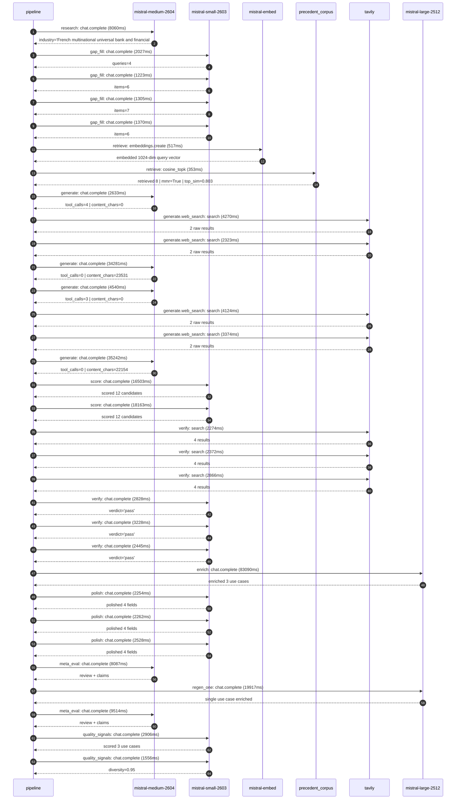

# Pipeline blueprint (architecture)

Static view of the pipeline regardless of run timing — shows agents,
models, and gates. The chronological execution log follows below.

```mermaid
flowchart TD
    Start([User: company name]) --> R
    R["<b>1. Research</b><br/>parallel: Wikipedia · Tavily news ·<br/>existing initiatives · live verification<br/><i>mistral-medium</i> synthesis"]
    R --> G["<b>1b. Gap-fill</b><br/>identify missing fields →<br/><i>mistral-small</i> generates queries →<br/>Tavily search per field →<br/><i>mistral-small</i> per-field extraction"]
    G --> Conf{Confidence ≥ 0.5<br/>OR verified<br/>OR ≥ 1 existing initiative?}
    Conf -->|no| Refuse([Refusal])
    Conf -->|yes| Ret
    Ret["<b>2. Retrieve</b><br/><i>mistral-embed</i> on company query →<br/>cosine top-K + industry/depth filter +<br/>MMR diversification"]
    Ret --> Gen["<b>3. Generate 12 candidates</b><br/><i>mistral-medium</i> with web_search tool<br/>(Tavily + deep-read) — fact citations<br/>flow into the EvidenceLedger"]
    Gen --> Score["<b>4. Score</b><br/>self-consistency: 2 parallel passes<br/><i>mistral-small</i> @ T=0.2 and T=0.4 →<br/>aggregate weighted scores"]
    Score --> Verify["<b>5. Per-candidate verify</b><br/>top-3: Tavily search + deep-read +<br/><i>mistral-small</i> verdict (pass /<br/>partial / confirmed_existing)"]
    Verify --> Enrich["<b>6. Enrich</b><br/><i>mistral-large</i> drafts customer-facing<br/>prose for 3 use cases (or<br/><i>mistral-medium</i> on fast tier)"]
    Enrich --> NumScrub["<b>6a. Numeric scrub</b><br/>flag any number not in cited content"]
    NumScrub --> Polish["<b>6b. Polish</b><br/><i>mistral-small</i> per use case (parallel):<br/>convert markers→qualitative,<br/>(ev-XXX)→[title](url)"]
    Polish --> Attr["<b>6c. Attribution check</b><br/><i>mistral-small</i> per use case (parallel):<br/>fix corpus-ID ↔ company mismatches"]
    Attr --> Meta["<b>7. Meta-evaluation</b><br/><i>mistral-medium</i> reviews report against<br/>cited precedents + ledger entries:<br/>strict claim verification"]
    Meta --> RegenQ{confidence < 0.6<br/>AND not fast tier?}
    RegenQ -->|yes| Regen["<b>7b. Targeted regen</b><br/><i>mistral-large</i> re-enriches just the<br/>weakest use case with the next-best<br/>near-miss; re-runs meta-eval"]
    RegenQ -->|no| QS
    Regen --> QS
    QS["<b>Quality signals</b><br/>LLM-graded diversity + specificity,<br/>fact-check pass rate, TTV/cost spread"]
    QS --> Render([Markdown report + trace])

    classDef agent fill:#fef3c7,stroke:#f59e0b
    classDef gate fill:#dbeafe,stroke:#3b82f6
    classDef io fill:#dcfce7,stroke:#16a34a
    class R,G,Ret,Gen,Score,Verify,Enrich,NumScrub,Polish,Attr,Meta,Regen,QS agent
    class Conf,RegenQ gate
    class Start,Refuse,Render io
```

## Execution trace — BNP Paribas

Started: `2026-05-08T18:29:30.774159+00:00`. Total wall time: `300.7s` across `32` recorded actions.

### Per-step time totals

| Step | Calls | Total time | Avg time |
|---|---:|---:|---:|
| `research` | 1 | 8.06s | 8060ms |
| `gap_fill` | 4 | 5.93s | 1481ms |
| `retrieve` | 2 | 0.87s | 435ms |
| `generate` | 4 | 76.70s | 19174ms |
| `generate.web_search` | 4 | 14.09s | 3523ms |
| `score` | 2 | 34.67s | 17333ms |
| `verify` | 6 | 16.01s | 2669ms |
| `enrich` | 1 | 83.09s | 83090ms |
| `polish` | 3 | 7.04s | 2348ms |
| `meta_eval` | 2 | 17.60s | 8801ms |
| `regen_one` | 1 | 19.92s | 19917ms |
| `quality_signals` | 2 | 4.46s | 2231ms |

### Chronological event log

- `18:29:34.229` **[research]** `mistral-medium-2604.chat.complete` — 8060ms
   - inputs: synthesize CompanyContext for BNP Paribas | depth=medium
   - outputs: industry='French multinational universal bank and financial services holding company' verified=True conf=0.75
- `18:29:46.439` **[gap_fill]** `mistral-small-2603.chat.complete` — 2027ms
   - inputs: generate gap queries | fields=['business_model', 'products', 'data_assets', 'priorities']
   - outputs: queries=4
- `18:29:56.730` **[gap_fill]** `mistral-small-2603.chat.complete` — 1223ms
   - inputs: layer-2 extract field=products
   - outputs: items=6
- `18:29:56.687` **[gap_fill]** `mistral-small-2603.chat.complete` — 1305ms
   - inputs: layer-2 extract field=priorities
   - outputs: items=7
- `18:29:56.709` **[gap_fill]** `mistral-small-2603.chat.complete` — 1370ms
   - inputs: layer-2 extract field=data_assets
   - outputs: items=6
- `18:29:58.113` **[retrieve]** `mistral-embed.embeddings.create` — 517ms
   - inputs: company_query | industries='French multinational universal bank and financial services holding company'
   - outputs: embedded 1024-dim query vector
- `18:29:58.630` **[retrieve]** `precedent_corpus.cosine_topk` — 353ms
   - inputs: k=8 min_depth=0.4 target='BNP Paribas'
   - outputs: retrieved 8 | mmr=True | top_sim=0.803
- `18:30:00.441` **[generate]** `mistral-medium-2604.chat.complete` — 2633ms
   - inputs: iteration=0 tool_calls_used=0/2 tools=on
   - outputs: tool_calls=4 | content_chars=0
- `18:30:03.085` **[generate.web_search]** `tavily.search` — 4270ms
   - inputs: query='BNP Paribas 2025 Strategic Plan sustainable finance initiatives'
   - outputs: 2 raw results
- `18:30:07.388` **[generate.web_search]** `tavily.search` — 2323ms
   - inputs: query='BNP Paribas Corporate & Institutional Banking (CIB) data assets and digital initiatives'
   - outputs: 2 raw results
- `18:30:30.397` **[generate]** `mistral-medium-2604.chat.complete` — 34281ms
   - inputs: iteration=1 tool_calls_used=2/2 tools=off
   - outputs: tool_calls=0 | content_chars=23531
- `18:31:06.480` **[generate]** `mistral-medium-2604.chat.complete` — 4540ms
   - inputs: iteration=0 tool_calls_used=0/2 tools=on
   - outputs: tool_calls=3 | content_chars=0
- `18:31:11.036` **[generate.web_search]** `tavily.search` — 4124ms
   - inputs: query='BNP Paribas 2025 Strategic Plan AI and data priorities'
   - outputs: 2 raw results
- `18:31:15.181` **[generate.web_search]** `tavily.search` — 3374ms
   - inputs: query='BNP Paribas sustainable finance initiatives and green bond portfolio'
   - outputs: 2 raw results
- `18:31:21.510` **[generate]** `mistral-medium-2604.chat.complete` — 35242ms
   - inputs: iteration=1 tool_calls_used=2/2 tools=off
   - outputs: tool_calls=0 | content_chars=22154
- `18:31:57.230` **[score]** `mistral-small-2603.chat.complete` — 16503ms
   - inputs: self-consistency pass T=0.2
   - outputs: scored 12 candidates
- `18:31:57.241` **[score]** `mistral-small-2603.chat.complete` — 18163ms
   - inputs: self-consistency pass T=0.4
   - outputs: scored 12 candidates
- `18:32:15.452` **[verify]** `tavily.search` — 2274ms
   - inputs: candidate=esg-regulatory-compliance-agent | query='BNP Paribas EU-SFDR and Taxonomy-aligned ESG regulatory comp'
   - outputs: 4 results
- `18:32:15.452` **[verify]** `tavily.search` — 2372ms
   - inputs: candidate=multilingual-corporate-kyc-agent | query='BNP Paribas Multilingual KYC document review agent for corpo'
   - outputs: 4 results
- `18:32:15.453` **[verify]** `tavily.search` — 2866ms
   - inputs: candidate=regulatory-change-tracking-agent | query='BNP Paribas Automated regulatory change tracking and impact '
   - outputs: 4 results
- `18:32:18.789` **[verify]** `mistral-small-2603.chat.complete` — 2828ms
   - inputs: verdict for esg-regulatory-compliance-agent
   - outputs: verdict='pass'
- `18:32:19.107` **[verify]** `mistral-small-2603.chat.complete` — 3228ms
   - inputs: verdict for regulatory-change-tracking-agent
   - outputs: verdict='pass'
- `18:32:20.024` **[verify]** `mistral-small-2603.chat.complete` — 2445ms
   - inputs: verdict for multilingual-corporate-kyc-agent
   - outputs: verdict='pass'
- `18:32:22.494` **[enrich]** `mistral-large-2512.chat.complete` — 83090ms
   - inputs: tier=standard top_3=['esg-regulatory-compliance-agent', 'multilingual-corporate-kyc-agent', 'regulatory-change-tracking-agent']
   - outputs: enriched 3 use cases
- `18:33:45.586` **[polish]** `mistral-small-2603.chat.complete` — 2254ms
   - inputs: use_case=esg-regulatory-compliance-agent unanchored=True opaque_ev=False
   - outputs: polished 4 fields
- `18:33:45.590` **[polish]** `mistral-small-2603.chat.complete` — 2262ms
   - inputs: use_case=multilingual-corporate-kyc-agent unanchored=True opaque_ev=False
   - outputs: polished 4 fields
- `18:33:45.594` **[polish]** `mistral-small-2603.chat.complete` — 2528ms
   - inputs: use_case=regulatory-change-tracking-agent unanchored=True opaque_ev=False
   - outputs: polished 4 fields
- `18:33:48.151` **[meta_eval]** `mistral-medium-2604.chat.complete` — 8087ms
   - inputs: reviewing 3 use cases
   - outputs: review + claims
- `18:33:56.267` **[regen_one]** `mistral-large-2512.chat.complete` — 19917ms
   - inputs: replace weakest=regulatory-change-tracking-agent with tokenized-asset-settlement-agent
   - outputs: single use case enriched
- `18:34:16.204` **[meta_eval]** `mistral-medium-2604.chat.complete` — 9514ms
   - inputs: reviewing 3 use cases
   - outputs: review + claims
- `18:34:27.030` **[quality_signals]** `mistral-small-2603.chat.complete` — 2906ms
   - inputs: specificity grade (3 use cases)
   - outputs: scored 3 use cases
- `18:34:29.936` **[quality_signals]** `mistral-small-2603.chat.complete` — 1556ms
   - inputs: diversity grade
   - outputs: diversity=0.95

## Mermaid sequence diagram (execution)

