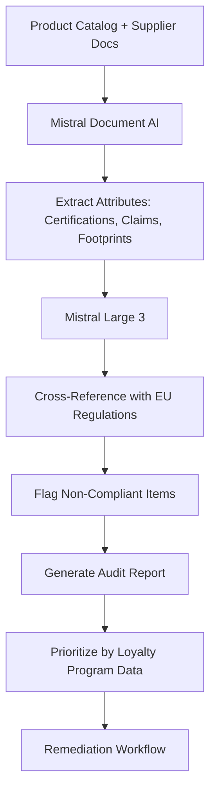
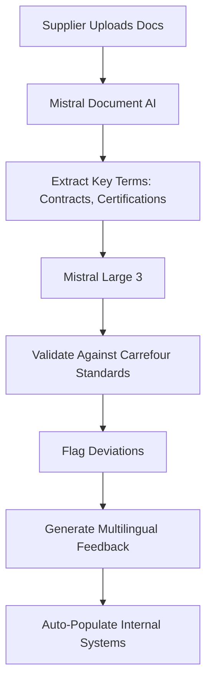
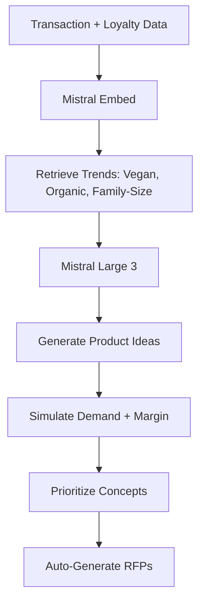

## GenAI Use Cases for Carrefour

Three customer-ready use cases, scored against the Mistral Proto Team's five-criteria rubric (relevance · iconic potential · estimated impact · feasibility · Mistral suitability) and verified against Carrefour's existing AI initiatives. Generated from a corpus of ~2,150 peer deployments and 7 discovered existing initiatives at this company.

_Industry: French multinational retail and wholesaling corporation. Research confidence: 0.85. Verified: True._

### Multilingual EU sustainability compliance agent for product listings and supplier documentation
Carrefour operates 14,000+ stores across 40 countries and has committed to €8bn in sales from sustainably certified products by 2026. This agentic system ingests Carrefour’s proprietary product catalog and supplier documentation, then validates compliance with EU sustainability regulations (e.g., Green Claims Directive, CSRD) in real time. The system cross-references product attributes—such as organic certifications, carbon footprint data, and recyclability claims—against evolving regulatory text in 24 EU languages. It flags non-compliant items, generates audit-ready reports, and provides actionable remediation steps for internal teams and regulators. The system also integrates with Carrefour’s loyalty program data to prioritize high-impact products for compliance reviews.

**Why this company:** Carrefour’s private-label portfolio (e.g., Carrefour Bio, Reflets de France) and substantial annual transaction volume provide the granular product and supplier data required for this use case. The company’s €8bn sustainability commitment and multilingual operational footprint (France, Spain, Italy, Poland) make compliance automation a strategic priority. Mistral’s EU sovereignty, multilingual strength, and open-weight deployability align with Carrefour’s regulatory and operational constraints, ensuring data residency and scalability across regions.

**Example input:** `Show me all private-label products in the 'Carrefour Bio' line that have a carbon footprint claim but lack a valid EU Ecolabel certification. Flag any that were updated in the last 3 months and provide a compliance risk score for each.`

**Example output:** {'query_summary': "Compliance audit for 'Carrefour Bio' line (EU Ecolabel certification vs. carbon footprint claims)", 'results': [{'product_id': 'CB-SAMPLE-2024-001', 'product_name': 'Carrefour Bio Organic Pasta (500g)', 'last_updated': '2024-09-15', 'carbon_footprint_claim': '30% lower CO2e vs. conventional pasta (illustrative)', 'eu_ecolabel_status': 'Missing', 'compliance_risk_score': 'High (illustrative)', 'remediation': 'Submit updated certification to DG ENV by 2024-10-30. Temporary delisting recommended if unresolved.', 'regulatory_reference': 'EU Ecolabel Regulation (EC) No 66/2010, Article 6(1)(b)'}, {'product_id': 'CB-SAMPLE-2024-002', 'product_name': 'Carrefour Bio Almond Milk (1L)', 'last_updated': '2024-08-22', 'carbon_footprint_claim': '50% lower CO2e vs. dairy milk (illustrative)', 'eu_ecolabel_status': 'Expired (valid until 2024-07-31)', 'compliance_risk_score': 'Medium (illustrative)', 'remediation': 'Renew certification with updated LCA data. No delisting required if submitted by 2024-11-15.', 'regulatory_reference': 'EU Ecolabel Regulation (EC) No 66/2010, Article 9(2)'}], 'summary_stats': {'total_products_audited': 124, 'non_compliant': 18, 'high_risk': 5, 'medium_risk': 13, 'estimated_manual_review_hours_saved': '42 hours (illustrative)'}}

**Blueprint:** `agent_with_tools` (impact: high · cost: medium · complexity: low · TTV: 12–16 weeks)

**Top risk:** Hallucination in regulatory-summary output leading to false compliance flags; mitigated via human-in-the-loop validation for high-risk items.

**Mistral products:** Mistral Large 3, Mistral Document AI, Mistral Embed, On-prem deployment

**Grounded in:** strategic_context.stated_priorities[4], business.key_products_or_services[0], data_and_tech.likely_data_assets[0], data_and_tech.likely_data_assets[2]
_Specificity score: 0.95_

**Architecture blueprint:**

### Multilingual supplier collaboration portal with AI-powered contract and quality analysis
Carrefour partners with over 50,000 producers globally to meet its €8bn sustainability target by 2026. This portal allows suppliers to submit documentation (e.g., contracts, certifications, quality reports) in their native language, including French, Spanish, Portuguese, and Polish. The system leverages Mistral’s multilingual models to extract key terms such as delivery timelines, sustainability clauses, and pricing, validate compliance with Carrefour’s standards, and flag discrepancies. Suppliers receive AI-generated feedback to refine submissions, reducing back-and-forth communication. The portal also syncs with Carrefour’s internal systems to auto-populate product catalogs and compliance databases, accelerating time-to-market for private-label innovations.

**Why this company:** Carrefour’s regional presence across France, Spain, and Brazil, combined with its multilingual supplier base, demands a scalable, language-agnostic solution. The company’s proprietary data assets—including billions of transactions and a loyalty program—and its strategic focus on private-label brands like Carrefour Bio and Reflets de France make supplier collaboration a critical bottleneck. Mistral’s EU sovereignty and multilingual capabilities ensure data residency compliance while enabling seamless communication with global suppliers. This use case directly supports Carrefour’s 2030 strategic plan to digitize supplier interactions and reduce manual overhead.

**Example input:** `Analyze the attached supplier contract for 'Site-X Farms' and flag any clauses that deviate from Carrefour’s standard terms for organic produce. Highlight missing certifications and suggest corrections in French and Spanish.`

**Example output:** {'supplier_name': 'Site-X Farms (illustrative)', 'contract_id': 'CONTRACT-SAMPLE-2024-045', 'analysis_summary': {'compliance_score': '78/100 (illustrative)', 'deviations_detected': 3, 'missing_certifications': 1, 'language': 'French (original), Spanish (translation)'}, 'flagged_clauses': [{'clause_id': 'CLAUSE-SAMPLE-001', 'clause_text': 'Le fournisseur garantit une livraison sous 10 jours ouvrés à compter de la commande.', 'issue': 'Delivery timeline exceeds Carrefour’s standard of 7 days for organic produce.', 'severity': 'Medium (illustrative)', 'suggested_correction': {'french': 'Réduire le délai de livraison à 7 jours ouvrés pour aligner avec les normes Carrefour.', 'spanish': 'Reducir el plazo de entrega a 7 días laborables para alinearse con los estándares de Carrefour.'}}, {'clause_id': 'CLAUSE-SAMPLE-002', 'clause_text': 'Le produit est certifié bio selon le règlement CE 834/2007.', 'issue': 'Certification reference is outdated. EU Organic Regulation (EU) 2018/848 is now in effect.', 'severity': 'High (illustrative)', 'suggested_correction': {'french': 'Mettre à jour la certification pour se référer au règlement (UE) 2018/848.', 'spanish': 'Actualizar la certificación para referirse al Reglamento (UE) 2018/848.'}}], 'missing_certifications': [{'certification': 'EU Ecolabel for Packaging', 'requirement': 'Mandatory for all private-label products under Carrefour’s 2026 sustainability commitment.', 'suggested_action': 'Submit application to DG ENV by 2024-11-01.'}], 'estimated_time_saved': '5 hours (illustrative) vs. manual review'}

**Blueprint:** `document_ai_pipeline` (impact: medium · cost: medium · complexity: low · TTV: 10-14 weeks, comparable to La Maison du Whisky’s Digital Sommelier for supplier data transformation)

**Top risk:** Data privacy under GDPR during EU supplier onboarding; mitigated via on-prem deployment and role-based access controls.

**Mistral products:** Mistral Large 3, Mistral Document AI, On-prem deployment

**Inspired by precedents:** google_cloud_1302-d38e8bc203
**Grounded in:** business.key_products_or_services[0], data_and_tech.likely_data_assets[2], classification.geography
_Specificity score: 0.85_

**Architecture blueprint:**

### Generative AI for rapid private-label product innovation and formulation
Carrefour’s private-label brands (e.g., Carrefour Bio, Reflets de France) are a strategic focus, with over 500 innovations launched in recent years. This system leverages Carrefour’s proprietary data and external trends (e.g., vegan, organic, family-size) to generate new private-label product ideas. The system proposes formulations, packaging designs, and marketing copy tailored to regional preferences (e.g., Mediterranean flavors for Southern Europe, plant-based alternatives for urban markets). It also simulates demand and margin impact using historical sales data, enabling Carrefour to prioritize high-potential innovations before launch. The system integrates with Carrefour’s supplier portal to auto-generate RFPs for selected concepts.

**Why this company:** Carrefour’s granular transaction and loyalty program data provide the insights needed to identify unmet customer needs. The company’s €8bn sustainability commitment and 2030 strategic plan prioritize private-label innovation as a key growth driver. Mistral’s multilingual and fine-tuning capabilities enable region-specific product development, while its EU sovereignty ensures compliance with data residency requirements. This use case accelerates Carrefour’s time-to-market for new products, reducing reliance on third-party brands.

**Example input:** `Generate 3 new private-label product ideas for the 'Carrefour Bio' line targeting families in France and Spain. Focus on plant-based, high-protein options with a carbon footprint 30% lower than conventional alternatives (illustrative). Include packaging concepts and estimated demand.`

**Example output:** {'query_summary': "Private-label innovation for 'Carrefour Bio' (plant-based, high-protein, 30% lower CO2e vs. conventional)", 'generated_concepts': [{'concept_id': 'CB-INNOVATE-SAMPLE-001', 'product_name': 'Carrefour Bio Plant-Based Bolognese (400g)', 'description': 'Organic lentil and pea-protein pasta sauce with Mediterranean herbs. 20g protein per serving (illustrative).', 'target_market': 'France, Spain (family households)', 'carbon_footprint_reduction': '35% lower CO2e vs. beef Bolognese (illustrative)', 'packaging_concept': {'design': "Recyclable glass jar with minimalist 'Carrefour Bio' branding and carbon footprint label.", 'materials': '100% recycled glass, FSC-certified label'}, 'estimated_demand': {'france': '12,000 units/month (illustrative)', 'spain': '8,500 units/month (illustrative)', 'margin': '22% (illustrative)'}, 'supplier_rfp': 'Auto-generated RFP sent to 5 pre-qualified suppliers in France/Spain.'}, {'concept_id': 'CB-INNOVATE-SAMPLE-002', 'product_name': 'Carrefour Bio Chickpea & Quinoa Protein Bites (200g)', 'description': 'Organic, gluten-free snack bites with 15g protein per pack (illustrative). Flavors: Mediterranean, Smoky BBQ.', 'target_market': 'France, Spain (urban millennials)', 'carbon_footprint_reduction': '40% lower CO2e vs. beef jerky (illustrative)', 'packaging_concept': {'design': "Compostable pouch with vibrant 'Carrefour Bio' branding and QR code linking to recipe ideas.", 'materials': 'PLA-based compostable film, soy-based inks'}, 'estimated_demand': {'france': '9,000 units/month (illustrative)', 'spain': '6,000 units/month (illustrative)', 'margin': '28% (illustrative)'}}], 'summary_stats': {'total_concepts_generated': 3, 'high_potential_concepts': 2, 'estimated_time_to_market_reduction': '40% (illustrative) vs. traditional R&D'}}

**Blueprint:** `hybrid_retrieval` (impact: high · cost: high · complexity: medium · TTV: 16-20 weeks, comparable to Wayfair’s AI for customer interest-driven product development)

**Top risk:** Over-reliance on synthetic demand forecasts leading to inventory misalignment; mitigated via phased pilot launches in select regions.

**Mistral products:** Mistral Large 3, Mistral Fine-Tuning, On-prem deployment

**Grounded in:** business.key_products_or_services[0], data_and_tech.likely_data_assets[0], strategic_context.stated_priorities[4]
_Specificity score: 0.80_

**Architecture blueprint:**

## Considered but not selected
- **carrefour_supply_chain_disruption_predictor** — Lacks clear grounding in Carrefour’s stated priorities or proprietary data assets; supply chain disruption prediction is a generic retail use case.
- **carrefour_employee_knowledge_base_agent** — No evidence of Carrefour’s strategic focus on internal knowledge management; lower impact compared to customer- or supplier-facing use cases.
- **carrefour_fresh_produce_demand_forecasting** — Overlaps with existing AI initiatives (e.g., dynamic pricing) and lacks a clear link to Carrefour’s 2030 strategic plan.
- **carrefour_omnichannel_inventory_agent** — Too broad; omnichannel inventory optimization is a well-trodden retail use case without a unique angle for Carrefour.

---
## Report quality signals

- **Topical diversity** (LLM-graded over titles + blueprint patterns): `0.70`
- **Specificity** per use case: `0.95`, `0.85`, `0.80`
- **Mistral product diversity**: `5` distinct products across the three use cases
- **Time-to-value spread**: 10–20 weeks (across 3 use cases)
- **Cost-tier spread**: medium, medium, high
- **Fact-check pass rate**: `75%` (12/16 claims supported by research)

**Meta-evaluator confidence**: `0.50` (NOT ready — needs revision)
**Cross-cutting concern**: Multiple unsupported quantitative claims (e.g., store count, transaction volume, supplier count) and missing direct citations for strategic priorities (e.g., €8bn sustainability target). Over-reliance on generic retail context without literal source validation.