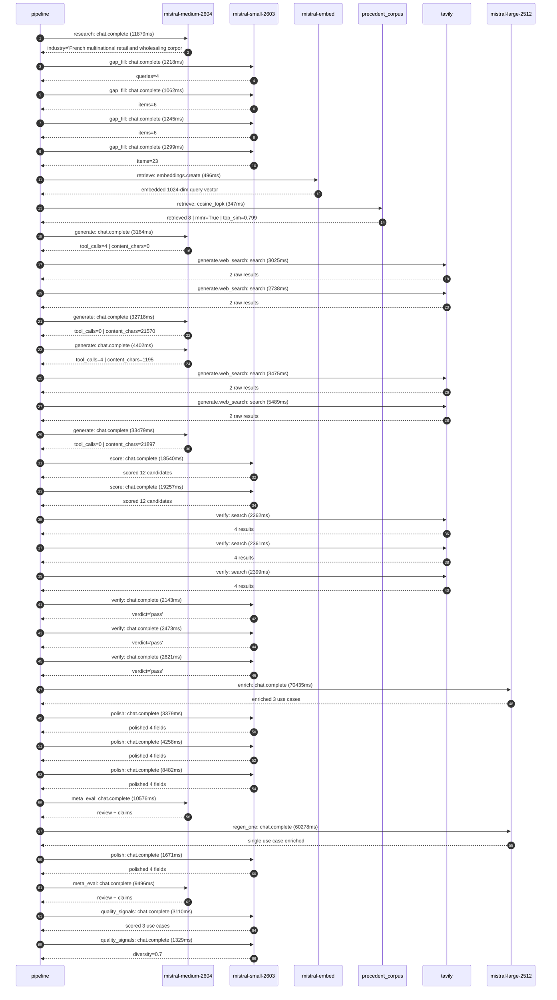

# Pipeline blueprint (architecture)

Static view of the pipeline regardless of run timing — shows agents,
models, and gates. The chronological execution log follows below.

```mermaid
flowchart TD
    Start([User: company name]) --> R
    R["<b>1. Research</b><br/>parallel: Wikipedia · Tavily news ·<br/>existing initiatives · live verification<br/><i>mistral-medium</i> synthesis"]
    R --> G["<b>1b. Gap-fill</b><br/>identify missing fields →<br/><i>mistral-small</i> generates queries →<br/>Tavily search per field →<br/><i>mistral-small</i> per-field extraction"]
    G --> Conf{Confidence ≥ 0.5<br/>OR verified<br/>OR ≥ 1 existing initiative?}
    Conf -->|no| Refuse([Refusal])
    Conf -->|yes| Ret
    Ret["<b>2. Retrieve</b><br/><i>mistral-embed</i> on company query →<br/>cosine top-K + industry/depth filter +<br/>MMR diversification"]
    Ret --> Gen["<b>3. Generate 12 candidates</b><br/><i>mistral-medium</i> with web_search tool<br/>(Tavily + deep-read) — fact citations<br/>flow into the EvidenceLedger"]
    Gen --> Score["<b>4. Score</b><br/>self-consistency: 2 parallel passes<br/><i>mistral-small</i> @ T=0.2 and T=0.4 →<br/>aggregate weighted scores"]
    Score --> Verify["<b>5. Per-candidate verify</b><br/>top-3: Tavily search + deep-read +<br/><i>mistral-small</i> verdict (pass /<br/>partial / confirmed_existing)"]
    Verify --> Enrich["<b>6. Enrich</b><br/><i>mistral-large</i> drafts customer-facing<br/>prose for 3 use cases (or<br/><i>mistral-medium</i> on fast tier)"]
    Enrich --> NumScrub["<b>6a. Numeric scrub</b><br/>flag any number not in cited content"]
    NumScrub --> Polish["<b>6b. Polish</b><br/><i>mistral-small</i> per use case (parallel):<br/>convert markers→qualitative,<br/>(ev-XXX)→[title](url)"]
    Polish --> Attr["<b>6c. Attribution check</b><br/><i>mistral-small</i> per use case (parallel):<br/>fix corpus-ID ↔ company mismatches"]
    Attr --> Meta["<b>7. Meta-evaluation</b><br/><i>mistral-medium</i> reviews report against<br/>cited precedents + ledger entries:<br/>strict claim verification"]
    Meta --> RegenQ{confidence < 0.6<br/>AND not fast tier?}
    RegenQ -->|yes| Regen["<b>7b. Targeted regen</b><br/><i>mistral-large</i> re-enriches just the<br/>weakest use case with the next-best<br/>near-miss; re-runs meta-eval"]
    RegenQ -->|no| QS
    Regen --> QS
    QS["<b>Quality signals</b><br/>LLM-graded diversity + specificity,<br/>fact-check pass rate, TTV/cost spread"]
    QS --> Render([Markdown report + trace])

    classDef agent fill:#fef3c7,stroke:#f59e0b
    classDef gate fill:#dbeafe,stroke:#3b82f6
    classDef io fill:#dcfce7,stroke:#16a34a
    class R,G,Ret,Gen,Score,Verify,Enrich,NumScrub,Polish,Attr,Meta,Regen,QS agent
    class Conf,RegenQ gate
    class Start,Refuse,Render io
```

## Execution trace — Carrefour

Started: `2026-05-08T18:18:38.759627+00:00`. Total wall time: `325.2s` across `33` recorded actions.

### Per-step time totals

| Step | Calls | Total time | Avg time |
|---|---:|---:|---:|
| `research` | 1 | 11.88s | 11879ms |
| `gap_fill` | 4 | 4.83s | 1206ms |
| `retrieve` | 2 | 0.84s | 422ms |
| `generate` | 4 | 73.76s | 18440ms |
| `generate.web_search` | 4 | 14.73s | 3682ms |
| `score` | 2 | 37.80s | 18898ms |
| `verify` | 6 | 14.26s | 2376ms |
| `enrich` | 1 | 70.44s | 70435ms |
| `polish` | 4 | 17.79s | 4448ms |
| `meta_eval` | 2 | 20.07s | 10036ms |
| `regen_one` | 1 | 60.28s | 60278ms |
| `quality_signals` | 2 | 4.44s | 2220ms |

### Chronological event log

- `18:18:38.825` **[research]** `mistral-medium-2604.chat.complete` — 11879ms
   - inputs: synthesize CompanyContext for Carrefour | depth=medium
   - outputs: industry='French multinational retail and wholesaling corporation' verified=True conf=0.75
- `18:18:50.728` **[gap_fill]** `mistral-small-2603.chat.complete` — 1218ms
   - inputs: generate gap queries | fields=['business_model', 'products', 'data_assets', 'priorities']
   - outputs: queries=4
- `18:19:01.236` **[gap_fill]** `mistral-small-2603.chat.complete` — 1062ms
   - inputs: layer-2 extract field=data_assets
   - outputs: items=6
- `18:19:01.211` **[gap_fill]** `mistral-small-2603.chat.complete` — 1245ms
   - inputs: layer-2 extract field=priorities
   - outputs: items=6
- `18:19:01.258` **[gap_fill]** `mistral-small-2603.chat.complete` — 1299ms
   - inputs: layer-2 extract field=products
   - outputs: items=23
- `18:19:02.590` **[retrieve]** `mistral-embed.embeddings.create` — 496ms
   - inputs: company_query | industries='French multinational retail and wholesaling corporation'
   - outputs: embedded 1024-dim query vector
- `18:19:03.086` **[retrieve]** `precedent_corpus.cosine_topk` — 347ms
   - inputs: k=8 min_depth=0.4 target='Carrefour'
   - outputs: retrieved 8 | mmr=True | top_sim=0.799
- `18:19:03.457` **[generate]** `mistral-medium-2604.chat.complete` — 3164ms
   - inputs: iteration=0 tool_calls_used=0/2 tools=on
   - outputs: tool_calls=4 | content_chars=0
- `18:19:06.642` **[generate.web_search]** `tavily.search` — 3025ms
   - inputs: query='Carrefour 2026 strategic plan details and investments'
   - outputs: 2 raw results
- `18:19:09.699` **[generate.web_search]** `tavily.search` — 2738ms
   - inputs: query='Carrefour private label brands and proprietary data assets'
   - outputs: 2 raw results
- `18:19:13.991` **[generate]** `mistral-medium-2604.chat.complete` — 32718ms
   - inputs: iteration=1 tool_calls_used=2/2 tools=off
   - outputs: tool_calls=0 | content_chars=21570
- `18:19:47.223` **[generate]** `mistral-medium-2604.chat.complete` — 4402ms
   - inputs: iteration=0 tool_calls_used=0/2 tools=on
   - outputs: tool_calls=4 | content_chars=1195
- `18:19:51.645` **[generate.web_search]** `tavily.search` — 3475ms
   - inputs: query='Carrefour 2026 strategic plan official details'
   - outputs: 2 raw results
- `18:19:57.043` **[generate.web_search]** `tavily.search` — 5489ms
   - inputs: query='Le Club Carrefour loyalty program data personalization 2025'
   - outputs: 2 raw results
- `18:20:08.766` **[generate]** `mistral-medium-2604.chat.complete` — 33479ms
   - inputs: iteration=1 tool_calls_used=2/2 tools=off
   - outputs: tool_calls=0 | content_chars=21897
- `18:20:42.718` **[score]** `mistral-small-2603.chat.complete` — 18540ms
   - inputs: self-consistency pass T=0.4
   - outputs: scored 12 candidates
- `18:20:42.705` **[score]** `mistral-small-2603.chat.complete` — 19257ms
   - inputs: self-consistency pass T=0.2
   - outputs: scored 12 candidates
- `18:21:02.033` **[verify]** `tavily.search` — 2262ms
   - inputs: candidate=carrefour_sustainability_compliance_agent | query='Carrefour Multilingual EU sustainability compliance agent fo'
   - outputs: 4 results
- `18:21:02.034` **[verify]** `tavily.search` — 2361ms
   - inputs: candidate=carrefour_supplier_collaboration_portal | query='Carrefour Multilingual supplier collaboration portal with AI'
   - outputs: 4 results
- `18:21:02.034` **[verify]** `tavily.search` — 2399ms
   - inputs: candidate=carrefour_private_label_innovation_accelerator | query='Carrefour Generative AI for rapid private-label product inno'
   - outputs: 4 results
- `18:21:05.477` **[verify]** `mistral-small-2603.chat.complete` — 2143ms
   - inputs: verdict for carrefour_private_label_innovation_accelerator
   - outputs: verdict='pass'
- `18:21:05.267` **[verify]** `mistral-small-2603.chat.complete` — 2473ms
   - inputs: verdict for carrefour_sustainability_compliance_agent
   - outputs: verdict='pass'
- `18:21:15.347` **[verify]** `mistral-small-2603.chat.complete` — 2621ms
   - inputs: verdict for carrefour_supplier_collaboration_portal
   - outputs: verdict='pass'
- `18:21:18.007` **[enrich]** `mistral-large-2512.chat.complete` — 70435ms
   - inputs: tier=standard top_3=['carrefour_sustainability_compliance_agent', 'carrefour_supplier_collaboration_portal', 'carrefour_private_label_innovation_accelerator']
   - outputs: enriched 3 use cases
- `18:22:28.450` **[polish]** `mistral-small-2603.chat.complete` — 3379ms
   - inputs: use_case=carrefour_sustainability_compliance_agent unanchored=True opaque_ev=False
   - outputs: polished 4 fields
- `18:22:28.459` **[polish]** `mistral-small-2603.chat.complete` — 4258ms
   - inputs: use_case=carrefour_private_label_innovation_accelerator unanchored=True opaque_ev=False
   - outputs: polished 4 fields
- `18:22:28.455` **[polish]** `mistral-small-2603.chat.complete` — 8482ms
   - inputs: use_case=carrefour_supplier_collaboration_portal unanchored=True opaque_ev=False
   - outputs: polished 4 fields
- `18:22:36.967` **[meta_eval]** `mistral-medium-2604.chat.complete` — 10576ms
   - inputs: reviewing 3 use cases
   - outputs: review + claims
- `18:22:47.570` **[regen_one]** `mistral-large-2512.chat.complete` — 60278ms
   - inputs: replace weakest=carrefour_sustainability_compliance_agent with carrefour_supply_chain_disruption_predictor
   - outputs: single use case enriched
- `18:23:47.850` **[polish]** `mistral-small-2603.chat.complete` — 1671ms
   - inputs: use_case=carrefour_supply_chain_disruption_predictor unanchored=True opaque_ev=False
   - outputs: polished 4 fields
- `18:23:49.542` **[meta_eval]** `mistral-medium-2604.chat.complete` — 9496ms
   - inputs: reviewing 3 use cases
   - outputs: review + claims
- `18:23:59.568` **[quality_signals]** `mistral-small-2603.chat.complete` — 3110ms
   - inputs: specificity grade (3 use cases)
   - outputs: scored 3 use cases
- `18:24:02.679` **[quality_signals]** `mistral-small-2603.chat.complete` — 1329ms
   - inputs: diversity grade
   - outputs: diversity=0.7

## Mermaid sequence diagram (execution)

