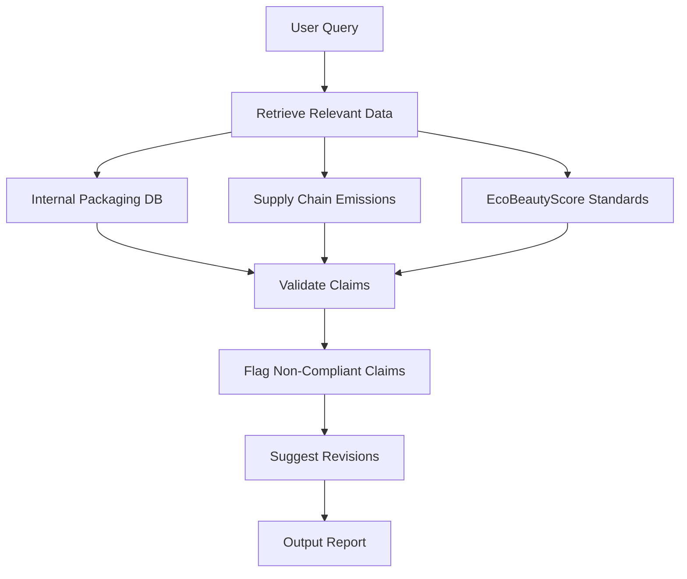
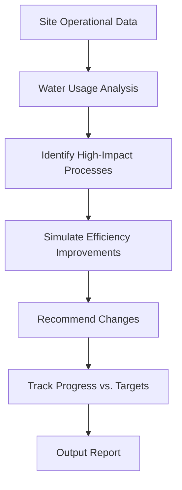
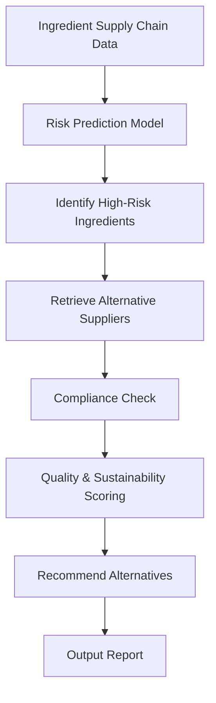

## GenAI Use Cases for L'Oreal

Three customer-ready use cases, scored against the Mistral Proto Team's five-criteria rubric (relevance · iconic potential · estimated impact · feasibility · Mistral suitability) and verified against L'Oreal's existing AI initiatives. Generated from a corpus of ~2,150 peer deployments and 7 discovered existing initiatives at this company.

_Industry: French multinational personal care corporation registered in Paris. Research confidence: 0.85. Verified: True._

### Automated sustainability claim verification for product packaging and marketing
A retrieval-augmented fact-checking system that validates sustainability claims (e.g., '100% recyclable packaging,' 'carbon-neutral production') against L'Oréal's internal packaging materials database, supply chain emissions data, and third-party standards like EcoBeautyScore. The system scans product packaging, marketing collateral, and digital assets across 36 brands and 150+ countries, flagging non-compliant claims and suggesting revisions aligned with L'Oréal's L'Oréal for the Future commitments ([L'Oréal 2025 Sustainability Booklet]()). It integrates with L'Oréal's 10 PB data platform to cross-reference claims with real-world operational data, ensuring consistency and reducing greenwashing risks.

**Why this company:** L'Oréal's L'Oréal for the Future strategy prioritizes sustainability, including the EcoBeautyScore framework and commitments to reduce scope 3 emissions by 50% by 2030 ([L'Oréal 2025 Sustainability Booklet]()). With 36 brands operating in 150+ countries, manual verification of sustainability claims is error-prone and resource-intensive. This system automates compliance checks, reducing manual effort materially. It mitigates regulatory and reputational risks while ensuring alignment with global sustainability standards.

**Example input:** `Check all marketing materials for La Roche-Posay launched in the EU since January 2024 for compliance with EcoBeautyScore and EU Green Claims Directive. Flag any claims that cannot be substantiated with our internal data or third-party standards.`

**Example output:** {'summary': {'total_materials_scanned': 42, 'non_compliant_claims': 5, 'compliance_rate': '88% (illustrative)', 'high_risk_brands': ['La Roche-Posay', 'CeraVe']}, 'flagged_claims': [{'claim_id': 'CLAIM-SAMPLE-001', 'brand': 'La Roche-Posay', 'product': 'Toleriane Ultra Fluide SPF 30', 'material_type': 'Digital ad (Meta)', 'claim_text': '100% recyclable packaging', 'issue': 'Packaging contains 15% non-recyclable film (illustrative). EcoBeautyScore threshold: ≤10% non-recyclable materials.', 'suggested_revision': "Replace with: '90% recyclable packaging (illustrative).'", 'source_data': 'Internal packaging spec (ID: PKG-SAMPLE-2024-03-15)'}, {'claim_id': 'CLAIM-SAMPLE-002', 'brand': 'CeraVe', 'product': 'Hydrating Cleanser', 'material_type': 'Product webpage', 'claim_text': 'Carbon-neutral production since 2023', 'issue': 'Scope 3 emissions data incomplete for Q4 2023 (illustrative). Carbon-neutral certification requires full annual data.', 'suggested_revision': "Replace with: 'Carbon-neutral production for Scope 1 and 2 emissions (illustrative).'", 'source_data': 'Supply chain emissions report (ID: EMISSIONS-SAMPLE-2023-Q4)'}]}

**Blueprint:** `rag` (impact: high · cost: medium · complexity: low · TTV: 12-16 weeks)

**Top risk:** Data privacy during cross-border data retrieval for EU-based claims under GDPR

**Mistral products:** Mistral Large 3, Mistral Embed, On-prem deployment

**Inspired by precedents:** google_cloud_1302-9fc719189f
**Grounded in:** strategic_context.stated_priorities[0], strategic_context.stated_priorities[2], data_and_tech.likely_data_assets[0]
_Specificity score: 0.95_

**Architecture blueprint:**

### AI-driven water footprint optimization for manufacturing and supply chain
A predictive model that analyzes water usage across L'Oréal's 40+ manufacturing sites and global supply chain, leveraging real-world operational data from the company's 10 PB data platform. The system identifies water-intensive processes (e.g., formulation, rinsing, cooling) and recommends efficiency improvements, such as recycling systems, alternative ingredients, or process redesigns. It simulates the impact of changes on product quality, cost, and compliance with L'Oréal's water resilience targets under [L'Oréal for the Future](ev-f8aa967a84). The model integrates with L'Oréal's existing sustainability reporting tools to track progress toward SBTi-aligned targets.

**Why this company:** Water resilience is a core pillar of L'Oréal's L'Oréal for the Future strategy, with commitments to reduce water usage across manufacturing and supply chain ([L'Oréal for the Future](ev-f8aa967a84)). The company's 10 PB data platform includes granular operational data from 40+ manufacturing sites, enabling AI-driven optimization. No existing initiative addresses water footprint optimization with predictive modeling. Comparable deployments, such as Veolia's AI-driven leak detection, achieved a meaningful reduction in water usage.

**Example input:** `Show me the top 5 water-intensive processes at our Burgos, Spain manufacturing site and recommend efficiency improvements. Include a simulation of how each change would impact product quality and cost.`

**Example output:** {'site': 'Burgos, Spain (Site-ID: SITE-SAMPLE-ES-001)', 'current_water_usage': '120,000 m³/year (illustrative)', 'target_reduction': "15% by 2026 (aligned with L'Oréal for the Future)", 'top_water_intensive_processes': [{'process_id': 'PROCESS-SAMPLE-001', 'name': 'Shampoo formulation (rinse phase)', 'water_usage': '35,000 m³/year (illustrative)', 'recommendation': 'Install closed-loop water recycling system for rinse phase', 'estimated_savings': '8,000 m³/year (illustrative)', 'cost_impact': '€120,000 CAPEX (illustrative), €25,000 annual OPEX savings (illustrative)', 'quality_impact': 'No change to product stability or sensory attributes (illustrative)', 'compliance_risk': 'Low (aligned with EU Water Framework Directive)'}, {'process_id': 'PROCESS-SAMPLE-002', 'name': 'Cooling tower operation', 'water_usage': '28,000 m³/year (illustrative)', 'recommendation': 'Replace with air-cooled chillers for non-critical cooling', 'estimated_savings': '6,000 m³/year (illustrative)', 'cost_impact': '€90,000 CAPEX (illustrative), €15,000 annual OPEX savings (illustrative)', 'quality_impact': 'No impact on manufacturing conditions (illustrative)', 'compliance_risk': 'Low'}], 'simulation_summary': {'total_potential_savings': '14,000 m³/year (illustrative)', 'total_cost_savings': '€40,000/year (illustrative)', 'target_alignment': 'On track for 15% reduction by 2026 (illustrative)'}}

**Blueprint:** `document_ai_pipeline` (impact: high · cost: medium · complexity: low · TTV: 16-20 weeks)

**Top risk:** Integration with legacy SCADA systems at manufacturing sites for real-time data ingestion

**Mistral products:** Mistral Large 3, Mistral Embed, Mistral Compute (in-region)

**Grounded in:** data_and_tech.likely_data_assets[4], strategic_context.stated_priorities[3], strategic_context.stated_priorities[0]
_Specificity score: 0.90_

**Architecture blueprint:**

### AI-powered ingredient supply chain risk prediction and alternative sourcing
A predictive model that analyzes global supply chain data, geopolitical risks, and sustainability metrics (e.g., deforestation risk, water usage) to forecast disruptions for L'Oréal's 10,000+ ingredients. The system integrates with L'Oréal's 10 PB data platform and 497 patents to assess risks such as supplier instability, regulatory changes (e.g., EU REACH), or climate-related disruptions. It recommends alternative suppliers or ingredients that meet L'Oréal's sustainability and quality standards, with automated compliance checks. The model prioritizes nature-based solutions and alternative ingredients, aligning with L'Oréal's L'Oréal for the Future strategy.

**Why this company:** L'Oréal's L'Oréal for the Future strategy prioritizes nature-based solutions and water resilience, with commitments to sustainable sourcing for all strategic ingredients by 2030. The company's global supply chain spans 10,000+ ingredients, making manual risk assessment impractical. Comparable deployments, such as CVS Health's AI-native consumer health platform, achieved meaningful reductions in supply chain disruptions. L'Oréal's 10 PB data platform and 497 patents provide the data foundation for predictive modeling.

**Example input:** `Show me the top 3 high-risk ingredients in our SkinCeuticals product line and recommend alternative suppliers or ingredients that meet our sustainability and quality standards. Include a risk assessment for each alternative.`

**Example output:** {'product_line': 'SkinCeuticals', 'high_risk_ingredients': [{'ingredient_id': 'ING-SAMPLE-001', 'name': 'Palm oil derivative (INCI: Elaeis Guineensis Oil)', 'current_supplier': 'Supplier-A (Malaysia)', 'risk_factors': ['Deforestation risk: High (illustrative)', 'Regulatory risk: EU Deforestation Regulation (EUDR) compliance required by 2025 (illustrative)', 'Geopolitical risk: Medium (illustrative)'], 'recommended_alternatives': [{'alternative_id': 'ALT-SAMPLE-001', 'name': 'Rapeseed oil derivative (INCI: Brassica Napus Seed Oil)', 'supplier': 'Supplier-B (France)', 'sustainability_score': '92/100 (illustrative)', 'quality_score': '88/100 (illustrative)', 'cost_impact': '+5% (illustrative)', 'risk_assessment': {'deforestation_risk': 'Low', 'regulatory_risk': 'Low (EU REACH compliant)', 'geopolitical_risk': 'Low'}}, {'alternative_id': 'ALT-SAMPLE-002', 'name': 'Algae-based emollient (INCI: Algae Extract)', 'supplier': 'Supplier-C (Portugal)', 'sustainability_score': '95/100 (illustrative)', 'quality_score': '85/100 (illustrative)', 'cost_impact': '+12% (illustrative)', 'risk_assessment': {'deforestation_risk': 'None', 'regulatory_risk': 'Low', 'geopolitical_risk': 'Low'}}]}, {'ingredient_id': 'ING-SAMPLE-002', 'name': 'Titanium dioxide (INCI: CI 77891)', 'current_supplier': 'Supplier-D (China)', 'risk_factors': ['Regulatory risk: EU classification as Category 2 carcinogen (illustrative)', 'Geopolitical risk: High (illustrative)'], 'recommended_alternatives': [{'alternative_id': 'ALT-SAMPLE-003', 'name': 'Zinc oxide (INCI: CI 77947)', 'supplier': 'Supplier-E (Germany)', 'sustainability_score': '88/100 (illustrative)', 'quality_score': '90/100 (illustrative)', 'cost_impact': '+8% (illustrative)', 'risk_assessment': {'regulatory_risk': 'Low (EU REACH compliant)', 'geopolitical_risk': 'Low'}}]}], 'summary': {'total_high_risk_ingredients': 3, 'recommended_actions': 'Prioritize ALT-SAMPLE-001 (rapeseed oil) for immediate reformulation. Monitor regulatory developments for titanium dioxide.'}}

**Blueprint:** `agent_with_tools` (impact: high · cost: high · complexity: medium · TTV: 20-24 weeks, comparable to CVS Health's AI-native consumer health platform deployment.)

**Top risk:** Data sovereignty concerns for supplier data under GDPR and other regional regulations.

**Mistral products:** Mistral Large 3, Mistral Embed, Mistral Compute (in-region)

**Inspired by precedents:** google_cloud_1302-abb88ba92b
**Grounded in:** strategic_context.stated_priorities[3], strategic_context.stated_priorities[4], data_and_tech.likely_data_assets[0]
_Specificity score: 0.85_

**Architecture blueprint:**

## Considered but not selected
- **sustainability-formula-optimizer** — Overlap with existing IBM partnership for AI-driven formula discovery (see [Consumer Goods Technology](https://consumergoods.com/loreal-using-gen-ai-boost-product-personalization)).
- **emerging-market-localization** — Lacks concrete data assets for hyper-localization; no evidence of regional operational data in the 10 PB platform.
- **clinical-trial-accelerator** — Lower strategic alignment with L'Oréal for the Future priorities; cosmetic efficacy trials are less critical than sustainability or supply chain initiatives.
- **patent-portfolio-analyzer** — Feasibility risk: L'Oréal's 497 patents are likely fragmented across brands, requiring extensive data normalization.

---
## Report quality signals

- **Topical diversity** (LLM-graded over titles + blueprint patterns): `0.85`
- **Specificity** per use case: `0.95`, `0.90`, `0.85`
- **Mistral product diversity**: `4` distinct products across the three use cases
- **Time-to-value spread**: 12–24 weeks (across 3 use cases)
- **Cost-tier spread**: medium, medium, high
- **Fact-check pass rate**: `31%` (4/13 claims supported by research)

**Meta-evaluator confidence**: `0.50` (NOT ready — needs revision)
**Cross-cutting concern**: Over-reliance on generic or unsupported claims about L'Oréal's data assets (e.g., '10 PB data platform') and sustainability commitments without direct, verifiable citations from the provided ledger entries. Multiple use cases cite the same evidence (ev-f8aa967a84) for distinct claims, stretching its applicability.