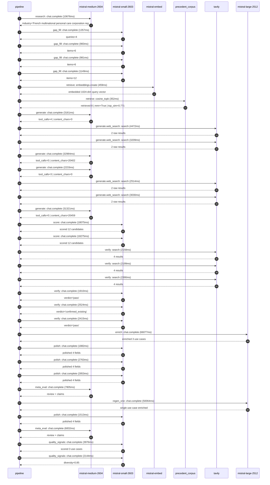

# Pipeline blueprint (architecture)

Static view of the pipeline regardless of run timing — shows agents,
models, and gates. The chronological execution log follows below.

```mermaid
flowchart TD
    Start([User: company name]) --> R
    R["<b>1. Research</b><br/>parallel: Wikipedia · Tavily news ·<br/>existing initiatives · live verification<br/><i>mistral-medium</i> synthesis"]
    R --> G["<b>1b. Gap-fill</b><br/>identify missing fields →<br/><i>mistral-small</i> generates queries →<br/>Tavily search per field →<br/><i>mistral-small</i> per-field extraction"]
    G --> Conf{Confidence ≥ 0.5<br/>OR verified<br/>OR ≥ 1 existing initiative?}
    Conf -->|no| Refuse([Refusal])
    Conf -->|yes| Ret
    Ret["<b>2. Retrieve</b><br/><i>mistral-embed</i> on company query →<br/>cosine top-K + industry/depth filter +<br/>MMR diversification"]
    Ret --> Gen["<b>3. Generate 12 candidates</b><br/><i>mistral-medium</i> with web_search tool<br/>(Tavily + deep-read) — fact citations<br/>flow into the EvidenceLedger"]
    Gen --> Score["<b>4. Score</b><br/>self-consistency: 2 parallel passes<br/><i>mistral-small</i> @ T=0.2 and T=0.4 →<br/>aggregate weighted scores"]
    Score --> Verify["<b>5. Per-candidate verify</b><br/>top-3: Tavily search + deep-read +<br/><i>mistral-small</i> verdict (pass /<br/>partial / confirmed_existing)"]
    Verify --> Enrich["<b>6. Enrich</b><br/><i>mistral-large</i> drafts customer-facing<br/>prose for 3 use cases (or<br/><i>mistral-medium</i> on fast tier)"]
    Enrich --> NumScrub["<b>6a. Numeric scrub</b><br/>flag any number not in cited content"]
    NumScrub --> Polish["<b>6b. Polish</b><br/><i>mistral-small</i> per use case (parallel):<br/>convert markers→qualitative,<br/>(ev-XXX)→[title](url)"]
    Polish --> Attr["<b>6c. Attribution check</b><br/><i>mistral-small</i> per use case (parallel):<br/>fix corpus-ID ↔ company mismatches"]
    Attr --> Meta["<b>7. Meta-evaluation</b><br/><i>mistral-medium</i> reviews report against<br/>cited precedents + ledger entries:<br/>strict claim verification"]
    Meta --> RegenQ{confidence < 0.6<br/>AND not fast tier?}
    RegenQ -->|yes| Regen["<b>7b. Targeted regen</b><br/><i>mistral-large</i> re-enriches just the<br/>weakest use case with the next-best<br/>near-miss; re-runs meta-eval"]
    RegenQ -->|no| QS
    Regen --> QS
    QS["<b>Quality signals</b><br/>LLM-graded diversity + specificity,<br/>fact-check pass rate, TTV/cost spread"]
    QS --> Render([Markdown report + trace])

    classDef agent fill:#fef3c7,stroke:#f59e0b
    classDef gate fill:#dbeafe,stroke:#3b82f6
    classDef io fill:#dcfce7,stroke:#16a34a
    class R,G,Ret,Gen,Score,Verify,Enrich,NumScrub,Polish,Attr,Meta,Regen,QS agent
    class Conf,RegenQ gate
    class Start,Refuse,Render io
```

## Execution trace — L'Oreal

Started: `2026-05-08T18:11:55.677873+00:00`. Total wall time: `279.5s` across `33` recorded actions.

### Per-step time totals

| Step | Calls | Total time | Avg time |
|---|---:|---:|---:|
| `research` | 1 | 10.68s | 10676ms |
| `gap_fill` | 4 | 4.47s | 1118ms |
| `retrieve` | 2 | 0.81s | 405ms |
| `generate` | 4 | 69.70s | 17425ms |
| `generate.web_search` | 4 | 13.23s | 3306ms |
| `score` | 2 | 36.35s | 18175ms |
| `verify` | 6 | 13.59s | 2266ms |
| `enrich` | 1 | 66.08s | 66077ms |
| `polish` | 4 | 9.01s | 2253ms |
| `meta_eval` | 2 | 14.64s | 7319ms |
| `regen_one` | 1 | 50.06s | 50064ms |
| `quality_signals` | 2 | 6.12s | 3060ms |

### Chronological event log

- `18:11:58.329` **[research]** `mistral-medium-2604.chat.complete` — 10676ms
   - inputs: synthesize CompanyContext for L'Oreal | depth=medium
   - outputs: industry='French multinational personal care corporation registered in Paris' verified=True conf=0.75
- `18:12:09.777` **[gap_fill]** `mistral-small-2603.chat.complete` — 1357ms
   - inputs: generate gap queries | fields=['business_model', 'products', 'data_assets', 'priorities']
   - outputs: queries=4
- `18:12:18.216` **[gap_fill]** `mistral-small-2603.chat.complete` — 983ms
   - inputs: layer-2 extract field=priorities
   - outputs: items=6
- `18:12:18.243` **[gap_fill]** `mistral-small-2603.chat.complete` — 981ms
   - inputs: layer-2 extract field=data_assets
   - outputs: items=6
- `18:12:18.266` **[gap_fill]** `mistral-small-2603.chat.complete` — 1149ms
   - inputs: layer-2 extract field=products
   - outputs: items=12
- `18:12:19.435` **[retrieve]** `mistral-embed.embeddings.create` — 459ms
   - inputs: company_query | industries='French multinational personal care corporation registered in Paris'
   - outputs: embedded 1024-dim query vector
- `18:12:19.894` **[retrieve]** `precedent_corpus.cosine_topk` — 352ms
   - inputs: k=8 min_depth=0.4 target="L'Oreal"
   - outputs: retrieved 8 | mmr=True | top_sim=0.771
- `18:12:21.383` **[generate]** `mistral-medium-2604.chat.complete` — 3161ms
   - inputs: iteration=0 tool_calls_used=0/2 tools=on
   - outputs: tool_calls=4 | content_chars=0
- `18:12:24.556` **[generate.web_search]** `tavily.search` — 4472ms
   - inputs: query="L'Oréal 10 petabytes data platform details 2024"
   - outputs: 2 raw results
- `18:12:30.696` **[generate.web_search]** `tavily.search` — 3209ms
   - inputs: query="L'Oréal sustainability 2024 L'Oréal for the Future water resilience programs"
   - outputs: 2 raw results
- `18:12:33.925` **[generate]** `mistral-medium-2604.chat.complete` — 32984ms
   - inputs: iteration=1 tool_calls_used=2/2 tools=off
   - outputs: tool_calls=0 | content_chars=20402
- `18:13:07.661` **[generate]** `mistral-medium-2604.chat.complete` — 2233ms
   - inputs: iteration=0 tool_calls_used=0/2 tools=on
   - outputs: tool_calls=3 | content_chars=0
- `18:13:09.913` **[generate.web_search]** `tavily.search` — 2514ms
   - inputs: query="L'Oréal sustainability goals 2024 L'Oréal for the Future"
   - outputs: 2 raw results
- `18:13:13.248` **[generate.web_search]** `tavily.search` — 3030ms
   - inputs: query="L'Oréal research and innovation labs data assets patents"
   - outputs: 2 raw results
- `18:13:16.987` **[generate]** `mistral-medium-2604.chat.complete` — 31321ms
   - inputs: iteration=1 tool_calls_used=2/2 tools=off
   - outputs: tool_calls=0 | content_chars=20459
- `18:13:48.790` **[score]** `mistral-small-2603.chat.complete` — 18075ms
   - inputs: self-consistency pass T=0.2
   - outputs: scored 12 candidates
- `18:13:48.804` **[score]** `mistral-small-2603.chat.complete` — 18275ms
   - inputs: self-consistency pass T=0.4
   - outputs: scored 12 candidates
- `18:14:07.134` **[verify]** `tavily.search` — 2158ms
   - inputs: candidate=sustainability-formula-optimizer | query="L'Oreal AI-driven sustainable formula reformulation assistan"
   - outputs: 4 results
- `18:14:07.135` **[verify]** `tavily.search` — 2199ms
   - inputs: candidate=water-footprint-optimizer | query="L'Oreal AI-driven water footprint optimization for manufactu"
   - outputs: 4 results
- `18:14:07.134` **[verify]** `tavily.search` — 2390ms
   - inputs: candidate=sustainability-claim-verification | query="L'Oreal Automated sustainability claim verification for prod"
   - outputs: 4 results
- `18:14:10.228` **[verify]** `mistral-small-2603.chat.complete` — 1910ms
   - inputs: verdict for water-footprint-optimizer
   - outputs: verdict='pass'
- `18:14:10.493` **[verify]** `mistral-small-2603.chat.complete` — 2524ms
   - inputs: verdict for sustainability-formula-optimizer
   - outputs: verdict='confirmed_existing'
- `18:14:10.846` **[verify]** `mistral-small-2603.chat.complete` — 2415ms
   - inputs: verdict for sustainability-claim-verification
   - outputs: verdict='pass'
- `18:14:13.290` **[enrich]** `mistral-large-2512.chat.complete` — 66077ms
   - inputs: tier=standard top_3=['sustainability-claim-verification', 'water-footprint-optimizer', 'supply-chain-ingredient-risk-predictor']
   - outputs: enriched 3 use cases
- `18:15:19.374` **[polish]** `mistral-small-2603.chat.complete` — 1882ms
   - inputs: use_case=water-footprint-optimizer unanchored=True opaque_ev=False
   - outputs: polished 4 fields
- `18:15:19.377` **[polish]** `mistral-small-2603.chat.complete` — 2763ms
   - inputs: use_case=supply-chain-ingredient-risk-predictor unanchored=True opaque_ev=False
   - outputs: polished 4 fields
- `18:15:19.369` **[polish]** `mistral-small-2603.chat.complete` — 2853ms
   - inputs: use_case=sustainability-claim-verification unanchored=True opaque_ev=False
   - outputs: polished 4 fields
- `18:15:22.257` **[meta_eval]** `mistral-medium-2604.chat.complete` — 7805ms
   - inputs: reviewing 3 use cases
   - outputs: review + claims
- `18:15:30.088` **[regen_one]** `mistral-large-2512.chat.complete` — 50064ms
   - inputs: replace weakest=supply-chain-ingredient-risk-predictor with sustainability-formula-optimizer
   - outputs: single use case enriched
- `18:16:20.153` **[polish]** `mistral-small-2603.chat.complete` — 1513ms
   - inputs: use_case=sustainability-formula-optimizer unanchored=False opaque_ev=True
   - outputs: polished 4 fields
- `18:16:21.697` **[meta_eval]** `mistral-medium-2604.chat.complete` — 6832ms
   - inputs: reviewing 3 use cases
   - outputs: review + claims
- `18:16:29.013` **[quality_signals]** `mistral-small-2603.chat.complete` — 3976ms
   - inputs: specificity grade (3 use cases)
   - outputs: scored 3 use cases
- `18:16:32.989` **[quality_signals]** `mistral-small-2603.chat.complete` — 2144ms
   - inputs: diversity grade
   - outputs: diversity=0.85

## Mermaid sequence diagram (execution)

