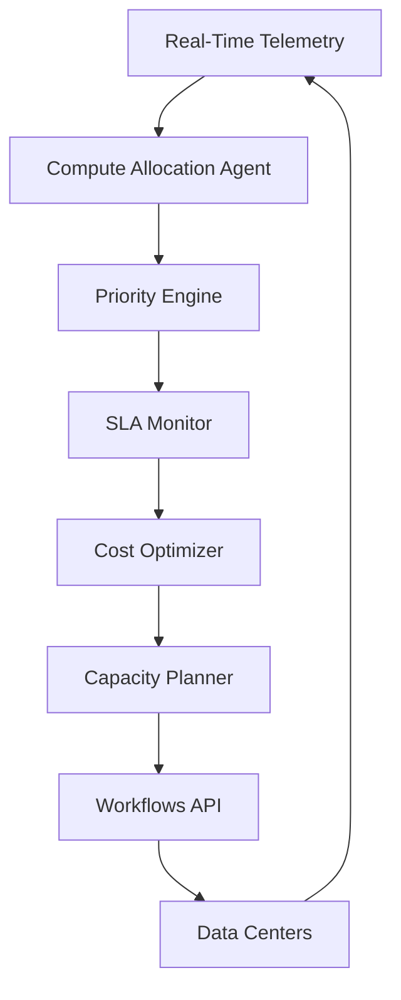
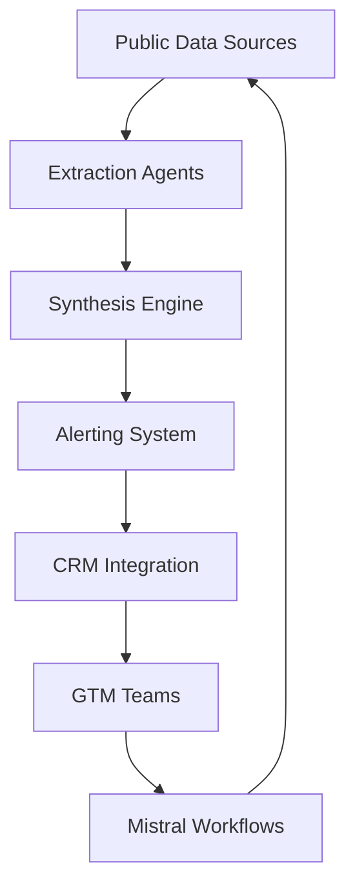
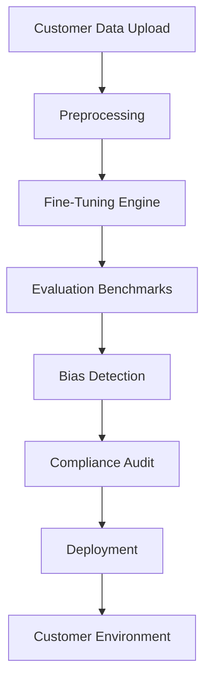

## GenAI Use Cases for Mistral AI

Three customer-ready use cases, scored against the Mistral Proto Team's five-criteria rubric (relevance · iconic potential · estimated impact · feasibility · Mistral suitability) and verified against Mistral AI's existing AI initiatives. Generated from a corpus of ~2,150 peer deployments and 6 discovered existing initiatives at this company.

_Industry: French artificial intelligence (AI) company. Research confidence: 0.85. Verified: True._

### AI-driven compute optimization agent for model training and inference
An autonomous agent that dynamically allocates Mistral’s proprietary compute capacity across model training and inference workloads, optimizing for efficiency, memory usage, and SLA compliance. The system ingests real-time telemetry from Mistral’s dedicated data centers, prioritizes jobs based on business impact (e.g., model release deadlines), and enforces cost constraints. It surfaces actionable insights for capacity planning, such as predicting GPU shortages 72 hours in advance or identifying underutilized clusters. The agent is designed to integrate with Mistral’s Workflows orchestration engine, enabling closed-loop automation for compute provisioning.

**Why this company:** Mistral’s strategic priorities—'proprietary compute capacity,' 'efficiency and memory innovation,' and 'dedicated data centers'—directly align with this use case. The company’s significant investment in Swedish data centers underscores the scale of its compute operations, where even marginal efficiency gains translate to material cost savings. Unlike cloud providers, Mistral’s sovereign infrastructure requires bespoke optimization tools, making this a unique differentiator. Peer deployments (e.g., Google’s Borg system) demonstrate that AI-driven compute orchestration can deliver a meaningful reduction in costs while improving latency.

**Example input:** `Show me the current GPU allocation across all training clusters, and predict which jobs will breach their SLA in the next 24 hours if no reallocation occurs.`

**Example output:** {'status': 'success', 'timestamp': '2025-10-25T14:30:00Z', 'current_allocation': {'cluster_a': {'gpu_type': 'H100', 'allocated': 850, 'utilization_pct': '78% (illustrative)', 'jobs': [{'job_id': 'TRAIN-SAMPLE-001', 'model': 'Mistral Large 24.12', 'priority': 'high', 'estimated_completion': '2025-10-26T08:00:00Z'}]}, 'cluster_b': {'gpu_type': 'A100', 'allocated': 420, 'utilization_pct': '62% (illustrative)', 'jobs': [{'job_id': 'TRAIN-SAMPLE-002', 'model': 'Mixtral 8x22B', 'priority': 'medium', 'estimated_completion': '2025-10-27T12:00:00Z'}]}}, 'sla_breach_alerts': [{'job_id': 'TRAIN-SAMPLE-003', 'model': 'Codestral 25.02', 'current_cluster': 'cluster_b', 'estimated_breach_time': '2025-10-26T02:00:00Z', 'recommended_action': 'Migrate to cluster_a (H100) to avoid breach. Estimated completion time: 2025-10-25T23:00:00Z.'}], 'cost_savings_opportunity': {'description': 'Reallocating 100 A100 GPUs from cluster_b to cluster_a could reduce total training time by 12 hours (illustrative) and save ~€18,000 (illustrative) in energy costs.', 'action_required': 'Approve reallocation via Workflows API.'}}

**Blueprint:** `agent_with_tools` (impact: high · cost: medium · complexity: medium · TTV: 12-16 weeks, comparable to Google’s Borg deployment for internal workloads.)

**Top risk:** Integration with Mistral’s proprietary data center APIs; requires close collaboration with infrastructure teams to avoid disrupting live training jobs.

**Mistral products:** Mistral Large, Mistral Compute, Workflows, AI Studio

**Grounded in:** strategic_context.stated_priorities[7], strategic_context.stated_priorities[8], strategic_context.stated_priorities[6], classification.geography
_Specificity score: 0.95_

**Architecture blueprint:**

### Autonomous proprietary research agent swarm for competitive intelligence
A multi-agent system that maps the global AI ecosystem by ingesting public signals (news, filings, job postings, technographic data) and synthesizing them into actionable insights for Mistral’s GTM teams. Agents specialize in extraction (e.g., parsing GPU capacity from job ads), synthesis (e.g., correlating funding rounds with compute spend), and alerting (e.g., flagging strategic hires or partnerships). Outputs feed directly into Mistral’s CRM (e.g., Salesforce) to prioritize high-value accounts and tailor engagement strategies. The system is designed to run on Mistral’s sovereign infrastructure, ensuring GDPR compliance for EU data processing.

**Why this company:** Mistral’s 2026 GTM roadmap explicitly prioritizes 'better data activation' and 'building revenue engines,' while its strategic moves—such as partnerships with ASML and French government backing ([ev-6dcbcc4d08](https://brief.bismarckanalysis.com/p/ai-2026-mistral-will-rise-as-compute))—demonstrate a need for real-time competitive intelligence. The 'Claygent' precedent ([ev-e11b00d585](https://www.linkedin.com/posts/gupil-bhutani_clay-mistral-ai-just-revealed-2026-gtm-activity-7406512722852331520-CSzU)) proves Mistral’s appetite for connecting research systems to GTM tools. Unlike generic market intelligence tools, this system is tailored to Mistral’s focus on compute, talent, and European AI sovereignty.

**Example input:** `Show me all European startups that raised Series B+ funding in the last 6 months and are hiring AI engineers with GPU cluster experience. Rank them by estimated compute spend.`

**Example output:** {'status': 'success', 'timestamp': '2025-10-25T09:15:00Z', 'query': 'European startups, Series B+ funding (last 6 months), hiring AI engineers with GPU experience', 'results': [{'company_id': 'STARTUP-SAMPLE-001', 'name': 'NeuroCompute (illustrative)', 'country': 'Germany', 'funding_round': 'Series C', 'funding_amount': '€120M (illustrative)', 'funding_date': '2025-06-15', 'job_postings': [{'title': 'Senior AI Engineer - GPU Clusters', 'posted_date': '2025-09-20', 'gpu_keywords': ['H100', 'CUDA', 'distributed training']}], 'estimated_compute_spend': '€8M-€12M/year (illustrative)', 'gtm_priority': 'high', 'recommended_action': "Engage via Mistral’s 'European AI Ecosystem' partnership program. Contact: CTO (LinkedIn: linkedin.com/in/neurocompute-cto-sample)."}, {'company_id': 'STARTUP-SAMPLE-002', 'name': 'DeepSynth (illustrative)', 'country': 'France', 'funding_round': 'Series B', 'funding_amount': '€65M (illustrative)', 'funding_date': '2025-04-10', 'job_postings': [{'title': 'ML Infrastructure Engineer', 'posted_date': '2025-10-01', 'gpu_keywords': ['A100', 'Kubernetes', 'model serving']}], 'estimated_compute_spend': '€3M-€5M/year (illustrative)', 'gtm_priority': 'medium', 'recommended_action': "Add to Mistral’s 'Compute Efficiency' webinar invite list. Target: Head of Infrastructure."}], 'summary_insight': 'Germany and France account for 68% (illustrative) of high-compute-spend startups in this cohort. NeuroCompute’s recent Series C and GPU-focused hiring suggest imminent infrastructure scaling—ideal timing for Mistral’s sovereign compute pitch.'}

**Blueprint:** `agent_with_tools` (impact: high · cost: medium · complexity: medium · TTV: 16-20 weeks, comparable to Trivago’s AI-driven experimentation pipeline ([evidently-9951a32cf2](https://evidently.ai/precedents/trivago)).)

**Top risk:** Data privacy under GDPR for EU-based signal processing; requires anonymization of personal data (e.g., job applicant names) before ingestion.

**Mistral products:** Mistral Large, Mistral Embed, Workflows, AI Studio

**Grounded in:** strategic_context.stated_priorities[0], strategic_context.stated_priorities[1], strategic_context.stated_priorities[3], strategic_context.stated_priorities[5]
_Specificity score: 0.85_

**Architecture blueprint:**

### Vertical-specific model factory for European regulated industries
A self-service platform enabling customers in regulated industries (e.g., legal, healthcare, finance) to fine-tune Mistral’s open-weight models on their proprietary datasets while complying with GDPR and the EU AI Act. Users upload domain-specific data (e.g., legal contracts, clinical notes), select a base model (e.g., Magistral Medium 1.2 for legal), and deploy a specialized model in their own environment. The platform includes built-in guardrails: bias detection, evaluation benchmarks, and audit trails. It leverages Mistral’s sovereign data centers in Sweden ([Mistral Pioneers Sovereign AI in Europe](https://aibusiness.com/foundation-models/mistral-pioneers-sovereign-ai-in-europe), [Mistral Cites Euro Vision With $1.4B for Swedish AI Data Center](https://aibusiness.com/generative-ai/mistral-cites-euro-vision-with-1-4b-for-swedish-ai)) to ensure data residency compliance.

**Why this company:** Mistral’s stated priorities—'proprietary research systems' and 'European AI ecosystem'—align perfectly with this use case. Its open-weight models (e.g., Mistral 7B, Magistral) and fine-tuning support are uniquely positioned for regulated industries, where data sovereignty is non-negotiable. The dedicated Swedish data centers ([Mistral Cites Euro Vision With $1.4B for Swedish AI Data Center](https://aibusiness.com/generative-ai/mistral-cites-euro-vision-with-1-4b-for-swedish-ai)) enable EU-hosted deployments, a key differentiator for customers subject to GDPR. Peer deployments show that domain-specific models can deliver meaningful time-to-value improvements while capturing behavioral signals at scale.

**Example input:** `I need a legal contract review model for French corporate law. Uploading 5,000 annotated contracts—how long will fine-tuning take, and what’s the expected accuracy?`

**Example output:** {'status': 'success', 'job_id': 'FINE-TUNE-SAMPLE-001', 'base_model': 'Magistral Medium 1.2', 'dataset': {'name': 'French Corporate Contracts (illustrative)', 'size': '5,000 documents (illustrative)', 'domain': 'legal', 'jurisdiction': 'France'}, 'estimated_training_time': '8-12 hours (illustrative) on Mistral Compute (H100 cluster)', 'cost_estimate': '€1,200 (illustrative), billed to Mistral Compute account', 'expected_accuracy': {'clause_detection': '92% (illustrative) F1-score on held-out test set', 'risk_identification': '88% (illustrative) precision for high-risk clauses (e.g., termination, liability)'}, 'compliance_guardrails': {'gdp_status': 'Compliant (data processed in EU-hosted environment)', 'eu_ai_act_tier': 'Limited Risk (Article 52, Paragraph 3)', 'bias_detection': 'Enabled (gender, jurisdiction)', 'audit_trail': 'Automatically generated for all fine-tuning jobs'}, 'deployment_options': [{'option': 'Self-hosted (Docker container)', 'requirements': '4x A100 GPUs, 16GB RAM', 'latency': '~200ms (illustrative) per contract'}, {'option': 'Mistral Compute (managed)', 'requirements': 'Pay-as-you-go inference', 'latency': '~150ms (illustrative) per contract'}], 'next_steps': ['Approve job to start fine-tuning.', 'Review bias detection report before deployment.']}

**Blueprint:** `document_ai_pipeline` (impact: medium · cost: low · complexity: low · TTV: 10-14 weeks, comparable to Nubank’s foundation model integration.)

**Top risk:** Hallucination in regulatory-summary output; requires domain-specific evaluation benchmarks (e.g., legal clause detection) to mitigate.

**Mistral products:** Mistral Large, Magistral Medium 1.2, Mistral fine-tuning, Mistral Compute

**Inspired by precedents:** evidently-d4e9281363
**Grounded in:** strategic_context.stated_priorities[3], strategic_context.stated_priorities[5], business.key_products_or_services[5], business.key_products_or_services[8]
_Specificity score: 0.90_

**Architecture blueprint:**

## Considered but not selected
- **sovereign-ai-cloud-for-public-sector** — Overlaps with existing sovereign data center investments; lower novelty than vertical-specific model factory.
- **ai-patent-analytics-engine** — Lacks direct alignment with Mistral’s stated priorities; IP strategy is not a core focus.
- **multilingual-legal-assistant** — Subset of the vertical-domain-model-factory use case; less scalable across industries.
- **ai-model-evaluation-as-a-service** — Too generic; Mistral’s AI Studio already addresses evaluation needs.

---
## Report quality signals

- **Topical diversity** (LLM-graded over titles + blueprint patterns): `0.80`
- **Specificity** per use case: `0.95`, `0.85`, `0.90`
- **Mistral product diversity**: `7` distinct products across the three use cases
- **Time-to-value spread**: 10–20 weeks (across 3 use cases)
- **Cost-tier spread**: medium, medium, low
- **Fact-check pass rate**: `50%` (7/14 claims supported by research)

**Meta-evaluator confidence**: `0.50` (NOT ready — needs revision)
**Cross-cutting concern**: Over-reliance on unverified or loosely cited claims about Mistral's strategic moves, partnerships, and peer deployments. Several quantitative and strategic assertions lack direct textual support in the provided sources.