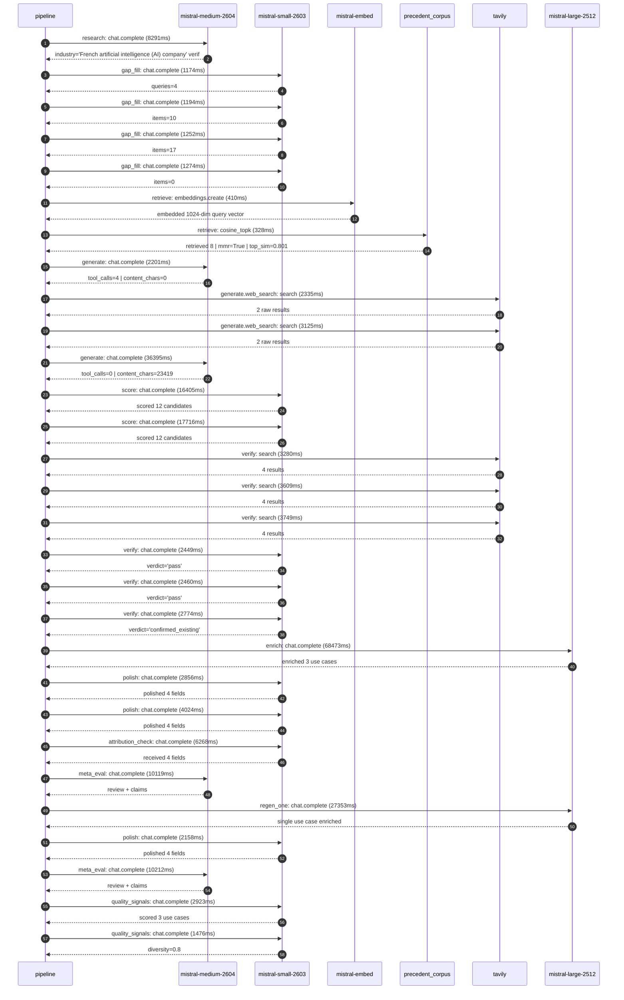

# Pipeline blueprint (architecture)

Static view of the pipeline regardless of run timing — shows agents,
models, and gates. The chronological execution log follows below.

```mermaid
flowchart TD
    Start([User: company name]) --> R
    R["<b>1. Research</b><br/>parallel: Wikipedia · Tavily news ·<br/>existing initiatives · live verification<br/><i>mistral-medium</i> synthesis"]
    R --> G["<b>1b. Gap-fill</b><br/>identify missing fields →<br/><i>mistral-small</i> generates queries →<br/>Tavily search per field →<br/><i>mistral-small</i> per-field extraction"]
    G --> Conf{Confidence ≥ 0.5<br/>OR verified<br/>OR ≥ 1 existing initiative?}
    Conf -->|no| Refuse([Refusal])
    Conf -->|yes| Ret
    Ret["<b>2. Retrieve</b><br/><i>mistral-embed</i> on company query →<br/>cosine top-K + industry/depth filter +<br/>MMR diversification"]
    Ret --> Gen["<b>3. Generate 12 candidates</b><br/><i>mistral-medium</i> with web_search tool<br/>(Tavily + deep-read) — fact citations<br/>flow into the EvidenceLedger"]
    Gen --> Score["<b>4. Score</b><br/>self-consistency: 2 parallel passes<br/><i>mistral-small</i> @ T=0.2 and T=0.4 →<br/>aggregate weighted scores"]
    Score --> Verify["<b>5. Per-candidate verify</b><br/>top-3: Tavily search + deep-read +<br/><i>mistral-small</i> verdict (pass /<br/>partial / confirmed_existing)"]
    Verify --> Enrich["<b>6. Enrich</b><br/><i>mistral-large</i> drafts customer-facing<br/>prose for 3 use cases (or<br/><i>mistral-medium</i> on fast tier)"]
    Enrich --> NumScrub["<b>6a. Numeric scrub</b><br/>flag any number not in cited content"]
    NumScrub --> Polish["<b>6b. Polish</b><br/><i>mistral-small</i> per use case (parallel):<br/>convert markers→qualitative,<br/>(ev-XXX)→[title](url)"]
    Polish --> Attr["<b>6c. Attribution check</b><br/><i>mistral-small</i> per use case (parallel):<br/>fix corpus-ID ↔ company mismatches"]
    Attr --> Meta["<b>7. Meta-evaluation</b><br/><i>mistral-medium</i> reviews report against<br/>cited precedents + ledger entries:<br/>strict claim verification"]
    Meta --> RegenQ{confidence < 0.6<br/>AND not fast tier?}
    RegenQ -->|yes| Regen["<b>7b. Targeted regen</b><br/><i>mistral-large</i> re-enriches just the<br/>weakest use case with the next-best<br/>near-miss; re-runs meta-eval"]
    RegenQ -->|no| QS
    Regen --> QS
    QS["<b>Quality signals</b><br/>LLM-graded diversity + specificity,<br/>fact-check pass rate, TTV/cost spread"]
    QS --> Render([Markdown report + trace])

    classDef agent fill:#fef3c7,stroke:#f59e0b
    classDef gate fill:#dbeafe,stroke:#3b82f6
    classDef io fill:#dcfce7,stroke:#16a34a
    class R,G,Ret,Gen,Score,Verify,Enrich,NumScrub,Polish,Attr,Meta,Regen,QS agent
    class Conf,RegenQ gate
    class Start,Refuse,Render io
```

## Execution trace — Mistral AI

Started: `2026-05-08T18:34:32.056360+00:00`. Total wall time: `228.8s` across `29` recorded actions.

### Per-step time totals

| Step | Calls | Total time | Avg time |
|---|---:|---:|---:|
| `research` | 1 | 8.29s | 8291ms |
| `gap_fill` | 4 | 4.89s | 1224ms |
| `retrieve` | 2 | 0.74s | 369ms |
| `generate` | 2 | 38.60s | 19298ms |
| `generate.web_search` | 2 | 5.46s | 2730ms |
| `score` | 2 | 34.12s | 17060ms |
| `verify` | 6 | 18.32s | 3054ms |
| `enrich` | 1 | 68.47s | 68473ms |
| `polish` | 3 | 9.04s | 3013ms |
| `attribution_check` | 1 | 6.27s | 6268ms |
| `meta_eval` | 2 | 20.33s | 10165ms |
| `regen_one` | 1 | 27.35s | 27353ms |
| `quality_signals` | 2 | 4.40s | 2200ms |

### Chronological event log

- `18:34:34.743` **[research]** `mistral-medium-2604.chat.complete` — 8291ms
   - inputs: synthesize CompanyContext for Mistral AI | depth=medium
   - outputs: industry='French artificial intelligence (AI) company' verified=True conf=0.75
- `18:34:43.716` **[gap_fill]** `mistral-small-2603.chat.complete` — 1174ms
   - inputs: generate gap queries | fields=['business_model', 'products', 'data_assets', 'priorities']
   - outputs: queries=4
- `18:34:51.670` **[gap_fill]** `mistral-small-2603.chat.complete` — 1194ms
   - inputs: layer-2 extract field=priorities
   - outputs: items=10
- `18:34:51.714` **[gap_fill]** `mistral-small-2603.chat.complete` — 1252ms
   - inputs: layer-2 extract field=products
   - outputs: items=17
- `18:34:51.693` **[gap_fill]** `mistral-small-2603.chat.complete` — 1274ms
   - inputs: layer-2 extract field=data_assets
   - outputs: items=0
- `18:34:52.997` **[retrieve]** `mistral-embed.embeddings.create` — 410ms
   - inputs: company_query | industries='French artificial intelligence (AI) company'
   - outputs: embedded 1024-dim query vector
- `18:34:53.407` **[retrieve]** `precedent_corpus.cosine_topk` — 328ms
   - inputs: k=8 min_depth=0.4 target='Mistral AI'
   - outputs: retrieved 8 | mmr=True | top_sim=0.801
- `18:34:54.452` **[generate]** `mistral-medium-2604.chat.complete` — 2201ms
   - inputs: iteration=0 tool_calls_used=0/2 tools=on
   - outputs: tool_calls=4 | content_chars=0
- `18:34:56.670` **[generate.web_search]** `tavily.search` — 2335ms
   - inputs: query='Mistral AI 2026 GTM roadmap and proprietary compute capacity'
   - outputs: 2 raw results
- `18:35:00.779` **[generate.web_search]** `tavily.search` — 3125ms
   - inputs: query='Mistral AI dedicated data centers and European AI ecosystem partnerships'
   - outputs: 2 raw results
- `18:35:04.847` **[generate]** `mistral-medium-2604.chat.complete` — 36395ms
   - inputs: iteration=1 tool_calls_used=2/2 tools=off
   - outputs: tool_calls=0 | content_chars=23419
- `18:35:41.758` **[score]** `mistral-small-2603.chat.complete` — 16405ms
   - inputs: self-consistency pass T=0.2
   - outputs: scored 12 candidates
- `18:35:41.761` **[score]** `mistral-small-2603.chat.complete` — 17716ms
   - inputs: self-consistency pass T=0.4
   - outputs: scored 12 candidates
- `18:35:59.525` **[verify]** `tavily.search` — 3280ms
   - inputs: candidate=ai-compute-optimization-agent | query='Mistral AI AI-driven compute optimization agent for model tr'
   - outputs: 4 results
- `18:35:59.524` **[verify]** `tavily.search` — 3609ms
   - inputs: candidate=sovereign-ai-cloud-for-public-sector | query='Mistral AI Sovereign AI cloud for European public sector and'
   - outputs: 4 results
- `18:35:59.525` **[verify]** `tavily.search` — 3749ms
   - inputs: candidate=proprietary-research-agent-swarm | query='Mistral AI Autonomous proprietary research agent swarm for c'
   - outputs: 4 results
- `18:36:03.917` **[verify]** `mistral-small-2603.chat.complete` — 2449ms
   - inputs: verdict for ai-compute-optimization-agent
   - outputs: verdict='pass'
- `18:36:04.388` **[verify]** `mistral-small-2603.chat.complete` — 2460ms
   - inputs: verdict for proprietary-research-agent-swarm
   - outputs: verdict='pass'
- `18:36:04.377` **[verify]** `mistral-small-2603.chat.complete` — 2774ms
   - inputs: verdict for sovereign-ai-cloud-for-public-sector
   - outputs: verdict='confirmed_existing'
- `18:36:07.185` **[enrich]** `mistral-large-2512.chat.complete` — 68473ms
   - inputs: tier=standard top_3=['ai-compute-optimization-agent', 'proprietary-research-agent-swarm', 'vertical-domain-model-factory']
   - outputs: enriched 3 use cases
- `18:37:15.660` **[polish]** `mistral-small-2603.chat.complete` — 2856ms
   - inputs: use_case=ai-compute-optimization-agent unanchored=True opaque_ev=False
   - outputs: polished 4 fields
- `18:37:15.663` **[polish]** `mistral-small-2603.chat.complete` — 4024ms
   - inputs: use_case=vertical-domain-model-factory unanchored=True opaque_ev=False
   - outputs: polished 4 fields
- `18:37:19.687` **[attribution_check]** `mistral-small-2603.chat.complete` — 6268ms
   - inputs: use_case=proprietary-research-agent-swarm cited_ids=['evidently-9951a32cf2']
   - outputs: received 4 fields
- `18:37:25.986` **[meta_eval]** `mistral-medium-2604.chat.complete` — 10119ms
   - inputs: reviewing 3 use cases
   - outputs: review + claims
- `18:37:36.136` **[regen_one]** `mistral-large-2512.chat.complete` — 27353ms
   - inputs: replace weakest=proprietary-research-agent-swarm with sovereign-ai-cloud-for-public-sector
   - outputs: single use case enriched
- `18:38:03.490` **[polish]** `mistral-small-2603.chat.complete` — 2158ms
   - inputs: use_case=sovereign-ai-cloud-for-public-sector unanchored=False opaque_ev=True
   - outputs: polished 4 fields
- `18:38:05.676` **[meta_eval]** `mistral-medium-2604.chat.complete` — 10212ms
   - inputs: reviewing 3 use cases
   - outputs: review + claims
- `18:38:16.443` **[quality_signals]** `mistral-small-2603.chat.complete` — 2923ms
   - inputs: specificity grade (3 use cases)
   - outputs: scored 3 use cases
- `18:38:19.366` **[quality_signals]** `mistral-small-2603.chat.complete` — 1476ms
   - inputs: diversity grade
   - outputs: diversity=0.8

## Mermaid sequence diagram (execution)

