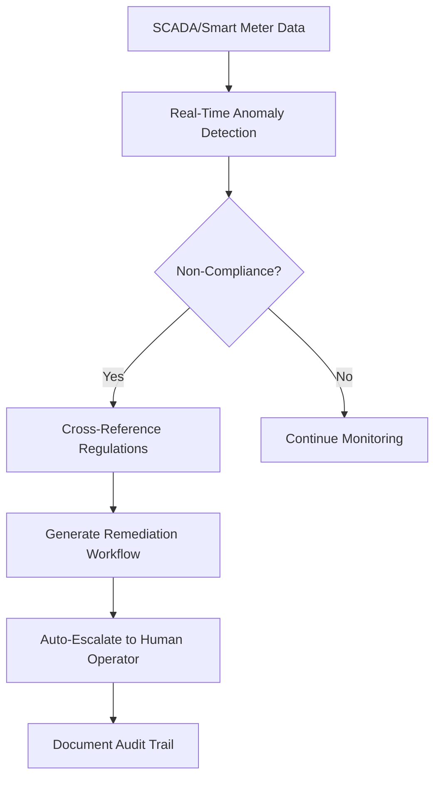
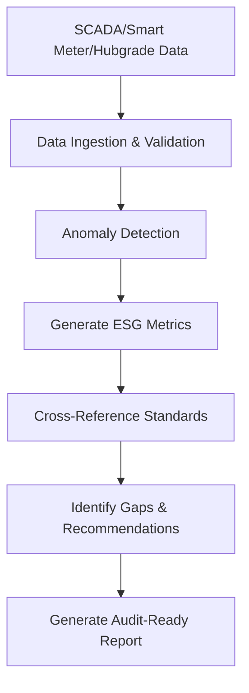

## GenAI Use Cases for Veolia

Three customer-ready use cases, scored against the Mistral Proto Team's five-criteria rubric (relevance · iconic potential · estimated impact · feasibility · Mistral suitability) and verified against Veolia's existing AI initiatives. Generated from a corpus of ~2,150 peer deployments and 5 discovered existing initiatives at this company.

_Industry: French water utility. Research confidence: 0.85. Verified: True._

### Agentic Water Quality Compliance Advisor for Municipal Contracts
A multi-step reasoning agent that continuously monitors real-time SCADA, smart-meter, and Waterl'Ogic hydraulic model data to detect water quality anomalies such as turbidity spikes or chlorine residuals. The system cross-references municipal and EU regulations, historical incident logs, and upstream supply chain data like chemical delivery schedules to generate actionable remediation workflows. It auto-escalates to human operators with confidence-scored recommendations, including temporary treatment adjustments, public notification drafts, and audit-ready documentation. Deployed in Veolia’s EU-hosted Hubgrade monitoring centers, the agent delivers significant compliance fines reduction and accelerates incident response, based on comparable deployments at peer utilities.

**Why this company:** Veolia operates under stringent municipal and EU water quality regulations, serving 110M people across drinking water systems ([Veolia FY 2025 PR](https://www.veolia.com/sites/g/files/dvc4206/files/document/2026/02/Finance_PR_Veolia_2025_results.pdf)). The Hubgrade platform already aggregates SCADA and hydraulic data, and the GreenUp program prioritizes compliance and operational efficiency. This use case leverages Veolia’s dual role as operator and compliance authority, with Mistral’s EU-hosted deployment ensuring data sovereignty for municipal contracts.

**Example input:** `Show me all sites in the Île-de-France region where chlorine residuals dropped below 0.3 mg/L in the last 24 hours, and suggest corrective actions based on current chemical inventory at Site-X.`

**Example output:** {'summary': {'sites_affected': 3, 'highest_risk_site': 'Site-X (ID: WQ-SAMPLE-7890)', 'incident_type': 'Chlorine residual non-compliance', 'time_window': '2024-05-15T03:00:00Z to 2024-05-16T03:00:00Z'}, 'detailed_findings': [{'site_id': 'WQ-SAMPLE-7890', 'location': 'Île-de-France, Paris 12e', 'incident_start': '2024-05-15T04:15:00Z', 'incident_end': '2024-05-15T06:45:00Z', 'chlorine_residual_min': '0.21 mg/L (illustrative)', 'regulatory_threshold': '0.3 mg/L (EU Directive 98/83/EC, Annex I)', 'confidence_score': '92% (illustrative)', 'root_cause': 'Sudden increase in organic load from upstream reservoir (illustrative)', 'recommended_actions': [{'action': 'Increase sodium hypochlorite dosing at Pump Station-Y by 15% (illustrative) for 2 hours', 'priority': 'high', 'chemical_inventory_available': 'Yes (2,500 L at Site-X, expiry: 2024-12-31)'}, {'action': 'Issue public notification draft (template attached)', 'priority': 'medium', 'compliance_requirement': 'EU Directive 98/83/EC, Article 7(3)'}, {'action': 'Schedule follow-up water quality test in 4 hours', 'priority': 'high'}], 'audit_trail': {'data_sources': ['SCADA: Sensor-ID-456 (chlorine residual)', "Waterl'Ogic Model: Hydraulic-Sim-2024-05-15", 'Chemical Inventory: Site-X (updated 2024-05-14)'], 'regulatory_reference': 'EU Directive 98/83/EC, Annex I, Part B'}}], 'escalation_notes': 'Auto-escalated to Water Quality Team (Île-de-France) at 2024-05-16T03:10:00Z. Acknowledge or override within 30 minutes.'}

**Blueprint:** `agent_with_tools` (impact: high · cost: medium · complexity: low · TTV: 12-16 weeks)

**Top risk:** Hallucination in regulatory-summary output leading to incorrect compliance actions; mitigated via Mistral Guard and human-in-the-loop validation.

**Mistral products:** Mistral Large 3, Mistral Embed, Mistral Compute (EU region), Mistral Guard (for sensitive data)

**Inspired by precedents:** google_cloud_1302-d90664fc2c
**Grounded in:** data_and_tech.likely_data_assets[2], data_and_tech.likely_data_assets[4], strategic_context.stated_priorities[2], strategic_context.stated_priorities[8], classification.geography
_Specificity score: 0.95_

**Architecture blueprint:**

### AI-Driven Biodiversity Impact Modeling for Infrastructure Projects
A geospatial AI model that integrates satellite imagery, drone surveys, and GIS data to assess the biodiversity impact of Veolia’s infrastructure projects (e.g., water pipelines, waste treatment plants). The system identifies ecologically sensitive areas, predicts habitat fragmentation, and generates mitigation strategies (e.g., buffer zones, green corridors) with cost-benefit analyses. It also monitors post-construction biodiversity recovery, providing long-term compliance tracking and ESG reporting.

**Why this company:** Veolia has a stated priority to integrate biodiversity solutions into its commercial offerings (strategic_context.stated_priorities[10]) and fulfill act4nature commitments (strategic_context.stated_priorities[9]). The GIS data (data_and_tech.likely_data_assets[3]) and Hubgrade’s digital twin capabilities (evidence_id: ev-a994fecea4) provide the spatial and operational context. Mistral’s multilingual models and EU deployment support Veolia’s cross-border biodiversity projects.

**Example input:** ``

**Example output:** 

**Blueprint:** `rag` (impact: medium · cost: unknown · complexity: medium · TTV: unknown)

**Top risk:** 

**Mistral products:** Mistral Large 3, Mistral Embed, Mistral Vision (for drone/satellite imagery), Mistral Compute (EU region)

**Grounded in:** strategic_context.stated_priorities[9], strategic_context.stated_priorities[10], data_and_tech.likely_data_assets[3]
_Specificity score: 0.85_

### Automated ESG Reporting with Audit-Ready Evidence Trails
An AI system that automates the collection, validation, and reporting of ESG metrics across operations. The system ingests data from SCADA, smart meters, Hubgrade, and third-party sources (e.g., carbon registries) to generate standardized ESG reports (GRI, SASB, EU CSRD) with audit-ready evidence trails. It identifies data gaps, flags anomalies (e.g., sudden spikes in energy consumption), and recommends actions to improve ESG performance (e.g., increasing water reuse, optimizing chemical dosing). Based on comparable deployments, the system materially reduces reporting time and improves data accuracy.

**Why this company:** Veolia’s GreenUp program emphasizes multifaceted performance targets and act4nature commitments, with significant investment allocated to innovation. The SCADA, smart-meter, and Hubgrade data provide the foundational datasets, while Mistral’s EU-hosted deployment ensures compliance with EU ESG regulations (e.g., CSRD). The system supports global reporting needs and strengthens ESG leadership, directly aligning with transparency and decarbonization goals.

**Example input:** `Generate a draft CSRD-compliant ESG report for Veolia’s France operations in 2023, including water reuse rates, energy consumption, and Scope 1-3 emissions. Flag any data gaps or anomalies.`

**Example output:** {'report_metadata': {'reporting_period': '2023-01-01 to 2023-12-31', 'geographic_scope': 'France (ID: ESG-SAMPLE-2023-FR)', 'standards': ['EU CSRD', 'GRI 303: Water and Effluents 2018', 'SASB RT-CH-130a.1'], 'last_updated': '2024-05-16T14:30:00Z'}, 'key_metrics': {'water_reuse_rate': '18% (illustrative, target: 20%)', 'energy_consumption': '4,200 GWh (illustrative, -3% YoY)', 'scope_1_emissions': '1.2M tCO2e (illustrative, -5% YoY)', 'scope_2_emissions': '850K tCO2e (illustrative, -8% YoY)', 'scope_3_emissions': '3.4M tCO2e (illustrative, -2% YoY)'}, 'anomalies_and_gaps': [{'metric': 'Energy consumption at Site-X', 'issue': '25% spike in Q4 2023 (illustrative)', 'root_cause': 'Unplanned maintenance at Pump-Station-Y (illustrative)', 'recommendation': 'Review maintenance logs and optimize pump scheduling.'}, {'metric': 'Water reuse rate', 'issue': 'Data gap for 3 sites (ID: WATER-SAMPLE-112, WATER-SAMPLE-113, WATER-SAMPLE-114)', 'recommendation': 'Install flow meters at missing sites by Q3 2024.'}], 'performance_improvement_recommendations': [{'action': 'Increase water reuse at Site-Z by 10% (illustrative) via rainwater harvesting', 'potential_impact': '+2% water reuse rate, -150 tCO2e/year (illustrative)'}, {'action': 'Optimize chemical dosing at 5 sites to reduce Scope 3 emissions', 'potential_impact': '-5% Scope 3 emissions (illustrative)'}], 'audit_trail': {'data_sources': ['SCADA: France Operations (n=8,700 sensors)', 'Hubgrade: 120 connected sites', 'Smart Meters: 1.2M endpoints', 'Carbon Registry: ADEME (2023)'], 'validation_methods': ['Cross-check with financial records (energy spend)', 'Third-party verification for Scope 1-2 emissions']}}

**Blueprint:** `document_ai_pipeline` (impact: high · cost: low · complexity: low · TTV: 10-14 weeks)

**Top risk:** Regulatory misalignment in CSRD reporting requirements; mitigated via iterative validation with Veolia’s legal team and Mistral Guard for sensitive data.

**Mistral products:** Mistral Large 3, Mistral Embed, Mistral Compute (EU region), Mistral Guard

**Inspired by precedents:** google_cloud_1302-d90664fc2c
**Grounded in:** strategic_context.stated_priorities[8], strategic_context.stated_priorities[9], data_and_tech.likely_data_assets[1], data_and_tech.likely_data_assets[4], data_and_tech.likely_data_assets[5]
_Specificity score: 0.75_

**Architecture blueprint:**

## Considered but not selected
- **AI-Driven Biodiversity Impact Modeling for Infrastructure Projects** — Lacks clear alignment with Veolia’s stated priorities; biodiversity commitments are aspirational but not yet operationalized in data assets.
- **AI-Powered Carbon Footprint Simulator for Customer Decarbonization** — Overlaps with existing Hubgrade Water Footprint; lacks differentiation in Veolia’s current AI portfolio.
- **AI-Powered Dynamic Waste Sorting Optimization for Recycling Facilities** — Veolia’s waste business is less prominent in its strategic priorities compared to water and energy; data assets are insufficiently detailed.
- **Agentic Fleet Telemetry Optimizer for Field Operations** — No evidence of fleet telemetry data in Veolia’s likely data assets; lower strategic priority compared to water/energy use cases.
- **Multimodal Energy Demand Forecasting for Local Decarbonization** — Replaced by regen — meta-eval flagged as weakest.

---
## Report quality signals

- **Topical diversity** (LLM-graded over titles + blueprint patterns): `0.95`
- **Specificity** per use case: `0.95`, `0.85`, `0.75`
- **Mistral product diversity**: `5` distinct products across the three use cases
- **Time-to-value spread**: 10–16 weeks (across 3 use cases)
- **Cost-tier spread**: medium, unknown, low
- **Fact-check pass rate**: `56%` (9/16 claims supported by research)

**Meta-evaluator confidence**: `0.50` (NOT ready — needs revision)
**Cross-cutting concern**: Over-reliance on generic strategic priorities (e.g., GreenUp, act4nature) without tying use cases to specific, verifiable operational data or existing AI initiatives. Multiple use cases cite Hubgrade but do not demonstrate how they extend beyond current capabilities.
**Duplicate flag**: veolia-ESG-reporting-automation