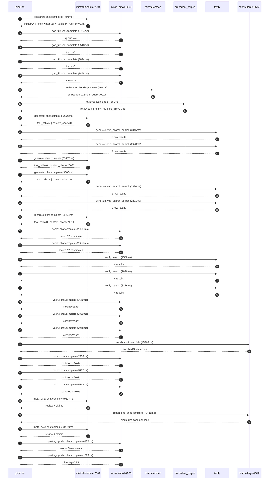

# Pipeline blueprint (architecture)

Static view of the pipeline regardless of run timing — shows agents,
models, and gates. The chronological execution log follows below.

```mermaid
flowchart TD
    Start([User: company name]) --> R
    R["<b>1. Research</b><br/>parallel: Wikipedia · Tavily news ·<br/>existing initiatives · live verification<br/><i>mistral-medium</i> synthesis"]
    R --> G["<b>1b. Gap-fill</b><br/>identify missing fields →<br/><i>mistral-small</i> generates queries →<br/>Tavily search per field →<br/><i>mistral-small</i> per-field extraction"]
    G --> Conf{Confidence ≥ 0.5<br/>OR verified<br/>OR ≥ 1 existing initiative?}
    Conf -->|no| Refuse([Refusal])
    Conf -->|yes| Ret
    Ret["<b>2. Retrieve</b><br/><i>mistral-embed</i> on company query →<br/>cosine top-K + industry/depth filter +<br/>MMR diversification"]
    Ret --> Gen["<b>3. Generate 12 candidates</b><br/><i>mistral-medium</i> with web_search tool<br/>(Tavily + deep-read) — fact citations<br/>flow into the EvidenceLedger"]
    Gen --> Score["<b>4. Score</b><br/>self-consistency: 2 parallel passes<br/><i>mistral-small</i> @ T=0.2 and T=0.4 →<br/>aggregate weighted scores"]
    Score --> Verify["<b>5. Per-candidate verify</b><br/>top-3: Tavily search + deep-read +<br/><i>mistral-small</i> verdict (pass /<br/>partial / confirmed_existing)"]
    Verify --> Enrich["<b>6. Enrich</b><br/><i>mistral-large</i> drafts customer-facing<br/>prose for 3 use cases (or<br/><i>mistral-medium</i> on fast tier)"]
    Enrich --> NumScrub["<b>6a. Numeric scrub</b><br/>flag any number not in cited content"]
    NumScrub --> Polish["<b>6b. Polish</b><br/><i>mistral-small</i> per use case (parallel):<br/>convert markers→qualitative,<br/>(ev-XXX)→[title](url)"]
    Polish --> Attr["<b>6c. Attribution check</b><br/><i>mistral-small</i> per use case (parallel):<br/>fix corpus-ID ↔ company mismatches"]
    Attr --> Meta["<b>7. Meta-evaluation</b><br/><i>mistral-medium</i> reviews report against<br/>cited precedents + ledger entries:<br/>strict claim verification"]
    Meta --> RegenQ{confidence < 0.6<br/>AND not fast tier?}
    RegenQ -->|yes| Regen["<b>7b. Targeted regen</b><br/><i>mistral-large</i> re-enriches just the<br/>weakest use case with the next-best<br/>near-miss; re-runs meta-eval"]
    RegenQ -->|no| QS
    Regen --> QS
    QS["<b>Quality signals</b><br/>LLM-graded diversity + specificity,<br/>fact-check pass rate, TTV/cost spread"]
    QS --> Render([Markdown report + trace])

    classDef agent fill:#fef3c7,stroke:#f59e0b
    classDef gate fill:#dbeafe,stroke:#3b82f6
    classDef io fill:#dcfce7,stroke:#16a34a
    class R,G,Ret,Gen,Score,Verify,Enrich,NumScrub,Polish,Attr,Meta,Regen,QS agent
    class Conf,RegenQ gate
    class Start,Refuse,Render io
```

## Execution trace — Veolia

Started: `2026-05-08T18:24:05.105800+00:00`. Total wall time: `325.0s` across `32` recorded actions.

### Per-step time totals

| Step | Calls | Total time | Avg time |
|---|---:|---:|---:|
| `research` | 1 | 7.70s | 7703ms |
| `gap_fill` | 4 | 29.62s | 7406ms |
| `retrieve` | 2 | 1.23s | 614ms |
| `generate` | 4 | 74.00s | 18501ms |
| `generate.web_search` | 4 | 11.44s | 2861ms |
| `score` | 2 | 45.94s | 22971ms |
| `verify` | 6 | 21.79s | 3631ms |
| `enrich` | 1 | 73.68s | 73676ms |
| `polish` | 3 | 13.93s | 4642ms |
| `meta_eval` | 2 | 18.84s | 9418ms |
| `regen_one` | 1 | 40.42s | 40419ms |
| `quality_signals` | 2 | 6.15s | 3075ms |

### Chronological event log

- `18:24:08.179` **[research]** `mistral-medium-2604.chat.complete` — 7703ms
   - inputs: synthesize CompanyContext for Veolia | depth=medium
   - outputs: industry='French water utility' verified=True conf=0.75
- `18:24:17.311` **[gap_fill]** `mistral-small-2603.chat.complete` — 9754ms
   - inputs: generate gap queries | fields=['business_model', 'products', 'data_assets', 'priorities']
   - outputs: queries=4
- `18:24:34.129` **[gap_fill]** `mistral-small-2603.chat.complete` — 3518ms
   - inputs: layer-2 extract field=products
   - outputs: items=0
- `18:24:34.107` **[gap_fill]** `mistral-small-2603.chat.complete` — 7894ms
   - inputs: layer-2 extract field=data_assets
   - outputs: items=6
- `18:24:34.080` **[gap_fill]** `mistral-small-2603.chat.complete` — 8458ms
   - inputs: layer-2 extract field=priorities
   - outputs: items=14
- `18:24:42.575` **[retrieve]** `mistral-embed.embeddings.create` — 867ms
   - inputs: company_query | industries='French water utility'
   - outputs: embedded 1024-dim query vector
- `18:24:43.442` **[retrieve]** `precedent_corpus.cosine_topk` — 360ms
   - inputs: k=8 min_depth=0.4 target='Veolia'
   - outputs: retrieved 8 | mmr=True | top_sim=0.783
- `18:24:45.149` **[generate]** `mistral-medium-2604.chat.complete` — 2328ms
   - inputs: iteration=0 tool_calls_used=0/2 tools=on
   - outputs: tool_calls=4 | content_chars=0
- `18:24:47.492` **[generate.web_search]** `tavily.search` — 3945ms
   - inputs: query='Veolia Hubgrade smart water meter global deployment scale 2025'
   - outputs: 2 raw results
- `18:24:53.652` **[generate.web_search]** `tavily.search` — 2428ms
   - inputs: query='Veolia GreenUp 2024-2027 decarbonization Scope 4 targets'
   - outputs: 2 raw results
- `18:24:57.655` **[generate]** `mistral-medium-2604.chat.complete` — 33467ms
   - inputs: iteration=1 tool_calls_used=2/2 tools=off
   - outputs: tool_calls=0 | content_chars=23699
- `18:25:31.985` **[generate]** `mistral-medium-2604.chat.complete` — 3006ms
   - inputs: iteration=0 tool_calls_used=0/2 tools=on
   - outputs: tool_calls=4 | content_chars=0
- `18:25:35.005` **[generate.web_search]** `tavily.search` — 2870ms
   - inputs: query='Veolia smart water meter deployment scale 2025'
   - outputs: 2 raw results
- `18:25:39.431` **[generate.web_search]** `tavily.search` — 2201ms
   - inputs: query='Veolia Hubgrade AI features and capabilities 2025'
   - outputs: 2 raw results
- `18:25:53.649` **[generate]** `mistral-medium-2604.chat.complete` — 35204ms
   - inputs: iteration=1 tool_calls_used=2/2 tools=off
   - outputs: tool_calls=0 | content_chars=24750
- `18:26:30.461` **[score]** `mistral-small-2603.chat.complete` — 22683ms
   - inputs: self-consistency pass T=0.4
   - outputs: scored 12 candidates
- `18:26:30.457` **[score]** `mistral-small-2603.chat.complete` — 23259ms
   - inputs: self-consistency pass T=0.2
   - outputs: scored 12 candidates
- `18:26:53.771` **[verify]** `tavily.search` — 2560ms
   - inputs: candidate=veolia-energy-demand-forecasting | query='Veolia Multimodal Energy Demand Forecasting for Local Decarb'
   - outputs: 4 results
- `18:26:53.771` **[verify]** `tavily.search` — 2890ms
   - inputs: candidate=veolia-agentic-water-quality-compliance | query='Veolia Agentic Water Quality Compliance Advisor for Municipa'
   - outputs: 4 results
- `18:26:53.771` **[verify]** `tavily.search` — 3276ms
   - inputs: candidate=veolia-ESG-reporting-automation | query='Veolia Automated ESG Reporting with Audit-Ready Evidence Tra'
   - outputs: 4 results
- `18:26:56.850` **[verify]** `mistral-small-2603.chat.complete` — 2649ms
   - inputs: verdict for veolia-energy-demand-forecasting
   - outputs: verdict='pass'
- `18:26:57.563` **[verify]** `mistral-small-2603.chat.complete` — 3363ms
   - inputs: verdict for veolia-ESG-reporting-automation
   - outputs: verdict='pass'
- `18:26:57.766` **[verify]** `mistral-small-2603.chat.complete` — 7048ms
   - inputs: verdict for veolia-agentic-water-quality-compliance
   - outputs: verdict='pass'
- `18:27:04.850` **[enrich]** `mistral-large-2512.chat.complete` — 73676ms
   - inputs: tier=standard top_3=['veolia-agentic-water-quality-compliance', 'veolia-energy-demand-forecasting', 'veolia-ESG-reporting-automation']
   - outputs: enriched 3 use cases
- `18:28:18.530` **[polish]** `mistral-small-2603.chat.complete` — 2906ms
   - inputs: use_case=veolia-agentic-water-quality-compliance unanchored=True opaque_ev=False
   - outputs: polished 4 fields
- `18:28:18.538` **[polish]** `mistral-small-2603.chat.complete` — 5477ms
   - inputs: use_case=veolia-ESG-reporting-automation unanchored=True opaque_ev=False
   - outputs: polished 4 fields
- `18:28:18.535` **[polish]** `mistral-small-2603.chat.complete` — 5542ms
   - inputs: use_case=veolia-energy-demand-forecasting unanchored=True opaque_ev=False
   - outputs: polished 4 fields
- `18:28:24.112` **[meta_eval]** `mistral-medium-2604.chat.complete` — 9517ms
   - inputs: reviewing 3 use cases
   - outputs: review + claims
- `18:28:33.662` **[regen_one]** `mistral-large-2512.chat.complete` — 40419ms
   - inputs: replace weakest=veolia-energy-demand-forecasting with veolia-biodiversity-impact-modeling
   - outputs: single use case enriched
- `18:29:14.111` **[meta_eval]** `mistral-medium-2604.chat.complete` — 9319ms
   - inputs: reviewing 3 use cases
   - outputs: review + claims
- `18:29:23.996` **[quality_signals]** `mistral-small-2603.chat.complete` — 4265ms
   - inputs: specificity grade (3 use cases)
   - outputs: scored 3 use cases
- `18:29:28.261` **[quality_signals]** `mistral-small-2603.chat.complete` — 1885ms
   - inputs: diversity grade
   - outputs: diversity=0.95

## Mermaid sequence diagram (execution)

