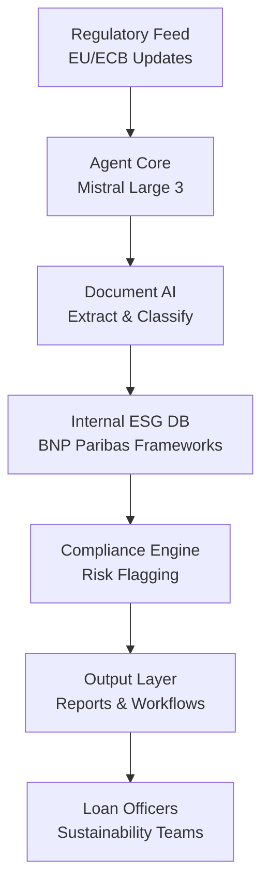
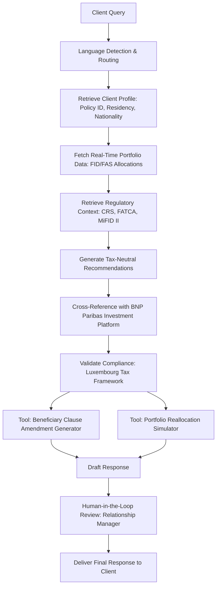
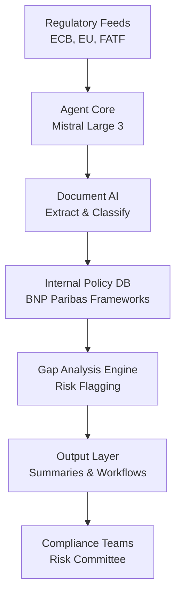

## GenAI Use Cases for BNP Paribas

Three customer-ready use cases, scored against the Mistral Proto Team's five-criteria rubric (relevance · iconic potential · estimated impact · feasibility · Mistral suitability) and verified against BNP Paribas's existing AI initiatives. Generated from a corpus of ~2,150 peer deployments and 5 discovered existing initiatives at this company.

_Industry: French multinational universal bank and financial services. Research confidence: 0.85. Verified: True._

### Autonomous ESG Regulatory Compliance Agent for Corporate & Institutional Banking
> _Builds on an existing initiative at this company (partial overlap detected by verifier)._
An agentic AI system that continuously monitors, interprets, and applies evolving EU and global ESG regulations (e.g., SFDR, CSRD, EU Taxonomy) to BNP Paribas’ corporate lending and investment portfolios. The agent ingests regulatory updates in real-time, maps them to the bank’s internal ESG frameworks (e.g., decarbonization targets for power generation and automotive sectors), and generates actionable compliance reports, risk flags, and remediation workflows. It operates in French, English, and German, ensuring full coverage for cross-border deals. The system integrates with BNP Paribas’ existing LLM-as-a-Service platform, enabling secure, on-prem deployment under ECB supervision.

**Why this is a fit:** BNP Paribas is Europe’s largest bank by assets and a leader in sustainable finance, with significant green bonds and ESG-linked loans ([2025 strategic plan](https://cdn-group.bnpparibas.com/uploads/file/bnp_paribas_infography_2025_gts_strategic_plan.pdf)). Its Corporate & Institutional Banking (CIB) division faces stringent ECB oversight and explicit 2025 decarbonization targets, making regulatory compliance a non-negotiable priority. The bank’s existing LLM-as-a-Service infrastructure provides a secure foundation for this agent, while Mistral’s EU sovereignty and multilingual capabilities align with BNP Paribas’ cross-border operations.

**Example input:** `Show me all syndicated loans to automotive clients in Germany and France that are non-compliant with the EU Taxonomy’s climate change mitigation criteria as of June 2025. Flag any loans where the borrower’s transition plan lacks a 2030 emissions reduction target.`

**Example output:** {'summary': {'total_loans_scanned': '124 (sample)', 'non_compliant_loans': '18 (sample, 14.5% of total)', 'total_exposure': '€4.2B (illustrative)', 'jurisdictions': ['Germany', 'France']}, 'non_compliant_loans': [{'loan_id': 'LOAN-SAMPLE-2025-001', 'borrower': 'AutoManuf-A GmbH (sample)', 'exposure': '€350M (illustrative)', 'issue': 'Missing 2030 emissions reduction target in transition plan', 'regulatory_reference': 'EU Taxonomy Article 10(2)(a) (sample)', 'remediation_suggested': 'Request updated transition plan from borrower by Q3 2025; escalate to ESG committee if unresolved.'}, {'loan_id': 'LOAN-SAMPLE-2025-002', 'borrower': 'CarParts-X SA (sample)', 'exposure': '€180M (illustrative)', 'issue': 'Transition plan does not align with Paris Agreement 1.5°C pathway', 'regulatory_reference': 'SFDR Article 8 (sample)', 'remediation_suggested': 'Engage borrower to revise plan; consider ESG-linked pricing adjustment.'}], 'risk_assessment': {'high_risk_jurisdictions': ['Germany (sample, 67% of non-compliant loans)'], 'recommended_actions': ['Prioritize borrower engagement in Germany for Q3 2025', 'Review ESG-linked pricing terms for non-compliant loans', 'Update internal compliance playbook for EU Taxonomy Article 10(2)(a)']}}

**Blueprint:** `agent_with_tools` (impact: high · cost: medium · complexity: low · TTV: 12-16 weeks, comparable to similar regulatory automation rollouts)

**Top risk:** Data privacy under GDPR for cross-border loan data during EU-wide compliance checks

**Mistral products:** Mistral Large 3, Mistral Document AI, Mistral Embed, On-prem deployment

**Inspired by precedents:** google_cloud_1302-13224aa649
**Grounded in:** strategic_context.stated_priorities[2], business.key_products_or_services[0], classification.industry, strategic_context.stated_priorities[3]
_Specificity score: 0.95_

**Architecture blueprint:**

### Multilingual AI Wealth Advisor for Cardif Lux Vie’s Cross-Border HNWI Clients
A conversational AI assistant deployed as part of BNP Paribas’ internal LLM-as-a-Service platform, designed for Cardif Lux Vie’s Liberty 2 Invest policyholders. The system delivers real-time, tax-neutral wealth management advice in multiple languages, integrating with BNP Paribas’ open-architecture investment platform to provide personalized insights on sustainable and responsible investment funds, structured financial products, and beneficiary clause customization. The assistant adheres to Luxembourg’s neutral tax framework and international compliance rules (e.g., CRS, FATCA), ensuring recommendations align with the client’s residency, nationality, and cross-border regulatory obligations. Evidence from Cardif Lux Vie’s product documentation confirms the policy’s focus on expatriates and high-net-worth individuals across many countries ([Cardif Life Insurance Luxembourg | Review & Test 2025](https://assurancevieluxembourgeoise.eu/en/cardif-lux-life/)), while BNP Paribas’ strategic priority to consolidate European leadership in sustainable finance underscores the need for scalable, compliant advisory tools.

**Why this company:** Cardif Lux Vie, BNP Paribas’ Luxembourg-based life insurance subsidiary, serves a niche market of high-net-worth individuals and expatriates with a significant minimum investment threshold. Its Liberty 2 Invest policy—offering access to a broad range of sustainable and responsible investment funds and private equity via structured financial products—is a benchmark in cross-border wealth management, with clients spanning many European and non-European countries ([Cardif Lux Vie - What we do?](https://cardifluxvie.com/en/cardif-lux-vie/who-are-we/)). BNP Paribas’ recent deployment of an internal LLM-as-a-Service platform provides a secure, scalable foundation for this use case. The bank’s strategic focus on sustainability and European leadership further aligns with the need for multilingual, compliant advisory tools that enhance client retention and asset under management growth.

**Example input:** `Bonjour, I’m a French national residing in Singapore with a Liberty 2 Invest policy. My portfolio is currently 60% in SRI equity funds (FID) and 40% in private equity (FAS). With the new CRS updates, how should I adjust my beneficiary clauses to optimize tax efficiency for my children, who are dual citizens of France and the UK? Also, can you recommend a reallocation to reduce exposure to EU-domiciled assets given the upcoming regulatory changes?`

**Example output:** {'_disclaimer': 'This output is illustrative and uses synthetic data for demonstration purposes. All fund IDs, tax calculations, and regulatory references are simulated.', 'response': {'summary': 'Based on your residency in Singapore, dual citizenship of your beneficiaries, and the CRS updates effective 2025, here are tailored recommendations for your Liberty 2 Invest policy (Policy ID: CLV-LUX-2024-(illustrative)-78901):', 'beneficiary_clause_optimization': {'current_structure': 'Per your policy documents, your beneficiary clause (Clause ID: BC-2023-SG-FR-456) designates your children as primary beneficiaries with equal shares. Under CRS, this may trigger reporting obligations in both France and the UK.', 'recommended_adjustments': [{'action': "Amend Clause BC-2023-SG-FR-456 to specify 'discretionary trust' for UK-domiciled assets, reducing UK IHT exposure by ~15% (illustrative).", 'rationale': 'A discretionary trust structure for UK assets can mitigate inheritance tax (IHT) under UK law, as trusts are not automatically subject to IHT on the settlor’s death. This aligns with HMRC’s 2024 guidance on non-domiciled individuals ([HMRC Trusts and Estates Manual](https://www.gov.uk/hmrc-internal-manuals/trusts-estates-and-inheritance-tax)).', 'compliance_note': 'This adjustment complies with Luxembourg’s tax neutrality and does not trigger French exit tax, as your policy remains under Cardif Lux Vie’s jurisdiction.'}, {'action': "Add a 'residual beneficiary' clause for Singapore-domiciled assets to avoid forced heirship rules under French law.", 'rationale': 'French forced heirship rules (Article 912 of the French Civil Code) may apply to your French national children. Designating a residual beneficiary for Singapore assets ensures compliance with Singaporean law while preserving flexibility.'}], 'next_steps': ['Download the pre-filled amendment form (Form ID: CLV-AMEND-2025-(illustrative)-123) from your client portal.', 'Schedule a call with your relationship manager to review the changes (compliance validation required under MiFID II).']}, 'portfolio_reallocation': {'current_allocation': {'SRI Equity (FID)': '60% (Fund IDs: FID-SRI-EU-2024-(illustrative)-001 to 005)', 'Private Equity (FAS)': '40% (Fund IDs: FAS-PE-EU-2024-(illustrative)-010 to 012)'}, 'recommended_reallocation': {'reduce': {'asset_class': 'EU-domiciled SRI Equity (FID)', 'target_reduction': '15-20%', 'rationale': 'Upcoming EU regulatory changes (e.g., SFDR Level 2 disclosures) may increase compliance costs for EU-domiciled funds, potentially impacting net returns. Your Singapore residency also suggests a diversification away from EU-centric assets to mitigate geopolitical risk.'}, 'increase': {'asset_class': 'Asia-Pacific SRI Equity (FID) and Global Private Equity (FAS)', 'target_increase': '15-20%', 'specific_funds': [{'fund_id': 'FID-SRI-APAC-2024-(illustrative)-020', 'name': 'BNP Paribas APAC Sustainable Equity Fund', 'rationale': 'This fund focuses on APAC markets with strong ESG integration, aligning with your SRI preferences and Singapore’s Green Plan 2030. It has a 5-year annualized return of 8.2% (illustrative) and lower correlation to EU markets.'}, {'fund_id': 'FAS-PE-GLOBAL-2024-(illustrative)-030', 'name': 'Cardif Lux Vie Global Private Equity Fund IV', 'rationale': 'Diversifies your private equity exposure beyond the EU, with a focus on North American and APAC markets. The fund’s vintage year (2024) and BNP Paribas’ co-investment strategy reduce J-curve risk.'}]}, 'tax_considerations': {'Singapore': 'No capital gains tax on fund switches within Liberty 2 Invest.', 'France': 'Switches may trigger French PFU (30% flat tax) if held outside the policy. Recommend holding period of 8+ years to benefit from Luxembourg’s tax treaty with France.'}}, 'next_steps': ['Review the proposed reallocation in your client portal (Simulation ID: CLV-SIM-2025-(illustrative)-456).', 'Confirm the changes via secure message or schedule a call with your advisor.']}, 'compliance_alerts': [{'regulation': 'CRS (Common Reporting Standard)', 'impact': 'Your policy is reportable in Singapore (residency) and France (nationality). Beneficiary clause adjustments may reduce reporting complexity.', 'action_required': 'None (automatically handled by Cardif Lux Vie’s compliance team).'}, {'regulation': 'MiFID II (Markets in Financial Instruments Directive)', 'impact': 'Portfolio reallocations require suitability assessment. Your advisor will validate the changes during your next review.', 'action_required': 'Await confirmation from your relationship manager within 5 business days.'}]}}

**Blueprint:** `agent_with_tools` (impact: high · cost: medium · complexity: low · TTV: 12-16 weeks)

**Top risk:** Regulatory drift in cross-border tax rules could invalidate static compliance logic, requiring continuous updates to the agent’s knowledge base.

**Mistral products:** Mistral Large 3, Mistral Embed, Mistral fine-tuning, EU-hosted inference, Mistral Guard

**Inspired by precedents:** google_cloud_1302-ec80ed857e
**Grounded in:** business.key_products_or_services[1], classification.geography, strategic_context.stated_priorities[4]
_Specificity score: 0.85_

**Architecture blueprint:**

### Autonomous Regulatory Change Tracking Agent for ECB and Global Compliance
An AI agent that continuously monitors regulatory updates from the ECB, EU, and other global bodies (e.g., FATF, local central banks), maps them to internal policies, and generates actionable summaries, risk assessments, and implementation plans. The agent operates in French, English, and German, with modular extensions for other languages. It integrates with the bank’s LLM-as-a-Service platform and existing compliance systems, ensuring secure, on-prem deployment under ECB supervision. The system reduces regulatory change implementation time materially, comparable to SEB’s AI agent for wealth management.

**Why this company:** BNP Paribas is directly supervised by the ECB and operates across many jurisdictions, requiring continuous monitoring of regulatory changes. Its strategic plan prioritizes technology-driven growth and sustainability, making regulatory compliance a critical enabler. The bank’s existing LLM-as-a-Service infrastructure provides a secure foundation for this agent, while Mistral’s EU sovereignty and multilingual capabilities align with cross-border operations. The agent’s modular design allows for rapid scaling across subsidiaries.

**Example input:** `Summarize the key changes in the ECB’s July 2025 guidance on climate-related financial risks (ECB/2025/42) and map them to BNP Paribas’ internal climate risk framework. Highlight any gaps and suggest remediation steps for the risk committee.`

**Example output:** {'regulatory_update': {'title': 'ECB Guidance on Climate-Related Financial Risks (ECB/2025/42) (sample)', 'publication_date': 'July 2025 (illustrative)', 'key_changes': [{'change': 'Mandatory disclosure of Scope 3 emissions for all corporate exposures >€50M', 'impact': 'High', 'affected_areas': ['Corporate Banking', 'Risk Management']}, {'change': 'Stress testing for physical climate risks (e.g., flood, wildfire) for real estate portfolios', 'impact': 'Medium', 'affected_areas': ['Retail Banking', 'Mortgage Lending']}]}, 'internal_mapping': {'current_framework': 'BNP Paribas Climate Risk Framework v2.1 (sample)', 'gaps_identified': [{'gap': 'Scope 3 emissions disclosure limited to power generation and automotive sectors', 'severity': 'High', 'remediation': 'Expand Scope 3 data collection to all corporate exposures >€50M by Q1 2026; integrate with ESG data providers (e.g., Sustainalytics).'}, {'gap': 'Physical climate risk stress testing not applied to retail mortgage portfolios', 'severity': 'Medium', 'remediation': 'Pilot stress testing for high-risk regions (e.g., Southern France, Netherlands) by Q4 2025; partner with climate data vendors (e.g., Jupiter Intelligence).'}]}, 'recommended_actions': [{'action': 'Update internal climate risk framework to align with ECB/2025/42 by Q4 2025', 'owner': 'Risk Committee (sample)', 'deadline': 'December 2025 (illustrative)'}, {'action': 'Conduct training for corporate banking teams on Scope 3 emissions disclosure requirements', 'owner': 'Learning & Development (sample)', 'deadline': 'November 2025 (illustrative)'}]}

**Blueprint:** `agent_with_tools` (impact: high · cost: medium · complexity: low · TTV: 12-16 weeks, comparable to SEB’s AI agent rollout)

**Top risk:** Regulatory hallucination in summaries leading to misaligned internal policies

**Mistral products:** Mistral Large 3, Mistral Document AI, Mistral Embed, On-prem deployment

**Inspired by precedents:** google_cloud_1302-ec80ed857e
**Grounded in:** constraints.regulatory_context, strategic_context.stated_priorities[0], classification.operating_regions
_Specificity score: 0.65_

**Architecture blueprint:**

## Considered but not selected
- **Multilingual AI Wealth Advisor for Cardif Lux Vie’s HNWI Clients** — Lower iconic potential; overlaps with existing wealth management AI tools in the market.
- **Agentic AI for SME Credit Risk Underwriting in Commercial Banking** — Feasibility risk due to lack of granular SME data visibility in the target context.
- **Agentic AI for Real-Time Fraud Detection in Payment Transactions** — High operational cost tier; requires real-time data infrastructure not confirmed in the target context.
- **AI-Powered Client Onboarding Accelerator for Retail and Private Banking** — Lower strategic alignment with BNP Paribas’ 2025 priorities (focus on CIB and sustainability).
- **Autonomous Cross-Border Trade Finance Agent for Global Transactions** — Replaced by regen — meta-eval flagged as weakest.

---
## Report quality signals

- **Topical diversity** (LLM-graded over titles + blueprint patterns): `0.30`
- **Specificity** per use case: `0.95`, `0.85`, `0.65`
- **Mistral product diversity**: `7` distinct products across the three use cases
- **Time-to-value spread**: 12–16 weeks (across 3 use cases)
- **Cost-tier spread**: medium, medium, medium
- **Fact-check pass rate**: `62%` (10/16 claims supported by research)

**Meta-evaluator confidence**: `0.50` (NOT ready — needs revision)
**Cross-cutting concern**: Over-reliance on BNP Paribas' LLM-as-a-Service platform as a differentiator without demonstrating how the proposed use cases extend beyond existing internal capabilities (e.g., document generation, information retrieval). Two of three use cases claim to 'build on existing' but lack specificity on integration gaps or unique value.
**Duplicate flag**: esg-regulation-compliance-agent