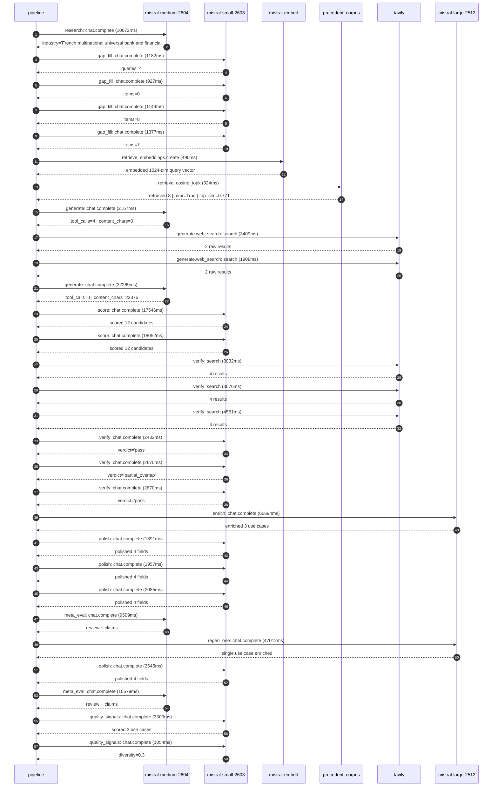

# Pipeline blueprint (architecture)

Static view of the pipeline regardless of run timing — shows agents,
models, and gates. The chronological execution log follows below.

```mermaid
flowchart TD
    Start([User: company name]) --> R
    R["<b>1. Research</b><br/>parallel: Wikipedia · Tavily news ·<br/>existing initiatives · live verification<br/><i>mistral-medium</i> synthesis"]
    R --> G["<b>1b. Gap-fill</b><br/>identify missing fields →<br/><i>mistral-small</i> generates queries →<br/>Tavily search per field →<br/><i>mistral-small</i> per-field extraction"]
    G --> Conf{Confidence ≥ 0.5<br/>OR verified<br/>OR ≥ 1 existing initiative?}
    Conf -->|no| Refuse([Refusal])
    Conf -->|yes| Ret
    Ret["<b>2. Retrieve</b><br/><i>mistral-embed</i> on company query →<br/>cosine top-K + industry/depth filter +<br/>MMR diversification"]
    Ret --> Gen["<b>3. Generate 12 candidates</b><br/><i>mistral-medium</i> with web_search tool<br/>(Tavily + deep-read) — fact citations<br/>flow into the EvidenceLedger"]
    Gen --> Score["<b>4. Score</b><br/>self-consistency: 2 parallel passes<br/><i>mistral-small</i> @ T=0.2 and T=0.4 →<br/>aggregate weighted scores"]
    Score --> Verify["<b>5. Per-candidate verify</b><br/>top-3: Tavily search + deep-read +<br/><i>mistral-small</i> verdict (pass /<br/>partial / confirmed_existing)"]
    Verify --> Enrich["<b>6. Enrich</b><br/><i>mistral-large</i> drafts customer-facing<br/>prose for 3 use cases (or<br/><i>mistral-medium</i> on fast tier)"]
    Enrich --> NumScrub["<b>6a. Numeric scrub</b><br/>flag any number not in cited content"]
    NumScrub --> Polish["<b>6b. Polish</b><br/><i>mistral-small</i> per use case (parallel):<br/>convert markers→qualitative,<br/>(ev-XXX)→[title](url)"]
    Polish --> Attr["<b>6c. Attribution check</b><br/><i>mistral-small</i> per use case (parallel):<br/>fix corpus-ID ↔ company mismatches"]
    Attr --> Meta["<b>7. Meta-evaluation</b><br/><i>mistral-medium</i> reviews report against<br/>cited precedents + ledger entries:<br/>strict claim verification"]
    Meta --> RegenQ{confidence < 0.6<br/>AND not fast tier?}
    RegenQ -->|yes| Regen["<b>7b. Targeted regen</b><br/><i>mistral-large</i> re-enriches just the<br/>weakest use case with the next-best<br/>near-miss; re-runs meta-eval"]
    RegenQ -->|no| QS
    Regen --> QS
    QS["<b>Quality signals</b><br/>LLM-graded diversity + specificity,<br/>fact-check pass rate, TTV/cost spread"]
    QS --> Render([Markdown report + trace])

    classDef agent fill:#fef3c7,stroke:#f59e0b
    classDef gate fill:#dbeafe,stroke:#3b82f6
    classDef io fill:#dcfce7,stroke:#16a34a
    class R,G,Ret,Gen,Score,Verify,Enrich,NumScrub,Polish,Attr,Meta,Regen,QS agent
    class Conf,RegenQ gate
    class Start,Refuse,Render io
```

## Execution trace — BNP Paribas

Started: `2026-05-08T23:09:45.376780+00:00`. Total wall time: `240.7s` across `29` recorded actions.

### Per-step time totals

| Step | Calls | Total time | Avg time |
|---|---:|---:|---:|
| `research` | 1 | 10.67s | 10672ms |
| `gap_fill` | 4 | 4.64s | 1159ms |
| `retrieve` | 2 | 0.81s | 407ms |
| `generate` | 2 | 34.44s | 17218ms |
| `generate.web_search` | 2 | 5.32s | 2659ms |
| `score` | 2 | 35.60s | 17799ms |
| `verify` | 6 | 18.65s | 3108ms |
| `enrich` | 1 | 65.69s | 65694ms |
| `polish` | 4 | 8.58s | 2144ms |
| `meta_eval` | 2 | 20.09s | 10044ms |
| `regen_one` | 1 | 47.01s | 47012ms |
| `quality_signals` | 2 | 4.36s | 2179ms |

### Chronological event log

- `23:09:48.451` **[research]** `mistral-medium-2604.chat.complete` — 10672ms
   - inputs: synthesize CompanyContext for BNP Paribas | depth=medium
   - outputs: industry='French multinational universal bank and financial services' verified=True conf=0.75
- `23:10:01.302` **[gap_fill]** `mistral-small-2603.chat.complete` — 1182ms
   - inputs: generate gap queries | fields=['business_model', 'products', 'data_assets', 'priorities']
   - outputs: queries=4
- `23:10:09.758` **[gap_fill]** `mistral-small-2603.chat.complete` — 927ms
   - inputs: layer-2 extract field=data_assets
   - outputs: items=0
- `23:10:09.780` **[gap_fill]** `mistral-small-2603.chat.complete` — 1149ms
   - inputs: layer-2 extract field=products
   - outputs: items=8
- `23:10:09.728` **[gap_fill]** `mistral-small-2603.chat.complete` — 1377ms
   - inputs: layer-2 extract field=priorities
   - outputs: items=7
- `23:10:11.139` **[retrieve]** `mistral-embed.embeddings.create` — 490ms
   - inputs: company_query | industries='French multinational universal bank and financial services'
   - outputs: embedded 1024-dim query vector
- `23:10:11.629` **[retrieve]** `precedent_corpus.cosine_topk` — 324ms
   - inputs: k=8 min_depth=0.4 target='BNP Paribas'
   - outputs: retrieved 8 | mmr=True | top_sim=0.771
- `23:10:13.595` **[generate]** `mistral-medium-2604.chat.complete` — 2167ms
   - inputs: iteration=0 tool_calls_used=0/2 tools=on
   - outputs: tool_calls=4 | content_chars=0
- `23:10:15.783` **[generate.web_search]** `tavily.search` — 3409ms
   - inputs: query='BNP Paribas 2025 Strategic Plan sustainability and technology priorities'
   - outputs: 2 raw results
- `23:10:19.226` **[generate.web_search]** `tavily.search` — 1908ms
   - inputs: query='BNP Paribas Arval Cardif Lux Vie key products and services'
   - outputs: 2 raw results
- `23:10:23.416` **[generate]** `mistral-medium-2604.chat.complete` — 32269ms
   - inputs: iteration=1 tool_calls_used=2/2 tools=off
   - outputs: tool_calls=0 | content_chars=22376
- `23:10:56.045` **[score]** `mistral-small-2603.chat.complete` — 17546ms
   - inputs: self-consistency pass T=0.2
   - outputs: scored 12 candidates
- `23:10:56.047` **[score]** `mistral-small-2603.chat.complete` — 18052ms
   - inputs: self-consistency pass T=0.4
   - outputs: scored 12 candidates
- `23:11:14.149` **[verify]** `tavily.search` — 3032ms
   - inputs: candidate=regulatory-change-tracking-agent | query='BNP Paribas Autonomous Regulatory Change Tracking Agent for '
   - outputs: 4 results
- `23:11:14.148` **[verify]** `tavily.search` — 3076ms
   - inputs: candidate=esg-regulation-compliance-agent | query='BNP Paribas Autonomous ESG Regulatory Compliance Agent for C'
   - outputs: 4 results
- `23:11:14.149` **[verify]** `tavily.search` — 4561ms
   - inputs: candidate=cross-border-trade-finance-agent | query='BNP Paribas Autonomous Cross-Border Trade Finance Agent for '
   - outputs: 4 results
- `23:11:19.084` **[verify]** `mistral-small-2603.chat.complete` — 2432ms
   - inputs: verdict for regulatory-change-tracking-agent
   - outputs: verdict='pass'
- `23:11:20.136` **[verify]** `mistral-small-2603.chat.complete` — 2675ms
   - inputs: verdict for esg-regulation-compliance-agent
   - outputs: verdict='partial_overlap'
- `23:11:20.445` **[verify]** `mistral-small-2603.chat.complete` — 2870ms
   - inputs: verdict for cross-border-trade-finance-agent
   - outputs: verdict='pass'
- `23:11:23.339` **[enrich]** `mistral-large-2512.chat.complete` — 65694ms
   - inputs: tier=standard top_3=['esg-regulation-compliance-agent', 'cross-border-trade-finance-agent', 'regulatory-change-tracking-agent']
   - outputs: enriched 3 use cases
- `23:12:29.045` **[polish]** `mistral-small-2603.chat.complete` — 1891ms
   - inputs: use_case=regulatory-change-tracking-agent unanchored=True opaque_ev=False
   - outputs: polished 4 fields
- `23:12:29.041` **[polish]** `mistral-small-2603.chat.complete` — 1957ms
   - inputs: use_case=cross-border-trade-finance-agent unanchored=True opaque_ev=False
   - outputs: polished 4 fields
- `23:12:29.036` **[polish]** `mistral-small-2603.chat.complete` — 2085ms
   - inputs: use_case=esg-regulation-compliance-agent unanchored=True opaque_ev=False
   - outputs: polished 4 fields
- `23:12:31.146` **[meta_eval]** `mistral-medium-2604.chat.complete` — 9509ms
   - inputs: reviewing 3 use cases
   - outputs: review + claims
- `23:12:40.688` **[regen_one]** `mistral-large-2512.chat.complete` — 47012ms
   - inputs: replace weakest=cross-border-trade-finance-agent with multilingual-wealth-advisor-agent
   - outputs: single use case enriched
- `23:13:27.703` **[polish]** `mistral-small-2603.chat.complete` — 2645ms
   - inputs: use_case=multilingual-wealth-advisor-agent unanchored=True opaque_ev=False
   - outputs: polished 4 fields
- `23:13:30.383` **[meta_eval]** `mistral-medium-2604.chat.complete` — 10579ms
   - inputs: reviewing 3 use cases
   - outputs: review + claims
- `23:13:41.713` **[quality_signals]** `mistral-small-2603.chat.complete` — 3303ms
   - inputs: specificity grade (3 use cases)
   - outputs: scored 3 use cases
- `23:13:45.016` **[quality_signals]** `mistral-small-2603.chat.complete` — 1054ms
   - inputs: diversity grade
   - outputs: diversity=0.3

## Mermaid sequence diagram (execution)

