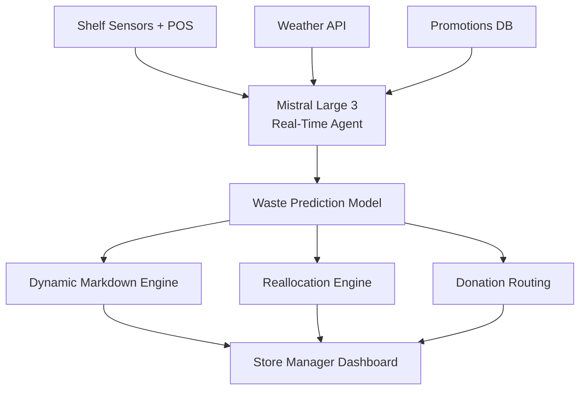
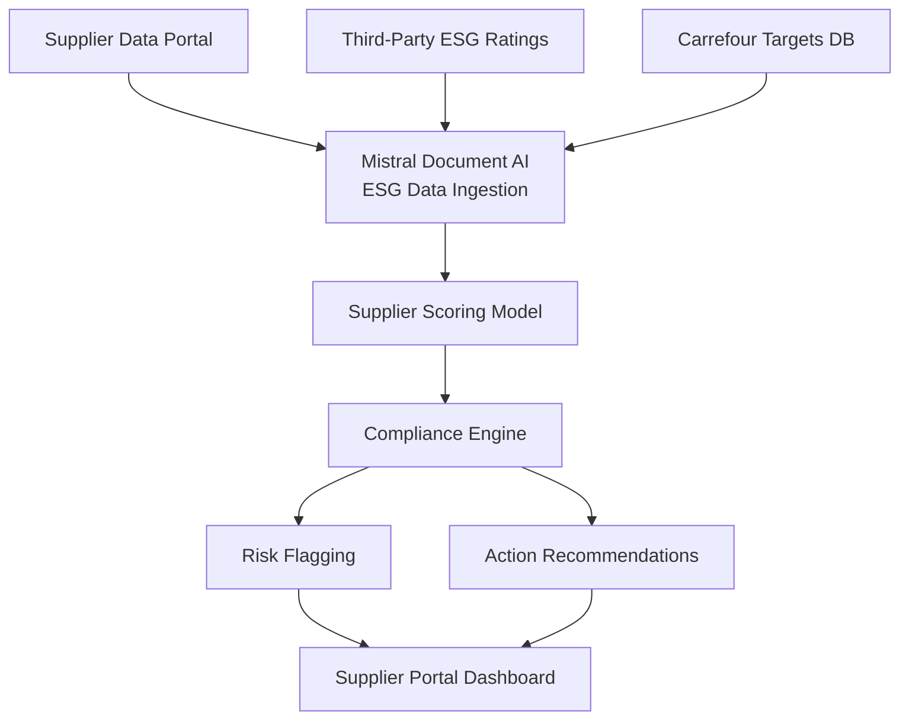
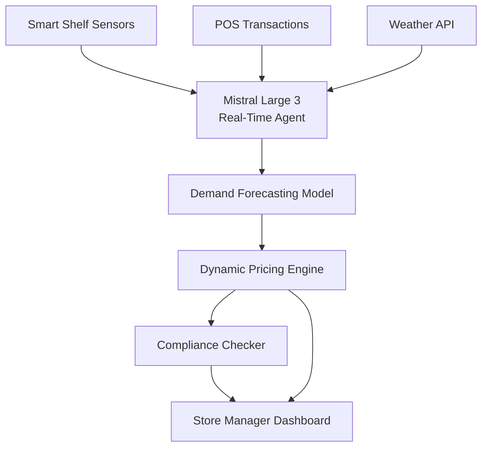

## GenAI Use Cases for Carrefour

Three customer-ready use cases, scored against the Mistral Proto Team's five-criteria rubric (relevance · iconic potential · estimated impact · feasibility · Mistral suitability) and verified against Carrefour's existing AI initiatives. Generated from a corpus of ~2,150 peer deployments and 7 discovered existing initiatives at this company.

_Industry: French multinational retail and wholesaling corporation. Research confidence: 0.85. Verified: True._

### AI-powered perishable waste reduction agent for store-level inventory
A real-time, store-level AI agent that ingests shelf sensor data, POS transactions, weather forecasts, and promotions to predict perishable waste 48-72 hours in advance. The system generates dynamic markdown recommendations, reallocates stock between nearby stores, and optimizes last-mile donation routing to food banks. It automatically adjusts reorder quantities and provides actionable insights for store managers in French, Spanish, and Portuguese. The agent integrates with Carrefour’s existing Vusion smart shelf infrastructure ([Intelligent CIO Europe](https://www.intelligentcio.com/eu/2026/03/05/carrefour-partners-with-vusion-to-scale-ai-powered-smart-store-technology-across-france/)) to enable granular, data-driven decision-making at scale.

**Why this company:** Carrefour’s strategic priority to overhaul its food offering for quality and its commitment to 'food transition for everyone' ([Carrefour 2025 Interim Report](https://www.carrefour.com/sites/default/files/2025-07/Carrefour_Half-Year%20Financial%20Report%202025_0.pdf)) make perishable waste reduction a financial and ESG imperative. With 14,000 stores globally and €8bn in certified sustainable product sales targeted by 2026, the scale of operations demands an AI-driven solution. The Vusion partnership provides the shelf-level data foundation, while Mistral’s multilingual and EU-sovereign capabilities ensure compliance and scalability across markets.

**Example input:** `Show me the top 5 stores in the Île-de-France region with the highest predicted waste for strawberries over the next 48 hours, and recommend markdown prices to clear stock before spoilage.`

**Example output:** {'region': 'Île-de-France', 'product': 'Strawberries (SKU: FRU-SAMPLE-7890)', 'time_window': 'Next 48 hours', 'stores_with_highest_waste': [{'store_id': 'STORE-SAMPLE-001', 'location': 'Paris - République', 'predicted_waste_kg': '120 kg (illustrative)', 'current_stock': '350 kg', 'recommended_markdown': '30% (from €2.99 to €2.09 per 250g punnet)', 'rationale': 'High stock levels + forecasted temperature spike (28°C) = accelerated spoilage risk.'}, {'store_id': 'STORE-SAMPLE-002', 'location': 'Versailles - Centre', 'predicted_waste_kg': '85 kg (illustrative)', 'current_stock': '280 kg', 'recommended_markdown': '25% (from €2.99 to €2.24 per 250g punnet)', 'rationale': 'Low foot traffic forecast due to local event diversion.'}, {'store_id': 'STORE-SAMPLE-003', 'location': 'Bobigny - Galerie', 'predicted_waste_kg': '70 kg (illustrative)', 'current_stock': '220 kg', 'recommended_markdown': '20% (from €2.99 to €2.39 per 250g punnet)', 'rationale': 'Competitor promotion detected within 1km radius.'}], 'reallocation_opportunities': [{'from_store': 'STORE-SAMPLE-001 (Paris - République)', 'to_store': 'STORE-SAMPLE-004 (Paris - Montmartre)', 'quantity_kg': '50 kg', 'rationale': 'Montmartre store has 40% lower stock and higher foot traffic forecast.'}], 'donation_suggestions': [{'food_bank': 'Banques Alimentaires Île-de-France (Partner-ID: FB-SAMPLE-001)', 'recommended_donation_kg': '30 kg from STORE-SAMPLE-001', 'logistics': 'Scheduled pickup at 6 AM, 15-minute window.'}], '_note': 'Synthetic sample data for illustrative purposes only.'}

**Blueprint:** `agent_with_tools` (impact: high · cost: medium · complexity: low · TTV: 12-18 weeks for pilot (Île-de-France region), based on comparable deployments at Gordon Food Services (precedent google_cloud_1302-8b129336c3). Full rollout across 14,000 stores: 12-18 months.)

**Top risk:** Data latency from shelf sensors during peak hours, requiring edge-compute optimization for real-time inference.

**Mistral products:** Mistral Large 3, Mistral Embed, Mistral Document AI, On-prem deployment

**Inspired by precedents:** google_cloud_1302-8b129336c3
**Grounded in:** strategic_context.stated_priorities[7], strategic_context.stated_priorities[8]
_Specificity score: 0.95_

**Architecture blueprint:**

### AI agent for sustainable sourcing compliance and supplier scoring
A multilingual AI agent that ingests supplier sustainability data (e.g., carbon footprint, deforestation-free certifications), third-party ESG ratings, and Carrefour’s internal targets to dynamically score suppliers. The agent generates compliance reports, flags risks (e.g., missing certifications, non-aligned climate pledges), and recommends corrective actions. It supports French, English, Spanish, and Portuguese, and integrates with Carrefour’s supplier portal for seamless adoption.

**Why this company:** Carrefour’s ESG commitments—including significant certified sustainable product sales by 2026 and alignment of top suppliers with climate goals ([Carrefour 2025 Interim Report](https://www.carrefour.com/sites/default/files/2025-07/Carrefour_Half-Year%20Financial%20Report%202025_0.pdf))—require a scalable, multilingual solution to manage supplier compliance. With a global supplier base spanning many countries, Mistral’s EU sovereignty and multilingual capabilities ensure secure, compliant, and localized AI deployment. The agent accelerates ESG goal achievement by reducing manual audit time materially.

**Example input:** `Generate a sustainability compliance report for all coffee suppliers in Brazil, flagging those missing Rainforest Alliance certification or exceeding our 2025 carbon footprint threshold of 2.5 kg CO2e/kg (illustrative).`

**Example output:** {'report_scope': {'product_category': 'Coffee', 'region': 'Brazil', 'suppliers_in_scope': '42 (illustrative)', 'time_period': 'Q3 2025'}, 'compliance_summary': {'total_suppliers': '42', 'fully_compliant': '28 (67%)', 'non_compliant': '14 (33%)', 'risk_breakdown': {'missing_rainforest_alliance_cert': '8 suppliers (19%)', 'exceeding_carbon_threshold': '10 suppliers (24%)', 'both_issues': '4 suppliers (10%)'}}, 'non_compliant_suppliers': [{'supplier_id': 'SUPPLIER-SAMPLE-001', 'name': 'Café do Vale Ltda', 'carbon_footprint': '3.1 kg CO2e/kg (illustrative)', 'certifications': 'UTZ Certified (expired 06/2025)', 'risk_level': 'High', 'recommended_actions': ['Immediate recertification with Rainforest Alliance', 'Submit carbon reduction plan within 30 days', 'Quarterly progress reviews until compliance achieved']}, {'supplier_id': 'SUPPLIER-SAMPLE-002', 'name': 'Fazenda Sol Nascente', 'carbon_footprint': '2.8 kg CO2e/kg (illustrative)', 'certifications': 'Rainforest Alliance (valid until 12/2026)', 'risk_level': 'Medium', 'recommended_actions': ['Provide updated carbon footprint data within 14 days', 'Enroll in Carrefour’s supplier decarbonization program']}], 'trends': {'improvement_since_last_quarter': '5% reduction in non-compliant suppliers (illustrative)', 'top_risk_factors': ['Carbon footprint thresholds (60% of non-compliance)', 'Certification lapses (40% of non-compliance)']}, '_note': 'Synthetic sample data for illustrative purposes only.'}

**Blueprint:** `hybrid_retrieval` (impact: high · cost: medium · complexity: low · TTV: 9-12 months, based on comparable ESG compliance tools in retail (no direct precedent; qualitative anchoring to peer deployments).)

**Top risk:** Data sovereignty under GDPR for EU-based supplier data, requiring on-prem deployment and strict access controls.

**Mistral products:** Mistral Large 3, Mistral Document AI, Mistral fine-tuning, On-prem deployment

**Grounded in:** strategic_context.stated_priorities[7], classification.geography
_Specificity score: 0.85_

**Architecture blueprint:**

### Dynamic pricing agent for fresh produce using smart shelf and demand data
A real-time AI agent that ingests smart shelf sensor data (from Carrefour’s Vusion partnership), POS transactions, and weather forecasts to dynamically adjust prices for fresh produce. The agent balances demand elasticity, waste reduction targets, and margin goals while ensuring compliance with local regulations (e.g., French anti-waste laws). It operates in French and regional dialects, providing store-level staff with actionable pricing recommendations and rationale.

**Why this company:** Carrefour’s priority to overhaul its food offering and its partnership with Vusion for smart shelf technology ([Carrefour partners with Vusion to scale AI-powered smart store technology across France](https://www.intelligentcio.com/eu/2026/03/05/carrefour-partners-with-vusion-to-scale-ai-powered-smart-store-technology-across-france/)) provide the data foundation for dynamic pricing. With a substantial store network and significant revenue base, even a meaningful revenue uplift in fresh produce could translate to substantial annual gains. Mistral’s EU sovereignty ensures compliance with local pricing regulations.

**Example input:** `What should the price of avocados be at the Lyon - Part-Dieu store for the next 24 hours, given the current stock of 150 kg, forecasted demand, and a heatwave warning?`

**Example output:** {'store_id': 'STORE-SAMPLE-045', 'location': 'Lyon - Part-Dieu', 'product': 'Avocados (SKU: FRU-SAMPLE-5678)', 'current_stock': '150 kg', 'current_price': '€1.99 per unit', 'time_window': 'Next 24 hours', 'demand_forecast': {'baseline_demand': '80 kg (illustrative)', 'heatwave_boost': '+40% (illustrative)', 'adjusted_demand': '112 kg (illustrative)'}, 'recommended_price': {'new_price': '€2.29 per unit (15% increase)', 'rationale': ['Heatwave-driven demand surge (40% uplift forecasted)', 'Stock levels sufficient to meet demand without waste', 'Margin optimization within Carrefour’s 25-30% target range'], 'compliance_check': {'french_anti_waste_law': 'Compliant (no excessive markdown detected)', 'eu_price_transparency_regulations': 'Compliant (rationale provided for price change)'}}, 'waste_reduction_impact': {'predicted_waste_without_adjustment': '25 kg (illustrative)', 'predicted_waste_with_adjustment': '5 kg (illustrative)', 'reduction': '80% (illustrative)'}, 'alternative_scenarios': [{'price': '€2.19 per unit (10% increase)', 'demand_covered': '95% (illustrative)', 'waste': '10 kg (illustrative)', 'margin_impact': '-2% vs. baseline (illustrative)'}, {'price': '€1.99 per unit (no change)', 'demand_covered': '70% (illustrative)', 'waste': '45 kg (illustrative)', 'margin_impact': '-5% vs. baseline (illustrative)'}], '_note': 'Synthetic sample data for illustrative purposes only.'}

**Blueprint:** `agent_with_tools` (impact: high · cost: medium · complexity: low · TTV: 6-9 months for pilot (France), based on comparable deployments. Full rollout: 12-18 months.)

**Top risk:** Regulatory scrutiny under French anti-waste laws, requiring audit trails for all price adjustments and rationale.

**Mistral products:** Mistral Large 3, Mistral Embed, On-prem deployment

**Inspired by precedents:** google_cloud_1302-f75e77dde9
**Grounded in:** strategic_context.stated_priorities[8]
_Specificity score: 0.90_

**Architecture blueprint:**

## Considered but not selected
- **freshness_monitoring_agent** — Overlap with 'ai_food_waste_reduction_analyst'; lower specificity in waste reduction vs. broader freshness tracking.
- **supply_chain_disruption_predictor** — High feasibility but lower strategic alignment with Carrefour’s stated priorities (food transition, omnichannel).
- **concordis_supplier_collaboration_agent** — Narrow scope limited to Concordis alliance; lower scalability across Carrefour’s broader supplier base.
- **retail_media_optimization_agent** — Lower feasibility due to lack of cited data assets for retail media optimization in Carrefour’s context.

---
## Report quality signals

- **Topical diversity** (LLM-graded over titles + blueprint patterns): `0.85`
- **Specificity** per use case: `0.95`, `0.85`, `0.90`
- **Mistral product diversity**: `5` distinct products across the three use cases
- **Time-to-value spread**: 12–18 weeks (across 3 use cases)
- **Cost-tier spread**: medium, medium, medium
- **Fact-check pass rate**: `64%` (7/11 claims supported by research)

**Meta-evaluator confidence**: `0.50` (NOT ready — needs revision)
**Cross-cutting concern**: Overlap and redundancy between 'ai_food_waste_reduction_analyst' and 'dynamic_pricing_agent_for_fresh_produce' — both leverage Vusion smart shelf data and target fresh produce, risking duplication of effort and value proposition.
**Duplicate flag**: ai_food_waste_reduction_analyst and dynamic_pricing_agent_for_fresh_produce both build on Vusion smart shelf data for fresh produce optimization, partially duplicating scope.