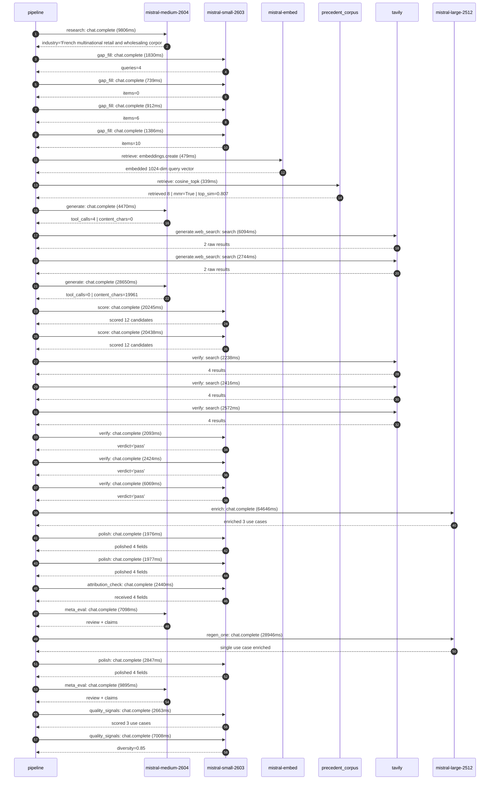

# Pipeline blueprint (architecture)

Static view of the pipeline regardless of run timing — shows agents,
models, and gates. The chronological execution log follows below.

```mermaid
flowchart TD
    Start([User: company name]) --> R
    R["<b>1. Research</b><br/>parallel: Wikipedia · Tavily news ·<br/>existing initiatives · live verification<br/><i>mistral-medium</i> synthesis"]
    R --> G["<b>1b. Gap-fill</b><br/>identify missing fields →<br/><i>mistral-small</i> generates queries →<br/>Tavily search per field →<br/><i>mistral-small</i> per-field extraction"]
    G --> Conf{Confidence ≥ 0.5<br/>OR verified<br/>OR ≥ 1 existing initiative?}
    Conf -->|no| Refuse([Refusal])
    Conf -->|yes| Ret
    Ret["<b>2. Retrieve</b><br/><i>mistral-embed</i> on company query →<br/>cosine top-K + industry/depth filter +<br/>MMR diversification"]
    Ret --> Gen["<b>3. Generate 12 candidates</b><br/><i>mistral-medium</i> with web_search tool<br/>(Tavily + deep-read) — fact citations<br/>flow into the EvidenceLedger"]
    Gen --> Score["<b>4. Score</b><br/>self-consistency: 2 parallel passes<br/><i>mistral-small</i> @ T=0.2 and T=0.4 →<br/>aggregate weighted scores"]
    Score --> Verify["<b>5. Per-candidate verify</b><br/>top-3: Tavily search + deep-read +<br/><i>mistral-small</i> verdict (pass /<br/>partial / confirmed_existing)"]
    Verify --> Enrich["<b>6. Enrich</b><br/><i>mistral-large</i> drafts customer-facing<br/>prose for 3 use cases (or<br/><i>mistral-medium</i> on fast tier)"]
    Enrich --> NumScrub["<b>6a. Numeric scrub</b><br/>flag any number not in cited content"]
    NumScrub --> Polish["<b>6b. Polish</b><br/><i>mistral-small</i> per use case (parallel):<br/>convert markers→qualitative,<br/>(ev-XXX)→[title](url)"]
    Polish --> Attr["<b>6c. Attribution check</b><br/><i>mistral-small</i> per use case (parallel):<br/>fix corpus-ID ↔ company mismatches"]
    Attr --> Meta["<b>7. Meta-evaluation</b><br/><i>mistral-medium</i> reviews report against<br/>cited precedents + ledger entries:<br/>strict claim verification"]
    Meta --> RegenQ{confidence < 0.6<br/>AND not fast tier?}
    RegenQ -->|yes| Regen["<b>7b. Targeted regen</b><br/><i>mistral-large</i> re-enriches just the<br/>weakest use case with the next-best<br/>near-miss; re-runs meta-eval"]
    RegenQ -->|no| QS
    Regen --> QS
    QS["<b>Quality signals</b><br/>LLM-graded diversity + specificity,<br/>fact-check pass rate, TTV/cost spread"]
    QS --> Render([Markdown report + trace])

    classDef agent fill:#fef3c7,stroke:#f59e0b
    classDef gate fill:#dbeafe,stroke:#3b82f6
    classDef io fill:#dcfce7,stroke:#16a34a
    class R,G,Ret,Gen,Score,Verify,Enrich,NumScrub,Polish,Attr,Meta,Regen,QS agent
    class Conf,RegenQ gate
    class Start,Refuse,Render io
```

## Execution trace — Carrefour

Started: `2026-05-08T23:02:08.617491+00:00`. Total wall time: `238.9s` across `29` recorded actions.

### Per-step time totals

| Step | Calls | Total time | Avg time |
|---|---:|---:|---:|
| `research` | 1 | 9.81s | 9806ms |
| `gap_fill` | 4 | 4.87s | 1217ms |
| `retrieve` | 2 | 0.82s | 409ms |
| `generate` | 2 | 33.12s | 16560ms |
| `generate.web_search` | 2 | 8.84s | 4419ms |
| `score` | 2 | 40.68s | 20342ms |
| `verify` | 6 | 17.81s | 2969ms |
| `enrich` | 1 | 64.65s | 64646ms |
| `polish` | 3 | 6.80s | 2267ms |
| `attribution_check` | 1 | 2.44s | 2440ms |
| `meta_eval` | 2 | 16.99s | 8496ms |
| `regen_one` | 1 | 28.95s | 28946ms |
| `quality_signals` | 2 | 9.67s | 4835ms |

### Chronological event log

- `23:02:10.355` **[research]** `mistral-medium-2604.chat.complete` — 9806ms
   - inputs: synthesize CompanyContext for Carrefour | depth=medium
   - outputs: industry='French multinational retail and wholesaling corporation' verified=True conf=0.75
- `23:02:22.952` **[gap_fill]** `mistral-small-2603.chat.complete` — 1830ms
   - inputs: generate gap queries | fields=['business_model', 'products', 'data_assets', 'priorities']
   - outputs: queries=4
- `23:02:39.449` **[gap_fill]** `mistral-small-2603.chat.complete` — 739ms
   - inputs: layer-2 extract field=data_assets
   - outputs: items=0
- `23:02:39.473` **[gap_fill]** `mistral-small-2603.chat.complete` — 912ms
   - inputs: layer-2 extract field=products
   - outputs: items=6
- `23:02:39.424` **[gap_fill]** `mistral-small-2603.chat.complete` — 1386ms
   - inputs: layer-2 extract field=priorities
   - outputs: items=10
- `23:02:40.847` **[retrieve]** `mistral-embed.embeddings.create` — 479ms
   - inputs: company_query | industries='French multinational retail and wholesaling corporation'
   - outputs: embedded 1024-dim query vector
- `23:02:41.326` **[retrieve]** `precedent_corpus.cosine_topk` — 339ms
   - inputs: k=8 min_depth=0.4 target='Carrefour'
   - outputs: retrieved 8 | mmr=True | top_sim=0.807
- `23:02:42.230` **[generate]** `mistral-medium-2604.chat.complete` — 4470ms
   - inputs: iteration=0 tool_calls_used=0/2 tools=on
   - outputs: tool_calls=4 | content_chars=0
- `23:02:46.710` **[generate.web_search]** `tavily.search` — 6094ms
   - inputs: query='Carrefour smart shelf labels sensors data partnership 2025'
   - outputs: 2 raw results
- `23:02:54.544` **[generate.web_search]** `tavily.search` — 2744ms
   - inputs: query='Carrefour 10 billion transactions data ecosystem 2025'
   - outputs: 2 raw results
- `23:02:58.234` **[generate]** `mistral-medium-2604.chat.complete` — 28650ms
   - inputs: iteration=1 tool_calls_used=2/2 tools=off
   - outputs: tool_calls=0 | content_chars=19961
- `23:03:28.602` **[score]** `mistral-small-2603.chat.complete` — 20245ms
   - inputs: self-consistency pass T=0.4
   - outputs: scored 12 candidates
- `23:03:28.599` **[score]** `mistral-small-2603.chat.complete` — 20438ms
   - inputs: self-consistency pass T=0.2
   - outputs: scored 12 candidates
- `23:03:49.104` **[verify]** `tavily.search` — 2238ms
   - inputs: candidate=ai_food_waste_reduction_analyst | query='Carrefour AI-powered perishable waste reduction agent for st'
   - outputs: 4 results
- `23:03:49.104` **[verify]** `tavily.search` — 2416ms
   - inputs: candidate=sustainable_sourcing_agent | query='Carrefour AI agent for sustainable sourcing compliance and s'
   - outputs: 4 results
- `23:03:49.104` **[verify]** `tavily.search` — 2572ms
   - inputs: candidate=dynamic_pricing_agent_for_fresh_produce | query='Carrefour Dynamic pricing agent for fresh produce using smar'
   - outputs: 4 results
- `23:03:52.922` **[verify]** `mistral-small-2603.chat.complete` — 2093ms
   - inputs: verdict for ai_food_waste_reduction_analyst
   - outputs: verdict='pass'
- `23:03:53.114` **[verify]** `mistral-small-2603.chat.complete` — 2424ms
   - inputs: verdict for sustainable_sourcing_agent
   - outputs: verdict='pass'
- `23:03:53.102` **[verify]** `mistral-small-2603.chat.complete` — 6069ms
   - inputs: verdict for dynamic_pricing_agent_for_fresh_produce
   - outputs: verdict='pass'
- `23:03:59.202` **[enrich]** `mistral-large-2512.chat.complete` — 64646ms
   - inputs: tier=standard top_3=['ai_food_waste_reduction_analyst', 'sustainable_sourcing_agent', 'dynamic_pricing_agent_for_fresh_produce']
   - outputs: enriched 3 use cases
- `23:05:03.852` **[polish]** `mistral-small-2603.chat.complete` — 1976ms
   - inputs: use_case=sustainable_sourcing_agent unanchored=True opaque_ev=False
   - outputs: polished 4 fields
- `23:05:03.856` **[polish]** `mistral-small-2603.chat.complete` — 1977ms
   - inputs: use_case=dynamic_pricing_agent_for_fresh_produce unanchored=True opaque_ev=False
   - outputs: polished 4 fields
- `23:05:05.835` **[attribution_check]** `mistral-small-2603.chat.complete` — 2440ms
   - inputs: use_case=ai_food_waste_reduction_analyst cited_ids=['google_cloud_1302-8b129336c3']
   - outputs: received 4 fields
- `23:05:08.307` **[meta_eval]** `mistral-medium-2604.chat.complete` — 7098ms
   - inputs: reviewing 3 use cases
   - outputs: review + claims
- `23:05:15.441` **[regen_one]** `mistral-large-2512.chat.complete` — 28946ms
   - inputs: replace weakest=sustainable_sourcing_agent with freshness_monitoring_agent
   - outputs: single use case enriched
- `23:05:44.389` **[polish]** `mistral-small-2603.chat.complete` — 2847ms
   - inputs: use_case=freshness_monitoring_agent unanchored=True opaque_ev=False
   - outputs: polished 4 fields
- `23:05:47.274` **[meta_eval]** `mistral-medium-2604.chat.complete` — 9895ms
   - inputs: reviewing 3 use cases
   - outputs: review + claims
- `23:05:57.871` **[quality_signals]** `mistral-small-2603.chat.complete` — 2663ms
   - inputs: specificity grade (3 use cases)
   - outputs: scored 3 use cases
- `23:06:00.534` **[quality_signals]** `mistral-small-2603.chat.complete` — 7008ms
   - inputs: diversity grade
   - outputs: diversity=0.85

## Mermaid sequence diagram (execution)

