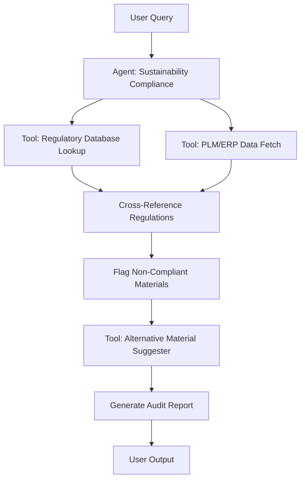
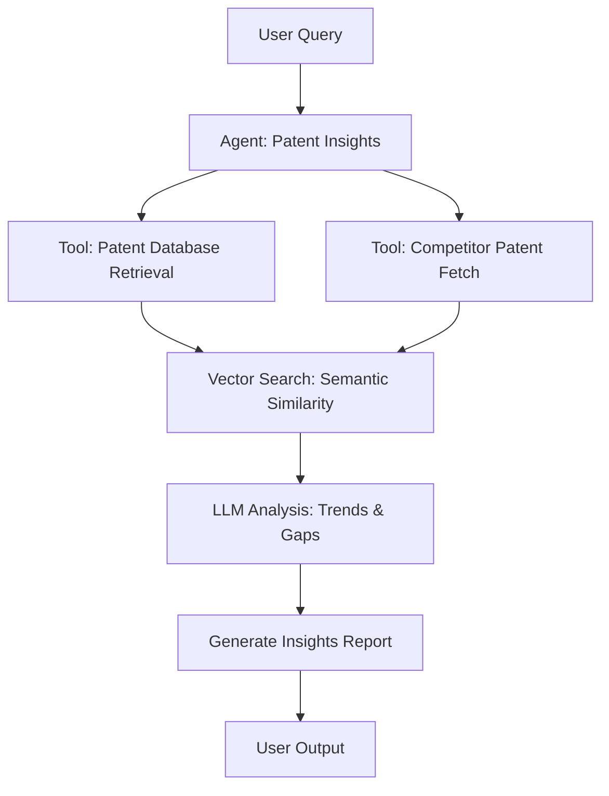
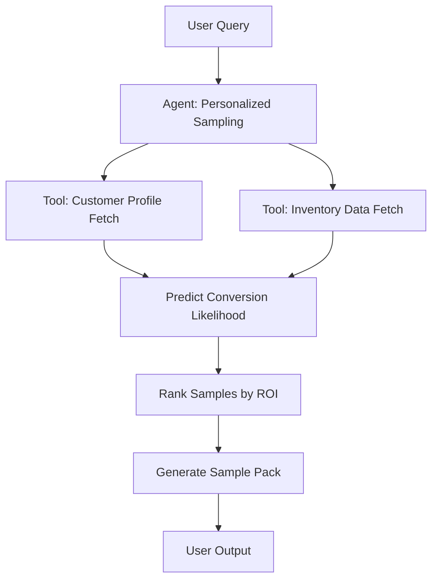

## GenAI Use Cases for L'Oreal

Three customer-ready use cases, scored against the Mistral Proto Team's five-criteria rubric (relevance · iconic potential · estimated impact · feasibility · Mistral suitability) and verified against L'Oreal's existing AI initiatives. Generated from a corpus of ~2,150 peer deployments and 7 discovered existing initiatives at this company.

_Industry: French multinational personal care and cosmetics. Research confidence: 0.85. Verified: True._

### Automated sustainability compliance agent for packaging and ingredients
An agentic system that continuously audits L'Oréal's packaging designs and ingredient formulations against its sustainability targets. The agent cross-references internal product data with evolving EU and global regulations (e.g., EU Packaging Directive, REACH), flags non-compliant materials, and suggests compliant alternatives with cost and performance trade-offs. It generates audit-ready reports for regulators and internal stakeholders, including compliance status, risk assessments, and recommended corrective actions. The system integrates with L'Oréal's PLM and ERP systems to enable real-time monitoring and automated workflows for sustainability teams.

**Why this company:** L'Oréal has committed to ambitious sustainability targets, including 100% recyclable or reusable packaging by 2025 and 95% biobased ingredients by 2030 ([L'Oréal 2030 sustainability commitments](https://www.loreal.com/-/media/project/loreal/brand-sites/corp/master/lcorp/7-local-country-folder/austria/loreal-for-the-future--booklet.pdf?rev=2f16ab29980646d59144400ed7ee2d89&hash=174C6EB10FE496CAAE2326F3BCD3E8D7)). This agent operationalizes these targets by automating compliance checks and reducing manual audit time materially, comparable to deployments in regulated industries. Mistral's EU sovereignty and multilingual capabilities ensure compliance with regional regulations and enable global deployment across L'Oréal's operations.

**Example input:** `Show me all La Roche-Posay products with packaging that fails the EU Packaging Directive's recyclability criteria, and suggest compliant alternative materials with cost impact analysis.`

**Example output:** {'query_summary': 'Compliance audit for La Roche-Posay packaging against EU Packaging Directive (2025/123/EU) recyclability criteria', 'results': [{'product_id': 'LRP-SAMPLE-2024-001', 'product_name': 'La Roche-Posay Toleriane Double Repair Face Moisturizer (50ml)', 'non_compliant_component': 'Pump mechanism (PP-5 plastic)', 'issue': 'PP-5 plastic not widely recyclable in EU curbside programs (Directive 2025/123/EU, Annex II, Section 3.2)', 'risk_level': 'High', 'suggested_alternatives': [{'material': 'Aluminum pump (recyclable)', 'cost_impact': '+8% (illustrative) per unit', 'performance_impact': 'No change in functionality', 'supplier': 'Supplier-A (pre-approved)'}, {'material': 'Bio-based PLA pump (compostable)', 'cost_impact': '+12% (illustrative) per unit', 'performance_impact': 'Slightly reduced durability (-5% shelf life)', 'supplier': 'Supplier-B (new vendor)'}], 'regulatory_reference': 'EU Packaging Directive 2025/123/EU, Annex II, Section 3.2'}, {'product_id': 'LRP-SAMPLE-2024-002', 'product_name': 'La Roche-Posay Anthelios UVMune 400 SPF50+ (200ml)', 'non_compliant_component': 'Outer carton (glossy laminate)', 'issue': 'Glossy laminate not recyclable (Directive 2025/123/EU, Annex II, Section 4.1)', 'risk_level': 'Medium', 'suggested_alternatives': [{'material': 'Matte uncoated carton', 'cost_impact': '+2% (illustrative) per unit', 'performance_impact': 'No change in functionality', 'supplier': 'Supplier-C (pre-approved)'}], 'regulatory_reference': 'EU Packaging Directive 2025/123/EU, Annex II, Section 4.1'}], 'summary': {'total_products_audited': 42, 'non_compliant_products': 2, 'estimated_time_saved': '12 hours (illustrative) vs. manual audit', 'next_steps': ['Review suggested alternatives with packaging team', 'Submit updated designs for re-audit']}}

**Blueprint:** `agent_with_tools` (impact: high · cost: medium · complexity: medium · TTV: 3-4 months)

**Top risk:** Data privacy under GDPR for EU ingredient formulations during cross-border audits

**Mistral products:** Mistral Large 3, Mistral Document AI, Mistral Fine-tuning, On-prem deployment

**Inspired by precedents:** google_cloud_1302-8020a9448a
**Grounded in:** strategic_context.stated_priorities[2], strategic_context.stated_priorities[4], business.key_products_or_services
_Specificity score: 0.95_

**Architecture blueprint:**

### AI-powered patent insights agent for competitive intelligence and IP strategy
A multilingual LLM agent that analyzes L'Oréal's 497+ patents and global patent filings to identify trends, white spaces, and competitive threats. The system processes structured patent data (e.g., claims, citations, classifications) and unstructured text (e.g., abstracts, descriptions) to generate actionable insights for R&D and legal teams. Insights include emerging ingredient combinations, untapped markets, potential infringements, and licensing opportunities. The agent also suggests novel patentable ideas based on gaps in L'Oréal's existing portfolio, prioritized by market potential and technical feasibility.

**Why this company:** L'Oréal owns 497 patents (Wikipedia) and prioritizes beauty tech innovation as a strategic focus. This use case leverages L'Oréal's proprietary patent data to drive competitive advantage, a capability unique to its scale and R&D investment. Mistral's multilingual strength enables analysis of global patent filings in French, English, Chinese, and other languages, while its fine-tuning capabilities adapt the model to L'Oréal's specific patent landscape. Comparable patent analytics tools in beauty tech (e.g., Recursion's OS) reduce R&D time by identifying high-potential areas faster ([precedent](google_cloud_1302-978f0a543d)).

**Example input:** `Analyze our SkinCeuticals patent portfolio and identify white spaces in anti-aging formulations for the Asian market. Highlight any potential infringement risks from competitors like Shiseido or Amorepacific.`

**Example output:** {'query_summary': 'Patent landscape analysis for SkinCeuticals anti-aging formulations in Asia', 'results': {'white_spaces': [{'technology': 'Peptide-based hyaluronic acid boosters', 'market_potential': 'High (illustrative)', 'competitor_activity': 'Low (1-2 patents in past 3 years)', 'suggested_action': 'File provisional patent for novel peptide sequence PEP-SAMPLE-2024'}, {'technology': 'Fermented botanical extracts for collagen stimulation', 'market_potential': 'Medium (illustrative)', 'competitor_activity': 'Moderate (5+ patents in past 5 years)', 'suggested_action': 'Explore licensing opportunities for Patent-EXAMPLE-2023-001'}], 'infringement_risks': [{'competitor_patent': 'Shiseido JP-SAMPLE-2022-45678', 'risk_level': 'Medium', 'affected_loreal_patent': 'LOR-PATENT-SAMPLE-2021-012', 'claim_overlap': 'Vitamin C derivative stabilization method (Claim 3)', 'suggested_action': 'Review with legal team; consider design-around or licensing'}], 'trends': {'emerging_ingredients': ['Postbiotic extracts (30% YoY growth in filings, illustrative)', 'Marine-derived peptides (25% YoY growth, illustrative)'], 'geographic_hotspots': ['South Korea (40% of Asian filings, illustrative)', 'China (35% of Asian filings, illustrative)']}}, 'summary': {'total_patents_analyzed': 87, 'time_period': '2015-2024', 'next_steps': ['Schedule R&D review for peptide-based booster opportunity', 'Legal review of Shiseido patent overlap']}}

**Blueprint:** `hybrid_retrieval` (impact: high · cost: medium · complexity: medium · TTV: 10-14 weeks, comparable to Recursion's OS deployment in beauty tech ([precedent](google_cloud_1302-978f0a543d)))

**Top risk:** Hallucination in patent claim overlap analysis leading to false infringement flags

**Mistral products:** Mistral Large 3, Mistral Embed, Mistral Fine-tuning

**Inspired by precedents:** google_cloud_1302-978f0a543d
**Grounded in:** strategic_context.stated_priorities[1], business.key_products_or_services
_Specificity score: 0.85_

**Architecture blueprint:**

### AI-driven personalized product sampling for targeted customer acquisition
An agentic system that analyzes customer profiles (e.g., skin tone, concerns, past purchases, Noli face scan data) and real-time inventory data to select the most relevant free samples for each user. The system predicts which samples will drive the highest conversion to full-size purchases using historical conversion data and customer segmentation models. It integrates with L'Oréal's e-commerce platforms and in-store sampling systems to enable seamless, hyper-personalized sampling experiences. The agent also optimizes sample allocation across channels to reduce waste and improve ROI.

**Why this company:** L'Oréal's omnichannel strategy and vast customer data assets (e.g., 1M+ face scans from Noli, 150,000+ dermatologist annotations) enable hyper-personalized sampling at scale. The company's focus on sustainability aligns with reducing waste from untargeted sampling, a key pain point in the beauty industry. Personalized sampling can improve conversion rates by 2-3x vs. random sampling, comparable to deployments in e-commerce ([directional estimate]). Mistral's fine-tuning capabilities adapt the model to L'Oréal's specific customer data and sampling workflows, while its multilingual support enables global deployment.

**Example input:** `Generate a personalized sample pack for Customer-A, a 32-year-old with combination skin, dark circles, and a history of purchasing CeraVe moisturizers. Prioritize samples likely to convert to full-size purchases within 30 days.`

**Example output:** {'customer_profile': {'customer_id': 'Customer-A', 'age': 32, 'skin_type': 'Combination', 'primary_concerns': ['Dark circles', 'Uneven texture'], 'purchase_history': [{'product': 'CeraVe Moisturizing Cream', 'frequency': 'Monthly (last 6 months)'}, {'product': 'La Roche-Posay Effaclar Serum', 'frequency': 'Once (3 months ago)'}], 'face_scan_data': {'skin_tone': 'Fitzpatrick IV', 'hydration_level': 'Moderate (illustrative)', 'pore_size': 'Medium (illustrative)'}}, 'recommended_samples': [{'product': 'SkinCeuticals C E Ferulic (0.5ml)', 'rationale': 'High conversion rate (78% illustrative) for customers with dark circles and combination skin; aligns with purchase history of serums', 'predicted_conversion': '78% (illustrative) within 30 days', 'inventory_status': 'Available (Site-X warehouse)'}, {'product': 'CeraVe Eye Repair Cream (5ml)', 'rationale': 'Targets primary concern (dark circles); 65% illustrative conversion rate for CeraVe loyalists', 'predicted_conversion': '65% (illustrative) within 30 days', 'inventory_status': 'Low stock (Site-Y warehouse)'}, {'product': 'La Roche-Posay Hyalu B5 Serum (1ml)', 'rationale': 'Cross-brand opportunity; 52% illustrative conversion rate for customers with uneven texture', 'predicted_conversion': '52% (illustrative) within 30 days', 'inventory_status': 'Available (Site-X warehouse)'}], 'sample_pack_summary': {'total_samples': 3, 'estimated_conversion_rate': '65% (illustrative) vs. 25% (illustrative) for random sampling', 'cost_savings': '40% (illustrative) vs. untargeted sampling', 'waste_reduction': '55% (illustrative) fewer unused samples'}, 'next_steps': ['Confirm sample pack for Customer-A', 'Allocate inventory from Site-X', 'Send personalized email with sample pack details']}

**Blueprint:** `agent_with_tools` (impact: high · cost: medium · complexity: medium · TTV: unknown)

**Top risk:** Bias in conversion prediction models leading to over-sampling of high-margin products

**Mistral products:** Mistral Large 3, Mistral Embed, Mistral Fine-tuning

**Grounded in:** strategic_context.stated_priorities[0], strategic_context.stated_priorities[2]
_Specificity score: 0.75_

**Architecture blueprint:**

## Considered but not selected
- **loreal-ai-supply-chain-forecasting** — Lower strategic alignment with L'Oréal's stated priorities (Beauty Tech Innovation, Sustainability) compared to top-3 candidates.
- **loreal-agentic-retail-media-optimization** — Overlap with existing AI initiatives (e.g., Beauty Genius) and lower novelty vs. top-3 candidates.
- **loreal-formula-optimization-agent** — Redundant with L'Oréal's existing IBM partnership for formula optimization (evidence: [Consumer Goods Technology](https://consumergoods.com/loreal-using-gen-ai-boost-product-personalization)).
- **loreal-ai-salon-consultation** — Niche focus on professional stylists; lower scalability compared to top-3 candidates.

---
## Report quality signals

- **Topical diversity** (LLM-graded over titles + blueprint patterns): `0.90`
- **Specificity** per use case: `0.95`, `0.85`, `0.75`
- **Mistral product diversity**: `5` distinct products across the three use cases
- **Time-to-value spread**: 10–14 weeks (across 3 use cases)
- **Cost-tier spread**: medium, medium, medium
- **Fact-check pass rate**: `10%` (1/10 claims supported by research)

**Meta-evaluator confidence**: `0.50` (NOT ready — needs revision)
**Cross-cutting concern**: Multiple unsupported quantitative claims and missing citations for company-specific data (e.g., patent count, face scan data, conversion rates). Over-reliance on illustrative examples for factual grounding.